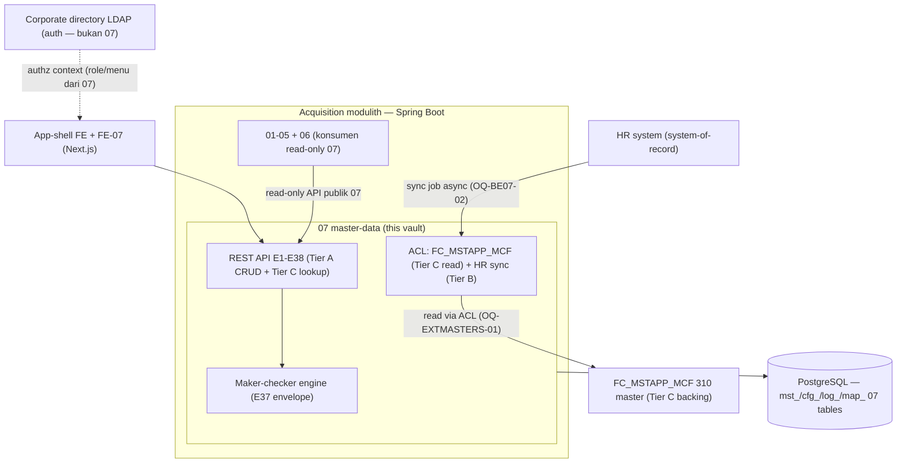

# 02 — Architecture

> **TL;DR**: Modul 07 = trunk reference leaf di dalam modulith Acquisition (Spring Modulith boundary `acquisition.masterdata`). Tiga tier kepemilikan master (A OWNED / B SYNCED MIRROR / C EXTERNAL READ-ONLY). Akses katalog eksternal via ACL (BR-BE07-26 — no cross-DB three-part-name / linked-server four-part-name sebagai pola aplikasi baru). Maker-checker envelope generik (E37) untuk resource sensitif. Komunikasi antar-modul via API publik 07 (read-only untuk konsumen 01–05 + FE app-shell).

## System overview (modul 07 dalam modulith Acquisition)

## Components by layer

### Domain module layer — `acquisition.masterdata` (Spring Modulith boundary)

07 adalah **leaf module** (M7 trunk reference): dikonsumsi 01–05 + app-shell FE, TIDAK konsumsi internal. Tidak ada event outbound 07 — kontrak publish = API publik read + config tables yang di-read modul lain.

| Sub-area | Owns (data) | Publishes (interface ke konsumen) | Consumes |
|---|---|---|---|
| User & RBAC | `mst_user`, `mst_user_branch_scope`, `cfg_menu`, `cfg_menu_role_grant`, `cfg_menu_user_grant_special` (OQ-BE07-05) | E6 menu efektif per user (app-shell FE); E7 role catalog D-10; E1-E5 user provisioning | `mst_employee_mirror` (HR sync) untuk NIK validation |
| Employee mirror | `mst_employee_mirror` (Tier B read-only; write only sync job) | E8 PIC picker + user provisioning NIK lookup | HR system (sync job, OQ-BE07-02) |
| Dealer family | `mst_dealer`, `mst_dealer_document`, `mst_dealer_personnel`, `mst_dealer_job_title`, `mst_dealer_bank_reference`, `mst_dealer_branch_access` | E12 dealer picker (01); E21 payment-eligible-contacts (04/disbursement); E18 bank-ref maker-checker | LOCATION/BANK lookup (Tier C) |
| TransType hierarchy | `cfg_transaction_code`, `cfg_transaction_type`, `cfg_hierarchy_matrix` (shared dengan 03 — admin writes langsung ke tabel walk) | E22-E28 config CRUD; `cfg_hierarchy_matrix` di-read engine routing 03; `trans_type_id` external-FK `[LOCKED]` | EMPLOYEE_MIRROR (PIC picker) |
| Master operasional | `mst_approval_reason`, `mst_credit_source`, `mst_branch_credit_source`, `mst_blacklist_override`, `mst_public_holiday`, `mst_general_parameter`, `mst_promotion_line_text`, `map_transaction_type_gl`, `cfg_number_format` | reason-code (03/05); `cfg_number_format` consumed 01 (mint `credit_id`); `map_transaction_type_gl` read finance/05 | — |
| Lookup layer Tier C | *(no local table — via ACL)* | E30 generic lookup `/lookups/{lookup_key}` (27+ applicant klasifikasi, bank, location+OJK crosswalk, product/asset taxonomy) | `FC_MSTAPP_MCF` via ACL (OQ-EXTMASTERS-01) |
| Audit | `log_master_change_request`, `log_master_audit` | — (append-only, INSERT-only) | — |

**Aturan komunikasi antar-modul** (inherited umbrella ADR-03): konsumen 01–05 baca 07 via API publik read-only; NO direct repo/tabel access 07 dari modul lain. `cfg_hierarchy_matrix` adalah pengecualian ter-dokumentasi: 07 (admin surface) dan 03 (walking engine) sama-sama akses tabel yang sama — 07 write definisi, 03 read untuk routing; kedua akses via repo masing-masing ter-scope (OQ-MASTERDATA-03 ✅ — single source, no separate `cfg_approval_hierarchy_level`).

### API layer (REST — BE-07 §4, E1-E38)

> USULAN transport = REST/JSON (OQ-ARCH-STACK). Envelope seragam `{ code, message, details?, correlation_id }`. Kontrak list terstandar (BR-BE07-20): `page`, `page_size`, `search`, filter scope → `{ items[], page, total_pages, record_count }`. Semua write Tier A mensyaratkan `Idempotency-Key` untuk create. Auth/Role = enforcement app-layer (fix BR-MASTERDATA-13).

| Resource group | Endpoints | Auth/Role | Maker-checker? |
|---|---|---|---|
| users | E1-E5 (list/provision/detail/patch/deactivate-reactivate) | Credit (Admin) maker | — |
| users/menus | E6 menu efektif, E11 special grants | Authenticated / Credit (Admin) | E11 ya |
| roles | E7 catalog D-10 (statis), E10 menu-grants per role | Authenticated / Credit (Admin) maker+checker | E10 ya |
| employees | E8 HR mirror picker | Credit (Admin) / Hierarchy Admin | — |
| menus | E9 CRUD tree (deactivate-only, no DELETE) | Credit (Admin) maker + checker utk `trans_type_id_prefix` | prefix ya |
| dealers | E12-E15 (list/create/detail-update/lifecycle) | Authenticated read / Credit (Admin) maker | field sensitif ya |
| dealer personnel/job-titles | E16-E17 | Credit (Admin) | — |
| dealer bank-references | E18 | maker + **checker WAJIB** (payout) | ya |
| dealer branch-access/documents | E19-E20 | Credit (Admin) maker | — |
| dealer payment-eligible-contacts | E21 (read) | Sistem/authenticated | — |
| transaction-codes/types | E22-E25 | Hierarchy Admin maker + checker | E25 ya |
| approval-hierarchies | E26-E28 (list/insert-update/PIC picker) | Hierarchy Admin maker + checker | E27 ya |
| approval-reasons | E29 | Credit (Admin) maker | — |
| lookups Tier C | E30 generic `/lookups/{lookup_key}` | Authenticated | — |
| credit-sources | E31 | Credit (Admin) maker | — |
| blacklist-overrides | E32 | maker + **checker WAJIB** (AML) | ya |
| public-holidays | E33 (satu-satunya ber-DELETE fisik — OQ-BE07-06) | Credit (Admin) | — |
| general-parameters | E34 (read/update; `is_updateable=false`→409; no create/delete) | Credit (Admin) maker + checker | ya |
| promotion-line-texts | E35 | Credit (Admin) | — |
| gl-transaction-type-links | E36 (read + audited update; no delete) | maker + **checker WAJIB** (CoA LOCKED) | ya |
| master-change-requests | E37 envelope generik (approve/reject) | maker / checker | — |
| number-formats | E38 (admin `cfg_number_format`; `CREDIT_ID` code_type change → maker-checker) | Credit (Admin) maker + checker utk `CREDIT_ID` | ya |

**Endpoint sengaja TIDAK ada** (BE-07 §4 catatan): `POST /employees` (HR system-of-record BR-EMPLOYEE-1), `DELETE` untuk semua master konfigurasi (deactivate-only BR-BE07-03), endpoint apa pun yang mengekspos `PasscodeBiBca` (**[REDACTED-SECRET]**), endpoint super-user grant (D-09).

Detail kontrak request/response (E2/E6/E13/E18/E27/E30/E37) ada di BE-07 §5 (sumber otoritatif).

### Maker-checker engine layer (E37 envelope generik)

Resource sensitif (BR-BE07-05) write masuk sebagai change-request `pending_approval` (BUKAN langsung applied). Checker (≠ maker, `403 SELF_APPROVAL_BLOCKED`) approve/reject. State machine BE-07 §7.2: `pending_approval → applied | rejected | cancelled` (terminal immutable). Approve idempotent by `Idempotency-Key`. Audit `log_master_change_request` (envelope + keputusan checker) + `log_master_audit` (before-after Tier A) — INSERT-only.

### ACL layer (Tier C + Tier B sync)

- **Tier C — `FC_MSTAPP_MCF` (310 master)** via ACL service API (BR-BE07-26: NO cross-DB three-part-name / linked-server four-part-name sebagai pola aplikasi baru — perubahan semantik transaksional diputuskan sadar, masuk asumsi D-11). Backing store E30. Kegagalan baca = `503 LOOKUP_SOURCE_UNAVAILABLE` (BR-BE07-22), BUKAN sukses-kosong. Ownership `[OPEN]` OQ-EXTMASTERS-01.
- **Tier B — HR sync** `mst_employee_mirror`: sync job async batch/CDC (mekanisme OQ-BE07-02); status resign `Fkeluar` WAJIB ikut ter-sync eksplisit (fix Edge Case 12 — legacy `vw_HREmployeeData` meng-comment-out filter `IsActive`). Trigger auto-deactivate user (BR-BE07-27).
- **LDAP** — TIDAK dipanggil 07; konteks alasan APP_USER tanpa password (BR-SHELL-1). 07 hanya sediakan data authz (role/menu-grant) yang dikonsumsi auth service/app-shell.

### Tech stack (inherited umbrella + D-12)

- **BE = Java** `[LOCKED]` (D-12); framework USULAN Spring Boot 3.x + Spring Modulith + Java 21 (OQ-ARCH-STACK, ITEC D-11). Repo existing: Spring Boot 4.1.1-SNAPSHOT + Java 21.
- **RDBMS = PostgreSQL** USULAN (final ITEC A-2); satu schema + prefix kelas (`docs/DB-CONVENTIONS.md`).
- **Transport** USULAN REST/JSON (OpenAPI 3).
- **AuthN/AuthZ** = LDAP `[LOCKED]` (BR-SHELL-1); branch re-verify server-side (OQ-SHELL-02, inherited). 07 pakai abstraksi `AuthenticatedActor` + `RoleResolver` (final mechanism OQ-ARCH-STACK).

## Sources

- `docs/prd/acquisition/BE-07-master-data-menus.md §1` (scope+tiering), `§4` (API E1-E38), `§8` (integrasi), `§6 BR-BE07-26` (ACL boundary)
- `docs/ARCHITECTURE-PROPOSAL.md §3/§5` (M7 trunk reference), `§4 ADR-02/03/05/07` (zero-SP, single-schema, ACL, RBAC)
- `docs/DB-CONVENTIONS.md` (schema, ADR-14)
- `.mega-sdd/vaults/acquisition/02-architecture.md` (parent — modulith context)

## Open Questions

- **OQ-ARCH-STACK** [P1] — framework/transport/topologi (ITEC D-11)
- **OQ-EXTMASTERS-01** [P1] — Tier C ownership + linked-server liveness (menentukan Tier C mana naik Tier A)
- **OQ-BE07-01/02/03** [P1] — maker-checker scope + checker role; HR sync mechanism; HO roles
- **OQ-DLRPTN-01/05** [P1] — dealer shape live + `PasscodeBiBca` security
- Lengkap di `00-index.md` roll-up
