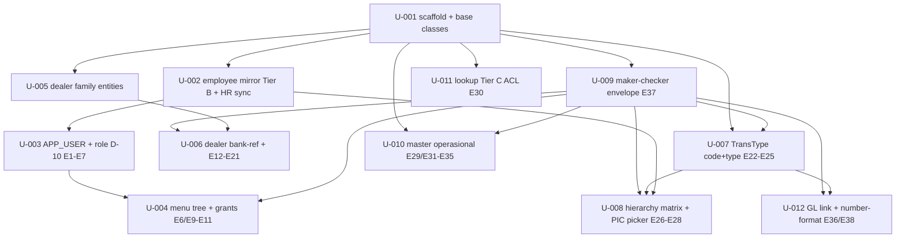

# Units Index — acquisition-master-data

> **Vault**: `.mega-sdd/vaults/acquisition-master-data/` (sub-vault module 07, v1.3.0, bound CLEAN)
> **Generated**: 2026-07-27 · **Units**: 12 · **Module**: M-default (single) · **Squad**: default (single)
> **All task_type**: `create` (greenfield module 07 in brownfield jwt-login repo — binding all NEW)
> **Decomposition key**: BE-07 §10 urutan build (HR mirror → user/menu → dealer → TransType → master ops/lookup/numbering) + atomicity (≤300 LOC, ≤5 files)

## Units by module (M-default)

| ID | Title | Complexity | Status | DoD | Depends on |
|---|---|---|---|---|---|
| U-001 | Master-data module scaffold + shared base classes | small | pending | scaffold + AuditableEntity/VersionedEntity/PageResponse | — |
| U-002 | Employee mirror entity + repository + HR sync job (Tier B) | medium | pending | E8 + is_resigned eksplisit + sync stub | U-001 |
| U-003 | APP_USER entity + role enum D-10 + user provisioning (E1-E7) | medium | pending | E1-E7 + no SUPER_USER + no password + auto-deactivate | U-001, U-002 |
| U-004 | Menu tree + role grants + menu efektif (E6/E9-E11) | medium | pending | E6/E9-E11 + trans_type_id_prefix maker-checker + no delete | U-003, U-009 |
| U-005 | Dealer master family entities + repository (Tier A) | medium | pending | 5 dealer entities + FK eksplisit + is_sub_dealer flag | U-001 |
| U-006 | Dealer bank-reference + controller E12-E21 + payment-eligible | medium | pending | E12-E21 + E18 maker-checker + E21 eligible-contacts | U-005, U-009 |
| U-007 | Transaction-Code + Transaction-Type config (E22-E25) | medium | pending | E22-E25 + transaction_type_code LOCKED + PATCH is_active only | U-001, U-009 |
| U-008 | Approval-hierarchy level cfg_hierarchy_matrix + PIC picker (E26-E28) | medium | pending | E26-E28 + server-side validation BR-BE07-15..17 (fix V4) | U-002, U-007, U-009 |
| U-009 | Maker-checker envelope engine E37 (generic change-request) | medium | pending | E37 + 202 pending + 403 self-approve + immutable terminal | U-001 |
| U-010 | Master operasional entities + controllers E29/E31-E35 | medium | pending | 7 entities + BLACKLIST_OVERRIDE maker-checker + is_updateable 409 + PUBLIC_HOLIDAY delete | U-001, U-009 |
| U-011 | Lookup Tier C ACL layer + generic E30 (FC_MSTAPP_MCF read-only) | medium | pending | E30 + set-membership filter + 503 not sukses-kosong + no local table | U-001 |
| U-012 | GL transaction-type link + number-format config (E36/E38) | medium | pending | E36 no-delete CoA + E38 CREDIT_ID maker-checker + generateCreditId | U-001, U-007, U-009 |

## Dependency DAG (Mermaid)

## Suggested topological execution order

> Parallelizable waves (within a wave, units independent). `execute-bolts --all` runs in DAG order; this is the human-readable wave view.

- **Wave 1 (foundation):** U-001 (scaffold + base classes)
- **Wave 2 (parallel):** U-009 (maker-checker envelope) · U-002 (employee mirror) · U-005 (dealer entities) · U-007 (TransType code+type) · U-010 (master operasional) · U-011 (lookup Tier C)
- **Wave 3 (parallel):** U-003 (APP_USER — needs U-002) · U-006 (dealer bank-ref — needs U-005, U-009) · U-008 (hierarchy matrix — needs U-002, U-007, U-009) · U-012 (GL+numbering — needs U-007, U-009)
- **Wave 4:** U-004 (menu — needs U-003, U-009)

## OQ propagation summary (Step 12.5.g)

> Implementation-relevant OQ-IDs propagated into unit `binding_refs:` frontmatter. P1 OQ still open (governance/DBA/ITEC — not code) are tracked; units that depend on their resolution carry `TBD: <OQ-ID>` in body.

| OQ-ID | Priority | Carried in units | Resolution needed for |
|---|---|---|---|
| OQ-ARCH-STACK | P1 | U-001 | framework/transport (Spring Boot confirmed via scan; real auth wiring, ACL transport) |
| OQ-BE07-01 | P1 | U-006, U-009 | maker-checker checker role per resource |
| OQ-BE07-02 | P1 | U-002 | HR sync mechanism/frequency (sync job stub) |
| OQ-BE07-03 | P1 | U-003 | HO roles (expand enum D-10 → mst_role?) |
| OQ-BE07-04 | P1 | U-003 | user single vs multi-branch scope |
| OQ-BE07-05 | P1 | U-004 | menu role-based vs position-based; USER_MENU_GRANT_SPECIAL retained? |
| OQ-BE07-06 | P1 | U-010 | PUBLIC_HOLIDAY hard-delete vs deactivate |
| OQ-DLRPTN-01 | P1 | U-005 | dealer shape live (MsDealer vs MsDealer1 vs backup) |
| OQ-DLRPTN-04 | P1 | U-010 | approval-reason type '9' meaning |
| OQ-EXTMASTERS-01 | P1 | U-011 | Tier C ownership (stays read-only until resolved) |
| OQ-EXTMASTERS-07 | P1 | U-011 | 8 objek absen dari dump |
| OQ-MASTERDATA-02 | P1 | U-007, U-008 | cleansing V4/V6 (runtime validates; import cleansing OQ-MIG-05) |
| OQ-GT-02 | P1 ✅ RESOLVED | U-012 | credit_id format `branch(5)+YY+MM+SEQ(5)` (resolved — implemented) |
| OQ-AC-PROVENANCE | P1 | (none — units use PRD as source, not KB) | KB absent (does not block units) |

## Notes

- **All `create` task_type** — greenfield module 07; binding all NEW (no IMPLEMENTED to verify, no PARTIAL to extend).
- **No CONFLICT** — binding CLEAN; gate passed.
- **Maker-checker (U-009) is a load-bearing foundation** — 6 units depend on it (U-004/006/007/008/010/012). Build U-009 early (Wave 2).
- **OQ-AC-PROVENANCE (KB absent) does NOT block unit generation** — units cite BE-07 PRD §N as source, not KB files. KB provenance is a vault-level caveat.
- **12 P1 OQ still open** (governance/DBA/ITEC) — units carry `TBD` markers; `execute-bolts` will block on units whose OQ isn't resolved. Recommend `resolve-oq` triage before `execute-bolts --all` (especially OQ-BE07-01/02/03 governance, OQ-DLRPTN-01 dealer shape).

## Next step

`/mega-sdd:execute-bolts --all` to execute in DAG order, or `/mega-sdd:execute-bolts U-001` to start with the foundation unit.

> ⚠️ **Recommendation:** `resolve-oq` triage P1 first (OQ-BE07-01/02/03, OQ-DLRPTN-01) so units aren't blocked at bolt time. Units U-002 (HR sync stub), U-009 (checker role stub), U-003 (HO roles) carry explicit `TBD: OQ-...` — they'll build the structure but real behavior deferred.
