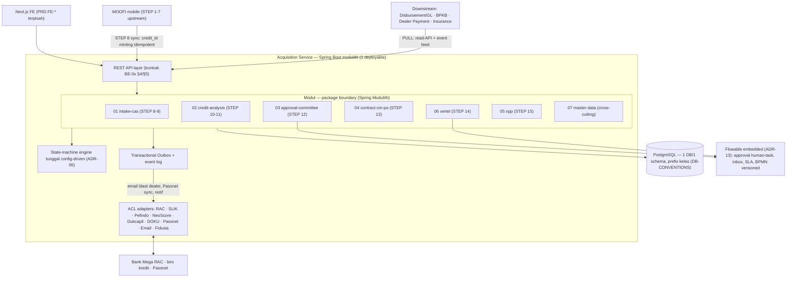

# 02 — Architecture

> **TL;DR**: Modular Monolith (modulith) Java/Spring Boot — satu deployable backend dengan boundary modul ter-enforce (Spring Modulith + ArchUnit), komunikasi antar-modul via domain event internal + transactional outbox, seluruh integrasi eksternal via Anti-Corruption Layer (ACL), downstream PULL. Status ADR-01..15: *Proposed* (menunggu rekonsiliasi ITEC D-11).

## System overview

## Components by layer

### Domain module layer (Spring Modulith — boundary ter-enforce via ArchUnit)

| Modul | STEP | Owns (data) | Emits | Konsumsi |
|---|---|---|---|---|
| **intake-cas** | 1–8 (sisi FINCORE: 8), 9 | application header, applicant, related-person (typed), asset & financial draft, dokumen, screening log, RFA lock | `ApplicationLocked` | master-data |
| **credit-analysis** | 10–11 | RAC request/decision, hasil biro, CA recommendation, DSR, risk-category (`trans_type_id` composition) | `RacDecisionReceived` (via outbox — pelepas wait-state Flowable 03) · `AnalysisComplete` | `ApplicationLocked` |
| **approval-committee** | 12 | hierarki routing, keputusan komite, audit trail | `MemoApproved` / correction / reject (nama correction/reject `[OPEN]` OQ-CMPO-11) | `AnalysisComplete` + `RacDecisionReceived` |
| **contract-cm-po** | 13 | CM final (freeze OP/ULI/LCR + insurance), PO | `POIssued` · `MemoCorrectionOpened` (Open CM) | `MemoApproved` |
| **vertel** | 14 | `trx_customer_verification`, RFA Vertel | `VertelApproved` (USULAN) / `CustomerVerificationApproved` | `POIssued` |
| **npp** | 15–16 | BAST, validasi chassis/engine, agreement aktif, jurnal + AR Card + master loan* + PK doc, feed downstream | `AgreementActivated` · `PassnetRegistration` · `JournalRequested` | `VertelApproved` |
| **master-data** | — | user (no super-user), dealer, master acquisition, read-through master eksternal | — | — |

\* ownership master loan = **OQ-MEET-02 [P1]** — bisa berpindah ke servicing per ITEC D-11.

**Aturan komunikasi antar-modul:** HANYA via event (tabel di atas) atau API publik modul — TIDAK pernah akses repository/tabel modul lain secara langsung (ADR-03 write-by-owner; ADR-04 outbox). No cross-module JOIN di write path; cross-module ref via business key `credit_id`.

### API layer (REST — kontrak BE-0x §4/§5)

> USULAN transport = REST/JSON (OpenAPI 3) sinkron + outbox/message-relay async; gRPC/bus antar-service ditunda ITEC D-11 (OQ-ARCH-STACK). Envelope seragam `{ code, message, details?, correlation_id }` via `@RestControllerAdvice` + `ProblemDetail` (RFC 9457). `correlation_id` via MDC/W3C traceparent.

| Resource group | Modul | Method | Path (representatif) | Purpose |
|---|---|---|---|---|
| credit-applications | 01 | POST | `/credit-applications` | Create CAS + dedup NIK + lock (web) |
| credit-applications | 01 | POST | `/sync/moofi-applications` | STEP 8 MOOFI ingestion (mint `credit_id`, idempotent) |
| credit-applications | 01 | POST | `/credit-applications/{id}/rfa` | RFA lock idempotent → `ApplicationLocked` |
| credit-applications | 01 | POST | `/credit-applications/{id}/return-for-correction` · `/reject` | STEP 9 disposition |
| screening | 01 | POST | `/screening/blacklist` · `/screening/aml-questionnaire` | Entry-time screening (fail-closed) |
| rac-screening | 02 | POST | `/applications/{id}/rac-screening` | Submit RAC STEP 10 (route CF/US via ACL) |
| rac-screening | 02 | POST | `/rac-screening/callbacks` | Ingest async decision (idempotent) → `RacDecisionReceived` |
| credit-analysis | 02 | POST | `/applications/{id}/credit-analysis` · `/credit-analysis/{id}/recommendation` | CA record + recommendation → `AnalysisComplete` |
| bureau | 02 | GET | `/applications/{id}/bureau/collectibility` · `/bureau/pefindo` · `/dukcapil-result` | Biro results |
| slik-requests | 02 | POST | `/slik-requests` · `/slik-requests/{id}/approval` | SLIK direct-check microflow |
| committee | 03 | POST | `/credit-memos/{memoId}/committee-routing` · `/approval-decision` | Build chain + execute (approve/reject/correction) → `MemoApproved` |
| committee | 03 | GET | `/approval-inbox` · `/approval-history` | Inbox + history (auth-context `approver` mandatory) |
| credit-memos | 04 | PUT | `/credit-memos/{memoId}/finalization` | Finalize financial structure |
| credit-memos | 04 | GET | `/credit-memos/{memoId}/bank-account:validate` | DOKU bank account validation (sync ACL) |
| purchase-orders | 04 | POST | `/purchase-orders/{poNumber}/print` · `/email` · `/correction` | PO print/email/Open CM |
| npp | 05 | POST | `/npp` · `/npp/{id}/submit` · `/npp/{id}/decision` | NPP draft + RFA + decision (atomic activation) |
| npp | 05 | GET | `/npp/{id}/preflight` · `/npp/{id}/agreement` · `/npp/{id}/documents/{docType}` | Preflight + PK print + legal docs |
| npp | 05 | GET | `/npp/validations/chassis` · `/installment-date` · `/asset-check` | Advisory validations |
| vertel | 06 | GET | `/vertel/queue` · `/vertel/verifications/by-application/{applicationId}/gate-status` | Queue + gate read (for 05-npp) |
| vertel | 06 | POST | `/vertel/verifications` · `/vertel/verifications/{id}/rfa` · `/vertel/verifications/{id}/decision` | Interview + RFA + decision (maker→checker) |
| vertel | 06 | GET | `/dukcapil/results/{nik}` | Dukcapil read-only (no gate) |
| users | 07 | GET/POST/PATCH | `/users` · `/users/{id}` · `/users/{id}/menus` · `/roles` | User provisioning + menu tree (rejects SUPER_USER) |
| dealers | 07 | GET/POST/PATCH | `/dealers` · `/dealers/{code}` · `/dealers/{code}/bank-references` · `/dealers/{code}/personnel` | Dealer CRUD (bank-ref maker-checker) |
| transaction-types | 07 | GET/POST/PATCH | `/transaction-codes` · `/transaction-types` · `/approval-hierarchies` | TransTypeHierarchy config (server-side validation) |
| lookups | 07 | GET | `/lookups/{lookup_key}` · `/credit-sources` · `/blacklist-overrides` · `/public-holidays` · `/general-parameters` | Tier C lookup + master ops |
| master-change-requests | 07 | GET/POST | `/master-change-requests` · `/{id}/approve` · `/{id}/reject` | Generic maker-checker envelope (E37) |

Detail kontrak request/response per endpoint ada di PRD `BE-0x §5` (sumber otoritatif). Endpoint lengkap + field census di `vault.json.flows` + `entities`.

### State-machine engine layer (ADR-06)

Single engine config-driven per produk MACF: step aktif, gate, hierarki approval (by `trans_type_id` + Plafond OP + skala risiko), varian car/motor & CF/syariah. Matrix per-product = `cfg_` tables (data change, NOT deploy). Matriks belum final = **OQ-MEET-06 [P1]** — justru karena itu harus konfigurasi, bukan kode. Instant-Approval = policy flag auditable di config (D-01 S11; eligibility OQ-MEET-04).

### Workflow engine layer (ADR-13 — Flowable embedded)

Lapisan approval/human-task (inbox, hierarki komite dinamis, maker-checker, RFA berlapis, deviasi, Vertel RFA, SLA aging, IA lane) dijalankan **Flowable embedded** di dalam modulith. Lifecycle status aplikasi TETAP config-driven in-app (ADR-06) — engine mengorkestrasi *human task*, BUKAN menggantikan state machine domain. Rel integrasi (`DB-CONVENTIONS.md §8`): BPMN versioned repo; matriks per-produk + hierarki dibaca delegate dari `cfg_`; variabel proses hanya key (`credit_id`, task ref); **`log_approval_history` TETAP audit otoritatif regulatori** (engine bukan satu-satunya sumber audit); `ACT_*` engine-owned, JANGAN disentuh manual; no-self-approval + role census D-10 enforced dua lapis (task assignment + service guard).

### Anti-Corruption Layer (ADR-05 — 10 integrasi eksternal)

Satu package/module `acl` dengan adapter per sistem eksternal; kontrak payload `[LOCKED]` dipertahankan; mekanisme transport bebas didesain ulang. **Async wajib via outbox** (RAC, Passnet, email blast D-03).

| # | Integrasi | Arah | Sync/Async | Pemilik seam | Catatan ACL/outbox |
|---|---|---|---|---|---|
| 1 | RAC Bank Mega | outbound req + inbound callback | **async** | 02-credit-analysis | Outbox request; callback/poll ingester idempotent by (app_id, decision_id); rute CF vs US dispatcher; tanpa cross-DB DML |
| 2 | SLIK/OJK | outbound pull | sync (via staging fabric) | 02 | Orkestrator biro; freshness 30-hari; upstream automation `[OPEN]` OQ-SLIK-05 |
| 3 | Pefindo | outbound pull | sync | 02 | Fan-out dari satu checking-request |
| 4 | NeoScore | outbound | async (call-site off-system `[OPEN]`) | 02 | Target BE-owned via ACL (legacy caller=FE RESOLVED); no tag-strip |
| 5 | Dukcapil | outbound | async (upstream automation `[OPEN]`) | 02 / verification | Identitas regulator `[LOCKED]`; trigger OQ-DUKCAPIL-01 |
| 6 | DOKU | outbound | sync | 04-contract | Ganti `sp_OACreate` HTTP-hardcoded-IP dengan client app-tier; own response persist (write-back OQ-DOKU-01) |
| 7 | Passnet | outbound | **async** | 05-npp | Outbox + reconciliation (ganti fire-and-forget); `passnet_id` `[LOCKED]` format verbatim |
| 8 | Fidusia | internal | n/a (record-keeping) | collateral (post-acq) | BUKAN API pemerintah live; cross-validate Passnet |
| 9 | External masters `FC_MSTAPP_MCF` (310 tabel) | inbound read | sync | references (Phase 1) | DDL dump ✅ 2026-07-22; owned vs read-only `[OPEN]` OQ-EXTMASTERS-01; 8 objek absen OQ-EXTMASTERS-07 |
| 10 | Email/SMS | outbound | **async** | cross-cutting | Least-privilege mail (bukan `EXECUTE AS sa`); email blast dealer D-03 via outbox; trigger/template OQ-MEET-01 |

**Konsumen downstream STEP 16 (PULL, bukan integrasi ACL):** Dealer Payment, BPKB Management, Insurance. Acquisition menyediakan kontrak eligibility + outbox event; mereka poll sendiri (OQ-NPP-03 ✅ PULL confirmed).

### Tech stack (confirmed via scan + PRD D-12)

- **BE language = Java** `[LOCKED]` (D-12). Framework = `[OPEN]` (USULAN Spring Boot 3.x + Spring Modulith + Java 21 LTS); menunggu ITEC D-11 (OQ-ARCH-STACK). Repo existing sudah Spring Boot 4.1.1-SNAPSHOT + Java 21 (`codebase-map.md`).
- **RDBMS = PostgreSQL** USULAN (final by ITEC A-2); desain portable. Existing repo pakai PostgreSQL (`newmojf` schema).
- **Transport** = USULAN REST/JSON (OpenAPI 3) sinkron + outbox/message-relay async.
- **Workflow engine** = Flowable embedded (ADR-13, keputusan user 2026-07-14).
- **AuthN/AuthZ** = LDAP corporate directory `[LOCKED]` (BR-SHELL-1); branch WAJIB di-bind session/token + re-verify server-side (BR-SHELL-3, OQ-SHELL-02). Mekanisme session/token final menunggu ITEC (OQ-ARCH-STACK); desain modul pakai abstraksi `AuthenticatedActor` + `RoleResolver`.

## Sources

- `docs/ARCHITECTURE-PROPOSAL.md` §3 (high-level), §4 (ADR-01..15), §5 (dekomposisi modul + event), §6 (data architecture), §10 (assumption register)
- `docs/prd/acquisition/BE-00` §3 Kapabilitas, §5 Boundary Ownership, §6 Shared ERD, §7 Kontrak API, §9 ACL
- `docs/prd/acquisition/BE-0x §4/§5` (API per modul), §8 (integrasi)
- `docs/DB-CONVENTIONS.md` §8 (Flowable footprint)

## Open Questions

- **OQ-ARCH-STACK** [P1] — framework (Spring Boot USULAN), transport, topologi (ITEC D-11)
- **OQ-MEET-06** [P1] — matrix step per-product MACF (D-07); config-driven engine menyerap
- **OQ-EXTMASTERS-01** [P1] — masters owned vs read-only + liveness linked-server
- **OQ-EXTMASTERS-07** [P1] — 8 objek code-referenced absen dari dump
- **OQ-CMPO-11** [P2] — nama/kontrak committee event correction/reject (03→04 pre-mint)
- **OQ-DOKU-01/OQ-PASSNET-01/OQ-RAC-01/02** — drain/write-back/scheduler integrasi
- **OQ-SHELL-02** [P1] — branch pick re-verify server-side
- Lengkap di `00-index.md` roll-up
