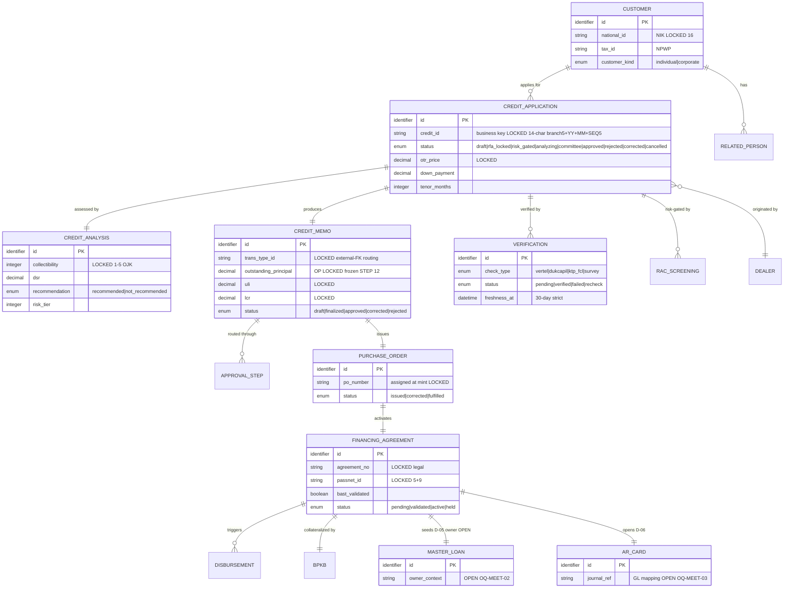

# 03 — Data Model

> **TL;DR**: Target schema rebuild (bukan legacy) — satu schema PostgreSQL, prefix kelas `mst_/trx_/cfg_/log_/map_/stg_/out_` per `docs/DB-CONVENTIONS.md` (ADR-14). PK `id BIGINT IDENTITY` + business key `credit_id` terpisah. Declared FK wajib. Audit columns wajib. Satu kolom `status`. Table-Ownership Registry = 112 tabel legacy `FC_ACQ_MCF` ter-assign 7 modul + downstream-boundary + cross-cutting (BE-00 §6.3). Flowable `ACT_*` engine-owned, di luar konvensi, JANGAN disentuh manual.

## Schema conventions (otoritatif `docs/DB-CONVENTIONS.md`)

- **Satu schema** (`public` / sesuai ITEC). Klasifikasi via prefix: `mst_` master · `trx_` transaksional spine · `cfg_` konfigurasi engine/rule (versioned) · `log_` audit append-only · `map_` bridge antar sistem · `stg_` staging migrasi · `out_` transactional outbox.
- **Naming**: `snake_case` English **singular** setelah prefix. Index `ix_{table}_{cols}`; unique `ux_`; FK `fk_{table}_{ref_table}`; check `ck_{table}_{rule}`.
- **Tipe**: uang `NUMERIC(18,2)` (JANGAN float; Java `BigDecimal`); rate `NUMERIC(9,6)`; `TIMESTAMPTZ` (UTC); `DATE`; `BOOLEAN NOT NULL DEFAULT false`; enum kecil `VARCHAR`+`CHECK`; NIK `VARCHAR(16)` `[LOCKED]`, NPWP 15/16 `[LOCKED]`.
- **Kolom wajib** semua `trx_/mst_/cfg_/map_`: `created_at/created_by/updated_at/updated_by`. `log_`: hanya `created_at/created_by`. Soft-delete `deleted_at` hanya bila butuh restore. Optimistic locking `version INTEGER` pada tabel edit konkuren (CM, master).
- **Status**: SATU kolom `status` per spine; vocabulary state machine modul; transisi via service/engine + CHECK; riwayat → `log_` append-only (bukan `last_*` bertumpuk).
- **Larangan** (do-not-replicate): shadow table `_shd/_R2/_staging`; print-tracking bespoke; denormalisasi identitas (NIK ditulis ulang); kolom polimorfik posisi (related-person by index); increment manual `logId`; temp permanen.
- **Field `[LOCKED]`** dipertahankan 1:1 additive-only (nilai/makna; nama boleh standar kecuali external-FK literal). `[INTENT]` outcome wajib mekanisme bebas. `[ARTIFACT]` dibuang setelah sign-off.

## Shared ERD (BE-00 §6 — target, tech-agnostic)

## Entitas inti — key + pemilik kapabilitas (BE-00 §6.1)

| Entitas | Key | Pemilik (writer otoritatif) | Konsumen | Tier |
|---|---|---|---|---|
| CUSTOMER (`mst_customer`) | `national_id` NIK unik | penulisan otoritatif **05-npp** (`tr_CIF` upsert); target dedup-at-intake **01** (D-01 S1) | semua | `[INTENT]` (field identitas `[LOCKED]`) |
| RELATED_PERSON | `id`, `customer_id`+`role` | **01-intake** (typed role + strict validation, D-01 S2) | 02, 03 | `[INTENT]` |
| CREDIT_APPLICATION (`trx_application`) | **`credit_id`** (mint STEP 8) | **01-intake** | 02, 03, 04, 05 | `[INTENT]` (mint-once `[LOCKED]`) |
| ASSET (`trx_financed_asset`) | `chassis_no`, `engine_no` unik | **01-intake** capture; validasi final **05** (`sp_validation_chasis_number`) | 04, 05, BPKB | `[LOCKED]` (chassis/engine) |
| CREDIT_ANALYSIS (`trx_credit_analysis`) | `id`, `application_id` | **02-credit-analysis** | 03 | `[LOCKED]` collectibility |
| BUREAU_RESULT | `id`, `analysis_id` | **02** via ACL | 02, 05 (freshness) | `[LOCKED]` scale / `[INTENT]` storage |
| RAC_SCREENING (`trx_rac_screening`) | `id`, `application_id` | **02** (ingest async) | 03 | `[LOCKED]` kontrak / `[INTENT]` mekanisme |
| CREDIT_MEMO (`trx_credit_memo`) | `id`; `trans_type_id` routing | **03** lock nilai finansial di approve (STEP 12); **04** mekanika kontrak/PO; `trans_type_id` disusun dari 02 | 03, 04, 05 | `[INTENT]` (OP/ULI/LCR + insurance `[LOCKED]` frozen) |
| APPROVAL_STEP / APPROVAL_HISTORY (`trx_approval_step` / `log_approval_history`) | `id`, `memo_id` | **03-approval** (audit fisik legacy `tr_hierarchy_transaction`; target `log_approval_history`; runtime human-task Flowable `ACT_*`) | audit | `[LOCKED]` routing key / `[INTENT]` storage |
| PURCHASE_ORDER (`trx_purchase_order`) | `id`, `po_number` | **04-contract** (mint) | 05 | `[INTENT]` |
| FINANCING_AGREEMENT (`trx_agreement`) | `agreement_no` | **05-npp** | DISB, BPKB, INSURANCE | `[LOCKED]` legal |
| MASTER_LOAN (`trx_master_loan`) (D-05) | `id`, `agreement_id` | trigger **05**; owner = `[OPEN]` OQ-MEET-02 | servicing/collection | `[INTENT]` + `[OPEN]` |
| AR_CARD + jurnal (`trx_ar_card`) (D-06) | `id`, `agreement_id` | trigger **05**; GL mapping = `[OPEN]` OQ-MEET-03 | GL, collection | `[INTENT]` + `[OPEN]` |
| VERIFICATION (`trx_customer_verification`) | `id`, `application_id` | kapabilitas verification (STEP 14) | **05** (gate) | `[INTENT]` |
| DISBURSEMENT / SUBLEDGER_ENTRY | `id`; `idempotency_key` | post-acq (PULL) | — | `[LOCKED]` GL crosswalk + amounts |
| BPKB | `id`, `agreement_id` | post-acq (PULL) | — | `[LOCKED]` custody states |

## Target entities per modul (census — sumber otoritatif BE-0x §3)

> Hanya tabel target (prefix konvensi). Census kolom penuh + mapping legacy + disposisi migrasi ada di PRD `BE-0x §3` (ground truth schema). `fields_count` indikatif.

### 01 intake-cas
`trx_application` (spine, business key `credit_id`) · `trx_application_related_person` (typed roles) · `trx_application_financial_profile` · `trx_application_other_installment` · `trx_application_bank_account` · `trx_application_corporate_profile` · `trx_application_corporate_deed` · `trx_application_corporate_owner` · `trx_application_document` · `trx_application_repeat_order` · `trx_application_payment_point` · `trx_application_lkk_score` (MIGRATE-READONLY) · `trx_application_aml_answer` (`[LOCKED]` regulatori) · `trx_application_aml_risk` (`[LOCKED]`) · `log_aml_hit` (append-only) · `log_ppatk_hit` · `log_blacklist_screening` · `map_customer_blacklist` · `trx_pooling_order` (MIGRATE-READONLY; OQ-GAP-01) · `trx_dealer_order_source` · `trx_dealer_order_source_refund` · `map_moofi_fincore` (idempotency STEP 8) · `log_moofi_reverse` · `map_nik_repeat_order` · `cfg_number_format` (consumer; census BE-07) · `log_number_generation`

### 02 credit-analysis
`trx_credit_analysis` (spine STEP 11) · `trx_credit_analysis_financial` · `trx_credit_analysis_bank_account` · `trx_credit_analysis_bank_mutation` · `trx_credit_analysis_document_check` (dual-channel civil_registry/playstore/document `[LOCKED]`) · `trx_credit_analysis_appi` · `trx_slik_history_entry` · `trx_slik_request` · `trx_slik_request_document` · `trx_rac_screening` (REBUILD external; idempotency `application_id+decision_id`) · `log_rac_callback` · `stg_rac_callback` · `trx_neoscore_result` · `log_neoscore_call` · `trx_risk_scale_analysis` · `log_document_print` (SHARED cross-cutting, canonical def BE-02 §3.11) · `log_slik_bypass` (`[LOCKED]` OQ-GAP-03)

### 03 approval-committee
`trx_approval_step` (committee chain ledger; status enum) · `log_approval_history` (audit append-only, INSERT-only) · `log_instant_approval` (IA lane audit) · `cfg_ia_policy` (IA lane policy D-01 S11) · `trx_deviation` (retyping `tr_general_deviation`) · `cfg_deviation_rule` (seeds EFF_RATE_MIN, TENOR_MAX) · `cfg_hierarchy_matrix` (internalized `ms_hierarchy_transaction`; shared admin surface BE-07). Flowable `ACT_*` = engine-owned, NOT census.

### 04 contract-cm-po
`trx_credit_memo` (spine; normalizes `tr_CM` 124 cols) · `trx_credit_memo_payment` · `trx_credit_memo_deposit_period` · `trx_credit_memo_insurance` · `trx_credit_memo_insurance_vehicle` (new `locked_at`/`locked_by`) · `trx_credit_memo_insurance_cover_year` · `trx_credit_memo_insurance_life` · `trx_credit_memo_insurance_health` · `trx_credit_memo_disbursement` · `trx_credit_memo_bank_account` · `trx_credit_memo_rate` · `trx_credit_memo_dp_subsidy` · `trx_purchase_order` (mint; `po_number` non-NULL `[LOCKED]`) · `out_notification` (PO email dealer) · `log_po_email` · `trx_financed_asset` (merge `tr_items`+`tr_items_UMC`) · `trx_bank_account_inquiry` (DOKU cache) · `log_credit_memo_reopen` (Open CM audit) · `trx_credit_memo_financing_snapshot` (+ `log_`) · `stg_legacy_tr_cm` (15 `[OPEN]` cols parked)

### 05 npp-legalization
`trx_agreement` (spine `FINANCING_AGREEMENT`; `agreement_no`+`passnet_id` `[LOCKED]`) · `log_agreement_snapshot` · `log_document_print` (SHARED) · `mst_customer` (`CUSTOMER`; authoritative write 05; NIK 16 `[LOCKED]`) · `trx_ar_card` (D-06; sums `[LOCKED]` zero-diff) · `trx_ar_card_penalty` · `trx_ar_card_social_fund` · `trx_amortization` (formula `[LOCKED]`) · `out_event` (outbox ADR-04; REBUILD) · `trx_fiducia_registration` (runtime owner collateral) · `log_approval_history` (NPP maker-checker; role `KEPALA_CABANG`) · `trx_master_loan` (D-05 NEW; `[INTENT]`+`[OPEN]`) · `out_notification` (D-03 email blast). Derived read-model: `Tr_OverDue` → archive + rebuilt rollup (no dual-write).

### 06 vertel-verification
`trx_customer_verification` (PORT+normalize `tr_verification_customer`; `credit_id` `[LOCKED]`) · `trx_customer_verification_contact_attempt` · `trx_customer_verification_document` · `trx_customer_verification_support_document` (NEW; min 2 docs bank). `log_approval_history` = centralized owned by 03 (06 contributes VK slice discriminator `entity_type='VK'`).

### 07 master-data-menus
`mst_user` (REBUILD no legacy RBAC) · `mst_user_branch_scope` · `cfg_menu` (`trans_type_id_prefix` `[LOCKED]`) · `cfg_menu_role_grant` (re-key position→role) · `cfg_menu_user_grant_special` (OQ-BE07-05) · `mst_employee_mirror` (HR Tier B read-only) · `mst_dealer` (KTP/NPWP zero-diff) · `mst_dealer_document` · `mst_dealer_personnel` · `mst_dealer_job_title` · `mst_dealer_bank_reference` (payout `[LOCKED]` zero-diff; maker-checker) · `mst_dealer_branch_access` · `cfg_transaction_code` · `cfg_transaction_type` (`code` `[LOCKED]` external-FK) · `cfg_hierarchy_matrix` (shared BE-03; single source no dup) · `mst_approval_reason` · `mst_credit_source` · `mst_branch_credit_source` · `mst_blacklist_override` (AML regulated; maker-checker) · `mst_public_holiday` · `mst_general_parameter` · `mst_promotion_line_text` · `map_transaction_type_gl` (CoA `[LOCKED]` zero-diff; maker-checker; no delete) · `cfg_number_format` (`CREDIT_ID` code_type `[LOCKED]`) · `log_master_change_request` · `log_master_audit`

## State machines (BE-00 §7.2 kanonik + BE-0x §7)

| Resource | Field | Enum | Owner modul |
|---|---|---|---|
| CREDIT_APPLICATION | `trx_application.status` | `draft \| rfa_locked \| risk_gated \| analyzing \| committee \| approved \| rejected \| corrected \| cancelled` | 01 (drives lifecycle) |
| CREDIT_MEMO | `trx_credit_memo.status` | `draft \| finalized \| approved \| corrected \| rejected` | 04 |
| PURCHASE_ORDER | `trx_purchase_order.status` | `issued \| corrected \| fulfilled` | 04 |
| APPROVAL_STEP | `trx_approval_step.status` | `pending \| approved \| rejected \| correction \| voided \| auto_approved_ia` | 03 |
| FINANCING_AGREEMENT | `trx_agreement.status` | `pending \| validated \| active \| held` | 05 |
| RAC_SCREENING | `trx_rac_screening.status` | `not_submitted \| pending \| approved \| rejected` | 02 |
| CREDIT_ANALYSIS | `trx_credit_analysis.status` | `queued \| under_review \| recommended` | 02 |
| SLIK_DIRECT_CHECK_REQUEST | `trx_slik_request.status` | `submitted \| forwarded \| approved \| corrected \| rejected` | 02 |
| VERIFICATION | `trx_customer_verification.status` | `draft \| rfa \| verified_interim \| approved \| correction \| rejected` (canonical projection `pending\|verified\|failed\|recheck`) | 06 |
| CREDIT_ANALYSIS.collectibility | — | `1..5` `[LOCKED]` OJK (0→1, 1-90→2, 91-120→3, 121-180→4, >180→5) | 02 |
| BPKB.custody_status | — | `in \| out \| loan \| re_entry \| handover \| lost` `[LOCKED]` | post-acq |
| DISBURSEMENT.status | — | `eligible \| paid \| posted \| reversed` | post-acq |

> Legacy status literal `'0'` = **RFA-locked** (bukan state edit; editing di `D`/`C`) — OQ-CMPO-01 ✅ RESOLVED. Mapping legacy → kanonik didokumentasikan saat migrasi (nilai `[LOCKED]` char-for-char; nama kolom standar).

## Table-Ownership Registry (BE-00 §6.3 — 112 tabel legacy `FC_ACQ_MCF`)

Distribusi: 01=34 · 02=17 · 03=8 · 04=20 · 05=14 · 06=4 · 07=2 · downstream-boundary=11 · cross-cutting=2 = **112**. Disposisi vocabulary: **MIGRATE** (dibawa ke target) · **MIGRATE-READONLY** (historis → arsip/read-model) · **DISCARD** (`[ARTIFACT]`, register + sign-off) · **REBUILD** (diturunkan ulang, mis. `out_event` mulai bersih). 

> **Epistemic caveat + no-data-left-behind (user directive 2026-07-14):** DISCARD/dead = asumsi code-only (grep SP + .NET; BUKAN evidence data prod) → final drop di-gate profiling data prod (OQ-MIG-05). DISCARD berlaku **schema target saja, TIDAK PERNAH data** — SEMUA 112 tabel di-extract 1:1 + diarsip permanen apapun disposisinya.

Registry lengkap per-tabel (legacy → target → owner → disposisi → catatan) ada di `docs/prd/acquisition/BE-00 §6.3` (ground truth). Vault ini tidak menduplikasi 112 baris; `bind-codebase` akan cross-check terhadap schema aktual.

## Sources

- `docs/DB-CONVENTIONS.md` (otoritatif — ADR-14)
- `docs/prd/acquisition/BE-00 §6` Shared ERD, `§6.1` entitas inti, `§6.2` 8 Departures, `§6.3` registry 112 tabel, `§7.2` enum kanonik
- `docs/prd/acquisition/BE-0x §3` census per modul (ground truth schema), `§7` state machine
- `docs/ARCHITECTURE-PROPOSAL.md §6` Data Architecture

## Open Questions

- **OQ-MEET-02** [P1] — owner master loan (acquisition vs servicing); menunggu ITEC D-11
- **OQ-MEET-03** [P2] — GL mapping jurnal/AR Card source of truth
- **OQ-CORE-03/OQ-CMPO-02** [P1] — arti bisnis OP/ULI/LCR (GL-reconciled? dua arti OP)
- **OQ-CRSCORE-10** [P1] — actor-of-record & time-ordering "credit analyst" (status CA provisional)
- **OQ-MIG-05** [P1] — gate profiling data prod atas klaim DISCARD/dead
- **OQ-EXTMASTERS-01/07/08** — masters ownership + 8 objek absen + `MsPublicHoliday` dual-DB
- Lengkap di `00-index.md` roll-up
