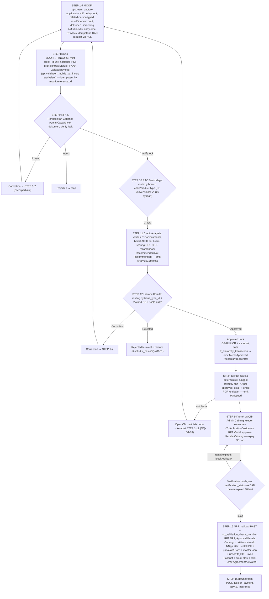
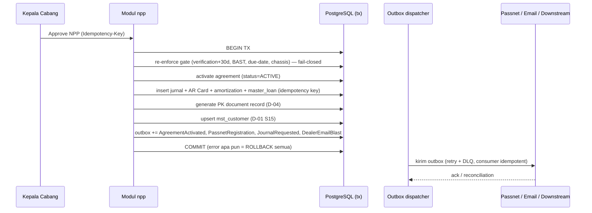

# 04 — Flows

> **TL;DR**: Alur end-to-end 16-STEP FINAL (PDF 08072026). Acquisition MEMILIKI STEP 8–15; STEP 1–7 = upstream MOOFI (kontrak input binding); STEP 16 = downstream PULL. Rute CF vs US di RAC · Vertel wajib (STEP 14) sebelum NPP · verification **hard-gate** · downstream **PULL**.

## F-S-001 — Sistem: Alur 16-STEP acquisition (end-to-end spine)

**Trigger**: Permohonan pembiayaan kendaraan masuk (MOOFI / dealer Pooling Order / field agent). **Actor chain**: CMO → Admin Cabang → Credit Analyst → Kepala Cabang → (downstream). **Source**: BE-00 §4 (`_ACQUISITION-GROUND-TRUTH.md` §FINAL 16-step).

**Definition of Done (F-S-001 spine):**
- [ ] Setiap aplikasi resolve lewat **tepat satu** jalur approval yang mengikat (human inbox ATAU Instant-Approval policy flag auditable; self-approval BLOCKED) — D-01 S11
- [ ] `credit_id` di-mint **sekali** (mint-once; idempotent by source application id) — D-01 S8, OQ-GT-02 ✅
- [ ] RAC decision async di-ingest idempotent by (application_id, decision_id); tanpa cross-DB DML — D-01 S8
- [ ] Committee approve = lock OP/ULI/LCR + asuransi + audit `log_approval_history`; executor freeze = 04 (OQ-BE03-02 ✅ opsi b) — D-01 S12
- [ ] PO minting deterministik tunggal — exactly one PO per approval (D-01 S13); semua terminasi hierarki (termasuk Level-0) mint
- [ ] Vertel STEP 14 penuh: maker Admin Cabang / checker Kepala Cabang, state machine, re-verifikasi Rejected diperbaiki (BR-VERIF-12 do-not-replicate)
- [ ] Verification hard-gate + Vertel gate + freshness FCL/SLIK 30-hari — **TIGA cek 30-hari BERBEDA, jangan dikonflasi** (BR-02-14/BR-06-14): (1) bureau freshness *advisory* STEP 11 (02); (2) SLIK/FCL *hard-gate* di NPP-save STEP 15 (05); (3) Vertel consumer-verification *expiry strict* D-01 S14 (06/05)
- [ ] NPP aktivasi **atomik** (D-01 S15): agreement active + PK + jurnal/AR Card + master loan + upsert customer + outbox (Passnet/email) dalam satu unit-of-work; error = ROLLBACK penuh
- [ ] Downstream STEP 16 = PULL (OQ-NPP-03 ✅); Acquisition tidak push
- [ ] Semua regulated gate (AML/blacklist, SLIK, DSR, verification, chassis/BAST) = **fail-closed** (OQ-REG-06 ✅): dependency gagal/throw = block

## F-S-002 — Sistem: STEP 8 MOOFI→FINCORE sync (ingestion idempotent)

**Trigger**: Aplikasi MOOFI siap sinkron. **Actor**: system (agent/batch; mode final OQ-ARCH-STACK). **Source**: BE-01 §5.5 (E13), ADR-08.

- POST `/sync/moofi-applications` (Idempotency-Key by `moofi_reference_id`): validasi payload → mint `credit_id` via `cfg_number_format`/sequence (format `branch(5)+YY+MM+SEQ(5)`) → bentuk draft kontrak skeleton `Status RFA='0'` → pindah foto ke object storage → re-derive screening FINCORE-side (BR-07) → emit `ApplicationLocked`
- **DoD**: mint-once (sync ulang tidak menghasilkan nomor kedua); `map_moofi_fincore` idempotency key; skeleton langsung `rfa_locked` menunggu pengecekan cabang STEP 9; screening re-derived FINCORE-side (bukan percaya flag MOOFI)

## F-S-003 — Sistem: STEP 15 aktivasi atomik (sequence kritis)

**Trigger**: Kepala Cabang approve NPP (RFA Vertel & BAST/chassis gate sudah lolos). **Source**: BE-05 §5.3, ARCHITECTURE-PROPOSAL §7.

**DoD (F-S-003):** aktivasi atomik dalam satu transaksi (D-01 S15); jurnal fail-closed (no silent-commit — fix bug legacy `sp_approve_npp` commit walau GL gagal diam-diam); outbox untuk efek eksternal (Passnet/email); idempotency key `{credit_id}:JOURNAL_DISBURSEMENT:v1`; `passnet_id` `[LOCKED]` format verbatim; downstream konsumsi via PULL/event feed.

## F-U-001 — User: STEP 9 RFA & Pengecekan Cabang (maker-checker cabang)

**Actor chain**: CMO (originator) → Admin Cabang (verifier/maker) → disposition. **Source**: BE-01 §7, BE-00 §4.

- Admin Cabang lihat Inbox Approval → cek kelengkapan dokumen pendukung → tombol Verify (lock via `sp_approve_cm_moofi` equivalent app-layer) → transisi `rfa_locked → risk_gated` (handoff 02)
- Correction → `rfa_locked → corrected` → kembali STEP 1–7 (CMO perbaiki)
- Reject → `rfa_locked → rejected` (proses berhenti; rebuild WAJIB closure eksplisit OQ-AC-01)
- **DoD**: RFA lock idempotent (re-lock memicu re-screen RAC, bukan destructive delete — fix GOTCHA-11); idempotency-key required; audit `log_approval_history`

## F-U-002 — User: STEP 12 Committee approval (maker-checker hierarki)

**Actor chain**: Credit Analyst (recommend) → committee chain by `trans_type_id`+OP+risk (Kepala Cabang/Marketing Head/level holder). **Source**: BE-03 §5, §7.

- POST `/credit-memos/{memoId}/committee-routing` (triggered by `AnalysisComplete`): re-qualify risk-tier, resolve `trans_type_id` via 02, walk `cfg_hierarchy_matrix`, evaluate IA lane; idempotent
- POST `/credit-memos/{memoId}/approval-decision`: approve/reject/correction; enforce assigned-only (D-09) + no-self-approval (D-01 S11); terminal approve → emit `MemoApproved` (freeze executor=04)
- Correction → voids un-reached steps eksplisit → kembali STEP 1–7; Reject = terminal permanent di setiap level
- **Operator surface**: (1) worklist/inbox `/approval-inbox` (current pending step assigned to caller); (2) decision affordance approve/reject/correction; (3) human-readable workflow-state labels; (4) audit timeline `/approval-history`. Enforced dua lapis: Flowable task assignment + Java service guard.
- **DoD**: routing by `trans_type_id` `[LOCKED]` external-FK char-for-char; IA = policy flag auditable (bukan string-hack — fix GOTCHA-9); audit `log_approval_history` independent dari engine; reject closure eksplisit

## F-U-003 — User: STEP 14 Vertel (maker-checker verifikasi telepon)

**Actor chain**: Admin Cabang (maker/verifier) → Kepala Cabang (checker/approver). **Source**: BE-06 §5, §7; BE-00 §4.1.

- Aplikasi masuk antrean Vertel hanya setelah CM committee-approved (`status_approval='A'`) DAN belum punya baris `trx_customer_verification` (BR-VERIF-1)
- Maker: wawancara telpon → capture confirmed-vs-actual (tenor, DP, angsuran, admin fee, delivery, item type, email/HP) + checklist dokumen per asset-kind → `save_mode` Draft/Submit
- RFA (`status='0'`, hierarki "VK") → checker `sp_approve_vertel` equivalent: Approve/Reject/Correction/Verify di-key reason-code master
- State `verification_status`: D→0→V(interim)→A(approved terminal, buka gate) / C(correction) / R(rejected)
- **DoD**: re-submit saat chain "VK" open = melanjutkan chain (BR-VERIF-4), bukan duplikasi; Rejected re-queue diperbaiki (BR-VERIF-12 do-not-replicate filter rusak); konsolidasi query antrean triplikat → satu; enforcement ukuran file server-side (fix BR-CSB-16/17); chain depth default 1 level Kepala Cabang, multi-level per risk = OQ-VTL-03; expiry 30-hari strict (D-01 S14; konsekuensi OQ-MEET-05)
- **Operator surface**: queue `/vertel/queue`; decision `/vertel/verifications/{id}/decision`; gate read `/vertel/verifications/by-application/{applicationId}/gate-status` (for 05-npp & BPKB); audit `log_approval_history` (VK slice, owned 03)

## F-U-004 — User: STEP 13 PO minting + cetak + email + Open CM

**Actor**: Admin Cabang. **Trigger**: `MemoApproved` event (consumed by 04). **Source**: BE-04 §5.

- Idempotent handler: freeze OP/ULI/LCR + lock asuransi (vehicle/life `locked_at`/`locked_by`) + mint exactly one PO (`po_number` non-NULL `[LOCKED]`)
- POST `/purchase-orders/{poNumber}/print` (position-gated; atomic `print_count++`; triggers async email PDF ke dealer via `out_notification`)
- POST `/purchase-orders/{poNumber}/correction` (Open CM): reopen memo → `corrected`, PO → `corrected` → emit `MemoCorrectionOpened` (consumed 02 re-screen idempotent + 01 re-lock)
- **DoD**: exactly one PO per approval (unique constraint `memo_id`+`approval_decision_id`); PO tidak dipicu dari modul credit-analyst (fix GOTCHA-8 `CreditAnalystRepositoryEF.cs:692-708`); print position gate `[LOCKED]` (mapping D-10 roles OQ-CMPOFE-02); freeze only on disposition=approved (fix BR-CMPO-6); Open CM return-target OQ-GT-03

## F-U-005 — User: STEP 15 NPP draft + RFA + decision (aktivasi)

**Actor chain**: Admin Cabang (maker RFA) → Kepala Cabang (checker decision). **Source**: BE-05 §5.

- POST `/npp` (from PO issued + Vertel approved) → `pending`; PUT edit (guard `pending`/`held(correction)`)
- POST `/npp/{id}/submit` (RFA maker): validate chassis/engine + pre-flight gate → `validated`
- GET `/npp/{id}/preflight` (advisory: verification+30d, chassis, BAST, due-date)
- POST `/npp/{id}/decision` (checker; Idempotency-Key required): approve → aktivasi atomik (F-S-003) / correction → `held(correction)` / reject → `held(rejected)` terminal
- **DoD**: BAST hard-gate in-transaction (`bast_no`+`bast_date` non-null, OQ-NPP-14 ✅); chassis/engine `[LOCKED]` unique; verification hard-gate re-enforced; aktivasi atomik (D-01 S15); idempotency at mutation boundary (BR-NPP-N4, guard inside tx not just pre-check); approver NPP = Kepala Cabang ≠ submitter (BR-NPP-N15)

## F-U-006 — User: Master data management (D-08 — maker-checker envelope)

**Actor chain**: Master Data Admin (maker = Credit Admin) → checker (Kepala Cabang cabang / HO role OQ-BE07-01). **Source**: BE-07 §5 (E37), §7.

- CRUD user (rejects SUPER_USER; NIK must exist & not resigned in `mst_employee_mirror`), dealer (KTP/NPWP validated), transaction-type hierarchy (server-side validation BR-BE07-15..17), menu tree (`trans_type_id_prefix` change → maker-checker)
- Resources dengan maker-checker WAJIB (BR-BE07-05): `DEALER_BANK_REFERENCE` (payout), `BLACKLIST_OVERRIDE` (AML), `GL_TRANSACTION_TYPE_LINK` (CoA), `GENERAL_PARAMETER`, `MENU.trans_type_id_prefix`, `TRANSACTION_TYPE`/`APPROVAL_HIERARCHY_LEVEL`, dealer legal identity, `NUMBER_FORMAT` `CREDIT_ID`
- E37 `/master-change-requests` envelope: write → `pending_approval`; checker approve/reject (≠maker); approve idempotent by Idempotency-Key
- **DoD**: no super-user; HR one-way sync (BR-EMPLOYEE-1, no employee create/update by 07); deactivate-only lifecycle Tier A (no hard delete, BR-BE07-03); audit `log_master_change_request` + `log_master_audit` INSERT-only; maker-checker is NEW (legacy has none — do not claim parity)

## Sources

- `docs/prd/acquisition/BE-00 §4` (16-STEP + §4.1 Vertel sub-flow), `§5` boundary ownership
- `docs/prd/acquisition/BE-0x §5` (kontrak request/response per flow), `§7` state machine, `§9` acceptance criteria
- `docs/ARCHITECTURE-PROPOSAL.md §7` (sequence STEP 15 atomik)

## Open Questions

- **OQ-GT-03** [P2] — Open CM return-target "Step 1–12" granularity
- **OQ-MEET-04** [P2] — IA lane eligibility per product/plafond
- **OQ-MEET-05** [P2] — expiry verifikasi 30-hari: auto-cancel vs re-verify + clock start
- **OQ-VTL-01/02/03/05** — Vertel post-PO vs parallel; Open CM effect; chain depth; gate consistency
- **OQ-CMPO-11** [P2] — nama committee event correction/reject
- **OQ-BE07-01/02/03** [P1] — maker-checker scope + HR sync + HO roles
- Lengkap di `00-index.md` roll-up
