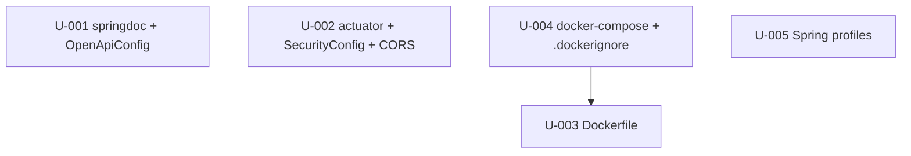

# Units Index — api-platform

> Decomposed from `.mega-sdd/vaults/api-platform/bound/` (clean binding, 0 CONFLICT).
> 5 units, single module (M-default), single squad (default). api-only, brownfield.

## Summary

- **Total units:** 5
- **Modules:** 1 (M-default)
- **Squads:** 1 (default)
- **task_type breakdown:** 4 `create` (U-001, U-003, U-004, U-005), 1 `extend` (U-002)
- **Dependency DAG:** acyclic (U-004 → U-003 only edge)
- **Hard rules:** 8 (HR-1..HR-8, propagated from constitution/binding)
- **OQs carried into units:** OQ-AP-1, OQ-AP-2, OQ-AP-3, OQ-AP-4, OQ-AP-5, OQ-AP-6, OQ-AP-8, OQ-AP-9 (OQ-AP-7 success-metrics is not implementation-relevant → not carried)

## Units table

| Unit | Title | task_type | Complexity | Priority | depends_on | Key OQs | Hard rules |
|---|---|---|---|---|---|---|---|
| U-001 | springdoc-openapi dep + OpenApiConfig | create | small | P1 | — | OQ-AP-1, OQ-AP-5 | HR-7 |
| U-002 | actuator + SecurityConfig permitAll + CORS externalize | extend | medium | P1 | — | OQ-AP-8, OQ-AP-9 | HR-3, HR-5, HR-8 |
| U-003 | multi-stage Dockerfile | create | medium | P1 | — | OQ-AP-2, OQ-AP-3 | HR-1, HR-2 |
| U-004 | docker-compose.yml + .dockerignore | create | medium | P2 | U-003 | OQ-AP-3, OQ-AP-4, OQ-AP-6 | HR-1 |
| U-005 | Spring profiles (dev + prod) | create | small | P2 | — | OQ-AP-5, OQ-AP-8, OQ-AP-9 | HR-4 |

## Dependency DAG (Mermaid)

> Only concrete coupling edge: U-004 `depends_on: U-003` (compose builds/refs the Dockerfile + the trust-store mount-target path decided in U-003). U-001, U-002, U-003, U-005 are independent (no file overlap forcing a dep) but COORDINATE on shared keys:
> - **U-001 ↔ U-002**: doc paths `/v3/api-docs`, `/swagger-ui.html` permitAll is wired in U-002; U-001's manual UI test needs U-002's permit.
> - **U-002 ↔ U-005**: CORS property key (`coresystem.cors.allowed-origins` / `${CORS_ALLOWED_ORIGINS}`) must match across SecurityConfig reader + profile YAML.
> - **U-004 ↔ U-002/U-003/U-005**: compose provides `CORS_ALLOWED_ORIGINS`, `TRUSTSTORE_*`, `SPRING_PROFILES_ACTIVE=prod` env that U-002/U-003/U-005 consume.

## Suggested topological execution order

1. **U-001** (springdoc dep + OpenApiConfig) — independent, P1, unblocks API docs.
2. **U-002** (actuator + SecurityConfig + CORS) — independent, P1, unblocks health + doc-path permit + CORS seam.
3. **U-003** (Dockerfile) — independent, P1, decides trust-store mount path (OQ-AP-3) consumed by U-004.
4. **U-005** (Spring profiles) — independent, P2, defines keys U-002/U-004 consume (can run parallel to U-001/U-002/U-003).
5. **U-004** (docker-compose + .dockerignore) — `depends_on: U-003` (needs the image + mount-target path); run last; its manual acceptance (`docker compose up`) exercises U-001..U-005 end-to-end.

> Parallelism: U-001, U-002, U-003, U-005 have no `depends_on` edges → may be executed concurrently (after the plan-first review checkpoint). U-004 runs after U-003.

## Definition of Done (vault-level)

All 5 units implemented + their acceptance criteria met, THEN the end-to-end manual gate (Flow 2 in `04-flows.md`): `docker compose up` starts the app with `.env` + mounted trust store, `POST /api/auth/dologin` reachable, `/actuator/health` returns `UP`, `/v3/api-docs` returns the OpenAPI spec, and no secret is present in the image.

## Notes for the plan-first review checkpoint

This vault is a **MAJOR iter** (cross-cutting epic: API docs + containerization + profile/config). Per Plan/Act gating, the chain PAUSES here (before `execute-bolts`) for the user to review:
- the vault (`00-index` → `06-constraints`, `constitution.md`)
- the binding (`binding.md` — 0 CONFLICT, clean)
- these 5 units (scope, deps, OQs, hard rules)
before any code is written. The blocking OQ **OQ-AP-3** (trust-store mount target path) is carried into U-003/U-004 and resolved interactively at bolt time (propose-and-confirm bridge).
