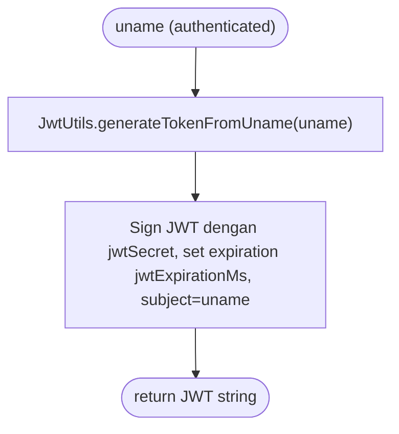

# 04 — Flows

> **TL;DR**: Flow login JWT end-to-end + DoD observable. · BE Dev / QA · baca saat build/test fitur login.

## Consumer-facing flows

### F-U-001: Login (JWT issuance)

**Actor / Trigger**: API consumer / client app — memanggil `POST /api/auth/dologin` dengan `{uname, pass}`.

**Flow** — Mermaid flowchart (bukan prose list):
```mermaid
flowchart TD
    C(["Client POST /api/auth/dologin {uname, pass}"]) --> V["Validasi LoginRequest (non-null uname/pass)"]
    V --> L["LdapUcsService.authLDAPNew(uname, pass)"]
    L --> NullCheck{"respLdap != null?"}
    NullCheck -- "no" --> NullFail(["400 MessageResponse 'Failed to connect to LDAP service'"])
    NullCheck -- "yes" --> Code{"responseCode == '00' atau '01'?"}
    %% v1.3 live verification (commit de3f828): kode sukses "00" TERVERIFIKASI via endpoint
    %% UCS asli — responseCode="00" responseDescription="SUCCESS" → HTTP 200. Controller juga
    %% terima "01" sebagai sukses (defensif), tapi endpoint UCS asli return "00".
    %% Failure codes verified: 502/503 (token), 401 (process).
    Code -- "no" --> BadCred(["400 MessageResponse(\"Authentication failed\")  %% generic, §B-007"])
    Code -- "yes" --> Jwt["JwtUtils.generateTokenFromUname(uname)"]
    Jwt --> Lookup["UserRepository.findByUname(uname) → Users"]
    Lookup --> Role["Maps urole → 'ROLE_<urole>'"]
    Role --> Ok(["200 JwtResponse{token, id, uname, kodeMitra, role}"])
    Jwt -. "exception" .-> AuthFail(["401 MessageResponse 'Authentication failed'"])
```

**Definition of Done**:
- [ ] `POST /api/auth/dologin` menerima JSON `{uname, pass}` dan mem-parsing ke `LoginRequest`.
- [x] Kredensial valid (LDAP `responseCode` "00"/"01") → response `200` dengan `JwtResponse` field verbatim newmojf: `token` (JWT non-empty), `type` ("Bearer "), `id`, `uname`, `mitKode` (nilai dari entity.kodeMitra), `urole` (nilai `ROLE_<urole>`). (Nama field final → OQ-AR-7.) ✅ **v1.3 verified live (commit de3f828)**: kode sukses `"00"` TERVERIFIKASI via endpoint UCS asli — `responseCode="00"` `responseDescription="SUCCESS"` → HTTP 200 + JwtResponse (`{id:1561, mitKode:"001", urole:"ROLE_0"}`). Controller juga terima `"01"` defensif; endpoint asli return `"00"`. Bukan lagi `[INFERRED]`.
- [ ] Token JWT diterbitkan dari `uname` dengan secret + expiration dari config (`jwtExpirationMs`).
- [ ] `mitKode` dan `urole` di-response berasal dari data user di tabel `mojf_users` (lookup `findByUname`), bukan hardcoded.
- [x] Kredensial salah (LDAP `responseCode` bukan "00"/"01") → `400` `MessageResponse("Authentication failed")` (generic). ✅ **OQ-FL-3 RESOLVED v1.3**: `responseDescription` dari LDAP_UCS bisa berisi pesan error internal/raw exception (`e.getMessage()`) — JANGAN echo ke client (§B-007); map ke generic "Authentication failed", raw detail di-log server-side only. Failure codes verified: `401`/`502`/`503`.
- [ ] LDAP tidak respons (`respLdap == null`) → `400` `MessageResponse("Failed to connect to LDAP service")`.
- [ ] Exception saat generate JWT/lookup → `401` `MessageResponse("Authentication failed")`.
- [ ] `/api/auth/**` permitAll di `SecurityConfig` (endpoint login tidak butuh token).
- [ ] CSRF disabled, session stateless di `SecurityConfig`.

**Source**: `AuthUserController.java:89-150`; `seed-PRD §E`.

---

## Backend / system flows

### F-S-001: JWT token generation & validation wiring

**Trigger**: suksesnya autentikasi LDAP di F-U-001 (generate); request ke endpoint terproteksi (validate — future scope).
**Inputs**: `uname` (String); `jwtSecret` + `jwtExpirationMs` dari config.

**Flow** — Mermaid:


**Outputs**: JWT string (HMAC-signed, subject=uname, exp 24j dari config).
**Failure handling**: exception → controller catch → `401 Authentication failed`. `(AuthUserController.java:140-142)`

**Definition of Done**:
- [ ] `JwtUtils.generateTokenFromUname(uname)` menghasilkan JWT bertanda (signed) dengan `jwtSecret`.
- [ ] Expiration token = `jwtExpirationMs` (86400000 ms = 24 jam) dari config.
- [ ] `JwtUtils` menyediakan method validate + parse (untuk endpoint terproteksi future).
- [ ] `jwtSecret` dibaca dari config (env var placeholder — lihat OQ-AR-3), bukan hardcoded literal.

**Source**: `AuthUserController.java:128`; `application-test.properties:24-25`.

---

## Sources

- `source/seed-PRD.md` §E, §D
- `AuthUserController.java:89-150,128` (newmojf referensi)
- `application-test.properties:24-25` (newmojf referensi)

## Out of Scope

- Flow refresh-token `(seed-PRD §F)`
- Flow password reset `(seed-PRD §F)`
- Validasi token di endpoint terproteksi (resource server) — disiapkan di SecurityConfig tapi endpoint terproteksi = future `(seed-PRD §F)`

## Open Questions

- [x] **OQ-FL-1** [P1] [business] [conf: high]: kontrak response LDAP UCS (`responseCode`/`responseDescription`, kode sukses "00"/"01") — valid untuk coresystembackend? Endpoint LDAP UCS apa yang dipakai (host/credential)? → **Resolved v1.2** (2026-07-22, with correction): endpoint LDAP UCS TERVERIFIKASI (lihat OQ-AR-1): `urlToken` (OAuth2 password-grant → Bearer) + `urlVerifyPassword` (GET `…/verifypassword/userid/{uname}/password/{AES-ECB-hashed}`) di `openapidev2.bankmega.local:15000` (UAT). **KOREKSI MATERIAL**: asumsi kode sukses `"00"/"01"` di flow F-U-001 **TIDAK TERVERIFIKASI** di kode newmojf — `LDAP_UCS_Utils.authLDAPNew` (baris 87-100) mengembalikan JSON mentah dari endpoint UCS saat sukses (`JSONParser` parse + return apa adanya, baris 243-249); newmojf tidak pernah men-set `"00"` sebagai responseCode sukses. Kode failure yang TERVERIFIKASI: token-error → `responseCode="502"/"503"` (baris 73-74, 95-96), process-error → `responseCode="401"` + `responseDescription=e.getMessage()` (baris 257-258, **pelanggaran B-007**). Kontrak `responseCode`/`responseDescription` sukses sebenarnya **HARUS dikonfirmasi dari endpoint UCS OpenAPI bankmega asli** — tandai `[INFERRED]` sampai integration-test ke endpoint asli; jangan berasumsi `"00"/"01"`. B-007: `responseDescription` JANGAN di-echo ke client (map ke generic "Invalid credentials"). Lihat catatan koreksi di F-U-001. **[v1.3 live verification, 2026-07-23, commit de3f828]**: kontrak sukses TERVERIFIKASI via endpoint UCS asli — POST `/api/auth/dologin` {orisys06/B@nkmega03} → LDAP verify-password return `responseCode="00"` `responseDescription="SUCCESS"` (ter-log: `responseCode=00 responseDescription=SUCCESS`); login sukses → HTTP 200 + JwtResponse. Kode sukses `"00"` KONFIRMASI valid (bukan lagi `[INFERRED]`). Catatan: controller juga menerima `"01"` sebagai sukses (defensif), tapi endpoint UCS asli mengembalikan `"00"`.
- [~] **OQ-FL-2** [P3] [business] [conf: low]: rate-limiting / lockout akun setelah N percobaan gagal — tidak disebut newmojf; perlu di v1? → **Deferred v1.3** (2026-07-23, PO decision): DEFER ke post-v1. Replikasi verbatim pola newmojf — newmojf tidak punya fitur rate-limiting/lockout, jadi v1 tidak mengimplementasikannya. Login endpoint tetap `permitAll` tanpa lockout. Rate-limiting/lockout = future enhancement (post-v1), memerlukan unit baru + modifikasi vault jika diadopsi. Tidak blocking v1 deploy. ⚠️ Pertimbangan security: tanpa lockout, endpoint rentan brute-force — mitigasi sementara via network-layer rate-limit (API gateway/reverse proxy) direkomendasikan sampai fitur diaplikasikan.
- [x] **OQ-FL-3** [P2] [business] [conf: medium]: sanitasi error body LDAP — `responseDescription` dari `LDAP_UCS_Utils` bisa berisi pesan internal/raw exception (`e.getMessage()`, `LDAP_UCS_Utils.java:257-258`) yang di-echo verbatim ke `400 MessageResponse` (`AuthUserController.java:144`). Replikasi verbatim (echo) atau map ke generic "Invalid credentials" (security hardening, anti information-leakage)? → **Resolved v1.3** (2026-07-23, implementation-verified, commit 6783558 U-008 + de3f828 logging): VERIFIED — map ke generic, BUKAN echo `responseDescription` verbatim. `AuthUserController.login()`: untuk non-success responseCode, return `MessageResponse("Authentication failed")` (generic) — TIDAK echo `result.responseDescription()` ke client (§B-007). `LdapUcsService`: semua catch-block log raw detail SERVER-SIDE only (`logger.error` e.getMessage/body), return `LdapAuthResult("401","Authentication failed")` generic. Live test konfirmasi: login gagal → `{message:"Authentication failed"}` tanpa bocor detail internal Keycloak/LDAP. Commit de3f828 menambah logging server-side di `getToken()` (RestClientResponseException body) + `authLDAPNew()` + controller catch — untuk diagnosis tanpa information-leakage ke client.
