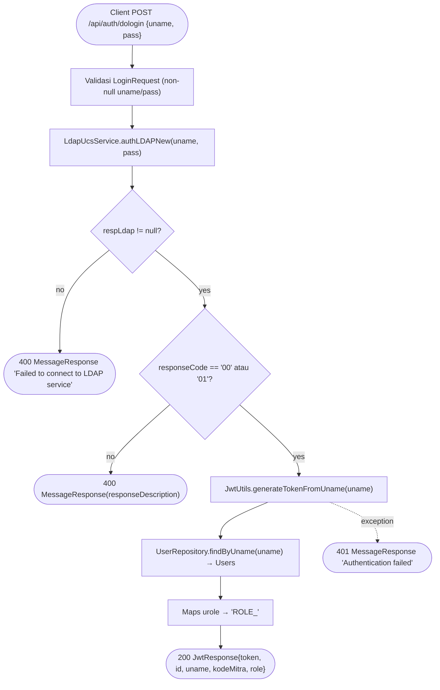

# 04 — Flows

> **TL;DR**: Flow login JWT end-to-end + DoD observable. · BE Dev / QA · baca saat build/test fitur login.

## Consumer-facing flows

### F-U-001: Login (JWT issuance)

**Actor / Trigger**: API consumer / client app — memanggil `POST /api/auth/dologin` dengan `{uname, pass}`.

**Flow** — Mermaid flowchart (bukan prose list):

**Definition of Done**:
- [ ] `POST /api/auth/dologin` menerima JSON `{uname, pass}` dan mem-parsing ke `LoginRequest`.
- [ ] Kredensial valid (LDAP `responseCode` "00"/"01") → response `200` dengan `JwtResponse` field verbatim newmojf: `token` (JWT non-empty), `type` ("Bearer "), `id`, `uname`, `mitKode` (nilai dari entity.kodeMitra), `urole` (nilai `ROLE_<urole>`). (Nama field final → OQ-AR-7.)
- [ ] Token JWT diterbitkan dari `uname` dengan secret + expiration dari config (`jwtExpirationMs`).
- [ ] `mitKode` dan `urole` di-response berasal dari data user di tabel `users` (lookup `findByUname`), bukan hardcoded.
- [ ] Kredensial salah (LDAP `responseCode` bukan "00"/"01") → `400` `MessageResponse(responseDescription)`. ⚠️ `responseDescription` dari LDAP_UCS bisa berisi pesan error internal/raw exception (`e.getMessage()`) — risiko information leakage (lihat OQ-FL-3).
- [ ] LDAP tidak respons (`respLdap == null`) → `400` `MessageResponse("Failed to connect to LDAP service")`.
- [ ] Exception saat generate JWT/lookup → `401` `MessageResponse("Authentication failed")`.
- [ ] `/api/auth/**` permitAll di `SecurityConfig` (endpoint login tidak butuh token).
- [ ] CSRF disabled, session stateless di `SecurityConfig`.

**Source**: `AuthUserController.java:89-150`; `seed-PRD §E`.

---

## Backend / system flows

### F-S-001: JWT token generation & validation wiring

**Trigger**: suksesnya autentikasi LDAP di F-U-001 (generate); request ke endpoint terproteksi (validate — future scope).
**Inputs**: `uname` (String); `jwtSecret` + `jwtExpirationMs` dari config.

**Flow** — Mermaid:

**Outputs**: JWT string (HMAC-signed, subject=uname, exp 24j dari config).
**Failure handling**: exception → controller catch → `401 Authentication failed`. `(AuthUserController.java:140-142)`

**Definition of Done**:
- [ ] `JwtUtils.generateTokenFromUname(uname)` menghasilkan JWT bertanda (signed) dengan `jwtSecret`.
- [ ] Expiration token = `jwtExpirationMs` (86400000 ms = 24 jam) dari config.
- [ ] `JwtUtils` menyediakan method validate + parse (untuk endpoint terproteksi future).
- [ ] `jwtSecret` dibaca dari config (env var placeholder — lihat OQ-AR-3), bukan hardcoded literal.

**Source**: `AuthUserController.java:128`; `application-test.properties:24-25`.

---

## Sources

- `source/seed-PRD.md` §E, §D
- `AuthUserController.java:89-150,128` (newmojf referensi)
- `application-test.properties:24-25` (newmojf referensi)

## Out of Scope

- Flow refresh-token `(seed-PRD §F)`
- Flow password reset `(seed-PRD §F)`
- Validasi token di endpoint terproteksi (resource server) — disiapkan di SecurityConfig tapi endpoint terproteksi = future `(seed-PRD §F)`

## Open Questions

- [ ] **OQ-FL-1** [P1] [business] [conf: high]: kontrak response LDAP UCS (`responseCode`/`responseDescription`, kode sukses "00"/"01") — valid untuk coresystembackend? Endpoint LDAP UCS apa yang dipakai (host/credential)? — resolve: infra/security team
- [ ] **OQ-FL-2** [P3] [business] [conf: low]: rate-limiting / lockout akun setelah N percobaan gagal — tidak disebut newmojf; perlu di v1? — resolve: PO/security
- [ ] **OQ-FL-3** [P2] [business] [conf: medium]: sanitasi error body LDAP — `responseDescription` dari `LDAP_UCS_Utils` bisa berisi pesan internal/raw exception (`e.getMessage()`, `LDAP_UCS_Utils.java:257-258`) yang di-echo verbatim ke `400 MessageResponse` (`AuthUserController.java:144`). Replikasi verbatim (echo) atau map ke generic "Invalid credentials" (security hardening, anti information-leakage)? — resolve: PO/security
