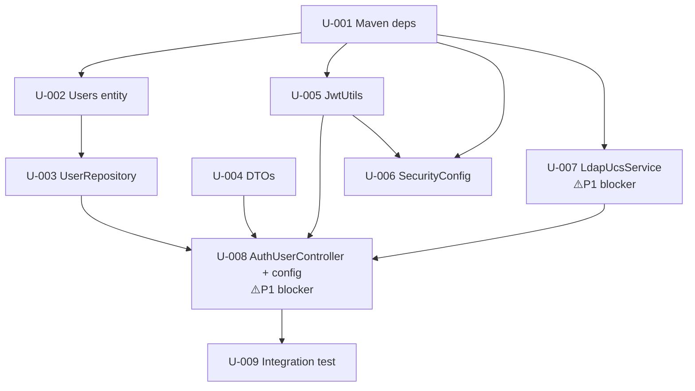

# Units Index — jwt-login

> 9 atomic units, all `task_type: create` (greenfield). Modules: M-foundation, M-persistence, M-security, M-integration, M-api.
> Generated by `mega-sdd:generate-units` on 2026-07-22.

## Summary

- **Total units:** 9
- **All task_type: create** (greenfield skeleton — no existing code to verify/extend)
- **P1-blocker units** (halt execute-bolts if OQ unresolved): U-007 (OQ-AR-1, AR-6, FL-1), U-008 (OQ-AR-2)
- **Risk: high** — U-007, U-008 (external dependencies / P1 OQs)
- **OQs propagated into binding_refs:** OQ-AR-1..7, OQ-DM-1..3, OQ-FL-1..3, OQ-CN-1..2, OQ-DC-1, OQ-OV-1 (Step 12.5.g traceability)

## Dependency DAG

## Topological execution order (waves)

> `execute-bolts --parallel` can run each wave concurrently; waves are sequential barriers.

- **Wave 1:** U-001 (foundation — everything compiles against it)
- **Wave 2 (parallel):** U-002 (entity), U-004 (DTOs), U-005 (JwtUtils), U-007 (LdapUcsService)
- **Wave 3 (parallel):** U-003 (repo, needs U-002), U-006 (SecurityConfig, needs U-001+U-005)
- **Wave 4:** U-008 (controller + config, needs U-003+U-004+U-005+U-007) — ⚠️ P1 blocker OQ-AR-2
- **Wave 5:** U-009 (integration test, needs U-008)

## Units by module

### M-foundation
| ID | Title | Complexity | Depends on | P1 blocker? |
|---|---|---|---|---|
| U-001 | Add Maven dependencies | small | — | no |

### M-persistence
| ID | Title | Complexity | Depends on | P1 blocker? |
|---|---|---|---|---|
| U-002 | Create Users entity | small | U-001 | no (OQ-DM-1/3 recommend) |
| U-003 | Create UserRepository | small | U-002 | no |

### M-security
| ID | Title | Complexity | Depends on | P1 blocker? |
|---|---|---|---|---|
| U-005 | Create JwtUtils (jjwt 0.12.x) | medium | U-001 | no (OQ-AR-3/4 recommend) |
| U-006 | Create SecurityConfig (7.x) | medium | U-001, U-005 | no (OQ-AR-5 recommend) |

### M-integration
| ID | Title | Complexity | Depends on | P1 blocker? |
|---|---|---|---|---|
| U-007 | Create LdapUcsService | medium | U-001 | **YES — OQ-AR-1, OQ-AR-6, OQ-FL-1** |

### M-api
| ID | Title | Complexity | Depends on | P1 blocker? |
|---|---|---|---|---|
| U-004 | Create DTOs | small | — | no (OQ-AR-7 default verbatim) |
| U-008 | AuthUserController + config | medium | U-003, U-004, U-005, U-007 | **YES — OQ-AR-2** |
| U-009 | Integration test | small | U-008 | no |

## Hard rules / anti-patterns summary

- 14 machine-validated Hard Rules (pack 8/8 + constitution) + 5 anti-patterns propagated from `binding.md` into the relevant units.
- Cross-unit invariants (constitution §C-003 business-logic-in-@Service, §C-005 @Transactional) injected where applicable.
- P1 OQ traceability (Step 12.5.g): OQ-AR-1/AR-6/FL-1 in U-007 `binding_refs`; OQ-AR-2 in U-008 `binding_refs`.

## Suggested next

`/mega-sdd:execute-bolts --all` (runs waves in order; halts on U-007/U-008 if P1 OQs unresolved — route to `/mega-sdd:resolve-oq` first).
