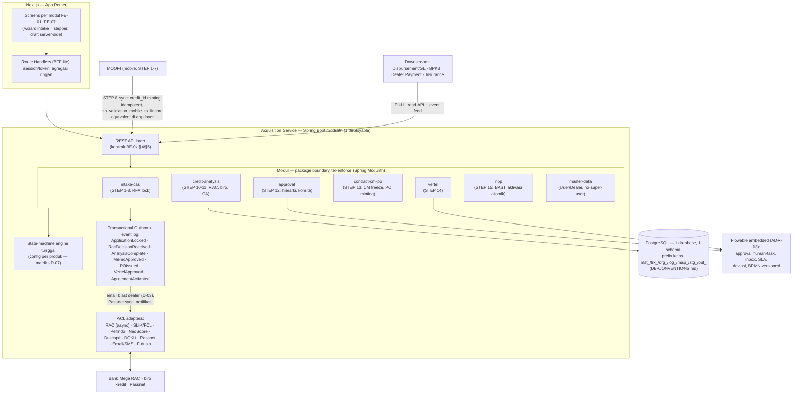
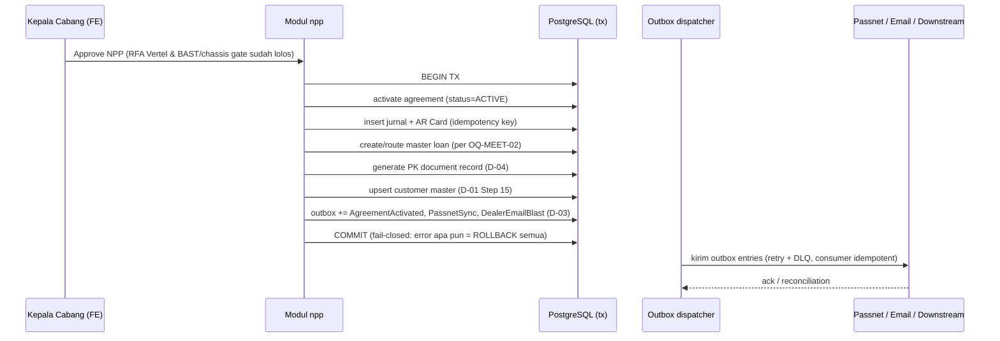

# ARCHITECTURE PROPOSAL — Revamp Acquisition MACF (New Coresystem)

> **Status**: USULAN (proposal) — disusun sebagai input rekonsiliasi dengan dokumen arsitektur tim
> **ITEC Bank Mega** (pemilik keputusan arsitektur final per keputusan meeting **D-11**, deadline dokumen
> ITEC 10 Juli 2026). Semua butir yang menunggu ITEC tercatat di §10 Assumption Register.
>
> **Tanggal**: 2026-07-14 · **Scope**: bounded context **Acquisition** (SoW BE + FE)
> **Target stack** `[LOCKED per D-12]`: **BE = Java** · **FE = Next.js**
>
> **Sumber otoritatif** (semua klaim dokumen ini bersumber dari sini):
> - Knowledge Base `.mega-sdd/knowledge-base/` — khususnya `99-rebuild-architecture/suggested-system-flow.md`,
>   `module-dependency-graph.md`, `suggested-phasing.md`, `data-mutation-policy.md`, `suggested-erd.md`
> - Ground truth alur final 16 STEP: `.mega-sdd/knowledge-base/.sp-manifests/_ACQUISITION-GROUND-TRUTH.md` (v2,
>   dari "ALUR TRANSAKSI ACQUISITION 08072026.pdf")
> - Register keputusan meeting D-01..D-12: `.mega-sdd/knowledge-base/.sp-manifests/_MEETING-DECISIONS-2026-07.md`
> - PRD per modul: `docs/prd/acquisition/BE-00..BE-07` (Java) + `FE-00..FE-07` (Next.js)
> - Ekstraksi FE legacy: `.mega-sdd/knowledge-base/60-frontend/` (`_screen-inventory.md`)

---

## 1. Executive Summary

**Rekomendasi: Modular Monolith ("modulith") Java/Spring Boot + Next.js dengan BFF-lite** — satu
deployable backend dengan boundary modul yang tegas dan ter-enforce di build, mengikuti 7+1 modul PRD;
komunikasi antar-modul via domain event internal + **transactional outbox**; seluruh integrasi eksternal
lewat **Anti-Corruption Layer (ACL)**; downstream tetap **PULL**. Pemecahan menjadi service terpisah
adalah *jalur evolusi* (§9), bukan titik awal.

Alasan inti (detail di ADR-01, §4):

1. **Konsistensi transaksional adalah inti bisnis** — STEP 15 (aktivasi kontrak → jurnal + AR Card +
   master loan + dokumen PK + sync Passnet) WAJIB atomik (D-01 Step 15; gotcha legacy "GL silent no-op
   but commit", `40-business-rules/hidden-gotchas.md`). Modulith = satu transaksi DB + outbox.
   Microservices = saga — kompleksitas yang mengulang bug legacy dalam bentuk terdistribusi.
2. **Alur 16 STEP itu satu state machine sekuensial**, bukan kumpulan kapabilitas paralel-independen.
   Network boundary memberi benefit kecil, penalti konsistensi besar.
3. **Realitas tim & timeline** — satu tim BE + satu tim FE; deploy independen per modul belum dibutuhkan.
4. **KB sendiri membolehkan** — `suggested-system-flow.md`: *"the boundaries below could ship as one
   modular service or several"*. Yang `[LOCKED]` adalah **boundary + kontrak perilaku**, bukan jumlah
   deployable.

---

## 2. Konteks & Constraint

### 2.1 Constraint keras (tidak bisa dinegosiasikan di level arsitektur)

| ID | Constraint | Sumber |
|---|---|---|
| C-1 | BE = Java, FE = Next.js | D-12 `[LOCKED]` |
| C-2 | Alur final = 16 STEP (STEP 8 sync MOOFI→FINCORE · STEP 14 Vertel · STEP 15 NPP dengan output jurnal/AR Card/master loan/PK/Passnet) | Ground-truth v2 |
| C-3 | Downstream (Disbursement/GL, BPKB, Dealer Payment, Insurance) menarik data via **PULL** — acquisition tidak push | Ground-truth v2 STEP 16 `[LOCKED]` |
| C-4 | RAC Bank Mega = integrasi eksternal **async** (request → callback/poll); dilarang cross-DB DML ke DB partner | `50-integrations/rac-bank-mega-risk-engine.md` `[LOCKED]` kontrak |
| C-5 | **Tidak ada super-user** | D-09 `[LOCKED]` |
| C-6 | Role cabang = CMO, Marketing Head, Credit Analyst, Kepala Cabang, Credit (Admin); hierarki approval by skala risiko | D-10 `[LOCKED]` |
| C-7 | Arsitektur final dimiliki ITEC Bank Mega | D-11 |
| C-8 | Field/aturan `[LOCKED]` di `data-mutation-policy.md` dipertahankan 1:1 (mis. skala kolektibilitas OJK, `trans_type_id` routing key, kontrak RAC) | KB data-mutation-policy |

### 2.2 Do-not-replicate (bug legacy yang WAJIB diperbaiki secara arsitektural)

Dari `40-business-rules/hidden-gotchas.md` (20 item) + ekstraksi FE `60-frontend/` — yang berdampak arsitektur:

- GL posting tanpa idempotency/reversal, silent-commit saat error → **outbox + idempotency key + fail-closed** (ADR-04).
- Logika bisnis di 473 stored procedure, termasuk HTTP dari T-SQL (`sp_OACreate` ke IP hardcode) dan
  linked-server DML lintas perusahaan → **zero SP, logic di application layer, ACL** (ADR-02, ADR-05).
- Car-vs-motor & CF-vs-syariah sebagai code path terpisah dengan formula drift + shadow table →
  **satu engine config-driven** (ADR-06).
- Validasi hanya client-side di banyak layar; menu per-employee tanpa role scheme; pilihan branch login
  tidak diverifikasi ulang server-side (OQ-SHELL-02) → **server-side authoritative validation + RBAC** (ADR-07).
- Fire-and-forget sync (Passnet) tanpa ack/write-back → **outbox + reconciliation** (ADR-04).
- Instant-Approval via manipulasi string identifier atas allow-list hardcode → **policy flag eksplisit &
  auditable** (D-01 Step 11).

---

## 3. Arsitektur Target (High-Level)

Urutan alur antar modul mengikuti dependency graph KB (`module-dependency-graph.md`):
`M1 → M2 → M3 → M4 → M6 → M5`, dengan `M7` sebagai trunk reference yang dikonsumsi semua modul.

---

## 4. Architecture Decision Records

Setiap ADR: **Keputusan → Konteks → Konsekuensi → Sumber**. Status semua ADR: *Proposed* (menunggu
rekonsiliasi ITEC, §10).

### ADR-01 — Modular Monolith, bukan microservices penuh

- **Keputusan**: satu deployable Spring Boot; modul = bounded context PRD (7+1); boundary ter-enforce.
- **Konteks**: lihat §1. Alur sekuensial 16 STEP; atomisitas STEP 15; satu tim BE.
- **Konsekuensi**: (+) transaksi lokal untuk titik kritis; (+) refactor boundary murah di awal; (−) satu
  blast-radius deploy — dimitigasi modul + test per modul; jalur evolusi ke service terpisah tersedia (§9).
- **Sumber**: `suggested-system-flow.md` §Logical service boundaries; D-01 Step 15.

### ADR-02 — Business logic 100% di application layer; **zero stored procedure**

- **Keputusan**: tidak ada logika bisnis di database. DB = penyimpanan + constraint integritas.
- **Konteks**: 473 SP legacy adalah lokus unmaintainability dan bug (HTTP dari T-SQL, `EXECUTE AS 'sa'`,
  linked-server DML). Ini pembalikan sadar dari arsitektur legacy.
- **Konsekuensi**: (+) testable, versionable, satu bahasa (Java); (−) migrasi perilaku SP → service perlu
  disiplin paritas: setiap SP acquisition yang masih hidup dipetakan ke service method di PRD BE-0x §6
  (aturan bisnis ber-ID + sumber).
- **Sumber**: `hidden-gotchas.md` §A/F; PRD BE-00 §7.

### ADR-03 — Satu database PostgreSQL, **satu schema + prefix kelas tabel**, ownership registry per modul *(REVISI 2026-07-14 — keputusan user)*

- **Keputusan**: 1 instance/1 database/**1 schema**; klasifikasi tabel via **prefix kelas**:
  `mst_` (master) · `trx_` (transaksional) · `cfg_` (konfigurasi engine/rule) · `log_` (audit append-only) ·
  `map_` (bridge antar sistem) · `stg_` (staging migrasi) · `out_` (outbox). Boundary modul di-enforce di
  **application layer** (Spring Modulith + ArchUnit) + **table-ownership registry** (PRD BE-00 §6: setiap
  tabel dimiliki tepat satu modul; write hanya oleh pemilik, read lintas modul via API/read-model modul
  pemilik). Konvensi lengkap (naming, tipe data, kolom wajib, larangan): **`docs/DB-CONVENTIONS.md`**.
- **Konteks**: butuh transaksi lintas modul di STEP 15 + disiplin ownership supaya pemecahan kelak murah.
  User memilih prefix-satu-schema (lebih sederhana operasionalnya) di atas schema-per-module; trade-off
  boundary DB fisik digantikan enforcement application-layer + registry.
- **Konsekuensi**: (+) atomisitas terjaga; (+) operasional DB sederhana; (−) boundary tidak ter-enforce
  di DB — mitigasi: ArchUnit test menolak repository menulis tabel milik modul lain (registry sebagai
  input test), review schema wajib rujuk DB-CONVENTIONS. **Catatan**: RDBMS final milik ITEC (§10);
  PostgreSQL USULAN — desain portable.
- **Sumber**: keputusan user 2026-07-14; `docs/DB-CONVENTIONS.md`; `suggested-erd.md`; `data-mutation-policy.md`.

### ADR-04 — Transactional Outbox untuk SEMUA efek eksternal + idempotency per flow

- **Keputusan**: setiap efek keluar (Passnet sync, email blast dealer D-03, notifikasi, event feed
  downstream) ditulis ke tabel outbox **dalam transaksi yang sama** dengan mutasi domain; dispatcher
  terpisah mengirim dengan retry + dead-letter; consumer idempotent.
- **Konteks**: legacy fire-and-forget tanpa ack (Passnet), GL double-posting possible, email dari `sa`.
- **Konsekuensi**: tabel idempotency-key per flow, mengikuti tabel wajib KB:

  | Flow | Requirement |
  |---|---|
  | RFA lock (STEP 6/9) | idempotent lock; re-lock memicu re-screening; emit `ApplicationLocked` |
  | RAC callback ingest (STEP 10) | idempotent by `application_id + decision_id` |
  | Committee approve (STEP 12) | identitas approver ter-enforce; **no self-approval** |
  | PO minting (STEP 13) | **single deterministic trigger** — tepat satu PO per approval |
  | NPP activation (STEP 15) | hard gate BAST + chassis; aktivasi atomik; jurnal fail-closed |
  | GL/jurnal posting | idempotency key + compensating reversal; TIDAK PERNAH silent-commit |
- **Sumber**: `suggested-system-flow.md` §Idempotency; D-01 Step 6/13/15; D-03.

### ADR-05 — Anti-Corruption Layer untuk 10 integrasi eksternal

- **Keputusan**: satu package/module `acl` dengan adapter per sistem eksternal; kontrak payload `[LOCKED]`
  dipertahankan; mekanisme transport bebas didesain ulang.
- **Konteks & bentuk per integrasi**:
  - **RAC Bank Mega** — request adapter + callback/poll ingester **async** (D-01 Step 8); route CF
    (konvensional) vs US (syariah) = dispatcher eksplisit; dilarang menulis ke DB Bank Mega.
  - **Biro (SLIK/FCL, Pefindo, NeoScore, Dukcapil)** — satu *bureau orchestrator* dengan adapter
    per sumber; window kesegaran 30 hari dihormati; skala kolektibilitas `[LOCKED]`.
  - **DOKU** — client HTTP di app tier (menggantikan `sp_OACreate`); persistence respons dimiliki sendiri.
  - **Passnet** — outbox + reconciliation job (ADR-04).
  - **Email/SMS** — provider adapter; email blast dealer (D-03) via outbox; template & trigger = OQ-MEET-01.
- **Sumber**: `50-integrations/*.md`; `suggested-system-flow.md` §ACL requirements.

### ADR-06 — State-machine engine tunggal, config-driven per produk

- **Keputusan**: satu engine status aplikasi (Draft → RFA-locked → RAC → CA → Committee → CM/PO → Vertel →
  NPP-active) dengan konfigurasi per produk MACF: step yang aktif, gate, hierarki approval (by
  `trans_type_id` + Plafond OP + skala risiko), varian car/motor & CF/syariah.
- **Konteks**: matriks step per produk belum final (D-07 / **OQ-MEET-06 [P1]**) — justru karena itu harus
  konfigurasi, bukan kode; legacy men-duplikasi path car/motor dengan formula drift.
- **Konsekuensi**: (+) OQ-MEET-06 bisa diselesaikan tanpa perubahan kode; (+) Instant-Approval jadi policy
  flag auditable di config (D-01 Step 11, eligibility = OQ-MEET-04); (−) engine harus dites property-based
  terhadap konfigurasi.
- **Sumber**: D-01 Step 10-11; D-07; `hidden-gotchas.md` (car/motor divergence); `suggested-system-flow.md` §Notes.

### ADR-07 — Security & AuthZ: RBAC 5 peran + maker-checker, server-side authoritative

- **Keputusan**:
  - Role model persis sensus **D-10** (CMO, Marketing Head, Credit Analyst, Kepala Cabang, Credit/Admin);
    **tidak ada super-user** (D-09) — tidak ada role, grant, maupun bypass path yang setara.
  - **Semua** validasi & gating otoritatif di server; FE hanya mirror preventif (temuan FE: banyak rule
    hanya hidup di browser).
  - No-self-approval di-enforce di service (checker ≠ maker), respons `403 SELF_APPROVAL_BLOCKED`.
  - Branch scoping: pilihan branch di login **diverifikasi ulang server-side** terhadap daftar branch
    yang berhak (menutup OQ-SHELL-02 [P1] — legacy hanya simpan snapshot 1 branch dan percaya input client).
  - Mekanisme auth/session & role-claim final menunggu ITEC (OQ-ARCH-STACK, §10); desain modul tidak
    bergantung pada pilihan itu (abstraksi `AuthenticatedActor` + `RoleResolver`).
- **Sumber**: D-09, D-10; `60-frontend/60-app-shell-auth-navigation.md` §9; PRD BE-07/FE-00.

### ADR-08 — Kontrak MOOFI→FINCORE (STEP 8): sync idempotent + credit_id minting

- **Keputusan**: endpoint ingest dari MOOFI yang (a) mint **nomor kontrak unik nasional → `credit_id`
  (PK)** lewat sequence/generator yang dimiliki modul intake (format 14-char `branch(5)+YY+MM+SEQ(5)`,
  reset bulanan per cabang — **OQ-GT-02 RESOLVED**, spec di BE-01 §3.1.13 / BE-07 §3.4), (b) membentuk
  draft kontrak `Status RFA='0'` idempotent by referensi aplikasi mobile, (c) memvalidasi payload
  (padanan `sp_validation_mobile_to_fincore` di app layer).
- **Sumber**: Ground-truth v2 STEP 8; PRD BE-01.

### ADR-09 — Downstream delivery: PULL via read-API + event feed (bukan push)

- **Keputusan**: modul NPP mengekspos (a) read-API kontrak eligibility/agreement dan (b) event feed
  (`AgreementActivated` dst. dari outbox) yang bisa di-poll/subscribe downstream. Acquisition tidak pernah
  menulis ke sistem downstream.
- **Sumber**: Ground-truth v2 STEP 16 `[LOCKED]`; `suggested-system-flow.md`.

### ADR-10 — Next.js: App Router + BFF-lite, tanpa BFF service terpisah

- **Keputusan**: App Router; server components untuk read path; Route Handlers hanya untuk session/token
  + agregasi ringan; **bukan** layanan BFF berdiri sendiri (hanya ada satu backend).
- **Bentuk FE** (detail di PRD FE-00): shared app shell (login + branch pick ter-verifikasi server,
  navigasi role-driven dari D-10 — bukan per-employee seperti legacy), shared components (form, table/grid
  dengan search/paging, dialog konfirmasi, upload, date/currency input — kontrak perilaku dari KB
  `67-client-side-behavior.md`), wizard intake multi-step dengan draft state server-side (staging §3a KB 61
  dipertahankan, tidak di-flatten), responsive mobile + desktop.
- **Sumber**: PRD FE-00; `60-frontend/_screen-inventory.md`.

### ADR-11 — Observability & audit sebagai first-class requirement

- **Keputusan**: (a) audit trail approval ke tabel padanan `tr_hierarchy_transaction` (STEP 12) —
  append-only; (b) structured logging + correlation id per `credit_id` menembus modul & ACL;
  (c) metric per gate (RFA, RAC latency, committee SLA, Vertel aging, NPP 30-day expiry — OQ-MEET-05);
  (d) event log outbox = sumber replay/rekonsiliasi.
- **Sumber**: Ground-truth v2 STEP 12/15; D-01 Step 14.

### ADR-12 — Testing & quality gates

- **Keputusan**: unit + module test per boundary (Modulith slice test); contract test untuk ACL adapter
  (wiremock per integrasi); property-based test untuk state-machine engine terhadap konfigurasi produk;
  acceptance test = Given/When/Then dari PRD BE-0x/FE-0x §9; arsitektur test (`ApplicationModules.verify()` +
  ArchUnit) menolak dependensi lintas modul ilegal & write ke tabel milik modul lain (input: table-ownership
  registry PRD BE-00 §6, per ADR-03); BPMN process test (Flowable test harness) untuk definisi approval.

### ADR-13 — Workflow engine: **Flowable embedded** untuk lapisan approval/human-task *(BARU 2026-07-14 — keputusan user)*

- **Keputusan**: approval/human-task layer (inbox, hierarki komite dinamis, maker-checker, RFA berlapis,
  deviasi, Vertel RFA, SLA aging, Instant-Approval lane) dijalankan **Flowable embedded** di dalam
  modulith. Lifecycle status aplikasi (Draft → RFA → RAC → CA → … → NPP-active) TETAP config-driven
  in-app (ADR-06) — engine mengorkestrasi *human task*, bukan menggantikan state machine domain.
- **Konteks**: banyak step approval dengan bentuk yang bisa berubah (matriks per-produk D-07/OQ-MEET-06
  belum final; mekanisme deviasi ditemukan di gap-extraction `tr_general_deviation`/`tr_ia_history`).
  Engine embedded = flow berubah tanpa deploy, tetap satu deployable.
- **Konsekuensi / rel integrasi** (detail `DB-CONVENTIONS.md` §8): (a) BPMN di-versioning di repo;
  (b) hierarki & matriks per-produk dibaca delegate dari `cfg_` tables — TIDAK di-hardcode di BPMN;
  (c) variabel proses hanya key (`credit_id`), payload tetap di `trx_`; (d) audit approval tetap ditulis
  ke `log_approval_history` milik kita — engine BUKAN satu-satunya sumber audit (kebutuhan regulatori);
  (e) no-self-approval & role census D-10 di-enforce di task assignment + service guard (dua lapis);
  (f) tabel runtime `ACT_*` milik engine, di luar konvensi schema, tidak disentuh manual; (g) kurva
  belajar BPMN tim = risiko yang diterima sadar.
- **Sumber**: keputusan user 2026-07-14; D-01 Step 10-11; gap-entities (deviasi/IA); D-07.

### ADR-14 — Standarisasi schema via `DB-CONVENTIONS.md` *(BARU 2026-07-14)*

- **Keputusan**: seluruh schema target mengikuti `docs/DB-CONVENTIONS.md` (prefix kelas, snake_case
  English singular, PK `id` identity + business key terpisah, declared FK wajib, mapping tipe MSSQL→
  PostgreSQL, kolom audit wajib, satu kolom `status`, larangan shadow-table/print-counter/denormalisasi
  identitas/temp permanen). PRD BE-0x §3 adalah **ground truth schema**: per tabel target memuat nama
  konvensi + mapping asal legacy + field census ber-marker.
- **Sumber**: keputusan user 2026-07-14; do-not-replicate `hidden-gotchas.md`.

### ADR-15 — Migrasi legacy→baru: simulation-first dengan reconciliation gate *(BARU 2026-07-14)*

- **Keputusan**: migrasi adalah deliverable Phase 1 (bukan aktivitas menjelang cutover): pipeline
  extract (`stg_legacy_*` 1:1) → transform (mapping matrix di PRD §3) → load, **dijalankan berulang
  sebagai simulasi** tiap sprint dengan **reconciliation report** otomatis (row count, financial sums,
  checksum field `[LOCKED]` zero-diff, FK orphan = 0, status-vocabulary mapping, dedup NIK report,
  **prod-data profiling atas semua klaim DISCARD/dead**, **archive completeness 112/112**).
  Acceptance cutover: 2 run berturut-turut zero-diff `[LOCKED]` + financial. Strategi cutover (drain vs
  in-flight) = **OQ-MIG-01 [P1]**, dua skenario terdokumentasi. Detail: `docs/DATA-MIGRATION-PLAN.md`.
  **Dua prinsip tambahan (user directive 2026-07-14)**: (a) **no-data-left-behind** — 100% data legacy
  (semua 112 tabel, termasuk DISCARD) di-extract + diarsip permanen; DISCARD hanya menyangkut schema
  target, bukan data; (b) **code-evidence ≠ data-evidence** — klasifikasi dead/DISCARD adalah asumsi
  arkeologi kode; final drop di-gate profiling data prod (OQ-MIG-05).
- **Konteks**: keputusan user — "migrasi dari lama ke baru harus support atau buat simulasi"; core baru
  = tolak ukur, legacy yang menyesuaikan (compatibility adapter di ACL untuk konsumen legacy selama
  transisi, dibuang setelah dekomisioning).
- **Sumber**: keputusan user 2026-07-14; `docs/DATA-MIGRATION-PLAN.md`; `data-mutation-policy.md`.

---

## 5. Dekomposisi Modul & Kontrak Event

| Modul | STEP | Owns (data) | Emits | Konsumsi |
|---|---|---|---|---|
| `intake-cas` | 1–8 (sisi FINCORE: 8), 9 | application header, applicant, related-person (typed), asset & financial draft, dokumen, screening log, RFA lock | `ApplicationLocked` | master-data |
| `credit-analysis` | 10–11 | RAC request/decision, hasil biro, CA recommendation, DSR | `RacDecisionReceived` (dari ingest callback RAC, via outbox — pelepas wait-state Flowable modul approval; OQ-BE03-04 resolved) · `AnalysisComplete` (bawa risk-tier + komposisi `trans_type_id`) | `ApplicationLocked` |
| `approval` | 12 | hierarki routing, keputusan komite, audit trail | `MemoApproved` / correction / reject | `AnalysisComplete` + `RacDecisionReceived` |
| `contract-cm-po` | 13 | CM final (freeze OP/ULI/LCR + asuransi), PO | `POIssued` | `MemoApproved` |
| `vertel` | 14 | TrVerificationCustomer padanan, RFA Vertel | `VertelApproved` | `POIssued` |
| `npp` | 15–16 | BAST, validasi chassis/engine, agreement aktif, jurnal + AR Card + master loan* + PK doc, feed downstream | `AgreementActivated` | `VertelApproved` |
| `master-data` | — | user (no super-user), dealer, master milik acquisition; read-through utk master eksternal | — | — |

\* ownership master loan = **OQ-MEET-02 [P1]** — bisa berpindah ke context servicing per keputusan ITEC.

Aturan komunikasi: antar modul **hanya** via event (tabel di atas) atau API publik modul — tidak pernah
akses repository/tabel modul lain secara langsung.

---

## 6. Data Architecture

- Konvensi schema OTORITATIF = **`docs/DB-CONVENTIONS.md`** (ADR-14): satu schema, prefix kelas
  `mst_/trx_/cfg_/log_/map_/stg_/out_`, **singular** snake_case English setelah prefix, PK `id`
  BIGINT identity (UUID hanya bila ITEC mensyaratkan — A-2) + business key terpisah (`credit_id`),
  declared FK wajib, kolom audit wajib, satu kolom `status`. Prinsip 3NF + Departures from Legacy
  tetap mengacu `99-rebuild-architecture/suggested-erd.md`.
- **Ground truth schema per modul = PRD `BE-0x` §3** (census kolom penuh + mapping asal legacy +
  disposisi migrasi); index kepemilikan = **Table-Ownership Registry BE-00 §6.3** (112 tabel legacy
  `FC_ACQ_MCF` ter-assign: 01:34 · 02:17 · 03:8 · 04:20 · 05:14 · 06:4 · 07:2 ·
  downstream-boundary:11 · cross-cutting:2).
- **Field `[LOCKED]`** (`data-mutation-policy.md`) dipertahankan 1:1 — antara lain skala kolektibilitas
  OJK, kontrak payload RAC (record set CF vs US/BMS), `trans_type_id` sebagai routing key, `credit_id`.
- **Field `[ARTIFACT]`** didrop dengan register discard (konfirmasi stakeholder per item); tabel gap
  hasil re-audit dump terdokumentasi di KB `30-data-model/gap-entities.md` (OQ-GAP-01..11).
- Master eksternal (`FC_MSTAPP_MCF`, **310 tabel — dump DDL diterima 2026-07-22**, census di KB
  `30-data-model/external-masters-census.md`; A-12 RESOLVED): dikonsumsi **read-only** via
  ACL/read-replica; kepemilikan tier per master TETAP **OQ-EXTMASTERS-01 [P1]** (daftar
  owned-vs-read-only + liveness linked-server masih menunggu jawaban DBA/ITEC).
- Migrasi data legacy: **`docs/DATA-MIGRATION-PLAN.md`** (ADR-15) — simulation-first + reconciliation
  gate; mapping matrix per tabel hidup di PRD `BE-0x` §3 kolom "Mapping asal".

---

## 7. Alur Kritis — Sequence STEP 15 (aktivasi atomik)

Kontras dengan legacy: `sp_approve_npp` legacy commit walau posting GL gagal diam-diam — pola di atas
menutupnya secara struktural.

---

## 8. Deployment View (usulan awal — final by ITEC)

- **1 container** acquisition-service (Spring Boot) + **1 container** Next.js + PostgreSQL managed.
- Horizontal scale: acquisition-service stateless (session di store eksternal), outbox dispatcher
  singleton-per-partition (leader election atau shedlock).
- Environment: dev → staging (integrasi RAC/biro sandbox) → prod. CI: build + test gates ADR-12.
- Topologi jaringan ke Bank Mega (RAC) & biro mengikuti standar ITEC — placeholder di §10.

---

## 9. Jalur Evolusi (kapan memecah modulith)

Pecah sebuah modul menjadi service terpisah HANYA bila salah satu tekanan ini nyata:

1. **Scale asimetris** — mis. ingest RAC callback / bureau orchestrator butuh throughput berbeda jauh.
2. **Tim terpisah dengan cadence deploy sendiri** per modul.
3. **Isolasi kegagalan regulatori** — mis. modul biro perlu boundary compliance sendiri.

Karena boundary sudah ter-enforce (ADR-01) dan data ownership per tabel tercatat di registry (ADR-03,
BE-00 §6.3), ekstraksi = angkat package + tabel-tabel milik modul itu + ganti event internal jadi
transport (di titik itu baru broker dipertimbangkan).
Kandidat ekstraksi pertama yang paling natural: **ACL/bureau orchestrator** (stateless, IO-bound).

**Anti-pattern yang secara eksplisit dihindari**: microservice-per-modul dari hari pertama; message
broker sebelum ada consumer streaming nyata; shadow table/`_R2` variants; BFF service terpisah;
validasi client-side-only; logika di stored procedure.

---

## 10. Assumption Register — menunggu rekonsiliasi ITEC (D-11)

| # | Butir | Status | Dampak bila berbeda |
|---|---|---|---|
| A-1 | Framework Java = Spring Boot 3 + Spring Modulith | USULAN | ADR tetap berlaku; enforcement boundary cari padanan (ArchUnit tetap bisa) |
| A-2 | RDBMS = PostgreSQL | USULAN | Desain portable; sequence/partisi outbox disesuaikan |
| A-3 | Mekanisme auth/session & role claim (SSO? LDAP/AD? token format?) | **OPEN — OQ-ARCH-STACK [P1]** | ADR-07 memakai abstraksi `AuthenticatedActor`; hanya adapter yang berubah |
| A-4 | Ownership master loan (acquisition vs servicing) | **OPEN — OQ-MEET-02 [P1]** | STEP 15 tetap atomik; yang berubah: tulis lokal vs emit command via outbox |
| A-5 | Matriks step per produk MACF | **OPEN — OQ-MEET-06 [P1]** | Ter-absorb di config engine (ADR-06), bukan kode |
| A-6 | Topologi infra/deployment, jaringan ke Bank Mega | menunggu dokumen ITEC | §8 direvisi mengikuti |
| A-7 | Trigger + template email blast dealer | **OPEN — OQ-MEET-01 [P2]** | Hanya konten adapter email |
| A-8 | Konsekuensi expiry verifikasi 30 hari (auto-cancel vs re-verify) | **OPEN — OQ-MEET-05 [P2]** | Transisi tambahan di state machine (config) |
| A-9 | Eligibility Instant-Approval per produk/plafond | **OPEN — OQ-MEET-04 [P2]** | Policy flag config (ADR-06) |
| A-10 | Dual path legacy `sp_approve_cm` vs `sp_approve_cm_moofi` per channel origination | **RESOLVED — evidence 2026-07-14** (OQ-GT-01): pemisah aktual = **trigger** (manual web vs agent otomatis IA/RAC-bulk), KEDUA SP live — detail BE-03 §11 | Keputusan port satu/dua jalur = keputusan desain modul approval (lane otomatis IA sejalan policy flag ADR-06), bukan lagi unknown evidence |
| A-11 | Strategi cutover migrasi: drain-di-legacy vs migrasi in-flight | **OPEN — OQ-MIG-01 [P1]** (dua skenario di `DATA-MIGRATION-PLAN.md` §5) | Menentukan scope mapping state + runbook cutover; simulasi jalan untuk keduanya |
| A-12 | Dump schema `FC_MSTAPP_MCF` belum tersedia | **RESOLVED — dump diterima 2026-07-22** (310 tabel + 112 SP + 2 UDF; census KB `30-data-model/external-masters-census.md`). Sisa umbrella OQ-EXTMASTERS-01: ownership per master + liveness linked-server; anomali baru OQ-EXTMASTERS-07 (8 objek dirujuk code, absen dari dump) | Mapping migrasi masters + finalisasi BE-07 UNBLOCKED di sisi DDL; ownership tetap gate keputusan |
| A-13 | KPI baseline legacy (SLA per step, end-to-end intake→NPP, latency RAC, throughput approval) belum diukur | aksi: ukur dari data legacy sebelum Phase 2 | "Efisien" jadi terukur — target angka ditetapkan bareng bisnis di atas baseline ini |

---

## 11. Ringkasan untuk Meeting Rekonsiliasi

Tiga pesan utama ke ITEC:

1. **Boundary & kontrak perilaku sudah final dari sisi analisa** (PRD BE/FE per modul + KB) — arsitektur
   fisik (deployable count, infra, auth) fleksibel mengikuti standar ITEC tanpa mengubah boundary.
2. **Usulan kami: modulith dulu** — dengan bukti seam yang bersih (event kontrak §5, table-ownership
   registry per modul §6/BE-00 §6.3, jalur evolusi §9) sehingga keputusan "berapa service" tidak perlu
   diambil prematur.
3. **9 butir §10 butuh jawaban ITEC/stakeholder** — 4 di antaranya P1; A-3/A-4 memblokir detail
   engineering modul terkait, sisanya ter-absorb konfigurasi (A-10 sudah RESOLVED via evidence kode).
