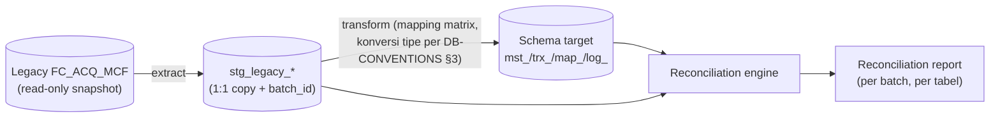

# DATA-MIGRATION-PLAN — Legacy FC_ACQ_MCF → Core Acquisition Baru

> **Status**: KERANGKA DISEPAKATI (2026-07-14) — strategi cutover masih **OQ-MIG-01 [P1]** (dua skenario
> terdokumentasi di §5, keputusan bareng bisnis/ITEC). Mapping matrix detil per tabel hidup di PRD
> `BE-0x` §3 (kolom "Mapping asal") — dokumen ini adalah payung proses + simulasi + rekonsiliasi.
>
> **Prinsip** (keputusan user): migrasi lama→baru HARUS di-support dan bisa **disimulasikan** berulang;
> core baru adalah tolak ukur — sistem legacy/tetangga yang menyesuaikan.
>
> **Prinsip 2 — NO-DATA-LEFT-BEHIND (keputusan user 2026-07-14)**: apapun disposisi target-nya,
> **SELURUH data legacy ikut ke sisi baru** — 100% dari 112 tabel (semua kolom, termasuk yang
> diklasifikasi DISCARD/dead) di-extract 1:1 ke `stg_legacy_*` DAN diarsip permanen (immutable archive).
> **DISCARD berlaku untuk SCHEMA TARGET saja, TIDAK PERNAH untuk data** — data tabel/kolom yang tidak
> dibawa ke schema operasional tetap query-able dari arsip. Tidak ada DELETE/DROP data legacy sampai
> dekomisioning diputuskan formal (dan arsip tetap dipertahankan sesudahnya per retensi OQ-MIG-02).
>
> **Prinsip 3 — CODE-EVIDENCE ≠ DATA-EVIDENCE (keputusan user 2026-07-14)**: semua klasifikasi
> "dead / 0-referensi / kolom mati / DISCARD" di PRD & KB berasal dari **arkeologi kode saja** (grep SP
> + .NET). Kita TIDAK punya data produksi riil — pemisahan kolom di legacy pasti punya alasan historis,
> dan kolom tanpa reader di kode BISA SAJA berisi data yang ditulis sistem lama/eksternal. Karena itu
> setiap klaim dead/DISCARD berstatus **ASUMSI [INFERRED — code-only]** sampai lolos gate profiling data
> prod (§3). Kontradiksi profiling → reklasifikasi + register OQ, bukan dipaksakan.

## 1. Scope & sumber

| Sumber | Isi | Status |
|---|---|---|
| `FC_ACQ_MCF` (dump tersedia) | 112 tabel transaksional acquisition | Ter-census penuh: KB `30-data-model/` + `gap-entities.md`; ownership per modul di PRD BE-00 §6 |
| `FC_MSTAPP_MCF` (**310 tabel** + 112 SP + 2 UDF) | Master data eksternal | **DUMP DITERIMA 2026-07-22** (`FC_MSTAPP_MCF.sql`); census + cross-check di KB `30-data-model/external-masters-census.md` (171 tabel dipakai code acquisition; 8 objek dirujuk code TIDAK ada di dump → OQ-EXTMASTERS-07 [P1]). Sisa OQ-EXTMASTERS-01: ownership per master + liveness linked-server |
| DB MOOFI (mobile) | Sumber STEP 1–7 | Di luar scope migrasi (upstream tetap hidup); hanya kontrak sync STEP 8 |

Klasifikasi tabel legacy (basis: PRD BE-0x §3 + KB). **Semua kelas mengikuti Prinsip 2**: extract 1:1 +
arsip permanen berlaku untuk SEMUA tabel — kelas hanya menentukan apa yang masuk **schema target operasional**:
- **MIGRATE** — data dibawa ke tabel target baru (mapping kolom eksplisit).
- **MIGRATE-READONLY** — historis dibawa ke store arsip/read-model (tidak jadi data operasional).
- **DISCARD** — `[ARTIFACT]` (dead/log/temp) — **tidak dibawa ke schema target**; datanya TETAP di-extract
  + diarsip (Prinsip 2). Status klasifikasi = asumsi code-only (Prinsip 3) — final drop dari schema target
  hanya setelah gate profiling §3 lolos + konfirmasi stakeholder per item.
- **REBUILD** — struktur target diisi ulang dari sumber lain (mis. `out_event` mulai kosong); data legacy
  padanannya tetap diarsip.
- **PULL (downstream-boundary)** — tabel milik downstream (mis. 5 subledger `CF*SubLedger` — engine
  disbursement-subledger, BE-05 §3.2.1): **di luar scope migrasi acquisition**; acquisition hanya emit
  event/read-only. Dipakai registry BE-00 §6.3 utk 11 tabel boundary. Data tabel boundary ini TETAP
  di-extract + diarsip (Prinsip 2 — masuk hitungan archive completeness 112/112, §3).

## 2. Arsitektur migrasi & simulasi

- **Extract**: snapshot konsisten legacy → tabel `stg_legacy_{nama_asli}` (struktur 1:1, plus
  `migration_batch_id`, `extracted_at`). Tidak ada transformasi di tahap ini.
- **Transform + Load**: per mapping matrix; konversi tipe mengikuti `DB-CONVENTIONS.md` §3; nilai
  `[LOCKED]` dilarang ditransformasi selain cast lossless.
- **Simulasi = pipeline yang sama, target schema staging** — dijalankan berulang tiap sprint sejak
  Phase 1 (bukan menjelang cutover). Setiap run menghasilkan reconciliation report; regresi mapping
  ketahuan dini.

## 3. Reconciliation (acceptance gate)

Per tabel MIGRATE, report wajib memuat:

| Check | Aturan lolos |
|---|---|
| Row count | `count(stg) = count(target) + count(rejected dengan alasan)` — rejected 0 tanpa alasan terdokumentasi |
| Financial sums | `SUM` semua kolom uang (`NUMERIC`) identik s.d. 2 desimal per company+branch |
| `[LOCKED]` checksum | hash per baris atas seluruh kolom `[LOCKED]` (per `data-mutation-policy.md` + PRD §3): zero-diff MUTLAK |
| FK integrity | 0 orphan pada semua declared FK target |
| Status vocabulary | setiap nilai status legacy ter-map ke vocabulary state machine baru; nilai tak ter-map = reject + register |
| Dedup | `credit_id` unik; NIK dedup report (temuan duplikat legacy = keputusan bisnis, bukan auto-merge) |
| **Assumption validation (prod-data profiling)** | Utk SETIAP klaim dead/DISCARD (tabel maupun kolom): profil data prod nyata — `% non-null`, `count distinct`, tanggal tulis terakhir (bila ada kolom waktu), sampel nilai. Kolom "mati menurut kode" yang ternyata TERISI & bervariasi di prod = **kontradiksi** → reklasifikasi (minimal MIGRATE-READONLY) + register OQ; TIDAK boleh di-drop dari schema target. Hasil profiling dilampirkan per tabel di reconciliation report |
| Archive completeness | `count(archive) = count(source)` utk SEMUA 112 tabel TANPA KECUALI (termasuk DISCARD/REBUILD) — bukti Prinsip 2 per batch |

**Acceptance cutover**: 2 run simulasi berturut-turut zero-diff pada `[LOCKED]` + financial sums,
semua rejected ber-disposisi, **archive completeness 112/112**, dan **seluruh klaim DISCARD/dead sudah
ber-profiling prod tanpa kontradiksi yang belum ter-disposisi**.

## 4. Urutan migrasi (mengikuti dependency graph KB)

1. **Masters** (`mst_*`/`cfg_`/`map_` referensi) — DDL katalog eksternal TERSEDIA (dump
   `FC_MSTAPP_MCF` 2026-07-22; read-set acquisition = 171 tabel, census KB
   `30-data-model/external-masters-census.md` §7); mapping final per master menunggu keputusan
   ownership (OQ-EXTMASTERS-01) + klarifikasi 8 objek absen (OQ-EXTMASTERS-07). Catatan sumber:
   keluarga konfigurasi approval (`ms_hierarchy_transaction`, `ms_trans_type`, `ms_module_menu`,
   `ms_approval_*`) fisiknya di `FC_MSTAPP_MCF` → sumber migrasi `cfg_*`; `MsPublicHoliday` ada di
   DUA database (OQ-EXTMASTERS-08 — pilih copy otoritatif). **Master LOKAL `FC_ACQ_MCF` (tak pernah
   ter-blokir dump)**: `MsPublicHoliday`→`mst_public_holiday`, `GFTransactionTypeGLLink`→`map_transaction_type_gl`
   (checksum `[LOCKED]` zero-diff), `ms_credit_source`→`mst_credit_source`, seed
   `tr_auto_number`/`tr_generate_code`→`cfg_number_format` (PRD BE-07 §3.0; registry BE-00 §6.3).
2. **Customer & application spine** — `tr_CIF`→customer, `tr_CAS`+anak→`trx_application`+anak.
3. **Analysis** — `tr_CA`+anak, hasil biro (historis → MIGRATE-READONLY).
4. **Approval history** — `tr_approval_history`/`tr_hierarchy_*` → `log_approval_history`
   (append-only; migrasi in-flight ke Flowable process instance TERGANTUNG keputusan cutover
   OQ-MIG-01 §5 — skenario A: tidak sama sekali; skenario B: start pada task padanan).
5. **Contract/PO** — `tr_CM`+anak (normalisasi per PRD BE-04), `tr_PO`.
6. **Vertel & NPP** — `tr_verification_customer`, `tr_NPP`, AR Card/jurnal (koordinasi downstream).

## 5. Strategi cutover — **OQ-MIG-01 [P1], BELUM DIPUTUSKAN**

| | Skenario A — Drain di legacy | Skenario B — Migrasi in-flight per status |
|---|---|---|
| Aplikasi baru | Masuk core baru sejak hari-X | Masuk core baru sejak hari-X |
| Aplikasi berjalan | Diselesaikan di legacy sampai habis (dual-run terbatas durasi pipeline terpanjang: intake→NPP + Vertel 30-day window) | Dipindah sesuai posisi step; state legacy di-map ke state machine baru + Flowable process instance di-start pada task padanan |
| Data dimigrasi | Kontrak aktif/selesai (read-model + spine historis) | Semua, termasuk in-flight |
| Risiko utama | Dual-run ops (2 sistem hidup); rekap gabungan pelaporan | Mapping state per step HARUS sempurna; start-instance Flowable mid-process kompleks; rollback sulit |
| Prasyarat tambahan | Definisi "habis" per step (mis. aplikasi Draft >90 hari = expire?) | Matriks state legacy→baru per step ter-uji di simulasi, termasuk kasus Correction/Open CM |
| Rekomendasi teknis | ✅ default paling aman | hanya bila bisnis menuntut cutover cepat total |

**Resolves**: keputusan bisnis + ITEC; input yang dibutuhkan: volume in-flight rata-rata per step,
toleransi dual-run ops, deadline dekomisioning legacy.

## 6. Deliverables & ownership

| Deliverable | Fase | Catatan |
|---|---|---|
| Mapping matrix per tabel (di PRD BE-0x §3 kolom "Mapping asal") | Phase 1 | ✅ sedang diisi (patch PRD 2026-07-14) |
| Simulation harness + reconciliation engine | Phase 1 | codebase terpisah `migration/`; jalan di CI |
| Reconciliation report format + dashboard | Phase 1 | per batch, per tabel |
| Dump & mapping `FC_MSTAPP_MCF` | Phase 1 | **Dump ✅ diterima 2026-07-22** (census KB `30-data-model/external-masters-census.md`); mapping per master lanjut setelah ownership (OQ-EXTMASTERS-01) + klarifikasi 8 objek absen (OQ-EXTMASTERS-07) |
| Akses snapshot/statistik data prod utk profiling | Phase 1 blocker | **aksi: minta DBA** — prasyarat OQ-MIG-05 (Prinsip 3) |
| Prod-data profiling pass atas SEMUA klaim dead/DISCARD (OQ-MIG-05) | Phase 1–2, sebelum final drop dari schema target | Output = lampiran profiling per tabel di reconciliation report (§3); kontradiksi → reklasifikasi + register OQ |
| Keputusan OQ-MIG-01 (cutover) | sebelum Phase 3 | dua skenario siap |
| Runbook cutover + rollback plan | Phase 3 | turunan keputusan OQ-MIG-01 |

## 7. Register OQ migrasi

- [ ] **OQ-MIG-01** [P1]: strategi cutover A (drain) vs B (in-flight) — lihat §5.
- [ ] **OQ-MIG-02** [P2]: retensi & lokasi arsip data legacy DISCARD/READONLY (kebutuhan audit OJK vs UU PDP).
- [ ] **OQ-MIG-03** [P2]: disposisi duplikat NIK historis yang ketahuan saat dedup migrasi (merge manual? biarkan per-aplikasi?).
- [ ] **OQ-MIG-04** [P3]: window freeze legacy saat extract snapshot final (berapa jam boleh downtime input cabang?).
- [ ] **OQ-MIG-05** [P1]: hasil profiling data prod atas SEMUA klaim dead/DISCARD (Prinsip 3) — daftar
  kolom/tabel "mati menurut kode" yang ternyata terisi di prod + disposisinya. **Prasyarat**: akses
  snapshot data prod (atau statistik dari DBA). BLOCKS final drop dari schema target, TIDAK memblokir
  desain schema (kolom bisa ditambahkan additive bila terbukti hidup).
