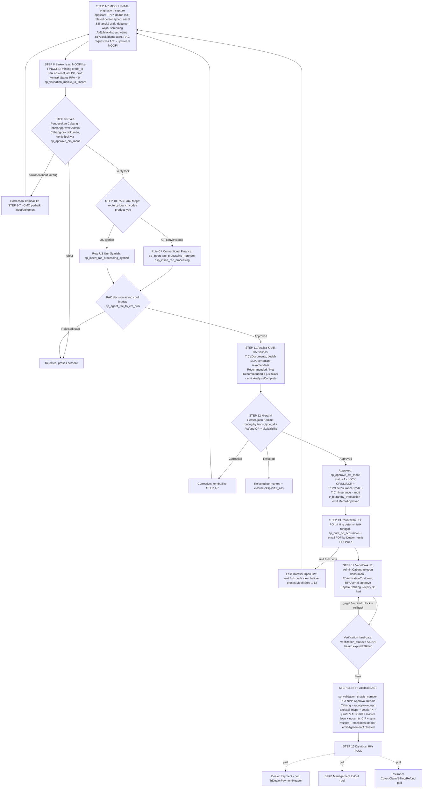
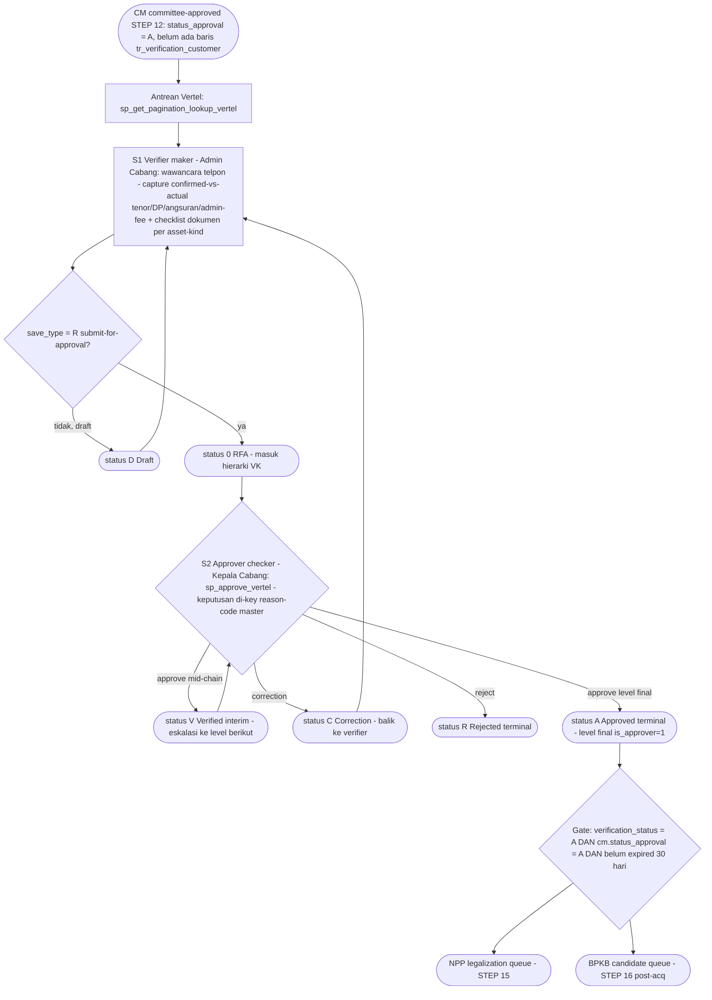
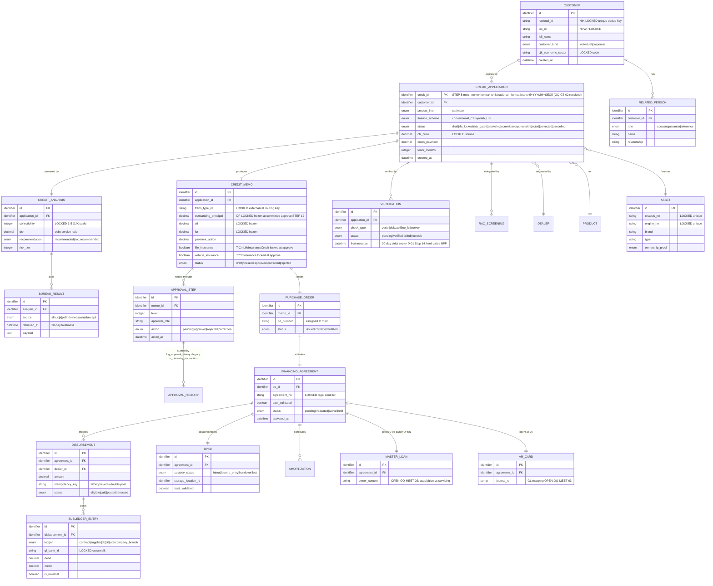

# PRD Payung — Microservice Acquisition (MCF/FINCORE) [BE]

> **Jenis dokumen**: PRD Payung (umbrella) untuk *bounded context* **Acquisition** pada core multifinance
> MCF/FINCORE — **edisi Backend (BE)**. Dokumen ini adalah **START POINT** tim backend untuk membangun
> microservice — ditulis agar **BUILDABLE** (entitas + field + enum + aturan kontrak konkret), bukan ringkasan.
>
> | Meta | Nilai |
> |---|---|
> | **Audience** | Tim Backend (BE) |
> | **Target stack** | **BE = Java** `[LOCKED]` (D-12); framework **belum ditetapkan** `[OPEN]` — lihat §7.0. FE = Next.js `[LOCKED]` (D-12), dicakup PRD `FE-*` terpisah. |
> | **Tanggal** | 2026-07-14 |
> | **Versi** | 2.1 — patch ground-truth schema 2026-07-14 (§6.3 Table-Ownership Registry 112 tabel, §7 pointer DB-CONVENTIONS/ADR-14, §8.7 ADR-13/ADR-15 + KPI baseline A-13, §11 OQ-MIG/OQ-GAP). Basis: 2.0 revisi post-meeting (supersedes `00-OVERVIEW.md` v1 pre-meeting) |
> | **Sumber otoritatif** | Ground-truth v2 (`.mega-sdd/knowledge-base/.sp-manifests/_ACQUISITION-GROUND-TRUTH.md`, PDF 08072026) · Decision register (`.mega-sdd/knowledge-base/.sp-manifests/_MEETING-DECISIONS-2026-07.md`, D-01..D-12) · KB backend (`.mega-sdd/knowledge-base/00-overview`, `20-workflows`, `30-data-model` — termasuk **`gap-entities.md`** (gap-extraction 22 tabel, 2026-07-14), `99-rebuild-architecture`) · KB frontend (`.mega-sdd/knowledge-base/60-frontend/`) · **Standar schema** `docs/DB-CONVENTIONS.md` (ADR-14, keputusan user 2026-07-14) · **Rencana migrasi** `docs/DATA-MIGRATION-PLAN.md` (ADR-15) · **ADR arsitektur** `docs/ARCHITECTURE-PROPOSAL.md` §4 (ADR-01..15; ADR-03 revisi satu-schema+prefix, ADR-13 Flowable) |
>
> **Bahasa**: Bahasa Indonesia; istilah teknis + identifier asli (nama SP, tabel, field, kode) dipertahankan
> apa adanya.

## Ringkasan Perubahan vs v1 (`00-OVERVIEW.md`)

Revisi ini mengintegrasikan hasil meeting FS Enhancement CRIA Phase 5 (MoM 7 Jul 26) + PDF final
"ALUR TRANSAKSI ACQUISITION 08072026":

1. **Renumbering final**: skema **FASE 1–15** (v1) di-supersede oleh **STEP 1–16** (PDF 08072026) —
   tabel rekonsiliasi di §3.0. Sumber: `_ACQUISITION-GROUND-TRUTH.md` §Deltas v1→v2.
2. **STEP 8 baru — sinkronisasi MOOFI → FINCORE** diformalkan: minting `credit_id` (nomor kontrak unik
   nasional, PK), pembentukan draft kontrak `Status RFA='0'`, `sp_validation_mobile_to_fincore`.
3. **STEP 14 baru — Vertel** disisipkan antara PO dan NPP (D-02): maker = Admin Cabang, checker = Kepala
   Cabang; sebelumnya di v1 diposisikan sebagai gate cross-cutting FASE 12–14.
4. **Aktor**: **Super user DIHAPUS** dari rebuild (D-09 `[LOCKED]`); **role census cabang** ditetapkan =
   CMO, Marketing Head, Credit Analyst, Kepala Cabang, Credit (Admin) (D-10 `[LOCKED]`).
5. **Financial lock berpindah**: v2 mengunci OP/ULI/LCR + asuransi **di committee-approve** (STEP 12,
   `sp_approve_cm_moofi`), bukan sebagai CM 2nd-data-entry terpisah (v1 FASE 12). Jalur ganda
   `sp_approve_cm` vs `sp_approve_cm_moofi` = OQ-GT-01 (✅ **RESOLVED — evidence 2026-07-14**: pemisah
   aktual = trigger manual-web vs agent otomatis, kedua SP live — §11.1).
6. **Output NPP dieksplisitkan** (STEP 15): jurnal + kartu piutang (AR Card, D-06), dokumen PK (D-04),
   master loan (D-05), sync Passnet, email blast dealer (D-03).
7. **Downstream bertambah Insurance** (STEP 16), selain Dealer Payment + BPKB.
8. **Target stack**: BE = **Java** `[LOCKED]` (D-12) — §7 ditulis ulang dengan konvensi Java; framework
   masih `[OPEN]` (USULAN: Spring Boot); arsitektur infra menunggu deliverable ITEC Bank Mega (D-11).
9. **Menu Master (User, Dealer, dst.)** masuk SoW rebuild (D-08) — memengaruhi §1.1 dan §10 Phase 1.
10. **Register keputusan §11** di-merge dengan OQ-GT-01..03 + OQ-MEET-01..06.

Seluruh substansi v1 yang masih valid **dipertahankan** (boundary ownership, shared ERD, ACL 10 integrasi,
NFR, resolusi OQ 2026-07-07).

## Tujuan Bisnis

Acquisition adalah **inti credit-origination pembiayaan kendaraan** (vehicle-financing credit origination)
untuk lender multifinance yang beroperasi di Indonesia. Fungsinya: menerima permohonan pembiayaan sebuah
**motor atau mobil** — yang bersumber dari dealer (*Pooling Order*), field agent, atau channel mobile
(*Repeat Order* / Instant-Approval via MOOFI) — lalu membawanya dari **intake pertama** melewati **credit
decisioning**, **persetujuan komite**, **kontrak/PO**, **verifikasi telepon (Vertel)**, hingga **legalisasi
(NPP)**, sambil menghasilkan catatan akuntansi dan regulator yang dibutuhkan sistem downstream
(disbursement/GL, BPKB, dealer payment, insurance) dan otoritas (OJK).

Rentang yang dimiliki microservice ini adalah **STEP 8–15** dari alur final 16-STEP (sinkronisasi
MOOFI→FINCORE → RFA cabang → RAC → CA → komite → PO → Vertel → NPP), dengan STEP 1–7 dimiliki upstream
MOOFI dan STEP 16 (post-acquisition) **menarik (PULL)** data dari sini — bukan di-push. Sumber:
`_ACQUISITION-GROUND-TRUTH.md` §FINAL 16-step.

### Catatan tentang sumber & artefak

- **KB (`.mega-sdd/knowledge-base/`) adalah SUMBER OTORITATIF TEKNIS** untuk PRD ini. Seluruh klaim entitas,
  alur, gate, dan penanda mutabilitas berasal dari sana (hasil ekstraksi tech-agnostic atas legacy .NET +
  473 stored procedure + schema `FC_ACQ_MCF`, plus ekstraksi FE `FINCORE.WEB` di `60-frontend/`).
- **Ground-truth alur v2** (`_ACQUISITION-GROUND-TRUTH.md`, dari PDF "ALUR TRANSAKSI ACQUISITION 08072026")
  **men-supersede v1**; di mana kode tidak sejalan dengan PDF, discrepancy didokumentasikan (mis. jalur ganda
  `sp_approve_cm` vs `sp_approve_cm_moofi` = OQ-GT-01, kini RESOLVED — evidence (§11.1);
  `sp_get_next_approval_scheme` di kode adalah ladder
  credit-analyst, sedangkan PDF STEP 12 menyebutnya sebagai router komite by Plafond+Risiko — perbedaan ini
  dicatat di §4, jangan direkonsiliasi diam-diam).
- **Decision register meeting** (`_MEETING-DECISIONS-2026-07.md`, D-01..D-12) berisi keputusan TARGET-STATE
  rebuild — bukan perilaku legacy; jangan berharap ada evidence 1:1 di kode legacy. Setiap pemakaian ditandai
  ID **D-xx** di dokumen ini.
- **BRD stakeholder-facing** direncanakan berada di `.mega-sdd/brd/` — itu **artefak berbeda** (bahasa bisnis,
  audiens stakeholder). *Forward reference*: pada saat penulisan PRD ini folder `.mega-sdd/brd/` belum dibuat;
  bila nanti ada, ia **melengkapi**, bukan menggantikan KB, dan bila terjadi selisih maka **KB menang** untuk
  keputusan teknis.

### Disiplin penanda (marker discipline)

| Penanda | Arti dalam PRD ini |
|---|---|
| `[LOCKED]` | **WAJIB dipertahankan 1:1** (regulatori / kontrak eksternal / external-FK / keputusan governance meeting). Perubahan additive saja. |
| `[INTENT]` | Outcome bisnis yang harus dipenuhi; **skema/mekanisme bebas didesain ulang** oleh rebuild. |
| `[ARTIFACT]` | Kecelakaan legacy — **dibuang** setelah konfirmasi stakeholder. |
| `[OPEN]` | Belum terjawab → masuk **Register Keputusan (§11)**; **JANGAN diselesaikan diam-diam**. |
| **USULAN** | Desain baru yang diusulkan PRD ini (belum diputuskan stakeholder/ITEC) — bukan fakta KB. |

---

## 1. Ruang Lingkup & Non-Goal

### 1.1 In-scope (dimiliki Acquisition — STEP 8–15 alur final)

- **Sinkronisasi MOOFI → FINCORE** (STEP 8): minting **`credit_id`** (nomor kontrak unik nasional, menjadi
  Primary Key), pembentukan draft kontrak (applicant + guarantor, kapasitas bayar, struktur pinjaman, file
  foto dipindah Mobile→Fincore) dengan **Status RFA = '0'**; SP validasi: `sp_validation_mobile_to_fincore`.
  Sumber: GT v2 STEP 8. Format/sequence penomoran = ✅ OQ-GT-02 **RESOLVED — evidence (2026-07-14)**:
  `branch_id(5)+YY(2)+MM(2)+SEQ(5)` = 14 char, counter `tr_generate_code` reset bulanan per cabang
  (spec: BE-01 §3.1.13; detail `_ACQUISITION-GROUND-TRUTH.md`).
- **RFA & Pengecekan Cabang** (STEP 9, menu Inbox Approval): Admin Cabang cek kelengkapan dokumen pendukung;
  tombol Verify mengunci data (`sp_approve_cm_moofi`); Correction → kembali ke STEP 1–7 (CMO perbaiki);
  Reject → proses berhenti. Sumber: GT v2 STEP 9.
- **Credit decisioning** (STEP 10–11): **RAC risk-gating** (rute CF konvensional vs US syariah) via ACL +
  ingest callback async + **Credit Analysis** (validasi dokumen granular `TrCaDocuments`, SLIK/FCL per bulan,
  scoring, DSR, rekomendasi Recommended/Not-Recommended).
- **Approval komite** (STEP 12): routing hierarki maker-checker by **trans_type_id + Plafond (OP) + skala
  risiko**; tiga aksi (approve/reject/correction); pada approve: **lock OP/ULI/LCR + Asuransi Jiwa
  (`TrCmLifeInsuranceCredit`) + Asuransi Kendaraan (`TrCmInsurance`)**; audit otomatis ke
  **`tr_hierarchy_transaction`**; Instant-Approval sebagai *policy flag* auditable (D-01 Step 11).
- **PO & Koreksi** (STEP 13): cetak PO (`sp_print_po_acquisition`; varian car `_mobil`), PDF di-email ke
  Dealer; **Fase Koreksi (Open CM)** bila unit fisik beda (warna/tipe) → kembali ke proses Moofi Step 1–12
  (granularitas return-target = `[OPEN]` OQ-GT-03).
- **Verifikasi Telepon / Vertel** (STEP 14 — **step baru wajib**, D-02): Admin Cabang validasi data langsung
  ke konsumen via telepon (**`TrVerificationCustomer`** / kanonik `tr_verification_customer`); Admin Cabang
  RFA Vertel; approval oleh **Kepala Cabang**. Detail sub-alur di §4.1.
- **NPP legalization** (STEP 15): validasi **BAST** + nomor rangka/mesin (`sp_validation_chasis_number`);
  RFA NPP oleh Admin Cabang; Approval NPP oleh Kepala Cabang → kontrak aktif (**`TrNpp`**), cetak Perjanjian
  Pembiayaan / dokumen **PK** (D-04), **jurnal + kartu piutang (AR Card)** terbentuk (D-06), **master loan**
  terbentuk (D-05), **sync ke Passnet**, **email blast ke dealer terkait** (D-03); serah **PULL** ke
  downstream.
- **Menu Master** (D-08): pengelolaan master data minimal **User & Dealer** (CRUD API) masuk SoW rebuild BE.
- **Anti-Corruption Layer** untuk 10 integrasi eksternal (lihat §9).

### 1.2 Non-Goal (di luar batas Acquisition)

- **MOOFI mobile origination (STEP 1–7)**: capture applicant + NIK dedup lock, related-person, asset &
  financial draft, document upload, entry-time screening, RFA lock initiation, RAC request — detail dimiliki
  upstream MOOFI ("ALUR TRANSAKSI MOOFI.png"); Acquisition menerima hasilnya di STEP 8. Semantik target-state
  STEP 1–7 tetap mengikat sebagai kontrak input (D-01) — lihat §4 catatan.
- **Post-acquisition eksekusi (STEP 16)**: Disbursement/GL posting, BPKB custody state-machine, Dealer
  Payment transfer, **Insurance** (Cover/Claim/Billing/Refund — ditambahkan v2) — mereka **PULL** dari
  Acquisition. Acquisition **hanya menyediakan** kontrak eligibility / event outbox (§5, §9). Model data
  mereka disebut di §6 sebagai konsumen, bukan milik.
- **Sibling context**: COLLECTION (Cash Receive, Cashier Session), TERMINATION (Normal-Dipercepat/Khusus/
  Insurance/Repossession) — **bukan** scope acquisition. Catatan: **cashier till session** yang ter-ekstrak
  di FE KB (`60-frontend/60-app-shell-auth-navigation.md` §1, OQ-SHELL-01) berada di luar SoW acquisition
  kecuali stakeholder menariknya masuk.
- **Master data catalog** (`FC_MSTAPP_MCF`, **310 tabel — dump DDL diterima 2026-07-22**, census KB
  `30-data-model/external-masters-census.md`; read-set acquisition = 171 tabel): dikonsumsi read-only oleh
  Acquisition; kepemilikan (owned vs read-only) TETAP `[OPEN]` (sisa OQ-EXTMASTERS-01). D-08 hanya
  menetapkan **menu** master User & Dealer masuk SoW — bukan memutuskan kepemilikan seluruh katalog.
- **Master loan**: pembentukannya adalah output wajib STEP 15 (D-05), tetapi **konteks pemilik + field
  census = `[OPEN]`** (OQ-MEET-02) — bisa jadi milik servicing context.
- **Frontend** (`FINCORE.WEB` legacy / Next.js rebuild) dan rendering laporan (RDLC) — di luar backend scope;
  kebutuhan API dari layar di-cross-check via KB `60-frontend/` (lihat §7.5).

### 1.3 Reengineering mandate (bukan mirror legacy)

Rebuild memenuhi tujuan bisnis + constraint `[LOCKED]`, **bukan** mereplika legacy verbatim. Bug legacy
"do-not-replicate" (GL silent no-op, BPKB guard dinonaktifkan, blacklist fail-open, LKK grade→weight bug,
security anti-pattern, plus FE: login guard mati, auth-cookie tak pernah di-enforce, branch trust gap)
**WAJIB diperbaiki** — lihat §8 dan register OQ §11. Keputusan meeting (D-01..D-12) adalah requirement
TARGET-STATE dan mengikat di atas perilaku legacy.

---

## 2. Aktor & Peran

Sumber: `00-overview/actors-and-roles.md` (legacy evidence) + **role census meeting D-10 `[LOCKED]`**
(target rebuild) + FE KB `60-frontend/60-app-shell-auth-navigation.md` (bagaimana legacy me-render peran).

**Temuan legacy yang tetap berlaku**: **tidak ada** skema `[Authorize]`/RBAC statis di kode legacy
(pencarian repository = 0 hit; FE me-resolve menu **per-employee number**, bukan per-role —
`60-app-shell-auth-navigation.md` BR-SHELL-4). Peran legacy direkonstruksi dari data model hierarki
maker-checker + skema approval. Rebuild **WAJIB** memperkenalkan permission layer yang benar berbasis census
D-10; absennya RBAC di legacy **bukan** constraint.

### 2.1 Role census cabang — TARGET rebuild `[LOCKED]` (D-10)

PDF 08072026 PRD Notes 2.1: users existing di cabang adalah **lima peran** berikut; hierarki approval
tergantung **skala risiko**:

| Peran (D-10) | Tanggung jawab di alur 16-STEP | Pemetaan evidence legacy |
|---|---|---|
| **CMO** | Originasi/input di lapangan (STEP 1–7 via MOOFI); target Correction STEP 9 & STEP 12 ("kembali ke Step 1–7 untuk perbaikan CMO"). | Muncul di lookup portfolio-exposure keyed by surveyor code (v1 `[OPEN]` apakah distinct — **kini role resmi per D-10**; pemetaan field surveyor↔CMO tetap perlu konfirmasi, OQ-ACTORS-03). |
| **Marketing Head** | Reviewer/approver bernama pada credit memo; posisi persis di hierarki = `[OPEN]`. | Ter-evidensi di credit memo (`actors-and-roles.md`). |
| **Credit Analyst** | STEP 11: validasi dokumen granular, bedah SLIK per bulan, rekomendasi + justifikasi; ladder approval CA (`sp_get_next_approval_scheme`, `AA00000001`). Identitas penandatangan `[LOCKED]`. | Ter-evidensi (stage credit-analysis). |
| **Kepala Cabang** | Approver **Vertel** (STEP 14) dan **NPP** (STEP 15). | Tidak bernama eksplisit di kode legacy (v1 OQ-ACTORS-01 "Branch Manager"); kini dinamai resmi oleh GT v2 STEP 14–15 + D-10. Pemetaan ke level hierarki konkret tetap perlu konfirmasi (OQ-ACTORS-01, di-narrow). |
| **Credit (Admin) / "Admin Cabang"** | STEP 9: cek kelengkapan dokumen + Verify (lock); STEP 13: cetak PO + email dealer; STEP 14: wawancara Vertel + RFA Vertel; STEP 15: validasi BAST + RFA NPP. | v1 OQ-ACTORS-02 "Admin tak ter-evidensi" — kini role resmi per D-10; scope permission konkret perlu definisi di PRD modul. |

### 2.2 Super user — DIHAPUS `[LOCKED]` (D-09)

PDF PRD Notes 2.1: **"Super user dihapus."** Rebuild **TIDAK BOLEH** men-ship role super-user (keputusan
governance). Konsekuensi:

- Flag super-user legacy (per trans-type, active-dated, bypass cek "apakah saya next approver") **tidak
  dibawa** ke rebuild — men-supersede status v1 yang masih `[INTENT]`.
- Klausa "super-user override wajib ter-audit" pada resolusi OQ-MCP-01 (2026-07-07) **gugur sebagian**:
  enforcement identitas approver di app-layer (no self-approval) **tetap berlaku**; jalur override-nya
  **hilang**. Bila bisnis butuh jalur eksepsi darurat, itu **KEPUTUSAN DESAIN BARU** → daftarkan sebagai OQ
  baru, jangan menyelundupkan super-user dengan nama lain.

### 2.3 Peran ter-evidensi legacy (referensi struktur, bukan katalog final)

| Peran | Deskripsi | Mutabilitas |
|---|---|---|
| **Preparer / "maker"** | Employee yang membuat & submit transaksi ke hierarki approval; tercatat sebagai acting employee pada entri hierarki. | `[INTENT]` |
| **Approver / "checker"** | Employee yang diharapkan bertindak berikutnya; bisa multi-level. | `[INTENT]` |
| **Approval-level holder** | Posisi bernama di dalam skema approval, ter-scope skema+level (contoh teramati: "Level 0"). Katalog nama level asli = `[OPEN]` (OQ-ACTORS-03). | `[LOCKED]` struktur / `[OPEN]` katalog |
| **Surveyor** | Field role pada credit memo; kunjungan/verifikasi customer; muncul di pooling-order & phone-verification. Relasinya dengan role CMO (D-10) = `[OPEN]`. | `[INTENT]` |
| **Dealer personnel** | Aktor eksternal (bukan employee) yang mengoriginasi permohonan; **bukan** peserta hierarki approval; penerima email PO (STEP 13) + email blast pasca STEP 15 (D-03). | `[INTENT]` |
| **Employee / signed-in user** | Autentikasi via corporate directory (LDAP) by employee number — bukan password store lokal (`60-app-shell` BR-SHELL-1 `[LOCKED]`); wajib memilih **branch** sebelum beroperasi (BR-SHELL-3 `[INTENT]`). | `[LOCKED]` mekanisme identitas / `[INTENT]` alur |

### 2.4 Catatan jalur ganda approval

Query inbox approval legacy **mengecualikan** credit ID asal channel mobile → aplikasi mobile-originated
dirutekan lewat **Instant-Approval (IA)** auto-path, **bukan** inbox manusia. D-01 Step 11 menegaskan IA lane
tetap ada di target-state sebagai **policy path auditable** (skip human queue untuk mobile-origin), dengan
**self-approval BLOCKED**. Rebuild role/permission WAJIB memodelkan **jalur kedua** ini agar tidak
kehilangan/menduplikasi item antrean. Outcome (setiap aplikasi resolve lewat **tepat satu** jalur approval
yang mengikat) yang penting; mekanismenya bebas. Eligibility rules IA per product/plafond = `[OPEN]`
OQ-MEET-04.

---

## 3. Peta Bounded Context / Kapabilitas

### 3.0 Skema penomoran otoritatif: STEP 1–16 (PDF 08072026) — rekonsiliasi vs v1

PRD v1 memakai **FASE 1–15**; ground-truth v2 me-renumber ke **STEP 1–16 FINAL**. Dokumen ini memakai
**STEP**. Tabel rekonsiliasi (dari `_ACQUISITION-GROUND-TRUTH.md` §Deltas):

| v1 (FASE, PRD lama) | v2 (STEP, FINAL) | Delta |
|---|---|---|
| FASE 1–7 (rekonstruksi kode) | STEP 1–7 MOOFI + **STEP 8 sync MOOFI→FINCORE** | STEP 8 diformalkan: minting `credit_id`, draft `RFA='0'`, `sp_validation_mobile_to_fincore` |
| FASE 8 RFA (`sp_rfa_cm`) | STEP 9 RFA (`sp_approve_cm_moofi`) | SP jalur moofi; target Correction = Step 1–7 |
| FASE 9 RAC | STEP 10 RAC | tidak berubah (seam eksternal) |
| FASE 10 CA | STEP 11 CA | tidak berubah |
| FASE 11 Inbox Approval (`sp_approve_cm`) | STEP 12 Hierarki (`sp_approve_cm_moofi`; lock OP/ULI/LCR + insurance; audit `tr_hierarchy_transaction`) | financial lock pindah KE DALAM committee-approve; tabel audit dinamai |
| FASE 12 CM 2nd entry + FASE 13 PO | STEP 13 PO + Koreksi (Open CM → kembali Step 1–12) | CM entry dilipat ke upstream (jalur moofi); return-target Open CM diperluas |
| — (tambahan MoM) | **STEP 14 Vertel** | step wajib BARU sebelum NPP (D-02) |
| FASE 14 NPP | STEP 15 NPP (+ jurnal, AR Card, Passnet sync) | output dieksplisitkan (D-04/05/06) |
| FASE 15 downstream (Dealer Payment, BPKB) | STEP 16 downstream (+ **Insurance**) | Insurance masuk daftar downstream |

### 3.1 Lima kapabilitas

Acquisition dipecah menjadi **5 kapabilitas** di sepanjang critical path. Ini adalah **behaviour-contract
view**, bukan mandat jumlah microservice — boleh ship sebagai satu modular service atau beberapa
(`99-rebuild-architecture/suggested-system-flow.md`).

| # | Kapabilitas | STEP | MEMILIKI (owns) | BUKAN miliknya |
|---|---|---|---|---|
| **01** | **intake-cas** | 8–9 (+ kontrak input STEP 1–7) | Sinkronisasi MOOFI→FINCORE: minting `credit_id` (PK, unik nasional — format legacy 14-char `branch(5)+YY+MM+SEQ(5)`, OQ-GT-02 ✅ RESOLVED §11.1), draft kontrak `Status RFA='0'`, `sp_validation_mobile_to_fincore`; RFA & pengecekan cabang (Admin Cabang, `sp_approve_cm_moofi`), Correction → STEP 1–7, Reject → stop; capture customer/applicant + related-person + product/asset + struktur finansial draft + dokumen + screening AML/blacklist entry-time (semantik D-01 Step 1–6 utk jalur non-mobile). Emit `ApplicationLocked`. | Tidak memiliki: RAC decision, scoring biro, routing komite, PO minting, aktivasi kontrak, origination mobile MOOFI (STEP 1–7 upstream). Closure aplikasi saat reject = WAJIB eksplisit (OQ-AC-01 resolved). |
| **02** | **credit-analysis** | 10–11 | **RAC risk-gating** (rute **CF** konvensional vs **US** syariah — deteksi branch code/product type) via ACL + ingest callback async; **Credit Analysis**: validasi dokumen granular (`TrCaDocuments`), SLIK/FCL kolektibilitas per bulan, scoring LKK, DSR, rekomendasi (Recommended/Not-Recommended + justifikasi); komposisi **risk-category** yang menyusun `trans_type_id`. Emit `AnalysisComplete`. | Tidak memiliki: keputusan komite (hanya **memasok** decision RAC + risk-tier ke 03), penerbitan PO, freeze OP/ULI/LCR. RAC *processing* jalan di sisi Bank Mega (eksternal — `sp_insert_rac_processing*` absen di dump lokal, OQ-RAC-01). |
| **03** | **approval-committee** | 12 | Routing hierarki komite keyed by `trans_type_id` (risk-tier-qualified) + **OP (Plafond)** + skala risiko (D-01 Step 10, D-10); tiga aksi **approve/reject/correction**; pada approve (`sp_approve_cm_moofi`, status **'A'**): **lock OP/ULI/LCR + `TrCmLifeInsuranceCredit` + `TrCmInsurance`** `[LOCKED]`; enforce identitas approver (no self-approval, D-01 Step 11); IA sebagai **policy flag** auditable; audit → **`tr_hierarchy_transaction`** (GT v2 STEP 12; `20-workflows/maker-checker-pattern.md`). Emit `MemoApproved`. | Tidak memiliki: komposisi awal `trans_type_id` (dari 02), **PO minting** (milik 04 — legacy memicunya dari modul yang salah), aktivasi NPP. Ladder credit-analyst (`sp_get_next_approval_scheme`, `AA00000001`) **distinct** dari router komite — walau PDF STEP 12 menyebut SP itu utk komite; discrepancy dicatat, jangan dikonflasi (lihat §4 catatan). |
| **04** | **contract-cm-po** | 13 | **PO minting deterministik tunggal** pada `MemoApproved` (D-01 Step 13: exactly one PO per approval; → `TrPo`); cetak PO `sp_print_po_acquisition` (varian car `_mobil`) + email PDF ke Dealer; **Fase Koreksi (Open CM)**: unit fisik beda → kembali ke proses Moofi Step 1–12 (granularitas `[OPEN]` OQ-GT-03); konsumsi DOKU account-validate. Catatan delta: freeze OP/ULI/LCR + insurance kini terjadi di STEP 12 (03) pada jalur moofi; mekanika freeze + CM 2nd-entry jalur non-moofi = jalur manual web `sp_approve_cm` (OQ-GT-01 ✅ RESOLVED — evidence §11.1; keputusan port satu/dua jalur = keputusan desain). Emit `POIssued`. | Tidak memiliki: keputusan approve/reject (dari 03), BAST/chassis validation, aktivasi kontrak, GL posting. **JANGAN** memicu PO dari modul credit-analyst (bug legacy `CreditAnalystRepositoryEF.cs:692-708`). |
| **05** | **npp-legalization** | 15 (+ enforce gate STEP 14) | Validasi **BAST** + `sp_validation_chasis_number` (nomor rangka + mesin); **eksekusi verification hard-gate** (`verification_status='A'` + expiry 30-hari, D-01 Step 14) sebelum aktivasi; RFA NPP (Admin Cabang) + Approval NPP (Kepala Cabang) → `sp_approve_npp` mengaktifkan `TrNpp` + cetak Perjanjian Pembiayaan / **PK** (D-04); **jurnal + AR Card** (D-06); **master loan** (D-05, ownership `[OPEN]` OQ-MEET-02); **upsert `tr_CIF`** (identitas KTP/NIK + NPWP); **sync Passnet**; **email blast dealer** (D-03); serah **PULL** ke downstream. Emit `AgreementActivated`. | Tidak memiliki: eksekusi disbursement/GL, custody BPKB, transfer dealer, insurance cover (semua PULL, STEP 16). Tidak **memproduksi** status verifikasi (itu milik kapabilitas verification / STEP 14); 05 hanya **meng-enforce** gate-nya. |

**Kapabilitas pendukung (bukan bagian dari 5, tapi bersinggungan):**
`verification-external-checks` **memproduksi** `verification_status` STEP 14 (Vertel — kini step formal per
D-02, sub-alur di §4.1); `regulatory-rules` (AML, kolektibilitas, DSR) leaf Phase 1; masters
(customer/dealer/product + **menu master User & Dealer per D-08**) leaf Phase 1.

---

## 4. Alur End-to-End 16 STEP FINAL

Rute CF vs US di RAC · Vertel wajib (STEP 14) sebelum NPP · verification **hard-gate** · downstream **PULL**.
Sumber: `_ACQUISITION-GROUND-TRUTH.md` §FINAL 16-step; `20-workflows/credit-origination-lifecycle.md`.



**Catatan alur yang mengikat:**

- **STEP 1–7 (MOOFI) sebagai kontrak input** (D-01): meski dimiliki upstream, semantik target-state-nya
  mengikat Acquisition sebagai konsumen — NIK **deduplication lock** di capture pertama (Step 1),
  related-person **typed role structure + strict validation** (Step 2), **entry-time AML & Blacklist
  screening** otomatis (Step 5), **RFA lock idempotent** + event **`ApplicationLocked`** (Step 6), RAC request
  via **ACL** dengan rute conventional vs syariah (Step 7).
- **STEP 8 minting `credit_id`**: nomor kontrak "unik secara nasional" menjadi PK; format/sequence source
  **tidak ada di PDF**, kini ✅ **RESOLVED — evidence dari kode** (OQ-GT-02, §11.1): `branch_id(5)+YY(2)+MM(2)+SEQ(5)`
  via `sp_get_auto_number` + counter `tr_generate_code` reset bulanan per cabang (spec BE-01 §3.1.13).
- **RAC (STEP 10)** adalah boundary **eksternal async** (Bank Mega). `sp_insert_rac_processing*` TIDAK ada di
  dump SP lokal (grep = 0 hit) — processing kemungkinan jalan di sisi Bank Mega (OQ-RAC-01); dump lokal hanya
  punya lookup parameter risiko (`sp_get_risk_category`, `sp_get_risk_scale`, `sp_get_risk_scale_value`,
  `sp_save_risk_scale`). Legacy menulis `rac_processing_*` di linked-server `[macf-dbmega].[JFinMega]`;
  keputusan dibuat off-system; poll job `sp_agent_rac_to_cm_bulk` membaca `rac_get_status` balik. Rebuild:
  **request adapter + callback/poll ingester** (ACL), **tanpa** cross-DB DML. CF-vs-US = **entry-point
  dispatcher dua operating model** — jaga tetap distinguishable.
- **Jalur ganda approve OQ-GT-01 ✅ RESOLVED — evidence (2026-07-14, §11.1)**: PDF v2 memakai `sp_approve_cm_moofi`
  untuk STEP 9 **dan** STEP 12; legacy `sp_approve_cm` (non-moofi) masih ada di kode. Matriks caller dari kode:
  pemisah aktual = **trigger** — `sp_approve_cm` hanya jalur manual web, `sp_approve_cm_moofi` hanya 2 agent-SP
  otomatis (IA + RAC-bulk); KEDUA SP live. Keputusan port satu/dua jalur = keputusan desain terpisah. Terkait
  matrix per-product D-07/OQ-MEET-06 (masih OPEN).
- **Discrepancy router komite**: PDF STEP 12 menyebut `sp_get_next_approval_scheme` sebagai pemilih next
  approver by Plafond+Risiko; koreksi kode v1 (`_CROSS-DOMAIN-NOTES`) menetapkan SP itu adalah **ladder
  credit-analyst** (trans_type fixed `AA00000001`), distinct dari router komite (`ms_hierarchy_transaction`
  keyed `trans_type_id`). **Kedua fakta dipertahankan**; desain rebuild memakai SATU approval engine
  config-driven (§6.2 Departure 3 — dua lapis per ADR-13/§8.7a: human-task = Flowable embedded, lifecycle
  status domain tetap config-driven in-app) yang memenuhi outcome keduanya — penentuan final routing
  table = keputusan desain approval engine (evidence dual-path OQ-GT-01 sudah RESOLVED, §11.1).
- **Financial lock di STEP 12** (delta v2): nilai **OP/ULI/LCR, Asuransi Jiwa, Asuransi Kendaraan dikunci
  saat committee-approve** (`sp_approve_cm_moofi`, status 'A') — bukan CM 2nd-entry terpisah seperti v1
  FASE 12. `[LOCKED]` untuk nilai yang dibekukan.
- **Correction** (STEP 9 & 12) memantulkan ke STEP 1–7; re-open di legacy **menghapus destruktif** record
  RAC → memaksa re-screening. Rebuild: re-lock **idempotent**, re-screen eksplisit.
- **Reject komite** (STEP 12): legacy **tidak** menutup `tr_cas` (PDF v1 aspirational) — rebuild **WAJIB**
  closure eksplisit (OQ-AC-01 ✅ resolved 2026-07-07).
- **Verification hard-gate** dieksekusi oleh **05-npp** sebelum aktivasi (block + rollback bila gagal);
  status verifikasi konsumen **expired setelah 30 hari strict** (D-01 Step 14; konsekuensi expiry
  auto-cancel vs re-verify = `[OPEN]` OQ-MEET-05). Freshness credit-analysis/FCL-SLIK (STEP 11) adalah cek
  30-hari **berbeda** yang di-enforce di NPP-save — **jangan** dikonflasi (dua cek 30-hari berbeda).
- **STEP 15 aktivasi atomik** (D-01 Step 15): activate + cetak dokumen + upsert customer master dalam satu
  transaksi; gagal gate = rollback (perbaiki bug legacy "commit anyway").
- **STEP 16 = PULL**, bukan push: Dealer Payment, BPKB, **Insurance** adalah konsumen yang **poll** record
  eligible; tidak ada reader yang men-seed run Dealer Payment dari status NPP (OQ-NPP-03 ✅ PULL confirmed).
- **Pasca STEP 15**: email blast ke dealer terkait (D-03; trigger/template/failure policy = `[OPEN]`
  OQ-MEET-01); dokumen **PK** terbentuk (D-04); **master loan** terbentuk (D-05; pemilik = `[OPEN]`
  OQ-MEET-02); **jurnal + AR Card** terbentuk (D-06; GL mapping source-of-truth = `[OPEN]` OQ-MEET-03).
- **Parameterisasi per produk** (D-07): alur 16-STEP WAJIB didefinisikan per product MACF (step mana yang
  berlaku/berbeda per produk) — `[OPEN]` OQ-MEET-06 [P1]; mem-block annex PRD per-product, TIDAK mem-block
  PRD payung ini.

### 4.1 Sub-alur Verifikasi Telpon (Vertel) — STEP 14, maker-checker gate sebelum NPP

> **Posisi**: **STEP 14 FINAL** — antara Penerbitan PO (STEP 13) dan NPP (STEP 15); diformalkan dari MoM
> (D-02) di PDF 08072026. Ini adalah node `VGATE` pada diagram §4. Di-**produksi** oleh kapabilitas
> `verification-external-checks`, di-**enforce** oleh **05-npp** (§5, seam "Verification hard-gate sebelum
> NPP"). **Bukan sekadar layar input**: ia **maker-checker dua peran penuh** dengan approval engine, routing
> hierarki, state machine, dan gate downstream. **Aktor per GT v2 + D-10**: maker = **Admin Cabang / Credit
> (Admin)**, checker = **Kepala Cabang**. **Sumber otoritatif**: KB
> `10-domains/30-verification-external-checks.md` (BR-VERIF-1…12); tabel kanonik
> `tr_verification_customer` (OQ-DATA-05 **resolved**; `CFVerifikasiKonsumen` mati); layar:
> `60-frontend/65-npp-vertel-screens.md`.

**Trigger & scope (mengikat):**
- Aplikasi masuk antrean Vertel **hanya setelah** Credit Memo committee-approved (`status_approval='A'`,
  STEP 12) **dan** belum punya baris `tr_verification_customer` (BR-VERIF-1).
- Output `verification_status='A'` (bersama `cm.status_approval='A'`) = **syarat wajib** aplikasi masuk
  **NPP legalization queue** (STEP 15) + **BPKB candidate queue** (BR-VERIF-6, OQ-COLL-01 ✅). Ini gate
  `[INTENT]` — *outcome* (verifikasi mendahului legalisasi/kolateral) WAJIB dipertahankan; mekanisme kode
  status 1-karakter bebas didesain ulang.
- **Expiry 30 hari strict** pada status verifikasi konsumen (D-01 Step 14); konsekuensi + clock start =
  `[OPEN]` OQ-MEET-05.



**Dua peran (maker-checker):**
- **S1 — Verifier (maker) = Admin Cabang** `[INTENT]` (peran per GT v2 STEP 14 + D-10): wawancara telpon;
  capture pasangan *confirmed-vs-actual* (tenor, DP, angsuran, admin fee, delivery date, item type,
  email/HP), penerima barang + relasi, checklist dokumen per asset-kind (mis. foto KTP), catatan bebas.
  `save_type` = Draft vs Submit-for-approval. Sumber:
  `FINCORE.SERVICE.VERTEL/Repositories/EF/VertelRepositoryEF.cs:118-441`.
- **S2 — Approver (checker) = Kepala Cabang** `[INTENT]` (peran per GT v2 STEP 14 + D-10): aksi via
  `sp_approve_vertel` — tipe keputusan **Approve / Reject / Correction / Verify** di-*key* oleh reason-code
  master (`ms_CAS_approval_reason.type`), eskalasi multi-level lewat hierarki transaksi **"VK"**; skema
  routing **beda car (`_R4`) vs motor** (BR-VERIF-3). Sumber:
  `SP/FC_ACQ_MCF/dbo.sp_approve_vertel.StoredProcedure.sql:7-385`.

**State machine `verification_status`** (single char, `[INTENT]`):

| Kode | Arti | Transisi masuk |
|---|---|---|
| `D` | Draft | verifier simpan tanpa submit |
| `0` | RFA (masuk hierarki VK) | submit (`SaveType='R'`) |
| `V` | Verified (interim) | approve mid-chain → eskalasi level berikut |
| `A` | Approved (terminal) | approve di level final (`is_approver=1`) → **buka gate NPP/BPKB** |
| `C` | Correction | dikembalikan ke verifier (kembali S1) |
| `R` | Rejected (terminal) | ditolak approver |

**Catatan alur yang mengikat:**
- **Dua gate berbeda, JANGAN dikonflasi**: (a) gate approval domain ini `verification_status='A'` +
  expiry 30-hari status verifikasi (D-01 Step 14); (b) gate **freshness FCL/SLIK 30-hari** yang di-enforce
  **di NPP-save** (hard 403 + rollback, BR-VERIF-7) — cek berbeda, stage berbeda.
- **Idempotensi**: re-submit saat transaksi "VK" masih open (`status='0'`) **melanjutkan** chain yang ada
  (`sp_update_status_approval_vertel`), bukan membuat chain duplikat (BR-VERIF-4).
- **Do-not-replicate** `[ARTIFACT]`: Vertel `R` (Rejected) **seharusnya** kembali ke antrean untuk
  re-verifikasi, tapi filter antrean legacy mengecualikan setiap aplikasi yang sudah punya baris verifikasi →
  **tak pernah terjadi** (BR-VERIF-12). Rebuild: implement re-verifikasi dengan benar; jangan port filter
  rusak.
- **Do-not-replicate**: query eligibility Vertel **triplikat** (`spGetListNewVertelLookUpPaging`,
  `sp_get_pagination_lookup_vertel`, `sp_get_pagination_lookup_vertel_r4`) → konsolidasi jadi satu di rebuild.
- **Do-not-replicate FE**: cek max-file-size upload Vertel advisory-only dan rusak di layar Edit (baca `size`
  dari file-list, bukan file) — enforcement ukuran file WAJIB server-side
  (`60-frontend/67-client-side-behavior.md` BR-CSB-16/17).
- **OQ terkait** (register domain, bukan §11): OQ-VERIF-01 (apakah hasil match Dukcapil di-gate atau hanya
  informatif); OQ-VERIF-03 (apakah ada penulis eksternal `CFVerifikasiKonsumen`); OQ-MEET-05 (§11 —
  konsekuensi expiry 30-hari).

---

## 5. Kepemilikan Batas (Boundary Ownership)

Setiap seam rawan tabrakan antar-dev diberi **SATU pemilik**. Aturan: *pemilik seam = yang memiliki tabel/
kontrak sumbernya*; konsumen **membaca**, tidak menulis.

| Seam | Pemilik tunggal | Konsumen | Aturan mengikat | Sumber |
|---|---|---|---|---|
| **Minting `credit_id` (STEP 8)** | **01-intake-cas** | semua (PK lintas modul) | Nomor kontrak unik nasional di-mint **sekali** saat sinkronisasi MOOFI→FINCORE; menjadi PK seluruh lifecycle. Format/sequence legacy ✅ RESOLVED (OQ-GT-02, §11.1): `branch_id(5)+YY(2)+MM(2)+SEQ(5)` — spec BE-01 §3.1.13; kontrak "mint sekali, immutable" tetap mengikat. | GT v2 STEP 8 |
| **RFA (Request For Approval / lock, STEP 9)** | **01-intake-cas** | 02, 03 | RFA lock + transisi ke status **'0'** (RFA-locked) hanya boleh dipicu 01 (jalur moofi: `sp_approve_cm_moofi`; jalur legacy non-moofi `sp_rfa_cm`/`sp_approve_cm` = jalur manual web — OQ-GT-01 ✅ RESOLVED §11.1). Re-lock **idempotent** (D-01 Step 6); re-open memicu re-screen RAC. | GT v2 STEP 9; `_CROSS-DOMAIN-NOTES` (Wave 3 contract) |
| **RAC async callback ingest (STEP 10)** | **02-credit-analysis** | 03 (mengonsumsi decision) | 02 memiliki request adapter + callback/poll ingester (idempotent by application + decision id, D-01 Step 8). Pada apply efektif, 02 meng-emit event **`RacDecisionReceived`** (payload minimum `credit_id`, `decision_id`, `decision`; via outbox ADR-04) — pelepas wait-state Flowable komite 03 (BE-02 §5.2/§10; BE-03 §11 OQ-BE03-04 RESOLVED opsi a). 03 **membaca** decision untuk routing — **tidak** menulis balik ke RAC. Tanpa cross-DB DML. | Wave 4 integrations; §9 |
| **Verification hard-gate sebelum NPP (STEP 14→15)** | **Eksekutor: 05-npp**; **Produsen status: kapabilitas verification** | 05 | Verification (`tr_verification_customer`, canonical) **memproduksi** `verification_status='A'`; **05 meng-enforce** gate in-transaction (block + rollback bila gagal), termasuk expiry 30-hari (D-01 Step 14). Gate lintas: dua peran distinct, satu eksekutor. | Wave 4 verification; OQ-NPP-14 ✅; D-02 |
| **PO minting (STEP 13)** | **04-contract-cm-po** | — | PO di-mint **tunggal & deterministik** pada event `MemoApproved` — **exactly one PO per approval** (D-01 Step 13). Legacy memicunya dari modul **salah** (`CreditAnalystRepositoryEF.cs:692-708`, domain credit-analyst) — **JANGAN** direplika. Semua terminasi hierarki (termasuk Level-0) harus mint (OQ-CMPO-05 untuk jalur motor). Open CM (koreksi) tidak boleh menghasilkan PO kedua tanpa membatalkan PO pertama secara auditable (OQ-GT-03). | module-dependency-graph §Circular; Wave 3; GT v2 STEP 13 |
| **Penulisan `tr_CIF` di NPP (STEP 15)** | **05-npp-legalization** | intake (future dedup) | `sp_approve_npp` **meng-upsert `tr_CIF`** (KTP/NIK + NPWP). `tr_CIF` **LIVE** (OQ-DATA-02 **resolved**). Target rebuild: promosikan jadi customer master dedup-at-intake (D-01 Step 1), tapi **penulisan otoritatif** tetap milik 05. | Wave 3 npp; §6 Departure 1 |
| **Output akuntansi & loan NPP (STEP 15)** | **05-npp** (trigger); pemilik skema = `[OPEN]` | servicing/collection, GL | Jurnal + AR Card (D-06) dan master loan (D-05) WAJIB terbentuk pada aktivasi; source-of-truth GL mapping = `[OPEN]` OQ-MEET-03; owning context master loan = `[OPEN]` OQ-MEET-02. 05 memiliki **trigger**-nya; skema final menunggu resolusi + ITEC (D-11). | D-05, D-06; GT v2 STEP 15 |

**Circular dependency yang WAJIB dipecah bersih di desain:**
- **approval ↔ contract**: 03 memiliki **keputusan** (+ trigger financial lock di approve, delta v2); 04 memiliki
  **PO minting** (trigger tunggal deterministik pada `MemoApproved`). Jangan menyatukan.
  **Eksekutor freeze OP/ULI/LCR + lock asuransi = 04** sebagai konsumen segera `MemoApproved` —
  **RESOLVED by convention (2026-07-14)**; dasar: **ADR-03** write-by-owner (03 tidak pernah menulis
  `trx_credit_memo`/tabel asuransi milik 04) + **ADR-04** event via outbox (BE-03 §11 OQ-BE03-02 → opsi b).
  Konsekuensi: freeze **eventually-consistent** dalam transaksi konsumsi event (BE-04 §5.3); `locked_at/locked_by`
  asuransi (BE-04 §3.3) diisi saat konsumsi `MemoApproved`. Departure "financial lock di approve" (§6.2/GT v2)
  tetap terpenuhi sebagai **outcome** — CM sudah locked sejak RFA, sehingga tidak ada jendela mutasi.
- **credit-analysis → approval**: 02 meng-emit **risk-category** yang menyusun `trans_type_id` yang dipakai
  03 (D-01 Step 8). Jaga komposisi `trans_type_id` **di satu tempat** (lihat §7.1).

---

## 6. Model Data Bersama (Shared ERD)

Bentuk **target** (desain rebuild), tech-agnostic pada level konsep (`identifier`, `string`, `decimal`,
`enum`, dst — pemetaan tipe Java di §7.0). Bukan bentuk legacy. Field `[LOCKED]` boleh **additive only** —
tanpa perubahan nama/tipe/nilai. Sumber: `30-data-model/conceptual-erd.md`,
`99-rebuild-architecture/suggested-erd.md`, delta meeting D-05/D-06.



### 6.1 Entitas inti — key + pemilik kapabilitas

| Entitas | Key | Pemilik (writer otoritatif) | Konsumen | Tier |
|---|---|---|---|---|
| **CUSTOMER** | `national_id` (NIK) unik | penulisan otoritatif **05-npp** (`tr_CIF` upsert → target `mst_customer`, §6.3); target: dedup-at-intake **01** (D-01 Step 1) | semua | `[INTENT]` (field identitas `[LOCKED]`) |
| **RELATED_PERSON** | `id`, `customer_id`+`role` | **01-intake** (typed role + strict validation, D-01 Step 2) | 02, 03 | `[INTENT]` |
| **CREDIT_APPLICATION** | **`credit_id`** (mint STEP 8, unik nasional; format legacy `branch(5)+YY+MM+SEQ(5)` — OQ-GT-02 ✅ §11.1) | **01-intake** | 02, 03, 04, 05 | `[INTENT]` (kontrak mint-once `[LOCKED]`) |
| **ASSET** | `chassis_no`, `engine_no` unik | **01-intake** (capture); validasi final **05** (`sp_validation_chasis_number`) | 04, 05, BPKB | `[LOCKED]` (chassis/engine) |
| **CREDIT_ANALYSIS** | `id`, `application_id` | **02-credit-analysis** (+ `TrCaDocuments` granular, GT v2 STEP 11) | 03 | `[LOCKED]` collectibility |
| **BUREAU_RESULT** | `id`, `analysis_id` | **02** (via ACL) | 02, 05 (freshness) | `[LOCKED]` scale / `[INTENT]` storage |
| **RAC_SCREENING** | `id`, `application_id` | **02** (ingest async) | 03 | `[LOCKED]` kontrak / `[INTENT]` mekanisme |
| **CREDIT_MEMO** | `id`; `trans_type_id` routing | **03** meng-lock nilai finansial di approve (STEP 12, delta v2); **04** memiliki mekanika kontrak/PO; `trans_type_id` disusun dari 02 | 03, 04, 05 | `[INTENT]` (OP/ULI/LCR + insurance `[LOCKED]` frozen) |
| **APPROVAL_STEP / APPROVAL_HISTORY** | `id`, `memo_id` | **03-approval** (audit fisik legacy: `tr_hierarchy_transaction` / `tr_hierarchy_approval_transaction` — `20-workflows/maker-checker-pattern.md`; target: `log_approval_history` per §6.3; runtime human-task hidup di Flowable `ACT_*`, ADR-13 §8.7a) | audit | `[LOCKED]` routing key / `[INTENT]` storage |
| **PURCHASE_ORDER** | `id`, `po_number` | **04-contract** (mint) | 05 | `[INTENT]` |
| **FINANCING_AGREEMENT** | `agreement_no` | **05-npp** | DISB, BPKB, INSURANCE | `[LOCKED]` legal |
| **MASTER_LOAN** (baru, D-05) | `id`, `agreement_id` | trigger **05**; owner = `[OPEN]` OQ-MEET-02 | servicing/collection | `[INTENT]` + `[OPEN]` |
| **AR_CARD + jurnal** (baru, D-06) | `id`, `agreement_id` | trigger **05**; GL mapping = `[OPEN]` OQ-MEET-03 | GL, collection | `[INTENT]` + `[OPEN]` |
| **VERIFICATION** | `id`, `application_id` | kapabilitas verification (STEP 14) | **05** (gate) | `[INTENT]` |
| **DISBURSEMENT / SUBLEDGER_ENTRY** | `id`; `idempotency_key` | post-acq (PULL) | — | `[LOCKED]` GL crosswalk + amounts |
| **BPKB** | `id`, `agreement_id` | post-acq (PULL) | — | `[LOCKED]` custody states |

### 6.2 Delapan Departures-from-Legacy (target WAJIB)

1. **Durable CUSTOMER master dedup-by-NIK** — legacy re-capture identitas tiap aplikasi; `tr_CIF` diisi hanya
   di NPP (akhir funnel), tak pernah dipakai ulang di intake. Target: customer master ter-dedup NIK **sejak
   capture pertama dengan deduplication lock** (D-01 Step 1). `[INTENT]`.
2. **Typed related-person** — ganti record posisional (1=spouse, 2=guarantor, 3-5=references, hanya slot
   spouse divalidasi) dengan baris `RELATED_PERSON.role` bertipe + validasi strict per-role (D-01 Step 2).
   `[INTENT]`.
3. **Single approval engine** — kolapskan jalur car vs motor + tabel shadow `_transaction`/`_shd` + ladder
   credit-analyst terpisah + **jalur moofi vs non-moofi** (OQ-GT-01) menjadi satu engine config-driven.
   Pertahankan **outcome routing** (trans-type + OP/risk → approver, D-01 Step 10); redesign storage.
   `trans_type_id` tetap `[LOCKED]`. Implementasi **dua lapis per ADR-13 (§8.7a)**: lapisan human-task
   (inbox, routing komite, maker-checker, eskalasi) dijalankan **Flowable embedded**; lifecycle status
   domain TETAP config-driven in-app (ADR-06) — "satu engine" berarti satu konfigurasi routing di
   tabel `cfg_` yang dibaca delegate, bukan hardcode per jalur; audit tetap `log_approval_history` (§6.3).
4. **Normalized subledger + idempotent GL** — satu `SUBLEDGER_ENTRY` dengan diskriminator `ledger`; tambah
   `idempotency_key` + `is_reversal` (legacy tak punya keduanya → double-post mungkin, tanpa reversal).
   GL bank-ID crosswalk `[LOCKED]` verbatim. Jurnal + AR Card NPP (D-06) mengikuti disiplin yang sama.
   Catatan boundary (§6.3): kelima tabel legacy `CF*SubLedger` = **downstream-boundary** (milik engine
   disbursement-subledger, PULL STEP 16) — disiplin ini adalah kontrak untuk engine itu; Acquisition (05)
   hanya emit `JournalRequested` in-transaction fail-closed, TIDAK menulis subledger.
5. **Konsolidasi verification** — buang `CFVerifikasiKonsumen` mati; pertahankan `tr_verification_customer`
   sebagai `VERIFICATION` (target `trx_customer_verification`, §6.3; OQ-DATA-05 **resolved**); Vertel kini
   step formal STEP 14 (D-02). `[INTENT]`.
6. **Anti-Corruption Layer untuk semua panggilan eksternal** — RAC, SLIK, Pefindo, NeoScore, Dukcapil, DOKU,
   Passnet dicapai lewat **kontrak API yang dimiliki** + **outbox** untuk async (RAC callback, Passnet).
   Hapus cross-DB linked-server DML & HTTP dari dalam T-SQL. `[INTENT]` (kontrak `[LOCKED]`).
7. **Standarisasi tipe & penamaan** — `varchar` currency → `decimal` (Java: `BigDecimal`, §7.0); drift nama
   tabel Indonesia/Inggris → identifier Inggris bersih (nilai external-FK tetap eksak).
8. **Field dibuang** — `tr_cm.po_no` (selalu NULL), profession-tiered max-age (mati, diganti flat-65),
   `sp_*_cas` di `tr_credit_analyst` (stale), car-line CM staging SPs (mati), **flag super-user** (D-09
   `[LOCKED]` — dihapus by governance, bukan sekadar `[ARTIFACT]`). Konfirmasi stakeholder → ADR.

### 6.3 Table-Ownership Registry (Ground Truth) — 112 tabel legacy `FC_ACQ_MCF`

> ⚠️ **EPISTEMIC CAVEAT + NO-DATA-LEFT-BEHIND (user directive 2026-07-14)** — berlaku untuk seluruh
> kolom "Disposisi" registry ini dan census §3 semua modul: (a) klasifikasi **DISCARD/dead = asumsi
> code-only** (grep SP + .NET; TIDAK ada evidence data prod — kolom "mati menurut kode" bisa terisi
> di prod) → final drop di-gate profiling data prod (`DATA-MIGRATION-PLAN.md` §3 + OQ-MIG-05 [P1]);
> (b) **DISCARD berlaku untuk schema target saja, TIDAK PERNAH untuk data** — SEMUA 112 tabel
> di-extract 1:1 + diarsip permanen apapun disposisinya (`DATA-MIGRATION-PLAN.md` Prinsip 2, check
> "Archive completeness 112/112").

> **Status**: GROUND TRUTH level payung (2026-07-14). Registry ini mengoperasionalkan **ADR-03**
> (satu schema + prefix kelas; setiap tabel dimiliki TEPAT SATU modul; write hanya oleh pemilik, read
> lintas modul via API/read-model pemilik) dan menjadi **input ArchUnit test** per ADR-12. Nama target
> mengikuti **`docs/DB-CONVENTIONS.md`** (ADR-14); kolom Disposisi memakai vocabulary
> **`docs/DATA-MIGRATION-PLAN.md`** §1: **MIGRATE** (dibawa ke tabel target) · **MIGRATE-READONLY**
> (historis → arsip/read-model) · **DISCARD** (`[ARTIFACT]`, register + konfirmasi stakeholder) ·
> **REBUILD** (diturunkan ulang, mis. `out_event` mulai bersih). Basis: census kolom 112 tabel
> `FC_ACQ_MCF` + KB `30-data-model/` (termasuk `gap-entities.md` §1).
>
> **Owner**: `01`=intake-cas (BE-01) · `02`=credit-analysis (BE-02) · `03`=approval-committee (BE-03) ·
> `04`=contract-cm-po (BE-04) · `05`=npp-legalization (BE-05) · `06`=verification-external-checks
> (BE-06) · `07`=masters/references (BE-07) · **downstream-boundary** (bukan milik Acquisition — STEP 16
> **PULL**) · **cross-cutting**. Distribusi: 01=34 · 02=17 · 03=8 · 04=20 · 05=14 · 06=4 · 07=2 ·
> downstream-boundary=11 · cross-cutting=2 = **112**.
>
> Tabel anak bertanda "→ dinormalisasi di BE-0x §3" mendapat nama final di PRD modulnya — tetap WAJIB
> patuh DB-CONVENTIONS (§9 checklist kepatuhan). DISCARD baru final setelah sign-off stakeholder
> (template §10 + OQ terkait).

| Tabel legacy | Owner | Target (per DB-CONVENTIONS) | Disposisi | Catatan |
|---|---|---|---|---|
| `tr_CAS` | 01 | `trx_application` | MIGRATE | Spine intake; `credit_id` = business key `[LOCKED]`, bukan PK teknis |
| `tr_CAS_references` | 01 | `trx_application_related_person` | MIGRATE | Typed roles + validasi strict (D-01 S2); ganti slot posisional |
| `tr_CAS_AC_detail` | 01 | → dinormalisasi di BE-01 §3 | MIGRATE | Anak CAS |
| `tr_CAS_AC_header` | 02 | 5C narrative → `trx_credit_analysis` (BE-02 §3.1; authority 3-jalur 5C-note = OQ-CRSCORE-01) | MIGRATE | 5C narrative CMO (hand-off pra-RFA); disposisi teregister di BE-01 §3.4 #12 karena keluarga `tr_CAS_*`, owner target = **02** |
| `tr_CAS_bank_account` | 01 | → dinormalisasi di BE-01 §3 | MIGRATE | Rekening pemohon |
| `tr_CAS_financial` | 01 | → dinormalisasi di BE-01 §3 | MIGRATE | Struktur finansial draft |
| `tr_CAS_installment` | 01 | → dinormalisasi di BE-01 §3 | MIGRATE | Simulasi angsuran |
| `tr_CAS_payment_point` | 01 | → dinormalisasi di BE-01 §3 | MIGRATE | |
| `Tr_CAS_photo_detail` | 01 | → dinormalisasi di BE-01 §3 | MIGRATE | File → object storage + metadata table (DB-CONVENTIONS §3) |
| `tr_CAS_repeat_order` | 01 | → dinormalisasi di BE-01 §3 | MIGRATE | Jalur Repeat Order |
| `tr_CAS_LKK_Score` | 01 | → dinormalisasi di BE-01 §3 | MIGRATE-READONLY | Skor LKK; grade→weight bug = do-not-replicate; writer path `[OPEN]` — aktivasi operasional menunggu konfirmasi (BE-01 §3.4 #15) |
| `tr_CAS_corporate_document` | 01 | → dinormalisasi di BE-01 §3 | MIGRATE | Sub-profil korporasi |
| `tr_CAS_corporate_owner` | 01 | → dinormalisasi di BE-01 §3 | MIGRATE | |
| `tr_CAS_corporate_adjustment_deed` | 01 | → dinormalisasi di BE-01 §3 | MIGRATE | Akta + SK MENKUMHAM `[LOCKED]`; rebuild lekatkan ke legal-entity, bukan aplikasi (gap-entities §2.11) |
| `tr_CAS_corporate_amendment_deed` | 01 | → dinormalisasi di BE-01 §3 | MIGRATE | Idem (gap-entities §2.12) |
| `tr_CAS_APUPPT` | 01 | → dinormalisasi di BE-01 §3 | MIGRATE | Screening AML entry-time (D-01 S5) |
| `tr_CAS_APUPPT_risk` | 01 | → dinormalisasi di BE-01 §3 | MIGRATE | |
| `tr_APUPPT_header` | 01 | → dinormalisasi di BE-01 §3 | MIGRATE-READONLY | AML APU-PPT; duplikat vs `tr_CAS_APUPPT` = OQ-CORE-09 (BE-01 §3.4 #18) |
| `tr_APUPPT_detail` | 01 | → dinormalisasi di BE-01 §3 | MIGRATE-READONLY | Idem OQ-CORE-09 (BE-01 §3.4 #19); bila versi aktif → dilebur ke `trx_application_aml_answer` |
| `tr_APUPPT_blacklist_log` | 01 | `log_aml_hit` (BE-01 §3 #15) | MIGRATE-READONLY | Audit screening regulatori; append-only |
| `tr_PPATK_hit_log` | 01 | `log_ppatk_hit` (BE-01 §3 #16) | MIGRATE-READONLY | Hit PPATK — `[LOCKED]` regulatori |
| `tr_blacklist_daily` | 01 | `log_blacklist_screening` (BE-01 §3 #17) | MIGRATE-READONLY | Sumber blacklist harian (broad-match, OQ-ACQCAS-01 ✅); hasil baru selalu re-derive live (BR-05/07) |
| `tr_mapping_customer_blacklist` | 01 | → dinormalisasi di BE-01 §3 (kelas `map_`) | MIGRATE | |
| `tr_pooling_orders` | 01 | `trx_pooling_order` | MIGRATE-READONLY (historis); operasional kondisional | Channel Pooling Order/OMA masih hidup? = **OQ-GAP-01 [P1]** (BE-01 §3.4 #24) |
| `tr_dealer_order_source_header` | 01 | → dinormalisasi di BE-01 §3 | MIGRATE | Origination dealer |
| `tr_dealer_order_source_TAC` | 01 | → dinormalisasi di BE-01 §3 | MIGRATE | |
| `tr_dealer_order_source_third_party` | 01 | → dinormalisasi di BE-01 §3 | MIGRATE | |
| `CASMobile_mappingfincore` | 01 | `map_moofi_fincore` | REBUILD (operasional via E13) + MIGRATE-READONLY (historis) | Bridge STEP 8; pemakai nyata EF-only = OQ-GAP-06 (BE-01 §3.4 #28) |
| `tr_cas_mobile_flag` | 01 | — (diserap kolom `origination_channel` di `trx_application`) | REBUILD (diserap) | Keberadaan baris ≈ flag → di-derive jadi nilai `origination_channel='moofi'` saat transform; tabel tidak dibawa (gap-entities §2.6; BE-01 §3.4 #29) |
| `tr_reverse_CAS_to_mobile` | 01 | → dinormalisasi di BE-01 §3 (kelas `log_`) | MIGRATE-READONLY | Audit reverse STEP 8 jalur mundur (gap-entities §2.8) |
| `tr_mapping_NIK_RO` | 01 | `map_nik_repeat_order` | MIGRATE | Bridge NIK lama→baru utk lookup RO; cara populate = OQ-GAP-07 |
| `tr_auto_number` | 01 | sequence DB + `cfg_number_format` | REBUILD | Infra numbering `credit_id` (format legacy = OQ-GT-02 ✅ RESOLVED §11.1: `branch(5)+YY+MM+SEQ(5)`). Split ownership: census kanonik + admin surface `cfg_number_format` = **07** (BE-07 §3.4, E38); konsumen minting = 01 (BE-01 §3.1.13) |
| `tr_generate_code` | 01 | sequence DB + `cfg_number_format` | REBUILD | Idem — census kanonik BE-07 §3.4 |
| `tr_generate_code_history` | 01 | `log_number_generation` | MIGRATE-READONLY | Arsip audit numbering (BE-01 §3.4 #34) |
| `temppotonganro` | 01 | — | DISCARD | `[ARTIFACT: dead]` 0 referensi; larangan temp permanen (DB-CONVENTIONS §6.6) |
| `tr_CA` | 02 | `trx_credit_analysis` | MIGRATE | Spine CA; 3 kolom status overlap legacy DILARANG direplikasi (DB-CONVENTIONS §5) |
| `tr_CA_documents` | 02 | `trx_credit_analysis_document_check` (unpivot typed rows) + `trx_credit_analysis_appi` | MIGRATE (unpivot) | Validasi dokumen granular STEP 11 (`TrCaDocuments`); BE-02 §3.5 |
| `tr_CA_SLIK` | 02 | → dinormalisasi di BE-02 §3 | MIGRATE | Bedah SLIK per bulan; kolektibilitas 1–5 `[LOCKED]` OJK |
| `tr_CA_financial` | 02 | → dinormalisasi di BE-02 §3 | MIGRATE | DSR |
| `tr_CA_account_detail` | 02 | → dinormalisasi di BE-02 §3 | MIGRATE | |
| `tr_CA_account_mutation` | 02 | → dinormalisasi di BE-02 §3 | MIGRATE | |
| `tr_CA_approval_progress` | 02 | → dinormalisasi di BE-02 §3 | MIGRATE-READONLY | Ladder CA (`AA00000001`) dilipat ke engine tunggal (§6.2 Departure 3) |
| `tr_CA_approval_progress_transaction` | 02 | → dinormalisasi di BE-02 §3 | MIGRATE-READONLY | Idem |
| `tr_CA_print_history` | 02 | `log_document_print` (generik — SHARED, lihat catatan bawah) | MIGRATE-READONLY | Larangan print-tracking bespoke (DB-CONVENTIONS §6.2); BE-02 §3.11 |
| `tr_slik_request` | 02 | `trx_slik_request` | MIGRATE | Request SLIK/OJK direct-check (BE-02 §3.7) |
| `tr_slik_ojk_application_in` | 02 | `trx_slik_request_document` | MIGRATE | Aplikasi inbound SLIK (BE-02 §3.7) |
| `tr_slik_bypass_acquisition` | 02 | `log_slik_bypass` | MIGRATE-READONLY | `[LOCKED]` audit bypass biro kredit; kondisi/otoritas bypass = **OQ-GAP-03 [P1]** (regulatori); rebuild simpan juga application id internal |
| `tr_print_log_slikojk` | 02 | `log_document_print` (generik) | MIGRATE-READONLY | Jejak cetak SLIK — regulatori |
| `neo_score_log` | 02 | → dinormalisasi di BE-02 §3 (pisah log panggilan vs hasil skor first-class) | MIGRATE | BUKAN pure log — gate wajib RFA + sumber `total_score` (gap-entities §3) |
| `tr_risk_scale_analysis` | 02 | → dinormalisasi di BE-02 §3 | MIGRATE | Skala risiko → komposisi `trans_type_id` |
| `cek_apuppt_log` | 02 | target per BE-02 §3.13 | MIGRATE-READONLY (arsip) | Compliance-adjacent (AML). **Evidence update OQ-GAP-06 (2026-07-14, gap-entities §4)**: writer ketemu = `TrCasRepositoryEF.CekApupptLogAsync` (.NET EF, `POST validasi/cekapupptlog`) — semantik idempotency-marker cek APU-PPT per aplikasi; porsi `cek_apuppt_log` RESOLVED, porsi `CASMobile_mappingfincore` tetap OPEN |
| `tr_hierarchy_transaction` | 03 | `log_approval_history` | MIGRATE | Audit otoritatif STEP 12 `[LOCKED]`; in-flight TIDAK dimigrasi ke Flowable (`DATA-MIGRATION-PLAN.md` §4; OQ-MIG-01) |
| `tr_hierarchy_approval_transaction` | 03 | `log_approval_history` | MIGRATE | Digabung; append-only |
| `tr_hierarchy_transaction_shd` | 03 | — | DISCARD | `[ARTIFACT]` shadow table — larangan DB-CONVENTIONS §6.1 |
| `tr_approval_history` | 03 | `log_approval_history` | MIGRATE-READONLY (`legacy_source`) | Disused / mostly write-only `[ARTIFACT]` (OQ-MCP-04; BE-03 §3.4 #4) |
| `tr_ia_history` | 03 | `log_instant_approval` | MIGRATE-READONLY | Audit IA policy lane (D-01 S11); writer lokal tak ditemukan = **OQ-GAP-02 [P1]** |
| `tr_general_deviation` | 03 | → dinormalisasi di BE-03 §3 (deviasi typed: eff-rate floor, tenor cap) | MIGRATE | Ganti `param_1..4` generik; makna `param_2`/`param_4`/`CGS_no` = **OQ-GAP-04 [P1]**; dibaca delegate Flowable dari `cfg_` (ADR-13) |
| `tr_penyimpangan_effrate` | 03 | — | DISCARD | `[ARTIFACT: dead]` 0 referensi; digantikan `tr_general_deviation.param_1` (OQ-GAP-05) |
| `tr_temp_verify` | 03 | — fungsi DISERAP: Flowable wait-state + `stg_rac_callback` (milik **02**, BE-02 §3.2) + `log_approval_history` (BE-03 §3.4 #8) | DISCARD-as-table (fungsi diserap) | Workaround polling atas gap async RAC — bukan entitas domain; TIDAK dibuat `stg_rac_decision` di 03; tanpa PK (OQ-GAP-10); in-flight per OQ-MIG-01 |
| `tr_CM` | 04 | `trx_credit_memo` (+ `trx_credit_memo_insurance` + `trx_credit_memo_payment`) | MIGRATE | 124 kolom dinormalisasi di BE-04 §3; OP/ULI/LCR `[LOCKED]` frozen STEP 12 |
| `tr_CM_bank_account` | 04 | → dinormalisasi di BE-04 §3 | MIGRATE | |
| `tr_CM_rate` | 04 | → dinormalisasi di BE-04 §3 | MIGRATE | Effective rate → `NUMERIC(9,6)` (DB-CONVENTIONS §3) |
| `tr_CM_subsidi_DP` | 04 | → dinormalisasi di BE-04 §3 | MIGRATE | |
| `tr_CM_UMC` | 04 | → dinormalisasi di BE-04 §3 | MIGRATE | |
| `tr_CM_Insurance` | 04 | `trx_credit_memo_insurance_vehicle` + `trx_credit_memo_insurance_cover_year` | MIGRATE | Asuransi kendaraan — `[LOCKED]` frozen di committee-approve (BE-04 §3.3) |
| `tr_CM_life_insurance_credit` | 04 | `trx_credit_memo_insurance_life` | MIGRATE | Asuransi jiwa — `[LOCKED]` frozen (BE-04 §3.3) |
| `tr_cm_health_insurance` | 04 | `trx_credit_memo_insurance_health` | MIGRATE | BE-04 §3.3 |
| `tr_cm_deposit_installment` | 04 | fold → `trx_credit_memo_payment` | MIGRATE | Skema deposit installment (header) |
| `tr_cm_deposit_installment_detail` | 04 | `trx_credit_memo_deposit_period` | MIGRATE | gap-entities §2.10; BE-04 §3.2 |
| `tr_PO` | 04 | `trx_purchase_order` | MIGRATE | `po_number` diassign saat mint (bukan NULL seperti legacy) |
| `tr_items` | 04 | → dinormalisasi di BE-04 §3 | MIGRATE | Item/unit PO |
| `tr_items_UMC` | 04 | → dinormalisasi di BE-04 §3 | MIGRATE | |
| `tr_PO_send_to_email` | 04 | `out_notification` | REBUILD | Email PO ke dealer via outbox (ADR-04); mulai bersih |
| `tr_send_PO_log` | 04 | `log_po_email` | MIGRATE-READONLY | Historis pengiriman PO (BE-04 §3.6); snapshot figur denormalized di-drop |
| `Tr_TopUpMegaSolusi` | 04 | — | DISCARD | `[ARTIFACT: disabled]` insert di-comment-out; nasib fitur top-up = OQ-GAP-08 |
| `produk_other_income_skema_III` | 04 | — | DISCARD | `[ARTIFACT: dead]` 0 referensi (OQ-GAP-09) |
| `DOKU_Inquiry_Account_Bank_Check` | 04 | `trx_bank_account_inquiry` (cache inquiry rekening, ACL DOKU — BE-04 §3.8) | MIGRATE | Berisi PII (NIK/tgl lahir/rekening) — retensi UU PDP = OQ-GAP-11; increment `idx` manual do-not-replicate |
| `DOKU_API_Log` | 04 | — (structured logging, ADR-11) | DISCARD | `[ARTIFACT: log]`; race `logId` manual do-not-replicate; retensi OQ-GAP-11 |
| `log_open_transaction` | 04 | → dinormalisasi di BE-04 §3 (kelas `log_`) | MIGRATE-READONLY | Merekam aksi berisiko (unlock/Open CM) — jejak WAJIB dipertahankan |
| `tr_NPP` | 05 | `trx_agreement` | MIGRATE | Spine aktivasi kontrak; `agreement_no` `[LOCKED]` legal |
| `tr_npp_log` | 05 | → dinormalisasi di BE-05 §3 (kelas `log_`) | MIGRATE-READONLY | |
| `tr_NPP_print` | 05 | `log_document_print` (generik — SHARED, lihat catatan bawah) + split workflow fidusia → collateral | MIGRATE-READONLY (SPLIT) | Cetak PK (D-04): 21 kolom print → log generik; 21 kolom workflow fidusia/notaris → milik collateral-bpkb-fidusia (BE-05 §3.1.3) |
| `tr_CIF` | 05 | `mst_customer` | MIGRATE | LIVE (OQ-DATA-02 ✅); writer otoritatif 05, target dedup-at-intake (§6.1); dedup NIK report = OQ-MIG-03 |
| `tr_ARCard` | 05 | `trx_ar_card` | MIGRATE | AR Card (D-06); GL mapping = OQ-MEET-03 |
| `Tr_ARCard_Penalty` | 05 | → dinormalisasi di BE-05 §3 | MIGRATE | |
| `Tr_OverDue` | 05 | → dinormalisasi di BE-05 §3 | MIGRATE-READONLY | Kandidat milik servicing context (selaras OQ-MEET-02) |
| `tr_amortization` | 05 | `trx_amortization` | MIGRATE | Jadwal amortisasi |
| `tr_synchronize_to_passnet` | 05 | `out_event` | REBUILD | Outbox ADR-04, mulai bersih; drain queue legacy = OQ-PASSNET-01 |
| `tr_synchronize_to_passnet_BPKB` | 05 | `out_event` | REBUILD | Idem |
| `CFContractSubLedger` | downstream-boundary | — (milik engine disbursement-subledger) | PULL — di luar scope migrasi acquisition (BE-05 §3.2.1) | 05 hanya emit `JournalRequested` (in-transaction, fail-closed); TIDAK menulis; GL crosswalk `[LOCKED]` |
| `CFSupplierSubLedger` | downstream-boundary | — (milik engine disbursement-subledger) | PULL — di luar scope (BE-05 §3.2.1) | idem (leg dealer/supplier) |
| `CFCBSubLedger` | downstream-boundary | — (milik engine disbursement-subledger) | PULL — di luar scope (BE-05 §3.2.1) | idem |
| `CFCITSubLedger` | downstream-boundary | — (milik engine disbursement-subledger) | PULL — di luar scope (BE-05 §3.2.1) | idem |
| `CFInterCompanyBranchSubLedger` | downstream-boundary | — (milik engine disbursement-subledger) | PULL — di luar scope (BE-05 §3.2.1) | idem |
| `GFTransactionTypeGLLink` | 07 | `map_transaction_type_gl` (BE-07 §3.0) | MIGRATE | Crosswalk GL bank-ID/CoA `[LOCKED]` verbatim — checksum zero-diff MUTLAK; data milik finance (OQ-MEET-03); 05 + engine subledger read-only (BE-05 §3.2.1); admin surface di 07 |
| `tr_GFCIT_AccountMaster` | 05 | — | DISCARD (pending) | 0 referensi di scope acquisition; konfirmasi modul GL lain = OQ-GAP-09 |
| `tr_batching_trans` | 05 | — (digantikan event `AgreementActivated`; BE-05 §3.1.10) | **[OPEN — OQ-NPP-09]**; default DISCARD + register | Queue batch GL tanpa reader lokal |
| `tr_upload_fidusia` | 05 | → dinormalisasi di BE-05 §3 | MIGRATE | Fidusia = record-keeping internal, bukan API pemerintah live (§9 #8) |
| `Tr_Social_Fund` | 05 | → dinormalisasi di BE-05 §3 | MIGRATE | |
| `tr_verification_customer` | 06 | `trx_customer_verification` | MIGRATE | Kanonik Vertel STEP 14 (OQ-DATA-05 ✅); state machine §4.1 |
| `tr_verification_customer_application_in` | 06 | → dinormalisasi di BE-06 §3 | MIGRATE | Aplikasi inbound verifikasi |
| `CFVerifikasiKonsumen` | 06 | — | DISCARD | Mati (OQ-DATA-05 ✅ — `tr_verification_customer` kanonik); penulis eksternal? OQ-VERIF-03 |
| `CFVerifikasiKonsumen_AplikasiIN` | 06 | — | DISCARD | Sibling mati |
| `MsPublicHoliday` | 07 | `mst_public_holiday` | MIGRATE | Satu-satunya `Ms*` di dump acquisition; **copy kedua ditemukan di dump `FC_MSTAPP_MCF` 2026-07-22 (3 kolom)** — pilih copy otoritatif = OQ-EXTMASTERS-08. Katalog eksternal (310 tabel) ter-census di KB `30-data-model/external-masters-census.md`; ownership = sisa OQ-EXTMASTERS-01 |
| `tr_BPKB` | downstream-boundary | — (milik context BPKB) | PULL — di luar scope migrasi acquisition | Acquisition hanya menyediakan eligibility/event (STEP 16 PULL); custody states `[LOCKED]` milik context BPKB |
| `tr_BPKB_CMO` | downstream-boundary | — (milik context BPKB) | PULL — di luar scope | |
| `tr_BPKB_loan` | downstream-boundary | — (milik context BPKB) | PULL — di luar scope | |
| `tr_BPKB_loan_log` | downstream-boundary | — (milik context BPKB) | PULL — di luar scope | |
| `tr_bpkb_bast_log` | downstream-boundary | — (milik context BPKB) | PULL — di luar scope | BAST *validation* di STEP 15 tetap milik 05; log custody milik BPKB |
| `storage_location` | downstream-boundary | — (milik context BPKB) | PULL — di luar scope | Lokasi penyimpanan dokumen/BPKB |
| `acq_log_db_error` | cross-cutting | — | DISCARD | `[ARTIFACT]` — diganti centralized/structured logging + correlation id (ADR-11) |
| `log_error` | cross-cutting | — | DISCARD | `[ARTIFACT]` — idem |

> **Tabel target SHARED lintas modul — `log_document_print`**: SATU tabel generik (kelas `log_`,
> INSERT-only, DB-CONVENTIONS §6.2) untuk semua jejak cetak dokumen; **owner registry =
> cross-cutting** (BUKAN modul tunggal) — penetapan ini men-supersede status [USULAN] di BE-02 §3.11.
> Definisi kanonik & census: **BE-02 §3.11**. Pemakai teridentifikasi: 02 (`tr_CA_print_history`,
> `tr_print_log_slikojk`), 04 (riwayat cetak PO per-event — BE-04 §3.6), 05 (split print
> `tr_NPP_print` — BE-05 §3.1.3). Harmonisasi kolom saat DDL: pola `entity_type`/`entity_id`
> (BE-05 §3.1.3) menggeneralisasi `document_ref` (BE-02 §3.11) — satu DDL final, bukan dua varian.

---

## 7. Konvensi Kontrak API (Java)

> **Standar schema DB — WAJIB semua modul (ADR-14)**: seluruh tabel target mengikuti
> **`docs/DB-CONVENTIONS.md`** — prefix kelas `mst_`/`trx_`/`cfg_`/`log_`/`map_`/`stg_`/`out_` dalam
> **satu schema** (ADR-03 revisi 2026-07-14), snake_case English singular, PK `id` identity + business
> key terpisah (`credit_id` = business key `[LOCKED]`, bukan PK teknis), declared FK wajib, mapping tipe
> MSSQL→target (§3), kolom audit wajib (§4), SATU kolom `status` per tabel spine (§5), larangan eksplisit
> shadow-table/print-counter/denormalisasi-identitas/temp-permanen (§6). Setiap PRD `BE-0x` §3 Model Data
> WAJIB memenuhi checklist kepatuhan DB-CONVENTIONS §9 (nama target + mapping asal + field census
> ber-marker + register tabel yang tidak dibawa). Registry kepemilikan tabel = §6.3 dokumen ini.

### 7.0 Target stack & pemetaan tipe

- **Bahasa BE = Java** — `[LOCKED]` per **D-12** (SoW, user directive 2026-07-14). Ini men-supersede status
  v1 "target stack belum ditentukan" untuk dimensi bahasa.
- **Framework & runtime = `[OPEN]`** — belum ditetapkan. **USULAN** (bukan keputusan): **Spring Boot 3.x +
  Java 21 LTS** (alasan: ekosistem enterprise-banking Indonesia, dukungan Jakarta Bean Validation,
  transaction management deklaratif untuk gate in-transaction §7.3, Spring Modulith/modular monolith cocok
  dengan "5 kapabilitas boleh ship sebagai satu modular service"). Keputusan final menunggu register §11
  (OQ-ARCH-STACK residual) + deliverable arsitektur **ITEC Bank Mega** (D-11, deadline 10 Juli 2026).
- **Transport = `[OPEN]`**: **USULAN** REST/JSON (OpenAPI 3) untuk sinkron + outbox/message-relay untuk
  async; gRPC/bus antar-service ditunda ke keputusan ITEC (D-11).
- **Pemetaan tipe kanonik (mengikat untuk semua PRD `BE-*`):**

| Tipe konsep (§6) | Tipe Java | Catatan |
|---|---|---|
| `decimal` (uang: OTR, OP, ULI, LCR, amount) | `java.math.BigDecimal` | JANGAN `double`/`float`; skala mengikuti field legacy; serialisasi JSON sebagai string angka bila presisi > 2^53 |
| `identifier` | `String` untuk identifier `[LOCKED]` legacy (`credit_id`, `trans_type_id`, `agreement_no`, `po_number`); `UUID` **USULAN** untuk id internal baru | nilai `[LOCKED]` char-for-char |
| `datetime` | `java.time.Instant` (persist UTC) / `LocalDate` untuk tanggal bisnis | zona bisnis Asia/Jakarta di presentation |
| `enum` | Java `enum` + mapping eksplisit ke kode legacy 1-char (`'A'`,`'0'`,`'D'`,`'C'`,`'R'`,`'V'`) | mapping didokumentasikan per modul (OQ-CMPO-01 ✅) |
| `boolean` flag legacy `'0'/'1'` | `boolean` + converter | jangan bocorkan string flag ke kontrak API |

### 7.1 Format ID / nomor transaksi

- **`credit_id`** (STEP 8) — nomor kontrak **unik nasional**, di-mint sekali saat sinkronisasi
  MOOFI→FINCORE, menjadi **Primary Key** seluruh lifecycle (GT v2 STEP 8). Format/sequence legacy =
  ✅ OQ-GT-02 RESOLVED (§11.1): `branch_id(5)+YY(2)+MM(2)+SEQ(5)` = 14 char, counter reset bulanan per cabang
  (spec BE-01 §3.1.13) — implementasi TETAP WAJIB mengisolasi generator nomor di satu komponen (USULAN:
  `ContractNumberGenerator` di modul intake); legacy punya counter multi-`code_type` ber-format identik =
  risiko tabrakan, generator tunggal menutupnya (BR-33).
- **`trans_type_id` `[LOCKED]` external-FK** — **WAJIB dipertahankan char-for-char**. Alasan: dicocokkan
  char-for-char terhadap tabel referensi approval-hierarchy/trans-type **eksternal** (`FC_MSTAPP_MCF`);
  perubahan struktur akan memutus routing komite.
  - **Komposisi**: `(application-type code) + (menu-entry prefix) + (sequence)`, **risk-tier-qualified** di
    stage CM. Disusun oleh `sp_get_trans_type_id_cm`, dieskalasi di `sp_rfa_cm` / `sp_approve_cm`
    (jalur moofi: `sp_approve_cm_moofi` — OQ-GT-01).
  - **Satu tempat**: komposisi `trans_type_id` **hanya** disusun di satu lokasi (milik 02→dipakai 03), untuk
    hindari drift. Ladder credit-analyst memakai `trans_type_id` **fixed** `'AA00000001'` — **distinct**,
    jangan dicampur.
  - Contoh crosswalk `[LOCKED]` lain: **GL bank-ID** `'000001'→'00001'` (disbursement) WAJIB verbatim.
- **`agreement_no`** (Financing Agreement) & **`po_number`** — nomor legal/dokumen; `agreement_no` `[LOCKED]`
  (kontrak legal), diassign saat aktivasi; `po_number` diassign **saat mint** (bukan NULL seperti legacy).
- **`national_id` (NIK)** & **`tax_id` (NPWP)** — nama field boleh berubah; **nilai/format/validasi WAJIB
  dipertahankan** (identitas OJK/Dukcapil + AML). Dedup key NIK sejak intake (D-01 Step 1).

### 7.2 Enum status lintas service (kanonik)

| Resource | Field | Enum |
|---|---|---|
| CREDIT_APPLICATION | `status` | `draft` `rfa_locked` `risk_gated` `analyzing` `committee` `approved` `rejected` `corrected` `cancelled` |
| CREDIT_MEMO | `status` | `draft` `finalized` `approved` `corrected` `rejected` |
| APPROVAL_STEP | `action` | `pending` `approved` `rejected` `correction` |
| FINANCING_AGREEMENT | `status` | `pending` `validated` `active` `held` |
| DISBURSEMENT | `status` | `eligible` `paid` `posted` `reversed` |
| BPKB | `custody_status` | `in` `out` `loan` `re_entry` `handover` `lost` `[LOCKED]` (set state regulated) |
| VERIFICATION | `status` | `pending` `verified` `failed` `recheck` (mapping legacy `D/0/V/A/C/R` di §4.1) |
| CREDIT_ANALYSIS | `collectibility` | `1..5` `[LOCKED]` OJK (map hari: 0→1, 1-90→2, 91-120→3, 121-180→4, >180→5) |

> **Legacy status literal** `'0'` = **RFA-locked** (bukan state edit; editing di `D`/`C`) — OQ-CMPO-01 ✅.
> STEP 8 membuat draft dengan **Status RFA='0'** (GT v2) — perhatikan: di jalur moofi, draft hasil sync
> **langsung** berstatus RFA-locked menunggu pengecekan cabang STEP 9. Dokumentasikan mapping saat migrasi.

### 7.3 Pola error

- **Envelope seragam**: `{ code, message, details?, correlation_id }` di semua boundary. **USULAN Java**:
  implementasi via `@RestControllerAdvice` + `ProblemDetail` (RFC 9457) yang membungkus envelope ini;
  `correlation_id` dipropagasi via MDC/W3C traceparent.
- **Regulated gate = fail-closed** ✅ **RESOLVED (2026-07-07) → FAIL-CLOSED** (OQ-REG-06): AML/blacklist,
  SLIK, DSR, verification, chassis/BAST — dependency gagal/error/throw mid-check = **block**, tanpa kecuali.
- **Gate finansial in-transaction**: NPP activation & GL posting **rollback** atomik bila gate gagal
  (perbaiki bug legacy "commit anyway"; D-01 Step 15 aktivasi atomik). **USULAN Java**: `@Transactional`
  dengan boundary eksplisit per aggregate; dilarang commit parsial lintas gate.
- **Catatan FE-kompatibilitas**: FE legacy membaca nested status string `"Success"` dari body
  (`60-frontend/67-client-side-behavior.md` BR-CSB-9) — rebuild TIDAK mereplikasi konvensi ini; FE Next.js
  baru mengikuti envelope di atas (dikoordinasikan di PRD `FE-*`).

### 7.4 Idempotency-key (langkah yang memindahkan uang / state eksternal)

| Langkah | Kunci idempotensi | Alasan (gap legacy) |
|---|---|---|
| Minting `credit_id` (STEP 8) | mint-once per aplikasi MOOFI (dedup by source application id) | sync ulang tidak boleh menghasilkan nomor kontrak kedua |
| RFA lock (STEP 9) | idempotent; re-lock re-screen (D-01 Step 6) | re-open destruktif menghapus record RAC |
| RAC callback ingest (STEP 10) | by `application_id` + `decision_id` (D-01 Step 8) | poll async bisa re-read |
| Committee approve (STEP 12) | actor-identity enforced; **no self-approval** (D-01 Step 11; OQ-MCP-01 ✅) | legacy tak enforce identitas di SQL layer |
| PO minting (STEP 13) | trigger deterministik tunggal; **exactly one PO per approval** (D-01 Step 13); semua terminasi hierarki mint | Level-0 tak pernah mint; `po_no` selalu NULL |
| Vertel submit (STEP 14) | re-submit saat chain "VK" open melanjutkan chain (BR-VERIF-4) | duplikasi chain approval |
| NPP activation (STEP 15) | hard BAST + chassis gate sebelum activate; aktivasi atomik (D-01 Step 15) | BAST gate legacy prosedural saja |
| GL posting / jurnal + AR Card | `idempotency_key` + compensating reversal; fail-closed | double-post mungkin; tanpa reversal; silent commit |
| Email blast dealer (D-03) | outbox + dedup per (agreement, template) — kebijakan retry/failure `[OPEN]` OQ-MEET-01 | notifikasi legacy fire-and-forget |
| Downstream (payment/BPKB/insurance) | kontrak eligibility eksplisit ATAU outbox event | legacy PULL tanpa event push |
| Passnet sync (STEP 15) | outbox + reconciliation (ack/write-back) | fire-and-forget tanpa write-back |

### 7.5 Cross-check kebutuhan API dari layar (KB `60-frontend/`)

Setiap PRD modul `BE-0x` WAJIB memenuhi kontrak layar di file FE KB yang selaras
(`60-frontend/_screen-inventory.md` §File index): `61` intake ↔ BE-01, `62` CA ↔ BE-02, `63` inbox ↔ BE-03,
`64` CM/PO ↔ BE-04, `65` NPP/Vertel ↔ BE-05, `66` master-data ↔ D-08, `60`+`67` cross-cutting. Implikasi
umbrella untuk BE:

- **AuthN/AuthZ**: login 2-stage (credential → branch pick) dengan verifikasi corporate directory/LDAP
  `[LOCKED]` (BR-SHELL-1); **branch WAJIB di-bind ke session/token sebelum aksi operasional** (BR-SHELL-3
  `[INTENT]`); **re-verifikasi branch pick server-side** — jangan replikasi branch trust gap (OQ-SHELL-02
  [P1], `60-app-shell` Edge Case 1). Menu/permission resolution jadi API BE (per role census D-10, bukan
  per-employee ad-hoc).
- **Validasi server-side wajib**: banyak rule legacy hanya hidup di browser script (client-side-only P2
  sites, `_screen-inventory.md` §Cross-domain seams #4) — rebuild me-re-home semua rule itu ke BE (Jakarta
  Bean Validation + domain rules), FE hanya duplikasi UX.
- **Listing/pagination**: BE menyediakan kontrak list seragam (page, size, sort, filter) dengan pembedaan
  **"fetch failed" vs "genuinely empty"** (BR-CSB-11 — carry forward kontrak yang lebih lengkap).
- **Upload file**: multipart; **ceiling ukuran di-enforce server-side** (BR-CSB-16/17 — cek klien legacy
  advisory/rusak).

---

## 8. Non-Functional Requirements

### 8.1 Audit trail (maker-checker)

- Setiap transisi approval (submit/approve/reject/correction) **wajib** tercatat ke audit approval —
  legacy fisik: **`tr_hierarchy_transaction`** / `tr_hierarchy_approval_transaction` (GT v2 STEP 12;
  `20-workflows/maker-checker-pattern.md`); target: **`log_approval_history`** (§6.3, tetap audit
  otoritatif di samping Flowable per ADR-13 §8.7a) — dengan actor, timestamp, level, aksi, alasan.
- Enforce **identitas approver** (no self-approval) di **application layer** (SQL layer legacy tak enforce
  untuk NPP & credit-analyst approve — ✅ OQ-MCP-01 **RESOLVED 2026-07-07 → enforce app-layer**; ditegaskan
  D-01 Step 11 "self-approval BLOCKED").
- **Super-user & override**: super-user **DIHAPUS** (D-09 `[LOCKED]`) — tidak ada jalur bypass; klausa
  "override ter-audit" pada resolusi OQ-MCP-01 gugur bersama role-nya (lihat §2.2).

### 8.2 Keamanan — hapus anti-pattern legacy (WAJIB, bukan port)

- **`EXECUTE AS LOGIN='sa'`** untuk email → **least-privilege mail service** (semua mail via privilege esc.
  `[ARTIFACT]`).
- **HTTP dari dalam T-SQL** (`sp_OACreate` OLE Automation ke hardcoded IP `10.90.7.3:81`, DOKU) → **HTTP
  client app-tier** + owned response handling.
- **Cross-DB / cross-company linked-server DML** (mis. `DELETE` ke DB Bank Mega) → **kontrak API yang
  dimiliki**; tanpa DML lintas-DB.
- **Kredensial**: hapus plaintext DB credential (MINIAPI `appsettings.json`, OQ-EXTMASTERS-05); perlakukan
  `PasscodeBiBca` sebagai secret + security review (OQ-REF-05 / OQ-DLRPTN-05).
- **Anti-pattern sisi auth (temuan FE, berimplikasi BE)** — jangan direplikasi
  (`60-frontend/60-app-shell-auth-navigation.md` §9): (a) **branch trust gap** — branch pick stage-2 tidak
  di-re-verify server-side (OQ-SHELL-02 [P1]) → BE rebuild WAJIB re-verify terhadap authorized-branch list;
  (b) **auth cookie hard-coded role, tak pernah di-enforce** `[ARTIFACT]` → discard, desain token/session
  yang actively-enforced; (c) **tiga login-guard mati/rusak** `[ARTIFACT]` → satu guard terpusat di BE
  (bukan per-screen); (d) presence check kredensial hanya client-side (BR-SHELL-11) → validasi server-side.

### 8.3 Ketahanan async

- RAC callback + Passnet sync + email blast dealer (D-03): **outbox transaksional + reconciliation**; retry
  idempotent; dead-letter untuk gagal permanen; poll job punya scheduler yang terdokumentasi (legacy:
  scheduler tak ter-lokasi — OQ-RAC-02, OQ-NOTIF-01). **USULAN Java**: transactional outbox table + relay
  (mis. Spring scheduling / message relay), bukan side-effect dalam request thread.

### 8.4 Financial integrity

- GL posting + jurnal/AR Card NPP (D-06): **idempotent** (`idempotency_key`), **compensating reversal**,
  **fail-closed** (perbaiki silent no-op + commit-on-error legacy). BPKB custody guard **di-enforce di dalam
  transaksi mutasi** (bukan endpoint terpisah dengan `RAISERROR` di-comment).
- Aktivasi kontrak STEP 15 **atomik** (D-01 Step 15): TrNpp aktif + dokumen PK + jurnal/AR Card + master
  loan + upsert `tr_CIF` konsisten dalam satu unit-of-work (outbox untuk efek eksternal Passnet/email).

### 8.5 Data residency / regulator

- Data identitas + laporan OJK (kolektibilitas, sektor ekonomi, NIK/NPWP) **residen di Indonesia**; kepatuhan
  OJK/APU-PPT; retensi audit trail sesuai regulasi multifinance.

### 8.6 Dependensi arsitektur eksternal (D-11)

- Dokumen arsitektur rebuild disiapkan **tim ITEC Bank Mega** (deadline 10 Juli 2026, D-11). PRD ini
  menyatakan asumsi (modular service §3.1, outbox §8.3, REST/JSON §7.0-USULAN) dan **menunda topologi infra
  final** (deployment, service mesh, message broker, DB engine) ke deliverable ITEC. Semua USULAN §7.0 wajib
  di-reconcile terhadap deliverable tersebut sebelum Phase 1 dimulai.

### 8.7 Keputusan arsitektur payung 2026-07-14 — workflow engine, migrasi, KPI baseline

Sumber: `docs/ARCHITECTURE-PROPOSAL.md` §4 (ADR-13/ADR-14/ADR-15, status *Proposed* — menunggu
rekonsiliasi ITEC D-11) + register asumsi A-13. ADR-14 (standar schema) sudah dioperasionalkan di
§6.3 + note §7.

**(a) ADR-13 — Flowable embedded untuk approval layer** (keputusan user 2026-07-14):

- Lapisan approval/human-task (inbox, hierarki komite dinamis, maker-checker, RFA berlapis, deviasi,
  Vertel RFA, SLA aging, Instant-Approval lane) dijalankan **Flowable embedded** di dalam modulith.
  Lifecycle status aplikasi (Draft → RFA → RAC → CA → … → NPP-active) TETAP config-driven in-app
  (ADR-06) — engine mengorkestrasi *human task*, BUKAN menggantikan state machine domain.
- **BPMN di-versioning di repo**; matriks per-produk (D-07/OQ-MEET-06) + hierarki routing
  (`trans_type_id` + Plafond OP + skala risiko) dibaca delegate dari **`cfg_` tables** — TIDAK
  di-hardcode di BPMN.
- **`log_approval_history` TETAP audit otoritatif regulatori** (§8.1) — engine bukan satu-satunya
  sumber audit; variabel proses hanya key (`credit_id`, task ref), payload tetap di tabel `trx_`;
  tabel runtime `ACT_*` milik engine, di luar konvensi schema, tidak disentuh manual
  (`DB-CONVENTIONS.md` §8).
- No-self-approval + role census D-10 di-enforce **dua lapis**: task assignment + service guard.
- Risiko yang diterima sadar: kurva belajar BPMN tim; dimitigasi BPMN process test (Flowable test
  harness, ADR-12).

**(b) ADR-15 — Migrasi legacy→baru: simulation-first + reconciliation gate** (detail:
`docs/DATA-MIGRATION-PLAN.md`):

- Migrasi adalah **deliverable Phase 1**, bukan aktivitas menjelang cutover: pipeline extract
  (`stg_legacy_*` 1:1 + `migration_batch_id`) → transform (mapping matrix PRD BE-0x §3; konversi tipe
  per DB-CONVENTIONS §3; nilai `[LOCKED]` hanya cast lossless) → load, **dijalankan berulang sebagai
  simulasi tiap sprint** dengan reconciliation report otomatis: row count, financial sums, checksum
  field `[LOCKED]` **zero-diff MUTLAK**, FK orphan = 0, mapping status-vocabulary, dedup NIK report.
- **Acceptance cutover**: 2 run simulasi berturut-turut zero-diff pada `[LOCKED]` + financial sums,
  dan semua rejected ber-disposisi.
- Strategi cutover = **OQ-MIG-01 [P1]** (Skenario A drain-di-legacy vs Skenario B migrasi in-flight
  per status — `DATA-MIGRATION-PLAN.md` §5; keputusan bisnis + ITEC, dibutuhkan sebelum Phase 3).
  In-flight approval TIDAK dimigrasi ke Flowable pada Skenario A; Skenario B mensyaratkan matriks
  state legacy→baru teruji di simulasi.
- Disposisi migrasi per tabel = kolom Disposisi registry **§6.3**; prinsip: core baru = tolak ukur,
  legacy/tetangga yang menyesuaikan (compatibility adapter di ACL selama transisi).

**(c) KPI baseline register (A-13)** — prasyarat target kinerja terukur:

- **Sebelum Phase 2**, ukur dari data legacy sebagai **baseline**: (i) SLA per step approval,
  (ii) lead time end-to-end intake→NPP, (iii) latency RAC request→decision ingest,
  (iv) throughput approval (per komite/level).
- Target angka ditetapkan **bareng bisnis di atas baseline ini** — PRD TIDAK memfabrikasi angka
  target; "efisien" menjadi terukur. Metric runtime per gate (RFA, RAC latency, committee SLA,
  Vertel aging, NPP 30-day expiry) mengikuti ADR-11 (§8.1–8.4 observability/audit).

---

## 9. Anti-Corruption Layer & Integrasi

10 integrasi eksternal. **Arah** relatif terhadap Acquisition. **Async** wajib lewat **outbox** (RAC,
Passnet, email blast D-03). **Fidusia** adalah **record-keeping internal**, **bukan** API pemerintah live.

| # | Integrasi | Arah | Sync/Async | Pemilik seam | Catatan ACL / outbox | Sumber (`50-integrations/`) |
|---|---|---|---|---|---|---|
| 1 | **RAC Bank Mega** (risk engine) | outbound request + inbound callback | **async** | **02-credit-analysis** | **Outbox** untuk request; poll/callback ingester (`sp_agent_rac_to_cm_bulk`) idempotent; rute CF (`sp_insert_rac_processing[_noreturn]`) vs US (`sp_insert_rac_processing_syariah`) — SP berjalan sisi Bank Mega (OQ-RAC-01); **tanpa** cross-DB DML | `rac-bank-mega-risk-engine.md` |
| 2 | **SLIK / OJK** (biro nasional) | outbound (pull) | sync (via staging fabric) | 02 | Orkestrator biro; freshness 30-hari; upstream automation (RPA vs portal OJK) `[OPEN]` OQ-SLIK-05 | `slik-ojk.md` |
| 3 | **Pefindo** (biro privat) | outbound (pull) | sync | 02 | Fan-out dari satu checking-request (`IsPefindo=1`), staging bersama | `pefindo.md` |
| 4 | **NeoScore** (scoring internal/eksternal) | outbound | async (call-site off-system `[OPEN]`) | 02 | Call HTTP outbound tak ditemukan di backend (OQ-NEOSCORE-01); do-not-replicate bug clobber score stale | `neoscore.md` |
| 5 | **Dukcapil** (civil-registry) | outbound | async (upstream automation `[OPEN]`) | 02 / verification | Trigger request `[OPEN]` OQ-DUKCAPIL-01; identitas regulator `[LOCKED]` | `dukcapil.md` |
| 6 | **DOKU** (bank-account inquiry) | outbound | sync | **04-contract** | Ganti `sp_OACreate` HTTP-hardcoded-IP dengan client app-tier; own response persist (write-back mati OQ-DOKU-01) | `doku-payment-gateway.md` |
| 7 | **Passnet / mf-payment sync** | outbound | **async** | **05-npp** | **Outbox + reconciliation** (ganti fire-and-forget; write-back drain tak ada OQ-PASSNET-01); scope `[OPEN]` OQ-PASSNET-02; GT v2 STEP 15: "all data synced to Passnet" saat aktivasi | `passnet-mf-payment-sync.md` |
| 8 | **Fidusia** (registrasi fidusia) | internal | n/a (record-keeping internal) | collateral (post-acq) | **Bukan** API registri pemerintah live; entri notaris/sertifikat + cross-validate Passnet; flag `IsUpload` `[OPEN]` OQ-COLL-03 | `fidusia-registration.md` |
| 9 | **External masters & linked servers** (`FC_MSTAPP_MCF`) | inbound (read) | sync | references (Phase 1) | **DDL ✅** dump diterima 2026-07-22 (310 tabel; census `30-data-model/external-masters-census.md`); owned vs read-only TETAP `[OPEN]` OQ-EXTMASTERS-01; linked server reachability `[OPEN]`; 8 objek dirujuk code absen dari dump = OQ-EXTMASTERS-07; D-08 menambah menu master User & Dealer ke SoW (CRUD, bukan keputusan ownership katalog) | `external-masters-and-linked-servers.md` |
| 10 | **Email / SMS notifications** | outbound | async | cross-cutting | Least-privilege mail (bukan `EXECUTE AS sa`); **0** kapabilitas SMS nyata di kode; scheduler `[OPEN]` OQ-NOTIF-01/02; **BARU (D-03)**: email blast ke dealer terkait pasca STEP 15 — trigger/template/failure policy `[OPEN]` OQ-MEET-01; email PDF PO ke dealer di STEP 13 (GT v2) | `email-sms-notifications.md` |

**Konsumen downstream STEP 16 (PULL, bukan integrasi ACL):** Dealer Payment, BPKB Management (In/Out),
**Insurance** (Cover/Claim/Billing/Refund — ditambahkan GT v2). Acquisition menyediakan kontrak eligibility /
outbox event; mereka poll sendiri (OQ-NPP-03 ✅ PULL confirmed).

---

## 10. Fase Pembangunan

Dari `99-rebuild-architecture/suggested-phasing.md`, diperbarui dengan keputusan meeting. Setiap fase: goal +
modul + kriteria terima + **pre-phase blocker** yang WAJIB diselesaikan sebelum mulai.

### Pre-phase (global blockers — regulatori/keamanan/arsitektur, selesaikan lebih dulu)

- ✅ **RESOLVED (2026-07-07)** — kebijakan SEMUA regulated gate (AML, SLIK, DSR, verification) =
  **FAIL-CLOSED** (OQ-REG-06): dependency gagal/error/throw → block.
- Hapus security anti-pattern (§8.2): `EXECUTE AS sa`, `sp_OACreate` HTTP, cross-company linked-server DML,
  plaintext DB credential, field `PasscodeBiBca`, + auth anti-pattern FE (branch trust gap, dead cookie,
  broken guards).
- Konfirmasi varian SP mana yang production-live di antara banyak shadow/`_R2`/`_R4`/`_staging` —
  jalur `sp_approve_cm` vs `sp_approve_cm_moofi` ✅ selesai (OQ-GT-01 RESOLVED — evidence, §11.1: keduanya
  live, pemisah = trigger manual vs agent); sisanya masih perlu konfirmasi.
- **Terima deliverable arsitektur ITEC Bank Mega (D-11)** dan reconcile USULAN §7.0 (framework, transport,
  topologi) terhadapnya.
- **Workshop product owner untuk matrix per-product (D-07 / OQ-MEET-06 [P1])** — mem-block annex PRD
  per-product; PRD payung + modul boleh jalan paralel.

### Phase 1 — Foundation: reference data + intake

- **Modul**: customer/dealer/product master, **menu master User & Dealer (D-08)**, regulatory-rules,
  acquisition-cas-intake (STEP 8–9), app-shell BE (authN/authZ per census D-10, tanpa super-user D-09).
- **Kriteria terima**: customer master dedup-by-NIK **dengan deduplication lock di capture pertama**
  (D-01 Step 1); related-person typed rows + strict validation (D-01 Step 2); sinkronisasi MOOFI→FINCORE:
  mint `credit_id` mint-once + draft `RFA='0'` + `sp_validation_mobile_to_fincore` port (STEP 8); RFA cabang
  (Verify/Correction/Reject, STEP 9); CAS wizard (customer → asset → financial draft → dokumen → RFA) dengan
  staged input utk jalur non-mobile; AML/blacklist entry-time **deterministik broad-match, fail-closed**;
  komposisi `trans_type_id` eksak (external-FK compatible); RBAC census D-10 enforced, **tidak ada
  super-user** (D-09); CRUD master User & Dealer (D-08).
- **Pre-phase blocker**: ✅ OQ-ACQCAS-01 **RESOLVED → broad `sp_check_blacklist_test_ilyas`** authoritative;
  ✅ **OQ-GT-02 RESOLVED** (format `credit_id` = `branch(5)+YY+MM+SEQ(5)`, §11.1); ✅ **OQ-GT-01 RESOLVED**
  (jalur approve: pemisah = trigger manual vs agent, §11.1); ✅ komponen dump OQ-EXTMASTERS-01 (DDL
  `FC_MSTAPP_MCF` diterima 2026-07-22 — census KB `30-data-model/external-masters-census.md`).
  Sisa blocker: OQ-EXTMASTERS-01 (masters owned vs read-only + liveness linked-server);
  OQ-EXTMASTERS-07 (8 objek dirujuk code absen dari dump); OQ-CORE-03 (arti OP/ULI/LCR).

### Phase 2 — Decisioning: analysis + approval + contract

- **Modul**: credit-analysis-scoring (STEP 10–11), approval-committee (STEP 12), contract-cm-po (STEP 13),
  verification-external-checks (STEP 14 Vertel).
- **Kriteria terima**: RAC via ACL (async request + callback ingest), rute CF vs US; orkestrasi biro
  (SLIK/Pefindo/NeoScore/Dukcapil) honor freshness 30-hari, skala kolektibilitas eksak; validasi dokumen
  granular `TrCaDocuments` + bedah SLIK per bulan (GT v2 STEP 11); routing komite by `trans_type_id` + OP +
  skala risiko (D-10); tiga aksi; enforce identitas approver / no self-approval (D-01 Step 11); IA sebagai
  **policy flag** auditable (bukan string-hack); lock OP/ULI/LCR + insurance **di committee-approve**
  (STEP 12, delta v2) dengan audit `tr_hierarchy_transaction`; **PO minting deterministik tunggal — exactly
  one per approval** (D-01 Step 13) + cetak/email PO ke dealer + Open CM koreksi auditable (OQ-GT-03);
  **Vertel STEP 14 penuh** (maker Admin Cabang / checker Kepala Cabang, state machine §4.1, re-verifikasi
  Rejected diperbaiki, konsolidasi query antrean); verification **hard-gate** sebelum NPP; satu tabel
  verification.
- **Pre-phase blocker**: ✅ OQ-AC-02 **RESOLVED → Rp 35.000.000** (nilai kode); OQ-CRSCORE-01/OVERVIEW-01
  (CA vs CREDITSANALYST authoritative — ⏳ **NEEDS TELEMETRY**, tetap OPEN); ✅ OQ-REG-06 **RESOLVED →
  fail-closed**; LKK grade→weight bug (do-not-replicate); **OQ-MEET-04** (eligibility IA lane);
  **OQ-MEET-05** (konsekuensi expiry verifikasi 30-hari).

### Phase 3 — Legalization + downstream

- **Modul**: npp-legalization-downstream (STEP 15), collateral-bpkb-fidusia, disburse-subledger, reporting,
  notifikasi dealer (D-03).
- **Kriteria terima**: NPP activation gated BAST + chassis/engine (hard, in-transaction) + Vertel gate +
  expiry 30-hari; aktivasi **atomik** (D-01 Step 15) menghasilkan: `TrNpp` aktif, dokumen **PK** (D-04),
  **jurnal + AR Card** (D-06), **master loan** (D-05), upsert `tr_CIF`, sync Passnet (outbox +
  reconciliation), **email blast dealer** (D-03, outbox); GL/subledger normalized + idempotency-key +
  compensating reversal + fail-closed, GL bank-ID crosswalk verbatim; BPKB custody guard di dalam transaksi
  mutasi; downstream payment/BPKB/**insurance** via kontrak eligibility eksplisit atau outbox.
- **Pre-phase blocker**: OQ-PASSNET-01/OQ-DOKU-01 (siapa drain queue / response tables); ✅ OQ-COLL-01
  **RESOLVED → `verification_status='A'`**; OQ-DISB-05/OQ-NPP-03 (eligibility Dealer Payment + siapa post
  header di PAYMENT DB eksternal); **OQ-MEET-02** (owner master loan — juga tergantung ITEC D-11);
  **OQ-MEET-03** (GL mapping jurnal/AR Card); **OQ-MEET-01** (kebijakan email blast).

### Template kriteria per-modul

```
- [ ] Semua field/rule [LOCKED] modul ini dipertahankan 1:1 (lihat data-mutation-policy.md)
- [ ] Semua item [ARTIFACT] dikonfirmasi dibuang (atau dipertahankan eksplisit) dengan sign-off stakeholder
- [ ] Setiap keputusan meeting D-xx yang menyentuh modul ini terimplementasi & tertelusur di acceptance test
- [ ] Setiap bug do-not-replicate dari hidden-gotchas.md (BE) + §9 file 60-frontend (FE-berimplikasi-BE) diperbaiki, dengan regression test
- [ ] State machine cocok dengan domain file section 8; jalur non-happy-path tercakup
- [ ] Seam integrasi lewat anti-corruption layer (tanpa cross-DB DML, tanpa T-SQL HTTP)
- [ ] Idempotency + reversal di titik yang memindahkan uang atau state eksternal
- [ ] Kontrak layar FE KB (60-frontend file selaras) terpenuhi oleh API modul
```

---

## 11. Register Keputusan Dibutuhkan (Open Questions P1)

### 11.0 Keputusan meeting terintegrasi (D-01..D-12) — status pemakaian

| ID | Keputusan | Marker | Dipakai di |
|---|---|---|---|
| D-01 | Target flow 15-step UREQ (semantik dedup-lock, typed related-person, screening entry-time, RFA idempotent + event, ACL RAC, async ingest, routing OP+risk, self-approval blocked + IA lane, freeze finansial, PO tunggal, gate 30-hari, aktivasi atomik + PULL) | `[INTENT]` | §1.1, §2.4, §4, §5, §6.2, §7.4, §8, §10 |
| D-02 | Vertel step wajib antara PO dan NPP (STEP 14) | `[INTENT]` | §1.1, §3, §4, §4.1 |
| D-03 | Email blast ke dealer pasca STEP 15 | `[INTENT]` | §4, §7.4, §9 #10, §10 P3 |
| D-04 | Dokumen PK terbentuk pasca STEP 15 | `[INTENT]` | §1.1, §4, §10 P3 |
| D-05 | Master loan terbentuk saat aktivasi | `[INTENT]` | §1.2, §4, §5, §6.1, §10 P3 |
| D-06 | AR Card + jurnal terbentuk (output NPP wajib) | `[INTENT]` | §4, §5, §6.1, §8.4, §10 P3 |
| D-07 | Definisi step per-product MACF diperlukan | `[OPEN]` | §4 catatan, §10 pre-phase (OQ-MEET-06) |
| D-08 | Menu Master (User, Dealer, dst.) masuk SoW | `[INTENT]` | §1.1, §3.1 pendukung, §9 #9, §10 P1 |
| D-09 | Super user DIHAPUS | `[LOCKED]` | §2.2, §6.2 #8, §8.1, §10 P1 |
| D-10 | Role census cabang: CMO, Marketing Head, Credit Analyst, Kepala Cabang, Credit (Admin); hierarki by skala risiko | `[LOCKED]` | §2.1, §3.1, §4.1, §10 P1/P2 |
| D-11 | Arsitektur disiapkan ITEC Bank Mega (deadline 10 Juli 2026) | — (dependensi eksternal) | §7.0, §8.6, §10 pre-phase |
| D-12 | Target stack: BE = Java, FE = Next.js; PRD split per audience (`BE-*`/`FE-*`) | `[LOCKED]` | header, §7.0, dokumen ini sendiri |

### 11.1 Register OQ

Dari roll-up **247 OQ** (P1: 55 · P2: 108 · P3: 74 — *angka baseline ekstraksi KB 2026-07-07, BELUM
dihitung ulang pasca gelombang resolusi 2026-07-14; status per-ID di baris register masing-masing adalah
yang otoritatif*) + **OQ-GT-01..03** (ground-truth v2) + **OQ-MEET-01..06**
(meeting) + **OQ-MIG-01..05** (migrasi — `docs/DATA-MIGRATION-PLAN.md` §7; OQ-MIG-05 [P1] = gate profiling data prod) + **OQ-GAP-01..11**
(gap-extraction 22 tabel — `30-data-model/gap-entities.md` §4). Berikut yang paling **memblokir** untuk
Acquisition, dengan OQ-ID. **JANGAN diselesaikan diam-diam**
— setiap OQ butuh domain-expert / stakeholder sign-off; alirkan ke 5 penulis kapabilitas dan phasing (§10).

> **Sudah RESOLVED (jangan dimasukkan sebagai blocker):** OQ-DATA-02 (`tr_CIF` **LIVE** — di-upsert
> `sp_approve_npp`); OQ-DATA-05 (`tr_verification_customer` **canonical**, `CFVerifikasiKonsumen` mati).
>
> **RESOLVED via `resolve-oq` (2026-07-07, stakeholder sign-off):**
> - **OQ-REG-06** → **FAIL-CLOSED**: setiap regulated gate (AML/blacklist, SLIK, DSR, verification, chassis/BAST)
>   yang dependency-nya gagal/error/throw mid-check → **BLOCK** (jangan lolos diam-diam). Menetapkan default §7.3
>   sebagai kebijakan final; berlaku pre-phase global.
> - **OQ-ACQCAS-01** → blacklist **broad `sp_check_blacklist_test_ilyas`** = production-authoritative (varian
>   '_test_ilyas' dikonfirmasi memang deployed; broad-match dipilih demi minim false-negative kepatuhan).
> - **OQ-ACQCAS-02** → AML **`sp_check_APUPPT`** (varian produksi bersih) = authoritative; `sp_check_APUPPT_Test_Ilyas` bukan.
> - **OQ-AC-02** → threshold eskalasi aggregate-exposure = **Rp 35.000.000** (nilai di kode), bukan Rp 30jt komentar.
> - **OQ-MCP-01** → **enforce identitas approver di app-layer** (no self-approval) utk NPP & credit-analyst approve.
>   *Catatan supersede D-09*: klausa "super-user override wajib ter-audit" gugur — super-user dihapus dari rebuild (§2.2).
> - **OQ-NPP-14** → BAST completeness jadi **hard gate in-transaction** sebelum NPP activation (block + rollback bila tak lengkap), bukan prosedural.
> - **OQ-PRODASSET-06** → IA trial-cohort override (string-position) = **pilot hack stale `[ARTIFACT]` → dibuang**; IA dimodelkan sbg **policy flag auditable** (sejalan D-01 Step 11).
> - **OQ-COLL-01** → filter BPKB-In candidate-queue = **`verification_status='A'`** (kanonik per BR-VERIF-6); `agreement_status='A'` yang di-comment = regresi/dead-code, jangan re-enable.
> - **OQ-CMPO-01** → "Status 0" flow-doc = **status header credit-application = RFA-locked**, BUKAN status edit memo (memo diedit di `D`/`C`). Dokumentasikan mapping saat migrasi.
> - **OQ-NPP-03** → **PULL confirmed**: tak ada seeder sisi-NPP; downstream (Dealer Payment, BPKB, Insurance) poll record eligible sendiri (STEP 16 = PULL).
> - **OQ-AC-01** → committee Reject **TIDAK** menutup `tr_cas` di kode (deskripsi PDF aspirational) → **rebuild WAJIB tambah closure eksplisit** saat reject.
>
> **⏳ NEEDS STAKEHOLDER / TELEMETRY (tetap `[OPEN]` — tak dapat di-resolve dari kode, 2026-07-07):**
> - **OQ-CRSCORE-01** — mana dari 3 write-target 5C yang live: butuh production telemetry / stakeholder walkthrough.
> - **OQ-OVERVIEW-01** — CA vs CREDITSANALYST mana authoritative/dead: KB tak konklusif (controller nama identik); butuh telemetry.
> - **OQ-PRODASSET-01** — unify vs dua katalog aset distinct: keputusan desain, bukan fakta kode; tunda ke desain arsitektur (ITEC D-11).

| OQ-ID | Pertanyaan | Memengaruhi |
|---|---|---|
| **OQ-GT-01** ✅ ~~[P1]~~ | Jalur ganda approve `sp_approve_cm` vs `sp_approve_cm_moofi` — channel mana (dealer/field vs mobile) dilayani SP mana dalam scope rebuild? Resolusi: matrix channel-vs-SP dari kode + konfirmasi stakeholder. Terkait D-07/OQ-MEET-06. **RESOLVED — evidence (2026-07-14)**: dimensi pemisah aktual = **trigger** (manual vs agent otomatis), bukan channel murni; KEDUA SP LIVE. Matriks caller: `sp_approve_cm` ← hanya jalur manual web (FINCORE.WEB `CMServices.cs:153` → `POST ef/approve-cm` `FINCORE.SERVICE.CM/Controllers/CMController.cs:29-33` → `CMRepositoryEF.cs:127`; zero caller SP). `sp_approve_cm_moofi` ← zero caller .NET; hanya 2 agent-SP: `sp_agent_auto_approve_hirarki_ia` (`FC_ACQ_MCF 2.sql:9979,9984` — instant-approval MOOFI, `credit_source_id='7'` + `[MCF-MOBDB].[mob_acq]`, pilot branch 00545/00856) & `sp_agent_rac_to_cm_bulk` (`FC_ACQ_MCF 2.sql:10210` — bulk RAC APPROVED). Beda logika moofi: gate `tr_cas_mobile_flag.Is_Mobile` (`:12222-12251`), re-hit RAC delete (`:12321-12368`), write-back `[MCF-MOBDB].[mob_acq].dbo.tr_cm` (`:12676-12691`,`:12725`). Keputusan port satu/dua jalur = keputusan desain terpisah (evidence: dua-duanya hidup). Detail: `_ACQUISITION-GROUND-TRUTH.md` OQ-GT-01. | 01, 03, 04; §4; pre-phase global |
| **OQ-GT-02** ✅ ~~[P2]~~ | Aturan minting nomor kontrak STEP 8 ("unik secara nasional" → `credit_id`) — format/sequence source tidak ada di PDF. Resolusi: baca SP penomoran / stakeholder. **RESOLVED — evidence (2026-07-14)**: format aktual `credit_id = branch_id(5) + YY(2) + MM(2) + SEQ(5 zero-pad)` = 14 char (`SP/FC_ACQ_MCF/dbo.sp_get_auto_number.StoredProcedure.sql:54-60`; padding `fc_get_sequence_number` `FC_ACQ_MCF 2.sql:282-299`, cap 99999). Counter `tr_generate_code` per (`code_type`,`period_year`,`period_month`,`branch_id`) — reset bulanan per cabang; template tersimpan `'Branch_YYYY_MM_00001'` (`:42`) hanya label (aktual YY 2-digit). Keunikan nasional = prefix `branch_id`. code_type multi: `'TrCas'` (web .NET, `GeneratedCode.cs:7`), `'CreditId'` (SP sync, `FC_ACQ_MCF 2.sql:85803,96053`), `'CreditItid'` (r4/car) — counter independen dengan format output identik → risiko tabrakan antar jalur (memperkuat BR-33 generator tunggal). Detail: `_ACQUISITION-GROUND-TRUTH.md` OQ-GT-02, BE-01 §3.1.13, BE-07 §3.4. | 01-intake; §7.1; Phase 1 |
| **OQ-GT-03** [P2] | Open CM (STEP 13 koreksi) return-target "Step 1–12" — full re-entry vs koreksi field-scoped? Nasib PO pertama saat koreksi? Resolusi: baca kode Open CM + stakeholder. | 04-contract; §5 PO minting |
| **OQ-MEET-01** [P2] | Email blast dealer (D-03) — trigger point (NPP approve vs T+n batch), template, failure policy. Resolusi: business owner (COBS). | 05; §9 #10; Phase 3 |
| **OQ-MEET-02** [P1] | Master loan (D-05) — dimiliki Acquisition atau servicing context? Field census + consumer list. Resolusi: dokumen arsitektur ITEC (D-11) + stakeholder. | 05; §5; §6; Phase 3 |
| **OQ-MEET-03** [P2] | AR Card & jurnal (D-06) — GL account mapping + posting rules source of truth. Resolusi: finance stakeholder + kontrak Passnet. | 05; §8.4; Phase 3 |
| **OQ-MEET-04** [P2] | Instant-Approval lane (D-01 Step 11) — eligibility rules per product/plafond. Resolusi: risk policy owner. | 02, 03; §2.4; Phase 2 |
| **OQ-MEET-05** [P2] | Expiry verifikasi 30-hari (D-01 Step 14) — konsekuensi (auto-cancel vs re-verify) + clock start. Resolusi: ops stakeholder. | 05, verification; §4.1; Phase 2/3 |
| **OQ-MEET-06** [P1] | Matrix step per-product MACF (D-07) — daftar product + applicability/variance per step. Resolusi: workshop product owner; mem-BLOCK annex PRD per-product, bukan PRD payung. | semua; §4; annex per-product |
| **OQ-MIG-01** [P1] | Strategi cutover migrasi: Skenario A (drain-di-legacy, dual-run terbatas) vs Skenario B (migrasi in-flight per status + start Flowable instance mid-process) — `DATA-MIGRATION-PLAN.md` §5; ADR-15. Resolusi: bisnis + ITEC; input: volume in-flight per step, toleransi dual-run ops, deadline dekomisioning legacy. | semua; §6.3 disposisi; §8.7(b); sebelum Phase 3 |
| **OQ-GAP-01** [P1] | Channel Pooling Order/OMA (`tr_pooling_orders`) masih dipakai produksi? Rebuild pertahankan channel ini atau konsolidasi seluruh intake ke MOOFI? (8 SP aktif, tapi ada join yang sudah di-comment — indikasi transisi; `gap-entities.md` §4). | 01-intake; §6.3; Phase 1 |
| **OQ-GAP-02** [P1] | Siapa/proses apa penulis `tr_ia_history` lokal FINCORE (writer tak ditemukan di dump; SP membaca salinan `[MCF-MOBDB]`)? Enumerasi lengkap `message` + semantik `isIA`/`isActive`? Prasyarat desain `log_instant_approval`. **Evidence update 2026-07-14 (gap-entities §4): sweep exhaustive = 0 writer lokal; writer = pipeline IA sisi mobile `mob_acq` [INFERRED] — tetap OPEN (butuh akses repo/DB MOOFI).** | 03; IA lane (OQ-MEET-04); §6.3 |
| **OQ-GAP-03** [P1] | Bypass SLIK (`tr_slik_bypass_acquisition` ← `sp_validation_mobile_to_fincore`): kondisi bisnis pemicu, siapa berwenang mengaktifkan, dan apakah OJK/compliance mensyaratkan approval + audit lebih kaya (audit legacy tanpa `credit_id`/identitas pemberi izin)? **Regulatori.** | 02; §6.3 `log_slik_bypass`; STEP 8 |
| **OQ-GAP-04** [P1] | `tr_general_deviation`: makna `param_2` (date) dan `param_4` (varchar); semantik kolom `ID` dan `CGS_no`; siapa/di mana insert dilakukan (writer tak ditemukan)? Prasyarat pemodelan deviasi typed di BE-03 + delegate Flowable (ADR-13). **Evidence update 2026-07-14 (gap-entities §4): `ID` = kode jenis deviasi [VERIFIED], `param_4` = flag persetujuan per jenis [VERIFIED], `CGS_no` = nomor memo CGS Cabang [VERIFIED], `param_2` = kolom mati (0 usage); insert path tetap 0 → tetap OPEN utk writer + makna bisnis `param_2`.** | 03-approval; §6.3; Phase 2 |
| **OQ-REG-06** ✅ | ~~fail-closed (block) atau fail-open (lolos) saat screening SP throw mid-check?~~ **RESOLVED 2026-07-07 → FAIL-CLOSED** (dependency gagal/error/throw = block, tanpa kecuali). | 01, 02; semua regulated gate; pre-phase global |
| **OQ-ACQCAS-01** ✅ | ~~narrow `sp_check_blacklist` vs broad `sp_check_blacklist_test_ilyas`?~~ **RESOLVED 2026-07-07 → broad `sp_check_blacklist_test_ilyas`** (production-authoritative). | 01-intake; Phase 1 |
| **OQ-ACQCAS-02** ✅ | ~~`sp_check_APUPPT` vs `sp_check_APUPPT_Test_Ilyas`?~~ **RESOLVED 2026-07-07 → `sp_check_APUPPT`** (varian produksi bersih authoritative). | 01-intake |
| **OQ-CORE-03 / OQ-CMPO-02** | Arti bisnis `OP`, `ULI`, `LCR` (dan varian `Ost*`) — GL-reconciled? butuh `[LOCKED]`? | 02, 03, 04 |
| **OQ-AC-02** ✅ | ~~Rp 35.000.000 (kode) vs ~Rp 30.000.000 (komentar)?~~ **RESOLVED 2026-07-07 → Rp 35.000.000** (nilai di kode otoritatif). | 03-approval |
| **OQ-AC-01** ✅ | ~~Reject nutup `tr_cas` atau PDF aspirational?~~ **RESOLVED 2026-07-07 → tak ada closure di kode (PDF aspirational); rebuild WAJIB tambah closure eksplisit** saat reject. | 01, 03 |
| **OQ-MCP-01** ✅ | ~~API/session layer enforce 'hanya assigned employee boleh act' utk NPP & credit-analyst approve?~~ **RESOLVED 2026-07-07 → YA, enforce di app-layer** (no self-approval). Klausa super-user override di-supersede D-09 (§2.2). | 03, 05; §8.1 |
| **OQ-RAC-01** | Di mana `sp_insert_rac_processing*` berjalan (dikonfirmasi absen lokal = eksternal Bank Mega)? | 02; ACL RAC |
| **OQ-RAC-02** | SQL Agent job / scheduler apa yang memanggil `sp_agent_rac_to_cm_bulk` (poll ingest)? | 02; §8.3 |
| **OQ-CRSCORE-01** ⏳ | Dari 3 write-target paralel untuk catatan analisa 5C, mana source-of-truth? (CA vs CREDITSANALYST) — **NEEDS TELEMETRY/STAKEHOLDER** (tak dapat dari kode), tetap `[OPEN]`. | 02 |
| **OQ-OVERVIEW-01** ⏳ | CA vs CREDITSANALYST — mana authoritative, mana dead? — **NEEDS TELEMETRY/STAKEHOLDER** (KB tak konklusif, controller nama identik), tetap `[OPEN]`. | 02; Phase 2 |
| **OQ-CMPO-01** ✅ | ~~"Status 0" = header status parent atau status memo?~~ **RESOLVED 2026-07-07 → status header credit-application = RFA-locked** (bukan status edit memo; memo diedit di `D`/`C`). | 01, 04 |
| **OQ-CMPO-05** | Untuk hierarki terminasi Level-0 (tak auto-mint PO), bagaimana PO terbit untuk lini **motor** (tanpa self-heal fallback lini car)? | 04-contract |
| **OQ-PRODASSET-06** ✅ | ~~IA trial-cohort override = policy permanen atau pilot hack stale?~~ **RESOLVED 2026-07-07 → pilot hack stale `[ARTIFACT]`, dibuang** → IA jadi policy flag auditable. | 02, 03; IA policy flag |
| **OQ-PRODASSET-01** ⏳ | Katalog aset mana authoritative (asset-kind→class→brand vs item-brand-type + OTR)? — **KEPUTUSAN DESAIN** (unify vs dua distinct), bukan fakta kode; ditunda ke desain arsitektur (ITEC D-11), tetap `[OPEN]`. | 01, 12-product |
| **OQ-NPP-14** ✅ | ~~BAST completeness jadi hard gate?~~ **RESOLVED 2026-07-07 → YA, hard gate in-transaction** (block + rollback bila tak lengkap). | 05-npp |
| **OQ-NPP-03** ✅ | ~~konfirmasi PULL?~~ **RESOLVED 2026-07-07 → PULL confirmed** (tak ada seeder sisi-NPP; downstream poll sendiri). | 05; downstream seam |
| **OQ-COLL-01** ✅ | ~~BPKB-In queue: `verification_status='A'` vs `agreement_status='A'` (di-comment)?~~ **RESOLVED 2026-07-07 → `verification_status='A'`** (kanonik BR-VERIF-6); yang di-comment = regresi/dead-code. | post-acq; Phase 3 |
| **OQ-PASSNET-01** | Proses apa men-drain `tr_synchronize_to_passnet` (`is_sync='0'`) & write-back? | 05; outbox Passnet |
| **OQ-PASSNET-02** | Passnet murni master NPP, atau juga eksekusi payment? (scope ACL) | 05; boundary |
| **OQ-DOKU-01** | Siapa mengisi `DOKU_*.responseStatus/responseAccName` (write-back SP tanpa caller)? | 04; ACL DOKU |
| **OQ-DUKCAPIL-01** | Mekanisme apa yang menginisiasi request Dukcapil + mengisi hasilnya? | 02/verification |
| **OQ-NEOSCORE-01** | Tier mana yang melakukan HTTP outbound ke NeoScore, dengan apa? | 02; ACL NeoScore |
| **OQ-SLIK-05** | Apakah freshness 30-hari SLIK di-enforce hard block di suatu tempat? | 02; freshness |
| **OQ-DISB-05 / OQ-RPT-06** | Apa penentu "eligibility" kontrak masuk batch Dealer Payment? | post-acq; Phase 3 |
| **OQ-DISB-01** | Proses apa yang flip flag `is_sync` subledger dari unset → synced? | post-acq |
| **OQ-DISB-09** | Apakah record outbound-sync Passnet pernah dikonfirmasi (ack)? | 05; outbox |
| **OQ-DLRPTN-01** | `MsDealer` vs `MsDealer1` vs `MsDealerBackup20221227` — mana live? | references |
| **OQ-DLRPTN-05 / OQ-REF-05** | `[SECURITY]` `MsBank.PasscodeBiBca` — kredensial live? (review sebelum migrasi) | references; §8.2 |
| **OQ-EXTMASTERS-01** [P1] ⛔ | **PARTIALLY RESOLVED 2026-07-22 — komponen dump CLOSED**: DDL `FC_MSTAPP_MCF` diterima (310 tabel + 112 SP + 2 UDF; census KB `30-data-model/external-masters-census.md`; A-12 RESOLVED). **SISA (tetap blocker keputusan)**: kepemilikan masters per tabel (owned vs read-only) + linked server `MACF-DBSTG/DBMCF/DBKONSOL/dbrep` masih reachable/live? | references; Phase 1; §6.3 (07); migrasi masters |
| **OQ-EXTMASTERS-07** [P1] *(baru 2026-07-22)* | 8 objek dirujuk code acquisition ABSEN dari dump `FC_MSTAPP_MCF` (a.l. `ms_insurance_cover_type` — jalur insurance CM aktif; `ms_dp_minim_gross_*` — `sp_insert_cas_po`): di-drop, pindah DB, atau ekspor parsial? (census §3) | references; migrasi masters |
| **OQ-EXTMASTERS-08** [P2] *(baru 2026-07-22)* | `MsPublicHoliday` ada di DUA database (`FC_ACQ_MCF` & `FC_MSTAPP_MCF`) — copy mana otoritatif utk migrasi `mst_public_holiday`? | 07; §6.3 |
| **OQ-EXTMASTERS-05** | Status validitas/rotasi plaintext MINIAPI DB credential (aksi security). | §8.2 |
| **OQ-NOTIF-01 / OQ-NOTIF-02** | Trigger/scheduler & varian SP mail mana yang deployed produksi? (kini juga menyangkut email blast D-03) | 10-email; §8.3; OQ-MEET-01 |
| **OQ-COL-01** | Apa penentu sebuah aplikasi butuh case credit-analyst vs langsung dari CM-approval ke drafting? | 02, 03; UX/phasing |
| **OQ-ASM-01 / OQ-ASM-02** | Semantik "Reject" non-Level-0 (eskalasi?) & actor target correction non-Level-0. | 03-approval |
| **OQ-SHELL-02** [P1] | Branch pick login stage-2 dipercaya tanpa re-verifikasi server-side terhadap list stage-1 — by design (advisory) atau gap? Rebuild BE: re-verify (USULAN default). | authN/Z; §7.5; §8.2; Phase 1 |
| **OQ-ARCH-STACK** — **partially resolved** | ~~Target stack belum ditentukan~~ → **Bahasa: BE = Java, FE = Next.js RESOLVED per D-12 `[LOCKED]`.** Residual `[OPEN]`: framework BE (USULAN Spring Boot), transport (REST vs gRPC vs bus), topologi infra — menunggu deliverable ITEC Bank Mega (D-11). | semua; §7.0; §8.6 |

> **Register lengkap** ada di masing-masing domain file `10-domains/*.md §OQ`, `40-business-rules/*.md`,
> `50-integrations/*.md`, `60-frontend/*.md §10`, dan roll-up di `README.md` + `suggested-phasing.md` +
> `.sp-manifests/_MEETING-DECISIONS-2026-07.md`. Tabel di atas adalah subset **paling memblokir** untuk
> memulai microservice Acquisition.
