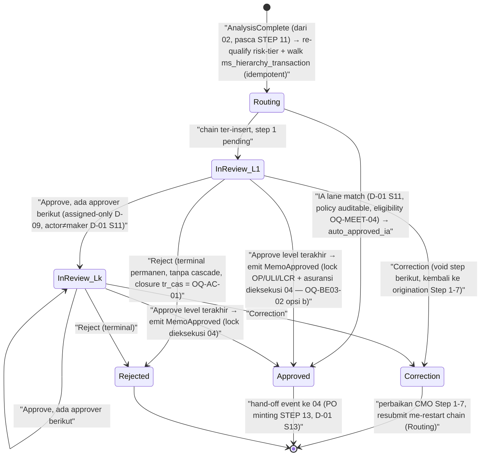

# PRD — Approval & Committee (Credit-Committee Inbox Hierarchy) [BE]

> **Audience**: Tim Backend (BE). **Target stack**: **Java** (bahasa DIWAJIBKAN per D-12 `[LOCKED]`;
> framework BELUM ditetapkan — **USULAN: Spring Boot**, lihat §11 `[OPEN]`). FE counterpart: Next.js (D-12).
> **Tanggal**: 2026-07-14. **Status**: Revisi v2 (post-meeting) atas baseline `03-approval-committee.md`.
> **Sumber otoritatif**: `_ACQUISITION-GROUND-TRUTH.md` (v2, PDF 08072026 — 16 STEP),
> `_MEETING-DECISIONS-2026-07.md` (D-01..D-12 + OQ-MEET), KB `10-domains/22-approval-committee.md`,
> `20-workflows/approval-state-machine.md`, `20-workflows/maker-checker-pattern.md`,
> KB FE `60-frontend/63-approval-inbox-screens.md`.

> **Kapabilitas 03** dari bounded context Acquisition. **STEP 12** flow final 16-step (PDF 08072026) —
> *Hierarki Persetujuan (Credit Committee)*. Kapabilitas ini adalah **gate persetujuan komite kredit**:
> setelah Analisa Kredit (STEP 11) selesai, dokumen masuk menu **Inbox Approval**; sistem menghitung
> **siapa** yang harus me-review (routing dinamis berdasarkan **trans_type_id + Plafond Hutang Pokok (OP) +
> risk level** — D-01 S10), menjalankan review sekuensial multi-level, lalu mengeksekusi salah satu dari
> **tiga aksi komite**: **Correction** (kembali ke proses origination Step 1–7), **Reject** (permanen),
> atau **Approve** — dan pada terminal Approve: **OP/ULI/LCR + asuransi (TrCmLifeInsuranceCredit,
> TrCmInsurance) DIKUNCI** (ground truth v2 STEP 12), event **`MemoApproved`** ter-emit → memicu PO minting
> di kapabilitas 04 (STEP 13). Audit trail ke **`tr_hierarchy_transaction`** `[VERIFIED — doc]`.
> **Bahasa**: Bahasa Indonesia; seluruh identifier/field/kode/SP/OQ-ID dipertahankan apa adanya.

**Kepemilikan singkat**: routing hierarki komite via `ms_hierarchy_transaction` **keyed by `trans_type_id`
(risk-tier-qualified) + Plafond OP + risk-tier** (D-01 S10); tiga aksi approve/reject/correction; enforce
identitas approver (**assigned-only** — role super-user DIHAPUS per **D-09** `[LOCKED]`) **plus**
**no-self-approval** (D-01 S11); **Instant-Approval lane** sebagai policy path auditable yang dapat
melewati antrian manusia untuk aplikasi mobile-origin (D-01 S11, OQ-MEET-04); lock OP/ULI/LCR + asuransi
pada terminal Approve (STEP 12); audit maker-checker ke `tr_hierarchy_transaction`. **BUKAN** miliknya:
komposisi awal `trans_type_id` (milik 02), PO minting (milik 04, STEP 13), Vertel (STEP 14), aktivasi NPP
(STEP 15), dan ladder credit-analyst (`AA00000001`, `sp_get_next_approval_scheme`) yang **distinct** dari
router komite ini.

> **Disiplin penanda** (dari `00-OVERVIEW.md`): `[LOCKED]` = WAJIB dipertahankan 1:1 (regulatori /
> external-FK / kontrak eksternal / keputusan governance meeting), additive only. `[INTENT]` = outcome
> bisnis dipertahankan, skema/mekanisme bebas didesain ulang. `[ARTIFACT]` = kecelakaan legacy, dibuang
> setelah konfirmasi stakeholder. `[OPEN]` = masuk Register Keputusan §11, JANGAN diselesaikan diam-diam.
> `[KEPUTUSAN DESAIN BARU]` / `USULAN` = desain baru, bukan dari legacy. Keputusan meeting dirujuk dengan
> ID **D-xx** dan membawa marker dari decision register.

---

## 1. Ruang Lingkup & Kepemilikan

### 1.1 Yang DIMILIKI kapabilitas ini (owns)

| # | Kepemilikan | Marker | Sumber |
|---|---|---|---|
| O-1 | **Routing hierarki komite** — walk `ms_hierarchy_transaction` (org-supervisor map: branch/outlet → area → regional) di-key oleh `trans_type_id` final (risk-tier-qualified), insert **satu** hand-off step per approver ter-resolve secara **sekuensial** (bukan quorum/parallel). Target-state: routing dinamis by **trans_type_id + Plafond Hutang Pokok (OP) + risk level** (**D-01 S10**); hierarki approval tergantung **skala risiko** (**D-10**). | `[VERIFIED][INTENT]` | `22-approval-committee.md §5.6, §7 BR-AC-5`; `_MEETING-DECISIONS D-01 S10, D-10` |
| O-2 | **Re-kualifikasi risk-tier di routing-time** — sebelum walk hierarki: (a) effective-rate re-check (naik satu tier bila rate di bawah minimum pasar), (b) aggregate-exposure (Plafond OP) escalation ke Very-High-Risk + swap approver final ke ACM. **03 tidak menyusun ulang `trans_type_id` dari nol** — ia me-re-qualify risk-digit lalu **memanggil fungsi komposisi milik 02** dengan input ter-eskalasi (lihat §6 BR-AC-1a). | `[VERIFIED][INTENT]` | `22 §5.4–5.6, §7 BR-AC-3` |
| O-3 | **Tiga aksi komite** pada step pending: **Approve** (advance / terminal), **Reject** (terminal, permanen), **Correction** (kembali ke proses origination **Step 1–7** untuk perbaikan CMO — target koreksi diperbarui per ground truth v2 STEP 12). | `[VERIFIED][INTENT]` + `[VERIFIED — doc]` (target Correction) | `22 §5.9–5.12, §8`; `_ACQUISITION-GROUND-TRUTH STEP 12` |
| O-4 | **Enforcement identitas approver** — hanya **assigned employee** boleh act (jalur super-user legacy **DIHAPUS** per **D-09** `[LOCKED]`); ditambah **no-self-approval** (maker ≠ checker, **D-01 S11**). | `[LOCKED]` (assigned-only + D-09) + `[INTENT]` (no-self-approval, D-01 S11) | `22 §7 BR-AC-7, BR-AC-11`; `_MEETING-DECISIONS D-09, D-01 S11` |
| O-5 | **Instant-Approval (IA) lane** — policy path **auditable** yang dapat melewati antrian approver manusia untuk aplikasi **mobile-origin** (**D-01 S11**), menggantikan **tiga** mekanisme legacy non-identik (risk-force-low, CA-role exclusion, auto-approve walker). Eligibility per product/plafond = **OQ-MEET-04** `[OPEN]`. | `[INTENT]` (lane, D-01 S11) menggantikan `[ARTIFACT]` (string-hack legacy) | `22 §7 BR-AC-8; hidden-gotchas GOTCHA-9`; `_MEETING-DECISIONS D-01 S11, OQ-MEET-04` |
| O-6 | **Audit maker-checker** — setiap transisi (submit/approve/reject/correction) tercatat ke `APPROVAL_HISTORY` yang bersih, grounded pada **`tr_hierarchy_transaction`** — dikonfirmasi eksplisit oleh PDF 08072026 STEP 12 ("Audit trail auto-recorded to tr_hierarchy_transaction") — **bukan** `tr_approval_history` yang disused. | `[INTENT]`; grounding `[VERIFIED — doc]` | `maker-checker-pattern.md §7 BR-MCP-2, Edge Case 1`; `_ACQUISITION-GROUND-TRUTH STEP 12` |
| O-7 | **Entitas `APPROVAL_STEP` + `APPROVAL_HISTORY`** (routing key `[LOCKED]`, storage `[INTENT]`). Emit event **`MemoApproved`** pada terminal Approve. | mixed | umbrella shared_entities; `22 §6` |
| O-8 | **Lock figur finansial pada terminal Approve (STEP 12)** — **OP/ULI/LCR, Asuransi Jiwa (`TrCmLifeInsuranceCredit`), Asuransi Kendaraan (`TrCmInsurance`) DIKUNCI (dikunci)** saat komite approve, via jalur `sp_approve_cm_moofi` di legacy. Outcome ini `[VERIFIED — doc]` (ground truth v2 STEP 12) dan `[INTENT]` (D-01 S12: freeze OP/ULI/LCR + payment options + insurance binding). **Penempatan eksekusi**: **04 sebagai konsumen segera `MemoApproved`** — **RESOLVED by convention** (OQ-BE03-02 §11 → opsi b; dasar: ADR-03 write-by-owner + ADR-04 outbox — lihat catatan keputusan di bawah §1.1). Formula `[LOCKED]`: `OP = asset_cost − nett_down_payment`, `LCR = amount_installment × tenor`, `ULI = LCR − OP` (BR-AC-10). | `[VERIFIED — doc]` outcome; penempatan **RESOLVED (04)** | `_ACQUISITION-GROUND-TRUTH STEP 12`; `_MEETING-DECISIONS D-01 S12`; `22 §7 BR-AC-10, §5.12` |

> **PERUBAHAN vs baseline pre-meeting**: baseline menetapkan "03 hanya emit `MemoApproved`; freeze OP/ULI/LCR
> milik 04" sebagai departure. Ground truth **v2** (delta table: *"financial lock moved INTO committee
> approve"*) memindahkan lock ke saat approve komite (STEP 12). PRD ini mengikuti v2: **outcome lock terjadi
> pada momen approve STEP 12**; penempatan eksekutornya dibahas di O-8/OQ-BE03-02 dan WAJIB dikoordinasikan
> dengan revisi PRD 04.

> **RESOLVED by convention — dasar: ADR-03 (write hanya oleh pemilik) + ADR-04 (outbox), keputusan 2026-07-14.**
> Eksekutor freeze = **04**: modul 04 menulis freeze **OP/ULI/LCR** ke `trx_credit_memo` + lock asuransi
> (`locked_at`/`locked_by`, BE-04 §3.3) sebagai **konsumen segera event `MemoApproved`** dari 03
> (**OQ-BE03-02 → opsi (b)**, sesuai USULAN). 03 **tidak pernah** menulis tabel milik 04 (ADR-03);
> sinyal lintas modul via `out_event` (ADR-04). Konsekuensi: freeze bersifat **eventually-consistent**
> dalam transaksi konsumsi event 04 (handler idempotent by `memo_id`+`approval_decision_id`, BE-04 §5.3);
> outcome "efektif saat approve" tetap terjaga karena CM sudah locked sejak RFA (STEP 9). Keputusan ini
> **independen dari OQ-GT-01** (dual approve path — kini ✅ RESOLVED — evidence, lihat §11; handler 04 source-agnostic, BE-04 BR-CMPO-27).

### 1.2 Yang BUKAN miliknya (non-goal / batas)

| Bukan miliknya | Pemilik sebenarnya | Catatan |
|---|---|---|
| **Komposisi awal `trans_type_id`** (application-type prefix + menu-prefix + base risk digit). | **02-credit-analysis** (`sp_get_trans_type_id_cm`, satu tempat) | 03 **mengonsumsi** + me-re-qualify risk-digit-nya, tidak menyusun ulang komposisi. Konvensi umbrella §7.1: komposisi HANYA di satu lokasi. |
| **PO minting** (`po_number`, STEP 13). | **04-contract-cm-po** — **single deterministic PO minting** segera setelah CM approval, exactly one PO per approval (**D-01 S13**) | Legacy menulis `tr_cm.po_no = NULL` di terminal-approve (GOTCHA-6 / KB 22 Edge Case 4). Rebuild: **03 tidak pernah menyentuh `po_no`**. **Departure dipertahankan**. |
| **Fase Koreksi / Open CM** (STEP 13) — bila unit fisik berbeda, cabang Open CM dan kembali ke proses Moofi Step 1–12. | **04-contract-cm-po** | Return-target granularity = OQ-GT-03 (milik 04/umbrella). |
| **RFA & Pengecekan Cabang** (STEP 9) — Admin Cabang cek kelengkapan dokumen, tombol Verify mengunci data (`sp_approve_cm_moofi`), Correction ke Step 1–7, Reject stop. | **01-intake-cas** | Catatan: SP yang sama (`sp_approve_cm_moofi`) dikutip PDF untuk STEP 9 **dan** STEP 12 → lihat BR-AC-18 / OQ-GT-01. Lock aplikasi (RFA='0') dan gate cabang = 01; **routing komite + keputusan komite = 03**. |
| **Penutupan aplikasi (`tr_cas`) saat Reject.** | **01-intake-cas** (status aplikasi) | Legacy committee reject **TIDAK** menutup `tr_cas` (KB 22 Edge Case 3); framing PDF "Rejected (permanent)" belum terkonfirmasi menutup TrCas → `[OPEN]` OQ-AC-01. 03 hanya emit keputusan Reject. |
| **Vertel (STEP 14)** — verifikasi telepon `TrVerificationCustomer`, RFA Vertel, approve Kepala Cabang. | **05-npp-legalization** (atau modul vertel per pembagian umbrella) | Step BARU hasil **D-02**; disebut di sini hanya sebagai downstream context. |
| **Aktivasi NPP + upsert `tr_CIF` + jurnal/AR Card/Passnet sync (STEP 15).** | **05-npp-legalization** | D-04/D-05/D-06 milik 05. |
| **Ladder credit-analyst** (`tr_ca`, `trans_type_id` fixed `'AA00000001'`, `sp_get_next_approval_scheme`, Level-0 escalation gate). | **domain credit-analyst / `approval-state-machine.md`** | **DISTINCT** dari router komite ini (§6 BR-AC-6, KB 22 Edge Case 5). Jangan dikonflasi/disatukan state machine-nya — meski PDF 08072026 STEP 12 kembali menyebut `sp_get_next_approval_scheme` (lihat BR-AC-6). |
| **Menu Master (User, Dealer, dst.)** — CRUD master data. | modul master (D-08) | Dalam SoW rebuild (D-08), bukan modul ini. |

### 1.3 STEP yang dicakup (flow final 16-step, PDF 08072026)

- **STEP 12 — Hierarki Persetujuan (Credit Committee)** `[VERIFIED — doc]`:
  - **12a Routing**: dokumen masuk menu Inbox; sistem me-resolve rantai approver dinamis by
    **trans_type_id + Plafond OP + risk** (D-01 S10). *Catatan discrepancy*: PDF menyebut
    `sp_get_next_approval_scheme` — per bukti kode itu milik ladder credit-analyst (BR-AC-6);
    router komite CM nyata = `ms_hierarchy_transaction`.
  - **12b Decision**: tiga aksi — **Correction** (kembali ke Step 1–7), **Rejected** (permanen),
    **Approved** (`sp_approve_cm_moofi`, contract status **Approved = 'A'**). Pada approve:
    **OP/ULI/LCR + Asuransi Jiwa + Asuransi Kendaraan DIKUNCI**; audit ke `tr_hierarchy_transaction`.
- **Prasyarat upstream**: STEP 9 (RFA & pengecekan cabang = 01), STEP 10 (RAC = seam eksternal, 02),
  STEP 11 (Analisa Kredit = 02). **Downstream**: STEP 13 (PO = 04).

> **Catatan rekonsiliasi renumbering** (v1 → v2): baseline pre-meeting memakai FASE 10–11 (v1). Pada v2,
> committee routing + decision menjadi **satu STEP 12**. Routing key komite secara literal legacy dihitung
> saat RFA (dulu FASE 8, kini konteks STEP 9 `sp_approve_cm_moofi` / legacy `sp_rfa_cm`), tetapi keputusan
> komite adalah STEP 12. Rebuild memisahkan: lock aplikasi + gate cabang = 01 (STEP 9);
> **routing-compute + decision + financial lock = 03 (STEP 12)**.

---

## 2. Aktor & Peran

Sumber: `22-approval-committee.md §2` + **D-10** (census role cabang, `[LOCKED]`). Legacy **tidak** punya
RBAC statis (`00-OVERVIEW.md §2`) — peran direkonstruksi dari data model hierarki maker-checker, kini
di-anchor ke census meeting.

**Census role cabang ter-evidensi (D-10 `[LOCKED]`)**: **CMO, Marketing Head, Credit Analyst,
Kepala Cabang, Credit (Admin)**. Hierarki approval tergantung **skala risiko**.

| Peran | Deskripsi | Marker / OQ |
|---|---|---|
| **Credit (Admin) / Admin Cabang — Maker** | Menyiapkan CM draft; di v2 melakukan pengecekan/Verify STEP 9 (milik 01). Adalah **submitter**; secara konstruksi tidak pernah di-insert sebagai step approver (chain dibangun mulai dari supervisor-nya). Padanan D-10: **Credit (Admin)**. | `[VERIFIED][INTENT]` (`sp_rfa_cm:7-52`); role name `[LOCKED]` D-10 |
| **CMO** | Field origination (Step 1–7 MOOFI); target Correction dari komite (dokumen kembali ke Step 1–7 untuk perbaikan CMO). | `[VERIFIED — doc]` STEP 9/12; D-10 |
| **Committee Approver (Level k, k=1..N)** | Deretan employee ter-resolve individual dari **org-supervisor chain** (branch/outlet head → area head → regional head), BUKAN dari skema "Level 1/2/3" bernama. Singkatan kode: `kacab`/`kapos` (branch/outlet head), `kepala area`, `kawil` (`kepala wilayah`, regional head). **Kepala Cabang** kini role ter-konfirmasi cabang (D-10) — memperkuat decode `kacab`. | `[VERIFIED][INTENT]` chain; `[INFERRED]` decode singkatan (`sp_rfa_cm:910-1150`); Kepala Cabang `[LOCKED]` D-10 |
| **ACM** | Employee ter-map spesifik (`ms_mapping_hierarchy.ACM_NIK`, keyed by branch) yang **di-substitusi sebagai approver LEVEL FINAL** ketika aturan aggregate-exposure escalation menyala (§6 BR-AC-3), menggantikan hasil walk org-hierarchy biasa. Job-title "ACM" tidak dinyatakan di kode & tidak muncul di census D-10 (bukan role cabang — konsisten dengan posisi eskalasi di atas cabang). | `[VERIFIED][INTENT]` mekanisme; job title `[OPEN]` **OQ-AC-05** (`sp_rfa_cm:1255-1270`) |
| **Credit Analyst** | Role cabang ter-konfirmasi (D-10). Biasanya kandidat di dalam chain org-hierarchy (bila supervisor di chain memegang title itu); **DIKECUALIKAN** dari chain di bawah kondisi IA legacy (§6 BR-AC-8b) — di target-state, exclusion ini melebur ke IA lane (D-01 S11). | `[VERIFIED][INTENT]` (`sp_rfa_cm:1307-1328`); D-10 |
| **Marketing Head** | Role cabang ter-konfirmasi (D-10). **Perannya dalam chain komite belum ter-evidensi** di legacy — jangan difabrikasi; bila bisnis menghendaki Marketing Head masuk hierarki, itu konfigurasi `ms_hierarchy_transaction`/penerusnya, bukan hard-code. | D-10 `[LOCKED]` (eksistensi role); keterlibatan komite `[OPEN]` OQ-BE03-03 |
| **System (Instant-Approval lane)** | Policy path otomatis auditable yang dapat melewati antrian approver manusia untuk aplikasi **mobile-origin** (D-01 S11). Menggantikan tiga varian legacy (§6 BR-AC-8). Eligibility per product/plafond = OQ-MEET-04. | `[INTENT]` D-01 S11; `[VERIFIED]` mekanisme legacy |
| ~~**Super-user**~~ | **DIHAPUS dari rebuild** (**D-09** `[LOCKED]`: "Super user dihapus"). Legacy: employee ber-flag per `trans_type_id` di `ms_trans_super_user` yang boleh act pada step pending manapun (`sp_approve_cm:169-193`). Rebuild **TIDAK BOLEH** men-ship role/jalur ini. Data historis override tetap dimigrasikan read-only untuk audit (lihat §3.1). Mekanisme pengganti coverage approver absen = **OQ-BE03-01**. | `[LOCKED]` D-09 (removal); legacy `[VERIFIED]` |

> **Peran belum ter-evidensi (jangan difabrikasi)**: "Branch Manager" sebagai *named role* (OQ-ACTORS-01)
> kini **sebagian terjawab** oleh D-10 — **Kepala Cabang** adalah role cabang resmi; pemetaan
> kacab↔Kepala Cabang dipakai PRD ini. Sisa pertanyaan (apakah ada role "Branch Manager" distinct) tetap
> `[OPEN]` di umbrella.

---

## 3. Model Data

Bentuk **target** = **GROUND TRUTH schema** modul ini (ADR-14): setiap tabel ditulis per
`docs/DB-CONVENTIONS.md` §9 — nama target + kelas prefix, **mapping asal legacy** (basis
`DATA-MIGRATION-PLAN.md`), field census ber-marker (confidence × mutability), dan **disposisi
tabel legacy** yang tidak dibawa (§3.4). Konform ke Shared ERD `00-OVERVIEW.md §6`. Alias entitas
logical umbrella → tabel fisik: `APPROVAL_STEP` → **`trx_approval_step`**, `APPROVAL_HISTORY` →
**`log_approval_history`**, `IA_POLICY` → **`cfg_ia_policy`**; plus serapan gap-entities KB:
**`log_instant_approval`**, **`trx_deviation`** + **`cfg_deviation_rule`**, dan config routing
**`cfg_hierarchy_matrix`**. Semua tabel membawa kolom audit wajib konvensi §4 (`created_at/by`,
`updated_at/by`; kelas `log_` hanya `created_*`, append-only). Modul ini **mengonsumsi** shared
entity lain read-only untuk routing (§3.2) dan (per O-8/OQ-BE03-02) menjadi pemicu lock figur
finansial + asuransi pada CM.

### 3.0 Footprint workflow engine (Flowable, ADR-13)

- Flowable embedded membawa **tabel runtime `ACT_*`** (process/task/history engine) — **milik
  engine, di luar konvensi schema ini, JANGAN disentuh manual** (DB-CONVENTIONS §8). `ACT_*`
  BUKAN bagian census §3.1 dan BUKAN target migrasi data legacy.
- Variabel proses hanya menyimpan **key** (`credit_id`, referensi task) — payload bisnis tetap di
  tabel `trx_` modul ini.
- **`log_approval_history` TETAP audit otoritatif** keputusan komite, **independen** dari history
  engine (`ACT_HI_*`) — kebutuhan regulatori; engine BUKAN satu-satunya sumber audit.
- Definisi proses (BPMN) di-**versioning di repo**; hierarki (trans_type_id + Plafond OP + risk,
  D-01 S10) dan matriks per-produk (D-07) dibaca **delegate** dari `cfg_hierarchy_matrix` /
  tabel `cfg_` lain — TIDAK di-hardcode di BPMN (perubahan matriks = **data**, bukan deploy).

### 3.1 Tabel target yang dimiliki

#### 3.1.1 `trx_approval_step` — ledger rantai komite (padanan `APPROVAL_STEP`)

Satu baris per approver ter-resolve dalam rantai komite (hand-off ledger step). **Mapping asal**:
struktur dari **`tr_hierarchy_transaction`** (satu baris per step; PK komposit legacy
`trans_id + trans_type_id + hierarchy_trans_id`). **Data legacy TIDAK di-load ke tabel ini** —
riwayat → `log_approval_history` (§3.1.2, DATA-MIGRATION-PLAN §4 butir 4); chain **in-flight
TIDAK dimigrasi ke Flowable** (DATA-MIGRATION-PLAN §5, OQ-MIG-01). Task lifecycle
(claim/complete) di-back Flowable task service (ADR-13); tabel ini = state domain otoritatif +
sumber read-model inbox.

| Kolom | Tipe target | Null | Marker | Catatan (mapping asal / aturan) |
|---|---|---|---|---|
| `id` | `BIGINT` identity | NOT NULL (PK) | `[INTENT]` | PK teknis (konvensi §2) |
| `credit_id` | `VARCHAR(20)` | NOT NULL | `[VERIFIED][LOCKED]` | business key spine (`memo_id` logis) ← `trans_id varchar(20)`; ref lintas modul via business key (ADR-03) |
| `trans_type_id` | `VARCHAR(10)` | NOT NULL | `[VERIFIED][LOCKED]` | **routing key external-FK**, char-for-char (BR-AC-1) ← `trans_type_id varchar(10)` |
| `sequence` | `INTEGER` | NOT NULL | `[VERIFIED][INTENT]` | urutan step strictly sequential ← `hierarchy_trans_id int`; `ux_trx_approval_step_credit_id_trans_type_id_sequence` = padanan PK komposit legacy |
| `level_label` | `VARCHAR(30)` | NULL | `[INFERRED][INTENT]` | decode `kepala_cabang`/`kepala_area`/`kawil`/`acm_final`; padanan longgar `group_hierarchy_id int` (semantik penuh `[OPEN]`) |
| `assigned_employee_id` | `VARCHAR(20)` | NOT NULL | `[VERIFIED][LOCKED]` | gate identitas assigned-only (D-09) ← `employee_id varchar(60)` (lebar 60 legacy = `[ARTIFACT]`, NIK riil ≤ 20); juga assignee human-task Flowable |
| `status` | `VARCHAR(20)` + `ck_trx_approval_step_status` | NOT NULL DEFAULT `'pending'` | `[LOCKED]` nilai kanonik + `[KEPUTUSAN DESAIN BARU]` | `pending\|approved\|rejected\|correction\|voided\|auto_approved_ia` ← `status char(1)` (mapping literal §7.1); empty-string sentinel legacy → `voided`; `auto_approved_ia` = IA lane D-01 S11. Satu kolom status (konvensi §5) |
| `reason_id` | `VARCHAR(10)` | NULL (wajib saat action) | `[VERIFIED][INTENT]` | ← `reason_id varchar(10)` (lookup `sp_get_approver_reason`) |
| `reason` | `TEXT` | NULL (wajib saat action) | `[VERIFIED][INTENT]` | ← `reason varchar(max)` |
| `acted_by_employee_id` | `VARCHAR(20)` | NULL | `[LOCKED]` | actor aktual (audit + no-self-approval); NULL bila `auto_approved_ia`. **TANPA** padanan `super_employee_id` — jalur super-user dihapus (D-09); jejak historisnya hanya hidup di `log_` |
| `ia_policy_id` | `BIGINT` FK → `cfg_ia_policy` | NULL | `[KEPUTUSAN DESAIN BARU]` | terisi saat IA lane (auditable, D-01 S11) |
| `acted_at` | `TIMESTAMPTZ` | NULL | `[INTENT]` | timestamp action ← `last_updated_on` semantik legacy |
| `flowable_task_id` | `VARCHAR(64)` | NULL | `[KEPUTUSAN DESAIN BARU]` (ADR-13) | korelasi ke user-task engine; NULL untuk step IA (tanpa human task). **Bukan** declared FK — `ACT_*` milik engine (§3.0) |
| audit + `version` | konvensi §4 | NOT NULL | `[INTENT]` | `created_*`, `updated_*`, `version INTEGER` (optimistic locking) |

> Kolom legacy yang **tidak dibawa**: `next_employee_id` (denormalisasi next-PIC — target: derive
> dari `sequence+1`, BR-AC-14 derive-current); `super_employee_id` (D-09 — historis ke `log_` saja);
> `trans_date` (tergantikan `created_at`). **Dihapus vs baseline**: `super_user_override`.

#### 3.1.2 `log_approval_history` — audit maker-checker (padanan `APPROVAL_HISTORY`, append-only)

Jejak audit **otoritatif** satu baris per transisi (submit/approve/reject/correction/void/IA) —
INSERT-only, tidak pernah UPDATE/DELETE (konvensi §1 kelas `log_`), **independen dari history
engine Flowable** (§3.0). **Mapping asal (MIGRATE, append-only — DATA-MIGRATION-PLAN §4 butir 4)**:
di-ground pada **`tr_hierarchy_transaction`** (audit legacy **live**, dikonfirmasi PDF 08072026
STEP 12) + dilebur dengan **`tr_hierarchy_approval_transaction`** (dual-write lini car, BR-AC-16)
dan **`tr_approval_history`** (disused — `[ARTIFACT]`, OQ-MCP-04), dibedakan kolom `legacy_source`.
**In-flight process TIDAK dimigrasi ke Flowable** (DATA-MIGRATION-PLAN §5).

| Kolom | Tipe target | Null | Marker | Catatan (mapping asal / aturan) |
|---|---|---|---|---|
| `id` | `BIGINT` identity | NOT NULL (PK) | `[INTENT]` | PK |
| `credit_id` | `VARCHAR(20)` | NOT NULL | `[VERIFIED][LOCKED]` | ← `trans_id` (kedua tabel hierarchy) / `trans_id varchar(20)` (`tr_approval_history`) |
| `step_id` | `BIGINT` FK → `trx_approval_step` | NULL | `[INTENT]` | NULL untuk baris migrasi legacy (step legacy tidak di-replay ke `trx_`) |
| `trans_type_id` | `VARCHAR(10)` | NOT NULL | `[VERIFIED][LOCKED]` | routing key, char-for-char |
| `actor_employee_id` | `VARCHAR(60)` | NULL | `[LOCKED]` | ← `employee_id`; NULL + `ia_policy_id` terisi untuk aksi IA lane; lebar 60 dipertahankan agar data historis muat |
| `action` | `VARCHAR(20)` + `ck_log_approval_history_action` | NOT NULL | `[LOCKED]` nilai kanonik | `submitted\|approved\|rejected\|correction\|voided\|auto_approved_ia\|pending` ← `status char(1)` (mapping §7.1); ← `decision varchar(70)` utk `tr_approval_history` |
| `reason_id` | `VARCHAR(10)` | NULL | `[VERIFIED][INTENT]` | ← `reason_id` |
| `reason` | `TEXT` | NULL | `[VERIFIED][INTENT]` | ← `reason varchar(max)` / `varchar(5000)` |
| `ia_policy_id` | `BIGINT` FK → `cfg_ia_policy` | NULL | `[KEPUTUSAN DESAIN BARU]` | jejak policy IA (D-01 S11: "auditable policy path") |
| `legacy_super_user_override` | `BOOLEAN` | NOT NULL DEFAULT `false` | `[ARTIFACT-MIGRASI]` | true ⇔ `super_employee_id` legacy terisi. **TIDAK PERNAH** true pasca go-live (D-09). Audit historis override WAJIB survive migrasi (BR-AC-15, turunan BR-MCP-2 `[LOCKED]`-audit) |
| `legacy_super_employee_id` | `VARCHAR(60)` | NULL | `[ARTIFACT-MIGRASI]` | ← `super_employee_id` (identitas override historis, read-only) |
| `legacy_source` | `VARCHAR(40)` | NULL | `[ARTIFACT-MIGRASI]` | asal baris migrasi: `tr_hierarchy_transaction` \| `tr_hierarchy_approval_transaction` \| `tr_approval_history`; NULL untuk baris baru |
| `correlation_id` | `VARCHAR(64)` | NOT NULL | `[KEPUTUSAN DESAIN BARU]` | trace lintas boundary (event `MemoApproved` dst.) |
| `recorded_at` | `TIMESTAMPTZ` | NOT NULL | `[INTENT]` | ← `trans_date`/`submit_date` untuk baris migrasi |
| `created_at`, `created_by` | konvensi §4 (`log_`) | NOT NULL | `[INTENT]` | append-only — TANPA `updated_*` |

#### 3.1.3 `log_instant_approval` — audit lane Instant-Approval

**Mapping asal**: **`tr_ia_history`** (MIGRATE-READONLY). Legacy: FINCORE hanya **reader** sebagai
gate auto-approve — `sp_agent_auto_approve_hirarki_ia` memproses CM `status_approval='V'` yang punya
baris `message = 'Very High Potential Approval'`, digabung `internal_risk_result='3'` (server
mobile) dan dibatasi **branch pilot `('00545','00856')`**; **writer lokal tidak ditemukan di dump**
(dua SP membaca salinan `[MCF-MOBDB].mob_acq.dbo.tr_ia_history`) → `[OPEN]` **OQ-GAP-02**. Target:
**IA lane 03 = writer tunggal in-app** (satu baris per evaluasi policy), INSERT-only.

| Kolom | Tipe target | Null | Marker | Catatan (mapping asal / aturan) |
|---|---|---|---|---|
| `id` | `BIGINT` identity | NOT NULL (PK) | `[INTENT]` | ← `id int identity` |
| `credit_id` | `VARCHAR(20)` | NULL | `[VERIFIED][LOCKED]` | join key spine ← `credit_id varchar(20)`; WAJIB terisi untuk baris baru (guard app-layer); NULL diizinkan hanya untuk baris migrasi (legacy nullable) |
| `acquisition_id` | `VARCHAR(50)` | NULL | `[VERIFIED][INTENT]` | ID akuisisi sisi mobile ← `acquisition_id` |
| `is_ia` | `BOOLEAN` | NOT NULL DEFAULT `false` | `[VERIFIED][INTENT]` | ← `isIA bit`; semantik/aturan set `[OPEN]` OQ-GAP-02 |
| `message` | `VARCHAR(255)` | NULL | `[VERIFIED]` | nilai gate legacy `'Very High Potential Approval'` = `[LOCKED]` nilai (kontrak gate); enumerasi lain `[OPEN]` OQ-GAP-02 |
| `ia_policy_id` | `BIGINT` FK → `cfg_ia_policy` | NULL | `[KEPUTUSAN DESAIN BARU]` | policy penyebab evaluasi (baris baru; NULL utk migrasi) |
| `evaluated_at` | `TIMESTAMPTZ` | NOT NULL | `[VERIFIED][INTENT]` | ← `createddate` |
| `created_at`, `created_by` | konvensi §4 (`log_`) | NOT NULL | `[INTENT]` | append-only |

> Kolom legacy `updateddate` + `isActive` = pola **log-mutable** — `[ARTIFACT — tidak dibawa]`;
> koreksi di target = baris baru (append-only). Semantik `isActive` tetap dicatat di OQ-GAP-02.
> Branch pilot 00545/00856 = kandidat seed `eligibility_rules` `cfg_ia_policy` (disposisi OQ-AC-04).

#### 3.1.4 `cfg_ia_policy` — policy Instant-Approval lane (padanan `IA_POLICY`)

*(entitas baru untuk D-01 S11 — tanpa padanan tabel legacy tunggal)* — menggantikan allow-list
tersebar legacy (`tamp_credit_id_trial_IA`, `tamp_branch_trial_IA`, disposisi OQ-AC-04), string-hack
risk-digit, dan branch hardcoded walker (BR-AC-8). Versioned per konvensi §1 kelas `cfg_`.

| Kolom | Tipe target | Null | Marker | Catatan |
|---|---|---|---|---|
| `id` | `BIGINT` identity | NOT NULL (PK) | `[KEPUTUSAN DESAIN BARU]` | PK |
| `code` | `VARCHAR(30)` + `ux_cfg_ia_policy_code` | NOT NULL | `[KEPUTUSAN DESAIN BARU]` | identitas policy stabil |
| `name` / `description` | `VARCHAR(100)` / `TEXT` | NOT NULL / NULL | `[KEPUTUSAN DESAIN BARU]` | |
| `origin_channel` | `VARCHAR(20)` + CHECK | NOT NULL | `[INTENT]` | minimal `mobile` (D-01 S11); nilai lain `[OPEN]` (decode `credit_source_id` 5/6 = OQ-AC-03) |
| `effect` | `VARCHAR(20)` + CHECK | NOT NULL | `[VERIFIED][INTENT]` | `skip_queue\|force_low_risk\|exclude_ca_role` — tiga efek legacy dienumerasi eksplisit (KB 22 Edge Case 6); jangan collapse jadi satu boolean (BR-AC-8) |
| `eligibility_rules` | `JSONB` | NULL | `[OPEN]` **OQ-MEET-04** | product/plafond band/branch/risk cap — **DILARANG diisi produksi sebelum risk policy owner memutuskan**; kandidat seed legacy: branch pilot 00545/00856 + allow-list `tamp_*` (OQ-AC-04) |
| `active` | `BOOLEAN` | NOT NULL DEFAULT `false` | `[KEPUTUSAN DESAIN BARU]` | |
| `effective_from` / `effective_to` | `DATE` / `DATE` | NOT NULL / NULL | `[KEPUTUSAN DESAIN BARU]` | versioned (konvensi §1 `cfg_`) |
| audit + `version` | konvensi §4 | NOT NULL | `[INTENT]` | |

#### 3.1.5 `trx_deviation` — deviasi ter-approve per aplikasi (Memo Persetujuan)

**Mapping asal**: **`tr_general_deviation`** (MIGRATE + explicit typing). Legacy: parameter deviasi
yang DISETUJUI via MP (Memo Persetujuan — komentar SP `'sesuai MP dari OBAC'`); pola
`param_1..param_4` generik-tanpa-makna = `[ARTIFACT]` anti-pattern (makna hanya hidup di SP
pemanggil). Terverifikasi: **`param_1` = effective-rate minimum** (dibaca `sp_rfa_cm(_car)`, error
`'EffRate tidak sesuai MP.'`), **`param_3` = tenor maksimum** (dibaca `sp_insert_cm(_car)`, error
`'Tenor max 48 bulan sesuai MP'`); `param_2` (date) / `param_4` (varchar) + kolom `ID` + `CGS_no`
= `[OPEN]` **OQ-GAP-04**. Target: **satu baris per jenis deviasi** (typed), jenis dinormalkan ke
`cfg_deviation_rule` (§3.1.6).

| Kolom | Tipe target | Null | Marker | Catatan (mapping asal / aturan) |
|---|---|---|---|---|
| `id` | `BIGINT` identity | NOT NULL (PK) | `[INTENT]` | PK teknis (legacy PK komposit `credit_id + CGS_no` → `ux_trx_deviation_credit_id_deviation_rule_id_cgs_no`) |
| `credit_id` | `VARCHAR(20)` | NOT NULL | `[VERIFIED][LOCKED]` | ← `credit_id varchar(40)` — lebar 40 ≠ spine 20 = `[ARTIFACT]` inkonsistensi; normalisasi + validasi lebar saat migrasi |
| `deviation_rule_id` | `BIGINT` FK → `cfg_deviation_rule` | NOT NULL | `[KEPUTUSAN DESAIN BARU]` | ← derivasi posisi `param_N` + kolom `ID varchar(5)` (semantik `ID` `[OPEN]` OQ-GAP-04) |
| `value_numeric` | `NUMERIC(9,6)` | NULL | `[VERIFIED][INTENT]` | ← `param_1 numeric(18,2)` (EFF_RATE_MIN; presisi rate per konvensi §3) |
| `value_int` | `INTEGER` | NULL | `[VERIFIED][INTENT]` | ← `param_3 int` (TENOR_MAX) |
| `value_date` | `DATE` | NULL | `[OPEN]` OQ-GAP-04 | ← `param_2 date` — makna tidak ditemukan di SP mana pun |
| `value_text` | `VARCHAR(20)` | NULL | `[OPEN]` OQ-GAP-04 | ← `param_4 varchar(20)` — makna tidak ditemukan |
| `memo_no` | `VARCHAR(200)` | NOT NULL | `[VERIFIED][LOCKED]` | referensi dokumen Memo Persetujuan (jejak akuntabilitas); legacy nullable → backfill/flag exception saat migrasi |
| `cgs_no` | `VARCHAR(20)` | NULL | `[VERIFIED]` | bagian PK komposit legacy; kepanjangan/entitas CGS `[OPEN]` OQ-GAP-04 |
| audit + `version` | konvensi §4 | NOT NULL | `[INTENT]` | legacy hanya `created_*` (record sekali-tulis `[INFERRED]`) |

> **Enforcement point** (dipertahankan sebagai outcome): `EFF_RATE_MIN` dievaluasi **03** saat
> routing/RFA (padanan `sp_rfa_cm`); `TENOR_MAX` dievaluasi **04** saat CM entry (padanan
> `sp_insert_cm`) — 04 membaca via API/read-model, bukan JOIN lintas modul di write path (ADR-03).
> Writer/insert path legacy **tidak ditemukan di dump** (`[OPEN]` OQ-GAP-04) — target: input MP via
> UI ber-maker-checker.

#### 3.1.6 `cfg_deviation_rule` — katalog jenis deviasi

*(pasangan `trx_deviation` — menggantikan makna implisit `param_N` di kode SP)*

| Kolom | Tipe target | Null | Marker | Catatan |
|---|---|---|---|---|
| `id` | `BIGINT` identity | NOT NULL (PK) | `[KEPUTUSAN DESAIN BARU]` | |
| `code` | `VARCHAR(30)` + `ux_cfg_deviation_rule_code` | NOT NULL | `[VERIFIED]` (dua seed) | seed terverifikasi: `EFF_RATE_MIN` (← `param_1`), `TENOR_MAX` (← `param_3`); jenis lain `[OPEN]` OQ-GAP-04 |
| `name` | `VARCHAR(100)` | NOT NULL | `[KEPUTUSAN DESAIN BARU]` | |
| `value_type` | `VARCHAR(10)` + CHECK | NOT NULL | `[KEPUTUSAN DESAIN BARU]` | `numeric\|integer\|date\|text` — memilih kolom `value_*` di `trx_deviation` |
| `enforcement_point` | `VARCHAR(20)` + CHECK | NOT NULL | `[VERIFIED]` | `rfa_routing\|cm_entry` (dari SP pemakai legacy) |
| `effective_from` / `effective_to` | `DATE` / `DATE` | NOT NULL / NULL | `[KEPUTUSAN DESAIN BARU]` | versioned `cfg_` |
| audit + `version` | konvensi §4 | NOT NULL | `[INTENT]` | |

#### 3.1.7 `cfg_hierarchy_matrix` — matriks routing komite (padanan bersih `ms_hierarchy_transaction`)

`[KEPUTUSAN DESAIN BARU]` — internalisasi katalog eksternal `FC_MSTAPP_MCF.ms_hierarchy_transaction`
menjadi config engine versioned (DB-CONVENTIONS §7), dibaca **delegate Flowable** saat routing
(ADR-13/§3.0). Model routing target: **trans_type_id + Plafond Hutang Pokok (OP) + risk level**
(D-01 S10; hierarki tergantung skala risiko D-10). **DDL sumber TERVERIFIKASI (dump `FC_MSTAPP_MCF`
2026-07-22)**: `ms_hierarchy_transaction` 13 kolom — `trans_type_id varchar(10)`, `employee_id`/`spv_employee_id
varchar(60)`, `position_id`/`spv_position_id varchar(5)`, `level int`, `is_active`/`is_approver bit`,
`branch_id varchar(5)` + 4 kolom audit (census KB `30-data-model/external-masters-census.md`). **Catatan
penting (OQ-MASTERDATA-03 ✅)**: tabel ini SEKALIGUS target write admin surface BE-07 §3.3 — satu sumber
routing, jangan duplikasi. **Struktur di bawah tetap indikatif** untuk kolom target-state (OP band + risk
level) — finalisasi menunggu keputusan ownership katalog (OQ-EXTMASTERS-01, DATA-MIGRATION-PLAN §4 butir 1):

| Kolom | Tipe target | Null | Marker | Catatan |
|---|---|---|---|---|
| `id` | `BIGINT` identity | NOT NULL (PK) | `[KEPUTUSAN DESAIN BARU]` | |
| `trans_type_id` | `VARCHAR(10)` | NOT NULL | `[LOCKED]` | routing key, char-for-char (BR-AC-1) — nilai WAJIB identik dengan katalog eksternal selama masa transisi |
| `risk_level` | `VARCHAR(12)` + CHECK | NOT NULL | `[INTENT]` | `low\|medium\|high\|very_high` (D-10) |
| `op_min` / `op_max` | `NUMERIC(18,2)` | NULL | `[INTENT]` | band Plafond OP; threshold escalation TIDAK di-hardcode (OQ-AC-02: 35jt kode vs 30jt komentar) |
| `sequence` | `INTEGER` | NOT NULL | `[INTENT]` | urutan level dalam chain (strictly sequential, BR-AC-5) |
| `approver_org_level` | `VARCHAR(20)` + CHECK | NOT NULL | `[INFERRED]` | `branch_head\|area_head\|regional_head\|acm_final` — resolusi employee aktual via org-supervisor walk |
| `effective_from` / `effective_to` | `DATE` / `DATE` | NOT NULL / NULL | `[KEPUTUSAN DESAIN BARU]` | versioned `cfg_` — perubahan matriks = data, bukan deploy |
| audit + `version` | konvensi §4 | NOT NULL | `[INTENT]` | |

> Swap approver final ke **ACM** per branch tetap bersumber `ms_mapping_hierarchy.ACM_NIK`
> (eksternal, §3.3) sampai internalisasi katalog diputus (OQ-EXTMASTERS-01).

### 3.2 Shared entity yang DIKONSUMSI (read; pemilik lain)

| Entitas | Pemilik | Dipakai 03 untuk | Field kunci |
|---|---|---|---|
| **`CREDIT_MEMO`** | 04 (kepemilikan tulis field frozen = 04 sebagai konsumen `MemoApproved` — OQ-BE03-02 ✅ RESOLVED by convention, opsi b, §11); `trans_type_id` disusun dari 02 | subjek review; sumber `trans_type_id`, effective-rate, asset_cost, down_payment; target lock OP/ULI/LCR | `trans_type_id` `[LOCKED]`; `outstanding_principal`(OP)/`uli`/`lcr` `[LOCKED]` formula (O-8) |
| **`CREDIT_APPLICATION`** | 01 | konteks aplikasi + status `committee` | `status` enum; `credit_id` (PK kontrak nasional, STEP 8) |
| **`CREDIT_ANALYSIS`** | 02 | **risk_tier** yang menyusun risk-digit; kolektibilitas (untuk jalur mobile "Kol>3"); rekomendasi CA (STEP 11: Recommended/Not Recommended) | `risk_tier` `[INTENT]`; `collectibility` 1–5 `[LOCKED]` |
| **`RAC_SCREENING`** | 02 (ingest async, D-01 S8) | decision RAC yang di-**baca** untuk routing (tanpa write-back) | kontrak `[LOCKED]` |
| **`TrCmLifeInsuranceCredit`** / **`TrCmInsurance`** | 04/kontrak (binding asuransi) | objek yang ikut **DIKUNCI** pada terminal Approve STEP 12 | `[VERIFIED — doc]`; skema field milik 04 |

### 3.3 Katalog referensi eksternal (read-only, `FC_MSTAPP_MCF`)

| Katalog | Peran | Marker |
|---|---|---|
| `ms_hierarchy_transaction` | org-supervisor map yang di-walk untuk membangun chain, keyed by `trans_type_id` — **target internalisasi: `cfg_hierarchy_matrix`** (§3.1.7; **DDL ✅ 13 kolom — dump 2026-07-22**; sisa OQ-EXTMASTERS-01 = ownership) | `[LOCKED]` external-FK |
| `ms_trans_type` (`mapping_risk_category_id`) | mapping risk-category → risk-digit (dipakai fungsi komposisi milik 02) | `[LOCKED]` external-FK |
| `ms_mapping_hierarchy.ACM_NIK` | target swap ACM per branch | `[LOCKED]` outcome; title `[OPEN]` OQ-AC-05 |
| `ms_application_type_inbox` | lookup opsi filter "Tipe Aplikasi" di layar Inbox (FE 63 §4) | `[VERIFIED]` (`sp_get_ms_application_type_inbox`) |
| ~~`ms_trans_super_user`~~ | **TIDAK dikonsumsi di target** — role super-user dihapus (D-09). Hanya dibaca satu kali saat migrasi untuk memetakan audit historis. | `[ARTIFACT-MIGRASI]` |

> **Dua makna "OP"** (keduanya ride OQ-CORE-03): (1) **aggregate-exposure OP** yang dihitung **03** di
> routing-time (`sp_get_OP_by_identity_number`: `asset_cost − down_payment`, di-sum lintas aplikasi + lintas
> sistem by NIK applicant + spouse) untuk cek threshold escalation — MoM menamai konsep routing ini
> **"Plafond Hutang Pokok (OP)"** (D-01 S10 — jawaban parsial atas ekspansi akronim; treatment GL tetap
> OQ-CORE-03); (2) **per-memo OP/ULI/LCR** yang di-**lock pada approve STEP 12** (O-8). Sama formula dasar
> (`asset_cost − down_payment`), scope berbeda. Jangan dikonflasi.

### 3.4 Disposisi migrasi tabel legacy milik modul ini (coverage 8/8)

Per DB-CONVENTIONS §9 butir 2 & 4 — setiap tabel legacy modul approval ter-disposisi. Basis:
`DATA-MIGRATION-PLAN.md` §4 butir 4 (*approval history → `log_approval_history`, append-only;
in-flight process TIDAK dimigrasi ke Flowable*) + §5 (strategi cutover OQ-MIG-01). DDL sumber:
dump `FC_ACQ_MCF 2.sql` (line refs per KB `gap-entities.md §5`).

| # | Tabel legacy | Disposisi | Target | Catatan |
|---|---|---|---|---|
| 1 | `tr_hierarchy_transaction` | **MIGRATE** (append-only) | `log_approval_history` | Audit STEP 12 **live** (`[VERIFIED — doc]` PDF 08072026); struktur = acuan `trx_approval_step` (§3.1.1). Riwayat → `log_`; **chain in-flight TIDAK di-start ulang sebagai process instance Flowable** — mengikuti keputusan cutover OQ-MIG-01 (skenario A: drain di legacy; skenario B: mapping state per step, DATA-MIGRATION-PLAN §5). |
| 2 | `tr_hierarchy_approval_transaction` | **MIGRATE** (append-only, `legacy_source`) | `log_approval_history` | Dual-write paralel lini **car** (BR-AC-16) — pola dual-write = `[ARTIFACT]` do-not-replicate (`maker-checker BR-MCP-6`); datanya dilebur ke satu log, dedup vs #1 diverifikasi reconciliation gate (ADR-15). Target-state: **satu** engine config-driven per produk (D-07), tanpa tabel kedua. |
| 3 | `tr_hierarchy_transaction_shd` | **DISCARD** `[ARTIFACT]` | — | Shadow table suffix `_shd` **DILARANG direplikasi** (DB-CONVENTIONS §6 larangan 1 → pakai `log_` + `version`). Struktur identik #1; 0 writer teridentifikasi di scope KB. Gate migrasi: rekonsiliasi WAJIB membuktikan tidak ada baris unik vs #1 — bila ada, baris unik ikut MIGRATE ke `log_approval_history` dengan `legacy_source='tr_hierarchy_transaction_shd'`; arsip mentah per OQ-MIG-02. |
| 4 | `tr_approval_history` | **MIGRATE-READONLY** (`legacy_source`) | `log_approval_history` | Disused / mostly write-only = `[ARTIFACT]` (OQ-MCP-04 — konfirmasi tidak ada FE flow yang masih menulis). Struktur TIDAK jadi acuan target; mapping kolom: `trans_id→credit_id`, `decision varchar(70)`+`status char(1)`→`action`, `submit_date→recorded_at`, `employee_id→actor_employee_id`. |
| 5 | `tr_ia_history` | **MIGRATE-READONLY** | `log_instant_approval` (§3.1.3) | Gate legacy `message='Very High Potential Approval'` + branch pilot `00545`/`00856`; **writer lokal tidak ditemukan** (reader membaca salinan `[MCF-MOBDB]`) → `[OPEN]` **OQ-GAP-02** menentukan sumber otoritatif saat migrasi (lokal vs MCF-MOBDB). Target-state: writer tunggal = IA lane 03. |
| 6 | `tr_general_deviation` | **MIGRATE + explicit retyping** | `trx_deviation` + `cfg_deviation_rule` (§3.1.5–3.1.6) | `param_1` → `EFF_RATE_MIN`, `param_3` → `TENOR_MAX` (`[VERIFIED]`); `param_2`/`param_4`/`ID`/`CGS_no` = `[OPEN]` **OQ-GAP-04** — baris yang hanya berisi param `[OPEN]` dimigrasi dengan rule placeholder + flag exception, JANGAN ditebak maknanya. |
| 7 | `tr_penyimpangan_effrate` | **DISCARD** `[ARTIFACT: dead/vestigial]` | — | **0 referensi** (473 SP + body dump + .NET; satu-satunya kemunculan = CREATE TABLE). Kemungkinan digantikan `tr_general_deviation.param_1` `[INFERRED]`. Konfirmasi stakeholder + cek data produksi masih terisi/tidak = `[OPEN]` **OQ-GAP-05** SEBELUM drop; bila berisi data historis → arsip per OQ-MIG-02, TIDAK dibuat tabel target. |
| 8 | `tr_temp_verify` | **DISCARD-as-table; fungsi DISERAP** (keputusan dari bukti, lihat catatan) | Flowable **wait-state** + `stg_rac_callback` (milik **02**) + `log_approval_history` | Legacy = staging buffer keputusan verifikasi menunggu balikan RAC: `sp_Cek_rac_history` menyimpan input verifikator (*"insert inputan verify untuk nanti digunakan untuk sp approval setelah balikan bank mega"*), `sp_agent_rac_to_cm_bulk` membaca baris terbaru per `credit_id` saat `@FinalRacStatus='APPROVED'` → panggil `sp_approve_cm_moofi`. **Tanpa PK**, dedup `order by CreatedOn desc` (`[OPEN]` **OQ-GAP-10**). Lihat justifikasi di bawah. |

> **Keputusan disposisi `tr_temp_verify` (dari bukti — TIDAK dibuat `stg_rac_decision` di 03)**:
> pola legacy adalah **workaround polling** atas gap async RAC — bukan entitas domain. Di target:
> (a) input verifikator (`reason_id`/`reason`/`analysis`/`conclusion`) direkam **langsung** saat
> capture — `log_approval_history` `action='submitted'` + piggyback anotasi `analysis`/`conclusion`
> ke record credit-analysis (kontrak §5.2); (b) "menunggu balikan Bank Mega" = **wait-state proses
> Flowable** (receive task) yang dilepas event `RacDecisionReceived` dari ingest async **modul 02**
> (D-01 S8) — staging callback mentah = **`stg_rac_callback`** milik 02 (contoh kanonik
> DB-CONVENTIONS §1 kelas `stg_`), 03 TIDAK menduplikasi staging RAC; (c) agent polling
> `sp_agent_rac_to_cm_bulk` **tidak direplika** (tergantikan event-driven). Migrasi: isi
> `tr_temp_verify` = state **in-flight** → mengikuti OQ-MIG-01 (skenario A: selesai di legacy,
> tidak dimigrasi; skenario B: di-map ke posisi wait-state padanan); ambiguitas multi-baris tanpa
> PK = `[OPEN]` **OQ-GAP-10** (input mapping migrasi). Koordinasi seam: produser
> `RacDecisionReceived` = **BE-02**, emit dari ingest `POST /rac-screening/callbacks`
> (BE-02 §5.2/§10; payload minimum `credit_id`, `decision_id`, `decision`; via `out_event`) —
> **OQ-BE03-04 §11 RESOLVED by convention (opsi a)**; dasar: legacy poll `sp_agent_rac_to_cm_bulk`
> membaca hasil RAC utk melepas keputusan (di atas) + ADR-04 outbox + boundary "RAC ingest milik 02"
> (BE-00 §5 registry).

---

## 4. API Endpoint

> **Stack**: BE **Java** (D-12 `[LOCKED]`). Framework & transport belum ditetapkan — **USULAN: Spring Boot
> + REST/JSON** (menyiratkan keputusan → `[OPEN]` §11 OQ-ARCH-STACK-residual; topologi infra menunggu
> deliverable arsitektur **ITEC Bank Mega**, D-11). Kontrak di bawah ditulis level **resource + field**;
> path berlaku apa pun framework-nya. `Auth/Role` menyebut peran §2 (census D-10), bukan skema teknis
> tertentu. **Tidak ada** role Super-user di kolom Auth mana pun (D-09).

| Method | Path | Deskripsi | Auth/Role |
|---|---|---|---|
| `POST` | `/credit-memos/{memoId}/committee-routing` | Bangun rantai approver komite (dipicu event `AnalysisComplete` dari 02 setelah STEP 11). Re-qualify risk-tier (effective-rate + exposure/Plafond OP), resolve `trans_type_id` final via fungsi komposisi 02, walk `ms_hierarchy_transaction`, evaluasi **IA lane** (D-01 S11), insert steps. **Idempotent** (re-emit tidak duplikasi step). | System (event handler) / Credit (Admin) |
| `GET` | `/credit-memos/{memoId}/approval-steps` | List rantai + step current pending untuk sebuah memo. | Approver, Credit (Admin), Auditor |
| `GET` | `/approval-inbox` | Inbox: semua item yang step current pending-nya di-assign ke approver ini. Query params (cross-check FE 63 §4): `approver` (WAJIB dari konteks auth — bukan input bebas), `page`, `size`, `applicationTypeId` (opsi dari `/approval-inbox/application-types`), `isRepeatOrder` (`0\|1`), `search`. Server WAJIB clamp `page` (perbaikan FE 63 BR-AIS-8/OQ-AIS-07). | Approver |
| `GET` | `/approval-inbox/application-types` | Lookup opsi filter "Tipe Aplikasi" (padanan `sp_get_ms_application_type_inbox`; FE 63 §4). | Approver |
| `POST` | `/credit-memos/{memoId}/approval-decision` | Eksekusi aksi komite pada step current pending: `approve` / `reject` / `correction`. Enforce identitas assigned-only (D-09) + no-self-approval (D-01 S11). Terminal Approve → emit `MemoApproved`; freeze OP/ULI/LCR + lock asuransi dieksekusi **04** sebagai konsumen event (O-8; OQ-BE03-02 RESOLVED — opsi b). | Approver (assigned) |
| `GET` | `/credit-memos/{memoId}/approval-history` | Jejak audit maker-checker untuk satu memo (grounded `tr_hierarchy_transaction`). | Auditor, Approver |
| `GET` | `/approval-history` | Layar History per-employee (FE 63): item yang sudah di-action oleh actor ini. Query: `actor` (dari konteks auth), `page`, `size`, `search`. Read-only — model item TANPA action slot (FE 63 BR-AIS-5). | Approver, Auditor |
| `GET` | `/approval-reasons?action={action}` | Lookup reason code per aksi (padanan `sp_get_approver_reason`). | Approver |
| `GET` | `/credit-memos/{memoId}/approval-progress` | View progres level (level aktif / selesai) untuk memo. | Approver, Credit (Admin) |
| `GET` | `/ia-policies` / `POST /ia-policies` *(USULAN)* | Kelola policy Instant-Approval lane (D-01 S11). Aturan eligibility TIDAK boleh diisi produksi sebelum OQ-MEET-04 resolve. | Risk policy admin `[OPEN]` |

> Catatan: `committee-routing` diekspos sebagai endpoint **dan** dipicu event `AnalysisComplete` (§10) —
> keduanya idempotent. Tidak ada endpoint untuk menyusun `trans_type_id` (milik 02) atau minting PO
> (milik 04). **Routing FE**: pengganti mekanisme legacy "Controller/Action string dari server" (FE 63
> Edge Case 5) adalah field **`item_type`** ber-enum tertutup pada item inbox — FE Next.js memetakan
> `item_type` → route lewat routing table eksplisit; BE TIDAK mengirim URL/nama controller.

> **Backing Flowable (ADR-13)**: endpoint inbox/steps/decision adalah **facade domain** di atas
> Flowable task service — `POST .../committee-routing` men-start process instance (variabel hanya
> key `credit_id`, §3.0) dengan delegate yang membaca `cfg_hierarchy_matrix`; `GET /approval-inbox`
> = query task ber-assignee (TaskService) di-join read-model domain (`trx_approval_step`);
> `POST .../approval-decision` = guard domain (assigned-only D-09, no-self-approval D-01 S11,
> BR-AC-9/14) lalu **complete task** engine atomik dengan penulisan `trx_approval_step` +
> `log_approval_history` (satu transaksi lokal — modular monolith ADR-01). Kontrak API TIDAK
> mengekspos konsep engine ke FE (task id engine tidak bocor; korelasi internal via
> `flowable_task_id` §3.1.1).

---

## 5. Kontrak Request/Response

### 5.1 `POST /credit-memos/{memoId}/committee-routing` — bangun chain

**Request** (field wajib ditandai `*`):
```json
{
  "memo_id": "CM-0001*",
  "submitter_employee_id": "EMP-BRANCH-88*",
  "idempotency_key": "route-CM-0001-v1*"
}
```

**Response 201** — chain terbentuk:
```json
{
  "memo_id": "CM-0001",
  "trans_type_id": "0224000004",
  "risk_tier_resolution": {
    "base_risk_digit": "2",
    "effective_rate_escalation_applied": false,
    "exposure_escalation_applied": true,
    "aggregate_op": 41000000,
    "op_threshold_applied": 35000000,
    "final_risk_digit": "4",
    "acm_swap_applied": true,
    "ia_policy_applied": null
  },
  "steps": [
    { "sequence": 1, "assigned_employee_id": "EMP-KACAB-12", "level_label": "kepala_cabang", "status": "pending" },
    { "sequence": 2, "assigned_employee_id": "EMP-AREA-05",  "level_label": "kepala_area",   "status": "pending" },
    { "sequence": 3, "assigned_employee_id": "EMP-ACM-01",   "level_label": "acm_final",     "status": "pending" }
  ]
}
```
- `trans_type_id` `[LOCKED]` — char-for-char external-FK.
- `aggregate_op` / `op_threshold_applied` — nilai threshold **konfigurable**; JANGAN hardcode 35M atau 30jt
  sebelum OQ-AC-02 di-resolve. `risk_tier_resolution` adalah jejak **auditable** dari re-kualifikasi.
- `ia_policy_applied` — bila IA lane match (D-01 S11), berisi `{ "policy_id": "...", "effect": "skip_queue" }`
  dan `steps` berisi jejak `auto_approved_ia` (lihat 5.2 varian IA), auditable penuh.
- Re-emit dengan `idempotency_key` sama → **200** mengembalikan chain yang sama (tidak insert ulang).

**Response 409** — guard gagal (status memo bukan `draft`/`correction`, lihat §6 BR-AC-9):
```json
{ "code": "INVALID_MEMO_STATUS", "message": "RFA hanya dari status Draft/Correction; status saat ini: finalized", "correlation_id": "..." }
```

**Response 422** — chain tak ter-resolve (org-hierarchy walk tidak mengembalikan approver):
```json
{ "code": "HIERARCHY_UNRESOLVED", "message": "ms_hierarchy_transaction tidak mengembalikan approver untuk trans_type_id 0224000004", "correlation_id": "..." }
```

### 5.2 `POST /credit-memos/{memoId}/approval-decision` — aksi komite

**Request** (approve):
```json
{
  "memo_id": "CM-0001*",
  "step_id": "STEP-3*",
  "actor_employee_id": "EMP-ACM-01*",
  "action": "approve*",
  "reason_id": "R-OK*",
  "reason": "Dokumen lengkap, exposure sesuai kebijakan*",
  "analysis": "opsional anotasi worksheet credit-analysis",
  "conclusion": "opsional",
  "idempotency_key": "decide-STEP-3-v1*"
}
```
- `action` ∈ `approve|reject|correction` (map ke `trx_approval_step.status` + `log_approval_history.action` `approved|rejected|correction`).
- `reason_id` + `reason` **wajib** setiap aksi.
- `analysis`/`conclusion` opsional (piggyback anotasi ke record credit-analysis).
- `idempotency_key` **wajib** (langkah pemindah state; §7.4 umbrella).
- `actor_employee_id` WAJIB = `assigned_employee_id` step (assigned-only, D-09 — tidak ada jalur override)
  dan WAJIB ≠ maker/submitter memo (no-self-approval, D-01 S11).

**Response 200** — approve non-final (advance):
```json
{ "memo_id": "CM-0001", "step_id": "STEP-3", "action": "approved", "next_pending_step": { "sequence": 2, "assigned_employee_id": "EMP-AREA-05" }, "memo_committee_state": "in_review" }
```

**Response 200** — approve **terminal** (last level) → lock finansial + emit `MemoApproved`:
```json
{
  "memo_id": "CM-0001",
  "step_id": "STEP-3",
  "action": "approved",
  "memo_committee_state": "approved",
  "financial_lock": {
    "op": 41000000,
    "lcr": 57600000,
    "uli": 16600000,
    "life_insurance_locked": true,
    "vehicle_insurance_locked": true,
    "locked_at": "2026-07-14T10:00:00Z"
  },
  "event_emitted": "MemoApproved",
  "note": "STEP 12 (PDF 08072026): OP/ULI/LCR + TrCmLifeInsuranceCredit + TrCmInsurance DIKUNCI saat approve; status kontrak 'A'. PO minting tetap milik 04 (STEP 13, D-01 S13); 03 tidak menulis po_no. Eksekutor lock: 04 sebagai konsumen MemoApproved (OQ-BE03-02 RESOLVED by convention — opsi b; ADR-03/ADR-04)."
}
```
- Formula lock `[LOCKED]`: `OP = asset_cost − nett_down_payment`; `LCR = amount_installment × tenor`;
  `ULI = LCR − OP` (BR-AC-10; `sp_approve_cm:326-331`). Snapshot legacy `tr_CM_Fincore` (dengan pengecualian
  product `'098'`) dipetakan ke event payload/`financial_lock` — pengecualian '098' dikonfirmasi ulang saat
  migrasi `[OPEN]` (mengikuti matriks produk D-07/OQ-MEET-06).

**Response 200** — reject (terminal):
```json
{ "memo_id": "CM-0001", "step_id": "STEP-2", "action": "rejected", "memo_committee_state": "rejected", "note": "Rejected permanen (STEP 12). 03 tidak menutup aplikasi (tr_cas); closure = concern 01, OQ-AC-01." }
```

**Response 200** — correction (kembali ke origination Step 1–7):
```json
{ "memo_id": "CM-0001", "step_id": "STEP-1", "action": "correction", "memo_committee_state": "correction", "correction_target": "STEP_1_7_ORIGINATION", "voided_future_steps": ["STEP-2","STEP-3"], "note": "Step berikutnya di-void eksplisit (bukan empty-string sentinel legacy). Target koreksi = proses origination Step 1-7 utk perbaikan CMO (PDF 08072026 STEP 12)." }
```

**Response 403** — identitas gagal (bukan assigned employee; atau self-approval):
```json
{ "code": "APPROVER_IDENTITY_DENIED", "message": "Actor bukan approver ter-assign untuk step ini, atau actor = maker (self-approval dilarang, D-01 S11). Jalur super-user tidak tersedia (D-09).", "correlation_id": "..." }
```

**Response 409** — step bukan current pending / sudah di-action / idempotency replay konflik:
```json
{ "code": "STEP_NOT_ACTIONABLE", "message": "Step bukan step pending current, atau sudah di-action", "correlation_id": "..." }
```

**Varian IA lane (system-actor)** — bila `committee-routing` me-resolve IA `skip_queue` (D-01 S11),
sistem menulis step-step dengan `action=auto_approved_ia`, `acted_by_employee_id=null`,
`ia_policy_id` terisi, lalu langsung memproses terminal-approve (lock + `MemoApproved`). Tidak ada
endpoint terpisah — IA adalah cabang policy dari routing, bukan aksi manusia. Auditable penuh di
`APPROVAL_HISTORY`.

> **Catatan engine (ADR-13)**: aksi 5.2 meng-**complete** user task Flowable ter-korelasi
> (`flowable_task_id`) atomik dengan tulis `trx_approval_step` + `log_approval_history` — gagal
> salah satu = rollback keduanya. Varian IA **tidak** membuat human task: proses melewati service
> task policy (jejak `auto_approved_ia` + `log_instant_approval`), tetap ter-audit penuh di luar
> engine (§3.0).

### 5.3 `GET /approval-inbox` — inbox (cross-check FE 63)

**Response 200**:
```json
{
  "approver": "EMP-AREA-05",
  "page": 1,
  "size": 20,
  "total": 1,
  "total_pages": 1,
  "items": [
    {
      "item_type": "CM_COMMITTEE",
      "memo_id": "CM-0001",
      "transaction_id": "CM-0001",
      "transaction_date": "2026-07-06",
      "description": "Credit Memo - Committee Approval",
      "debtor_name": "Budi",
      "trans_type_id": "0224000004",
      "sequence": 2,
      "pic_nik": "EMP-KACAB-12",
      "pic_name": "Kepala Cabang A",
      "next_pic_nik": "EMP-AREA-05",
      "next_pic_name": "Kepala Area B",
      "status": "pending",
      "actionable": true
    }
  ]
}
```
- Bentuk item memetakan kolom grid FE 63 §6 (`TransactionId`, `TransactionDate`, `Description`,
  `NamaDebitur`, PIC/Next-PIC NIK+Name, `Status`) — kebutuhan layar Inbox `[VERIFIED]` FE 63.
- **`item_type` enum tertutup** (mis. `CM_COMMITTEE`; item domain lain didefinisikan modulnya) menggantikan
  string `Controller`/`Action` server-driven legacy (FE 63 Edge Case 5 — do-not-replicate). `actionable`
  menggantikan semantik `ActionApproved` non-empty (FE 63 BR-AIS-4/5). Field legacy `Action`/`ActionEdit`
  yang tak pernah dibaca TIDAK dibawa (FE 63 Edge Case 4; OQ-AIS-04).
- Filter status pending set kanonik (padanan legacy `V|0|E|P`). Item ber-status void (correction)
  **eksplisit `voided`**, tidak muncul (perbaikan empty-string sentinel — GOTCHA/Edge Case 2 maker-checker).
- Scoping: `approver` diambil dari konteks autentikasi; TIDAK menerima fallback sentinel `"0"`
  (do-not-replicate FE 63 BR-AIS-2/Edge Case 3) — tanpa konteks employee valid → **401**.
- `page` di-clamp server-side; out-of-range → halaman terakhir atau **400**, bukan trust-the-client
  (FE 63 OQ-AIS-07 ditutup di sisi BE dengan guard eksplisit `[KEPUTUSAN DESAIN BARU]`).
- Kolom yang di-match `search` WAJIB didefinisikan eksplisit di implementasi (minimal `transaction_id`,
  `debtor_name`) — legacy semantics tak ter-evidensi (FE 63 OQ-AIS-06).
- **Sumber data (ADR-13)**: daftar item = task Flowable ber-assignee/candidate (TaskService)
  di-join read-model domain untuk field grid; scoping auth, clamp `page`, dan filter tetap
  ditegakkan di lapisan BE — FE tidak pernah query engine langsung.

### 5.4 `GET /approval-history` — layar History per-employee (FE 63)

**Response 200**: bentuk sama dengan 5.3 **minus** `debtor_name` dan `actionable`/action slot
(read-only secara struktural — FE 63 BR-AIS-5), plus `action` + `acted_at` hasil keputusan.

---

## 6. Aturan Bisnis

| ID | Aturan | Sumber | Marker | Catatan |
|---|---|---|---|---|
| **BR-AC-1** | Routing key komite adalah `trans_type_id` ter-komposisi positional (product/plafond-band prefix + menu prefix + satu risk-tier digit), di-match **char-for-char** ke katalog eksternal `ms_trans_type`/`ms_hierarchy_transaction`. | `22 §7 BR-AC-1` | `[LOCKED]` external-FK | Rebuild yang mengubah bentuk identifier memutus routing secara silent. |
| **BR-AC-1a** | 03 **tidak menyusun ulang** `trans_type_id`. Ia me-**re-qualify** risk-digit (via escalation di O-2) lalu **memanggil fungsi komposisi milik 02** dengan input ter-eskalasi untuk mendapat `trans_type_id` final. **BUKAN** string-position edit legacy. | konvensi umbrella §7.1; `22 §5.3–5.6`; GOTCHA-9 | `[KEPUTUSAN DESAIN BARU]` | Menjaga aturan "komposisi di SATU tempat" (02) sekaligus routing-escalation (03). Legacy meng-overwrite char ke-8 → **do-not-replicate**. |
| **BR-AC-1b** | Routing komite target-state adalah fungsi dari **trans_type_id + Plafond Hutang Pokok (OP) + risk level** (**D-01 S10**); hierarki approval bergantung **skala risiko** (**D-10**). Realisasi teknisnya = BR-AC-1/2/3 (trans_type_id membawa risk-digit; OP men-drive escalation). | `_MEETING-DECISIONS D-01 S10, D-10` | `[INTENT]` (D-01) | Meeting mengonfirmasi model routing legacy yang di-rebuild — bukan skema level bernama. |
| **BR-AC-2** | Risk-tier digit di-resolve dari pipeline scoring (`sp_get_scoring` → `sp_get_risk_category`: Low/Medium/High/Very-High + override motor) lalu di-map via `ms_trans_type.mapping_risk_category_id` — **bukan** inline di prosedur routing. | `22 §7 BR-AC-2` | `[INTENT]` | Jaga seam "how risky" (02) vs "route mana" (03). |
| **BR-AC-3** | Aggregate exposure **Plafond OP** (di-sum lintas applicant **DAN** spouse NIK, lintas current + dua sistem legacy) `>= threshold` memaksa Very-High-Risk **DAN** swap approver final ke ACM (branch-mapped) — pada **jalur desktop/branch-admin**. | `22 §7 BR-AC-3`; `operational-rules OR-7/OR-8` | `[VERIFIED][INTENT]`; threshold `[OPEN]` | Threshold **konfigurable**; JANGAN hardcode 35.000.000 (kode) atau 30jt (komentar) → **OQ-AC-02** / GOTCHA-4. Ini realisasi "route by Plafond" D-01 S10. |
| **BR-AC-4** | Escalation exposure yang **sama** diimplementasi berbeda untuk aplikasi mobile/MOOFI: blok OP di-**comment-out**, diganti kondisi **"Kol > 3"** (collectibility applicant/spouse) untuk outcome VHR+ACM yang sama. | `22 §7 BR-AC-4` | `[VERIFIED]`; unifikasi `[OPEN]` | Dua channel bisa capai outcome risk berbeda untuk aplikasi setara → konfirmasi sebelum unify (OQ-AC-09). Relevan naik karena v2 menjadikan MOOFI jalur utama (STEP 1–8). |
| **BR-AC-5** | Chain komite adalah daftar **strictly SEQUENTIAL** employee individual dari org-hierarchy (branch/outlet → area → regional) keyed `trans_type_id`; **tidak ada** skema "Level 1..N" bernama, **tidak ada** quorum/parallel. | `22 §7 BR-AC-5` | `[VERIFIED][INTENT]` | Kontras dengan ladder credit-analyst (skema-configured). |
| **BR-AC-6** | `sp_get_next_approval_scheme` / `ms_approval_scheme/level/user` — yang di-framing PDF (v1 **dan diulang di PDF 08072026 STEP 12**) sebagai router komite — sebenarnya milik **ladder credit-analyst** (`trans_type_id='AA00000001'`), **bukan** router komite CM. Router komite CM nyata = `ms_hierarchy_transaction` keyed risk-tier-qualified `trans_type_id`. | `22 §7 BR-AC-6`; GOTCHA-5; `_ACQUISITION-GROUND-TRUTH STEP 12` | `[VERIFIED][LOCKED]` (fakta) | **Do-not-misroute**: model dua ladder **terpisah**. Discrepancy doc-vs-code ini bertahan di v2 — didokumentasikan sesuai instruksi ground truth ("where code disagrees, document"). |
| **BR-AC-7** | Identitas approver **di-enforce**: actor HARUS = `assigned_employee_id` step current. **Jalur super-user legacy (`ms_trans_super_user`) DIHAPUS** — rebuild TIDAK menyediakan override act-on-any-step (**D-09** `[LOCKED]`). | `22 §7 BR-AC-7` (guard legacy); `_MEETING-DECISIONS D-09` | `[LOCKED]` (compliance control + keputusan governance) | Kontrol siapa yang boleh sign-off legal, kini lebih ketat dari legacy. Kebutuhan coverage approver absen → OQ-BE03-01. |
| **BR-AC-7a** | **No-self-approval**: submitter (maker) sebuah CM **dilarang** meng-approve/act sebagai approver pada case yang sama. Legacy **tidak** punya guard struktural ini (BR-AC-11 KB); **meeting menetapkannya sebagai requirement target-state** (**D-01 S11**: "self-approval BLOCKED"). | `22 §7 BR-AC-11`; umbrella §8.1; `_MEETING-DECISIONS D-01 S11`; ADR-13(e) | `[INTENT]` (D-01 S11; upgrade dari `[KEPUTUSAN DESAIN BARU]` baseline) | **Enforce DUA LAPIS (ADR-13 butir e)**: (1) **task assignment Flowable** — maker tidak pernah di-assign / jadi candidate user task pada case miliknya (checker ≠ maker sejak level assignment); (2) **service guard Java** pada `approval-decision` (defense-in-depth; tetap berlaku untuk jalur di luar engine, mis. verifikasi migrasi). Residual "di mana legacy enforce (jika ada)" = OQ-AC-06 / OQ-MCP-01 — kini hanya relevan untuk pemahaman migrasi, requirement-nya sudah diputus meeting. |
| **BR-AC-8** | **Instant-Approval lane = SATU policy path eksplisit auditable** (D-01 S11: dapat skip antrian manusia untuk aplikasi mobile-origin), menggantikan **tiga** mekanisme legacy non-identik: (a) `sp_get_trans_type_id_cm` force risk-digit low untuk `credit_source_id=5` + credit_id allow-listed; (b) `sp_rfa_cm`/`sp_validation_mobile_to_fincore` exclude title "CREDIT ANALYST" untuk `credit_source_id=6` + branch allow-listed; (c) auto-approve walker (`sp_agent_auto_approve_hirarki_ia`) VHR-flagged di 2 branch hardcoded. Ketiga **efek** dienumerasi eksplisit di `IA_POLICY.effect` (jangan collapse jadi satu boolean tanpa konfirmasi — KB 22 Edge Case 6). | `22 §7 BR-AC-8`; `maker-checker BR-MCP-7`; GOTCHA-9; `_MEETING-DECISIONS D-01 S11, OQ-MEET-04` | `[INTENT]` (lane, D-01) / `[OPEN]` (eligibility — OQ-MEET-04) | Rebuild: policy eksplisit auditable, bukan string-hack/allow-list tersebar. **Eksistensi lane sudah diputus meeting** (bukan lagi "permanent vs pilot"); yang tersisa: aturan eligibility per product/plafond (OQ-MEET-04) + nasib data allow-list legacy (OQ-AC-04). Walker (c) melakukan **HTTP dari T-SQL** (OLE Automation) ke endpoint print-PO eksternal → **security anti-pattern**, di-own app-tier / PO-print milik 04, **JANGAN** direplika. |
| **BR-AC-9** | RFA submission (chain-build) hanya diizinkan dari status memo **Draft** atau **Correction** (guard anti double-submission). | `22 §7 BR-AC-9` | `[LOCKED]` (data-integrity) | Status lain → block dengan pesan menyebut status current. |
| **BR-AC-10** | Terminal Approve (STEP 12) **mengunci** figur finansial pada CM: **OP** (=`asset_cost − nett_down_payment`), **LCR** (=`amount_installment × tenor`), **ULI** (=`LCR − OP`), **plus binding asuransi** (`TrCmLifeInsuranceCredit`, `TrCmInsurance`) dan payment options (D-01 S12); status kontrak → **'A'**. **REVISI vs baseline**: v2 memindahkan lock INI ke momen approve komite (bukan fase CM-entry terpisah). Eksekutor lock = **04** sebagai konsumen segera `MemoApproved` (**OQ-BE03-02 §11 RESOLVED by convention — opsi b**; ADR-03/ADR-04). | `_ACQUISITION-GROUND-TRUTH STEP 12 + delta table`; `_MEETING-DECISIONS D-01 S12`; `22 §7 BR-AC-10, §5.12` | `[VERIFIED — doc]` outcome; formula `[LOCKED]`; penempatan **RESOLVED (04)** | OP/ULI/LCR meaning GL = OQ-CORE-03; "Plafond Hutang Pokok" (D-01 S10) = ekspansi parsial. |
| **BR-AC-11** | Legacy `sp_approve_cm` meng-**recompute** `trans_type_id` (termasuk escalation) di approve-time lalu **membuang**-nya (di-overwrite lookup dari chain terbangun) → **dead code**. | `22 §7 BR-AC-12, Edge Case 1` | `[ARTIFACT]` | **Do-not-replicate** recompute-then-discard. Jika re-escalation approve-time benar dibutuhkan → redesign eksplisit; saat ini silently non-fungsional (**OQ-AC-08**). |
| **BR-AC-12** | Correction meng-set outcome step ter-action ke `correction` dan **eksplisit membatalkan (void)** semua step belum-tercapai untuk `(memo_id, trans_type_id)`, lalu mengembalikan proses ke **origination Step 1–7** untuk perbaikan CMO (target koreksi per PDF 08072026 STEP 12) sebelum resubmit. | `22 §5.10, §7`; `maker-checker BR-MCP-5`; `_ACQUISITION-GROUND-TRUTH STEP 12` | `[INTENT]`; target koreksi `[VERIFIED — doc]` | **Do-not-replicate** empty-string sentinel legacy (step jadi invisible, bukan void). Setiap Correction di level manapun berperilaku sama (tak ada branching "level mana yang minta"). |
| **BR-AC-13** | Reject adalah outcome first-class (`rejected`), **permanen** (STEP 12: "Rejected (permanent)"), tetapi **tanpa cascade** di kapabilitas ini: 03 hanya emit keputusan. Legacy **tidak** menutup `tr_cas` pada reject. | `22 §5.11, Edge Case 3`; GOTCHA-7; `_ACQUISITION-GROUND-TRUTH STEP 12` | `[VERIFIED]` (absence) / `[OPEN]` | Closure aplikasi = concern 01, **OQ-AC-01**. Report "rejected" WAJIB filter **status code** (`rejected`), **bukan** `reason like '%reject%'` (GOTCHA-7 / KB 22 Edge Case 9 — do-not-replicate). |
| **BR-AC-14** | "Current" pending step di-**derive** (step un-actioned paling awal setelah step ter-action terakhir), **tidak** disimpan sebagai pointer eksplisit → ledger append-only auditable. | `maker-checker §7 BR-MCP-1` | `[INTENT]` | Jaga semantik "derive current step". |
| **BR-AC-15** | **Super-user override DIHAPUS dari target-state** (**D-09** `[LOCKED]`). Legacy: super-user boleh act pada step pending manapun untuk `trans_type_id`-nya, fakta override ter-record (`maker-checker BR-MCP-2` `[LOCKED]` audit). Rebuild: (a) TIDAK ada jalur act non-assigned; (b) audit historis override legacy WAJIB survive migrasi (`legacy_super_user_override` di §3.1); (c) mekanisme coverage approver absen (delegasi/reassignment/SLA-escalation) belum diputus → **OQ-BE03-01**. | `maker-checker §7 BR-MCP-2`; `_MEETING-DECISIONS D-09` | `[LOCKED]` (removal D-09 + audit-survive) | REVISI vs baseline (yang masih men-support super-user). |
| **BR-AC-16** | Ada implementasi LIVE paralel untuk lini **car** (`sp_approve_cm_car`/`sp_rfa_cm_car`) yang **berbeda materiil**: routing key via `fn_get_trans_type_id` (bukan `sp_get_trans_type_id_cm`), dual-write ke `tr_hierarchy_approval_transaction`, formula OP/LCR/ULI berbeda (`OP=jml_pembiayaan`), dan create/update `tr_CA` on Approve. | `22 §7 BR-AC-13, Edge Case 8`; GOTCHA-10 | `[VERIFIED]` (divergence) / `[OPEN]` | **Do-not-silently-unify**. Rebuild: satu engine **config-driven** per produk (jaga outcome routing), bukan dua code path divergen — selaras **D-07** (definisi step per product MACF, OQ-MEET-06). Kesetaraan `fn_get_trans_type_id` vs `sp_get_trans_type_id_cm` = **OQ-AC-10**. |
| **BR-AC-17** | Efektif-rate re-check punya cabang **RIMO** (trans-type-level digit `5`) yang bergerak **berlawanan arah** (reset ke `1`/low) dari semua cabang lain (scale UP). | `22 §5.4, Edge Case 7` | `[VERIFIED]` (fakta) / `[OPEN]` | **JANGAN** asumsikan typo & "perbaiki" diam-diam → **OQ-AC-07**. |
| **BR-AC-18** | **Dual approve path**: PDF 08072026 mengutip **`sp_approve_cm_moofi`** untuk STEP 9 (Verify cabang) **dan** STEP 12 (approve komite); **`sp_approve_cm`** (non-moofi, dibaca KB 22 sebagai referensi utama) masih LIVE di kode. Channel-vs-SP matrix kini terpetakan dari kode — **OQ-GT-01 ✅ RESOLVED — evidence (2026-07-14, §11)**: pemisah = **trigger** (manual web vs agent otomatis), KEDUA SP LIVE; keputusan port satu/dua jalur = keputusan desain terpisah. Rebuild WAJIB men-treat keduanya sebagai **satu kapabilitas dengan dispatcher channel/produk eksplisit**, bukan dua engine tersembunyi. | `_ACQUISITION-GROUND-TRUTH STEP 9, STEP 12, OQ-GT-01`; `22 §11` | **RESOLVED — evidence**; keputusan port = desain | Catatan: `sp_approve_cm_moofi` TIDAK ter-ekstrak di KB 22 (KB dibangun dari `sp_approve_cm`/`sp_rfa_cm`/`sp_validation_mobile_to_fincore`); perilaku spesifik moofi-path kini terdokumentasi di §11 (gate `Is_Mobile`, RAC re-hit delete, write-back mobile) — jangan asumsikan identik dengan non-moofi. |
| **BR-OR-2** | Separasi maker–checker berlaku di setiap hand-off approval; aksi ter-record ke audit trail (`tr_hierarchy_transaction` — dikonfirmasi PDF STEP 12). | `operational-rules OR-2`; `_ACQUISITION-GROUND-TRUTH STEP 12` | `[VERIFIED][INTENT]` | cross-cutting; diperkuat D-01 S11 (self-approval block). |
| **BR-OR-5** | Tiga disposisi komite: **Correction** (kembali ke Step 1–7), **Rejected** (permanen), **Approved** (lock finansial + hand-off ke 04/STEP 13). | `operational-rules OR-5`; `22 §8`; `_ACQUISITION-GROUND-TRUTH STEP 12` | `[VERIFIED][INTENT]` | — |

---

## 7. State Machine

### 7.1 Status & mapping legacy

- **`APPROVAL_STEP.status`** (kanonik; fisik satu kolom `trx_approval_step.status`, §3.1.1): `pending` `approved` `rejected` `correction` `voided`
  `auto_approved_ia` (dua terakhir = `[KEPUTUSAN DESAIN BARU]`: `voided` menggantikan empty-string
  sentinel; `auto_approved_ia` merealisasikan IA lane D-01 S11).
- **State komite pada memo** (derivasi): `routing` → `in_review` → salah satu terminal `approved` /
  `rejected` / `correction`(→ kembali ke origination Step 1–7). Jalur IA: `routing` → `approved`
  (auto, auditable).
- **Mapping literal legacy** (dokumentasikan saat migrasi): RFA `0`; Correction `C`; Approved `A`
  (dikonfirmasi PDF STEP 12: "contract status Approved = 'A'"); Rejected `R`; Verify `V`; Escalated `E`;
  Pending `P`. (`maker-checker §11 legend`.) Catatan: legacy label sama kadang beda tampil ("Reject" vs
  "Review") → OQ-ASM-03 (sibling ladder).

> **Catatan Flowable (ADR-13)**: vocabulary di atas adalah **state machine DOMAIN** (fisik: satu
> kolom `trx_approval_step.status`, konvensi §5) — **BUKAN** state BPMN engine, dan tidak boleh
> dikonflasi dengannya. Flowable mengeksekusi *human task* (routing → satu user task per step
> sekuensial; wait-state balikan RAC §3.4 #8); state domain di-derive dari ledger
> `trx_approval_step` + `log_approval_history`, **bukan** dari `ACT_RU_*`/`ACT_HI_*`. Definisi
> BPMN di-**versioning di repo** (perubahan flow = deploy definisi ber-versi baru; instance
> berjalan menyelesaikan versinya); matriks per-produk (**D-07**) dan hierarki
> (trans_type_id + OP + risk) dibaca **delegate** dari `cfg_hierarchy_matrix`/`cfg_` — perubahan
> matriks = **data**, bukan deploy BPMN.

### 7.2 Transisi

| Dari | Aksi / Trigger | Ke | Guard / Prasyarat |
|---|---|---|---|
| *(memo Draft/Correction, pasca STEP 11 CA)* | `AnalysisComplete` (dari 02) → build chain (idempotent) | **routing** → step[1]=`pending` | Guard BR-AC-9: status ∈ {Draft, Correction}; org-hierarchy walk mengembalikan ≥1 approver (else 422) |
| **routing** | (chain ter-insert) | **in_review** (Level 1 pending) | re-emit event tidak duplikasi step (idempotent) |
| **routing** | **IA lane match** (D-01 S11, policy aktif + eligible) | **approved** (terminal, auto) | steps ditulis `auto_approved_ia` + `ia_policy_id`; lock finansial + emit `MemoApproved`; auditable penuh; eligibility = OQ-MEET-04 |
| **in_review** (step k) | **Approve**, masih ada approver berikutnya | **in_review** (step k+1 `pending`) | actor = assigned employee (BR-AC-7, assigned-only D-09); actor ≠ maker (BR-AC-7a, D-01 S11) |
| **in_review** (step terakhir) | **Approve**, tak ada step berikut | **approved** (terminal) → **lock OP/ULI/LCR + asuransi** (O-8) → emit `MemoApproved` | status kontrak 'A'; 03 **tidak** mint `po_no` (STEP 13 = 04, D-01 S13); eksekutor lock = 04 (OQ-BE03-02 ✅ RESOLVED opsi b, §11) |
| **in_review** (step manapun) | **Reject** | **rejected** (terminal, permanen) | first-class outcome, **tanpa** cascade; 03 tidak menutup `tr_cas` (OQ-AC-01) |
| **in_review** (step manapun) | **Correction** | **correction** → kembali ke origination **Step 1–7** | void eksplisit semua step belum-tercapai (BR-AC-12); perbaikan oleh CMO, lalu resubmit |
| **correction** | rework Step 1–7 + RFA/analisis ulang | **routing** (chain baru) | hanya saat status memo = `C` (atau `D`); chain lama tidak dilanjut |

### 7.3 Diagram



> **Non-happy-path tercakup**: guard status gagal (409), hierarki tak ter-resolve (422),
> identitas/self-approval gagal (403), step bukan current (409), Reject terminal, Correction kembali ke
> Step 1–7, jalur IA auto. **Kontras ladder credit-analyst** (`approval-state-machine.md`): di sana Reject
> non-Level-0 = **eskalasi** ke Level-0 branch-manager (bukan terminal); di **komite ini Reject langsung
> terminal permanen di setiap level** — jangan impor semantik eskalasi ladder (KB 22 Edge Case 5).

---

## 8. Integrasi Eksternal

**Tidak ada seam eksternal langsung** untuk kapabilitas ini (per brief). Semua integrasi eksternal
(RAC/SLIK/Pefindo/NeoScore/Dukcapil/DOKU/Passnet) dimiliki kapabilitas lain. Interaksi 03 bersifat
**internal antar-kapabilitas**:

| Interaksi | Arah | Sync/Async | Pemilik seam | Aturan |
|---|---|---|---|---|
| **RAC decision + risk-tier** | inbound (read) dari **02** | — (baca state; ingestion callback RAC async per D-01 S8) | 02-credit-analysis | 03 **membaca** decision/risk-category untuk routing; **TIDAK** menulis balik ke RAC. Tanpa cross-DB DML. |
| **`trans_type_id` composition function** | inbound (call) ke **02** | sync | 02-credit-analysis | 03 memanggil fungsi komposisi 02 dengan risk-digit ter-eskalasi (BR-AC-1a); komposisi tetap "satu tempat". |
| **`MemoApproved`** | outbound (event) ke **04** | async (event) | 03 (emitter) | 04 melakukan **PO minting deterministik tunggal** segera setelah approve (STEP 13, **D-01 S13**). Payload membawa `financial_lock` (§5.2). Eksekutor lock OP/ULI/LCR+asuransi = 04 sebagai konsumen (OQ-BE03-02 ✅ RESOLVED opsi b, §11). |
| **Disposisi correction/reject** | outbound (event) ke **01** & **04** | async | 03 (emitter); nama kontrak `[OPEN]` OQ-CMPO-11 | 01: closure/rework aplikasi (OQ-AC-01); 04: sinkronisasi state memo pre-mint. |
| **Katalog `FC_MSTAPP_MCF`** (`ms_hierarchy_transaction`, `ms_trans_type`, `ms_mapping_hierarchy`, `ms_application_type_inbox`) | inbound (read) | sync | references (Phase 1) | Read-only external-FK; owned vs read-only = OQ-EXTMASTERS-01. `ms_trans_super_user` TIDAK dikonsumsi (D-09). |
| **Arsitektur/infra** | — | — | **ITEC Bank Mega** (D-11) | Topologi deployment, messaging backbone, service mesh = deliverable eksternal ITEC (deadline 10 Juli 2026); PRD ini menahan asumsi di level logical. |

**Anti-pattern legacy yang WAJIB dibuang** (bukan di-port; `data-mutation-policy.md`, umbrella §8.2):
- **HTTP dari dalam T-SQL** (`sp_OACreate` OLE Automation) pada auto-approve walker IA → pindah ke **HTTP
  client app-tier** (di Java: klien HTTP aplikasi biasa); callback print-PO adalah concern 04. (BR-AC-8c.)
- **Dual-write shadow table** (`tr_hierarchy_approval_transaction` untuk lini car) → satu source-of-truth +
  event/history log. (BR-AC-16, `maker-checker BR-MCP-6`.)
- **Server-driven Controller/Action string ke FE** (FE 63 Edge Case 5) → `item_type` enum tertutup +
  routing table di FE Next.js.
- **String-sniffing error** ("Object reference not set...", FE 63 Edge Case 2) → BE mengembalikan
  structured error code (lihat kontrak §5).
- **Sentinel employee id `"0"`** saat sesi kosong (FE 63 BR-AIS-2) → BE menolak request tanpa konteks
  employee terautentikasi (401).

---

## 9. Acceptance Criteria

**AC-1 — Happy path: approve seluruh level → lock finansial + emit MemoApproved**
- **Given** CM `CM-1` status Draft dengan `trans_type_id` base dari 02 dan chain 2 level ter-resolve,
- **When** approver Level 1 approve (identitas assigned valid, bukan maker) lalu approver Level 2 (terakhir) approve,
- **Then** `APPROVAL_STEP` keduanya `approved`, memo committee-state `approved` (status kontrak `'A'`),
  **OP/ULI/LCR + `TrCmLifeInsuranceCredit` + `TrCmInsurance` ter-LOCK** dengan formula BR-AC-10
  (`OP = asset_cost − nett_down_payment`; `LCR = amount_installment × tenor`; `ULI = LCR − OP`),
  event **`MemoApproved`** ter-emit, dan **tidak ada** penulisan `po_no` oleh 03 (PO minting = 04, D-01 S13).

**AC-2 — Routing exposure escalation + ACM swap**
- **Given** applicant+spouse aggregate Plafond OP `>= threshold` (konfigurable) di jalur desktop,
- **When** `committee-routing` dijalankan,
- **Then** `final_risk_digit` = Very-High-Risk, approver **level final = ACM** (branch-mapped), dan
  `risk_tier_resolution` mencatat `exposure_escalation_applied=true` + `acm_swap_applied=true` (auditable).
  Threshold TIDAK di-hardcode (OQ-AC-02).

**AC-3 — Reject terminal permanen tanpa cascade**
- **Given** memo `in_review`,
- **When** approver Reject,
- **Then** step `rejected`, memo committee-state `rejected` (permanen, STEP 12); event Reject ter-emit;
  **03 tidak menutup `tr_cas`** (closure = concern 01, OQ-AC-01); report "rejected" memfilter
  **status code**, bukan teks alasan (KB 22 Edge Case 9).

**AC-4 — Correction kembali ke origination Step 1–7 + void step berikut**
- **Given** memo `in_review` dengan step 2 & 3 masih pending,
- **When** approver Level 1 Correction,
- **Then** step 1 `correction`, step 2 & 3 **`voided` eksplisit** (bukan empty-string sentinel), response
  memuat `correction_target = STEP_1_7_ORIGINATION` (PDF 08072026 STEP 12), proses kembali untuk
  perbaikan CMO; resubmit berikutnya me-restart chain baru.

**AC-5 — Enforcement identitas assigned-only (D-09)**
- **Given** step pending di-assign ke `EMP-A`,
- **When** `EMP-B` (bukan assigned) mencoba approve — termasuk `EMP-B` yang di legacy ter-flag
  `ms_trans_super_user` untuk `trans_type_id` ini,
- **Then** **403** `APPROVER_IDENTITY_DENIED` untuk KEDUA kasus — **tidak ada jalur override super-user**
  (D-09 `[LOCKED]`); attempt tercatat di audit.

**AC-6 — No-self-approval (D-01 S11)**
- **Given** `EMP-M` adalah maker/submitter `CM-1`,
- **When** `EMP-M` (walau kebetulan muncul di chain hasil walk) mencoba act pada `CM-1`,
- **Then** **403** ditolak (BR-AC-7a); tercatat sebagai attempt di audit.

**AC-7 — Guard status RFA**
- **Given** memo status `finalized`/`approved` (bukan Draft/Correction),
- **When** `committee-routing` dipanggil,
- **Then** **409** `INVALID_MEMO_STATUS` (BR-AC-9), tidak ada chain terbentuk.

**AC-8 — Idempotency chain-build & decision**
- **Given** event `AnalysisComplete` untuk `CM-1` ter-emit dua kali (atau `idempotency_key` sama),
- **When** `committee-routing` diproses ulang,
- **Then** chain **tidak** ter-duplikasi (step set identik). Sama untuk `approval-decision` replay: outcome
  idempotent, tidak double-advance, lock finansial tidak double-apply.

**AC-9 — Instant-Approval lane auditable (D-01 S11)**
- **Given** aplikasi **mobile-origin** memenuhi `IA_POLICY` aktif dengan `effect=skip_queue`
  (eligibility per OQ-MEET-04 setelah resolve),
- **When** `committee-routing` diproses,
- **Then** steps tertulis `auto_approved_ia` dengan `ia_policy_id` terisi + `acted_by_employee_id=null`,
  memo langsung `approved` dengan lock finansial + `MemoApproved`, seluruh jejak di `APPROVAL_HISTORY` —
  **bukan** string-position edit, **bukan** allow-list tersebar, **bukan** HTTP-dari-T-SQL (BR-AC-8).

**AC-10 — Hierarki tak ter-resolve**
- **Given** `ms_hierarchy_transaction` tidak mengembalikan approver untuk `trans_type_id` final,
- **When** `committee-routing` dijalankan,
- **Then** **422** `HIERARCHY_UNRESOLVED`, tidak insert step parsial (atomik).

**AC-11 — Kontrak inbox untuk FE (63-approval-inbox-screens)**
- **Given** approver `EMP-A` punya 1 item pending; request `GET /approval-inbox?page=1&size=20&applicationTypeId=X&isRepeatOrder=1&search=Budi`,
- **When** BE memproses,
- **Then** response memuat field grid FE (transaction_id, transaction_date, description, debtor_name,
  pic/next-pic NIK+name, status), `item_type` dari enum tertutup, `actionable` boolean; item `voided`
  TIDAK muncul; `page` out-of-range di-clamp server-side; request tanpa konteks employee → **401**
  (tanpa fallback `"0"`).

**AC-12 — Audit ke APPROVAL_HISTORY (grounding tr_hierarchy_transaction)**
- **Given** rangkaian aksi submit → approve → correction pada satu memo,
- **When** `GET /credit-memos/{memoId}/approval-history` dipanggil,
- **Then** setiap transisi punya satu baris history (actor, action, reason, correlation_id, recorded_at);
  baris migrasi legacy dengan override super-user menampilkan `legacy_super_user_override=true`
  (read-only); tidak ada baris baru pasca go-live dengan flag itu (D-09).

---

## 10. Dependency

### 10.1 Upstream (dikonsumsi)

| Sumber | Bentuk | Yang dikonsumsi |
|---|---|---|
| **01-intake-cas** | STEP 9 gate cabang (Verify lock via `sp_approve_cm_moofi`-path legacy; status RFA), event **`ApplicationLocked`** (D-01 S6, idempotent) | prasyarat upstream (aplikasi terkunci + dokumen ter-verifikasi cabang). **Routing TIDAK dipicu langsung oleh 01** — pemicu routing = **`AnalysisComplete`** dari 02 (baris berikut). |
| **02-credit-analysis** | STEP 10–11: event **`AnalysisComplete`** + read state | **risk_tier / risk-category** (menyusun risk-digit), **decision RAC** (read; ingestion async D-01 S8), **base `trans_type_id`** via fungsi komposisi 02, kolektibilitas (jalur mobile "Kol>3"), rekomendasi CA. Plus event **`RacDecisionReceived`** sebagai pelepas wait-state Flowable serapan `tr_temp_verify` (§3.4 #8) — produser = **BE-02**, emit dari ingest callback (BE-02 §5.2/§10; payload minimum `credit_id`, `decision_id`, `decision`) — **OQ-BE03-04 RESOLVED by convention (opsi a)**. |
| **references (Phase 1)** | read katalog `FC_MSTAPP_MCF` | `ms_hierarchy_transaction`, `ms_trans_type`, `ms_mapping_hierarchy`, `ms_application_type_inbox`. (`ms_trans_super_user` hanya untuk migrasi audit — D-09.) |
| **ITEC Bank Mega (D-11)** | dokumen arsitektur (deadline 10 Juli 2026) | topologi infra, messaging backbone, standar deployment — asumsi PRD ini defer ke deliverable tsb. |

### 10.2 Downstream (dipicu)

| Target | Bentuk | Efek |
|---|---|---|
| **04-contract-cm-po** | event **`MemoApproved`** (async) + payload `financial_lock` | 04 melakukan **PO minting deterministik tunggal** (STEP 13, D-01 S13: exactly one PO per approval). **OQ-BE03-02 RESOLVED by convention (opsi b)**: 04 juga menulis freeze OP/ULI/LCR + lock asuransi sebagai konsumen segera (dasar: ADR-03 write-by-owner + ADR-04 outbox; eventually-consistent dalam transaksi konsumsi event). **PULL/event**, bukan write langsung oleh 03. |
| **04-contract-cm-po** | disposisi **correction/reject** (event komite inbound, nama **`[OPEN]`** OQ-CMPO-11) | sinyal transisi `CREDIT_MEMO` → `corrected`/`rejected` (**pre-mint**, tanpa mint). Kontrak event lintas-service belum dinamai (lihat 04 §11). |
| **01-intake-cas** | keputusan Reject/Correction (event/status) | closure aplikasi pada Reject = **concern 01** (OQ-AC-01); Correction mengembalikan proses ke origination Step 1–7 (perbaikan CMO). |
| **audit / reporting** | `APPROVAL_HISTORY` (grounded `tr_hierarchy_transaction`) | jejak maker-checker (report "rejected" filter status code); jejak IA lane (`ia_policy_id`). |

> **Circular dependency approval ↔ contract dipecah**: 03 memiliki **keputusan + trigger lock**; 04
> memiliki **PO minting + eksekusi freeze** (OQ-BE03-02 RESOLVED by convention — opsi b), dipicu event `MemoApproved`.
> **JANGAN** memicu PO dari modul credit-analyst (bug legacy `CreditAnalystRepositoryEF.cs:692-708`;
> GOTCHA-8) dan **JANGAN** menyatukan 03 & 04. Revisi PRD 04 WAJIB disinkronkan dengan O-8/BR-AC-10 v2.

---

## 11. Keputusan Dibutuhkan (Open Questions)

Semua OQ yang menyentuh kapabilitas ini. **JANGAN diselesaikan diam-diam** — butuh domain-expert/stakeholder
sign-off. (`22 §10`, `maker-checker §10`, umbrella §11, `_ACQUISITION-GROUND-TRUTH` cross-check items,
`_MEETING-DECISIONS` OQ-MEET.)

| OQ-ID | Prioritas | Pertanyaan | Menyentuh (BR/AC) |
|---|---|---|---|
| **OQ-GT-01** | ~~P1~~ **RESOLVED** | **Dual approve path** `sp_approve_cm` vs `sp_approve_cm_moofi` — jalur mana melayani channel origination mana (dealer/field vs mobile) dalam scope rebuild? PDF v2 mengutip moofi-path untuk STEP 9 **dan** STEP 12; non-moofi masih LIVE. Resolusi: channel-vs-SP matrix dari kode + konfirmasi stakeholder. → **RESOLVED — evidence (2026-07-14)**: pemisah aktual = **trigger**, bukan channel murni; KEDUA SP LIVE. Matriks: `sp_approve_cm` ← hanya approve **manual** web (FINCORE.WEB `CMServices.cs:153` → `POST ef/approve-cm` `FINCORE.SERVICE.CM/Controllers/CMController.cs:29-33` → `CMRepositoryEF.cs:127`; zero caller SP); `sp_approve_cm_moofi` ← zero caller .NET, hanya 2 agent-SP **otomatis**: `sp_agent_auto_approve_hirarki_ia` (instant-approval MOOFI `credit_source_id='7'`, pilot branch 00545/00856; `FC_ACQ_MCF 2.sql:9979,9984`) & `sp_agent_rac_to_cm_bulk` (bulk RAC APPROVED; `FC_ACQ_MCF 2.sql:10210`). Moofi-variant menambah: gate `tr_cas_mobile_flag.Is_Mobile` (`:12222-12251`), RAC re-hit delete (`:12321-12368`), write-back status/PO ke `[MCF-MOBDB].[mob_acq].dbo.tr_cm` (`:12676-12691`,`:12725`). **Catatan desain (terpisah dari evidence)**: keputusan port satu/dua jalur tetap keputusan arsitektur — evidence hanya menetapkan bahwa keduanya hidup dan moofi = lane otomatis (IA + RAC), sejalan O-5 instant-approval lane. Detail penuh: `_ACQUISITION-GROUND-TRUTH.md` OQ-GT-01. | BR-AC-18, §1.2, O-8 |
| **OQ-BE03-02** | ~~P1~~ **RESOLVED** | **Penempatan eksekusi financial lock STEP 12** (OP/ULI/LCR + `TrCmLifeInsuranceCredit`/`TrCmInsurance` + payment options): (a) inline di transaksi terminal-approve 03 (bacaan literal PDF; 03 jadi writer field frozen CM), atau (b) 04 sebagai konsumen segera `MemoApproved` (menjaga sole-writer `CREDIT_MEMO`; lock "efektif saat approve" karena CM sudah locked sejak RFA). → **RESOLVED by convention (2026-07-14): opsi (b)** — dasar: **ADR-03** "write hanya oleh pemilik" (03 tidak menulis tabel milik 04) + **ADR-04** event via outbox. 04 menulis freeze + `locked_at/locked_by` asuransi saat konsumsi `MemoApproved` (BE-04 §5.3/§3.3); eventually-consistent dalam transaksi konsumsi event. PRD 04 sudah selaras. | O-8, BR-AC-10, §10.2 |
| **OQ-BE03-01** | P2 | Dengan **super-user dihapus** (D-09), apa mekanisme coverage saat assigned approver absen/cuti — delegasi ter-konfigurasi, reassignment oleh admin, atau SLA-escalation otomatis ke level berikut? Tanpa keputusan ini, chain bisa deadlock pada approver non-aktif. | BR-AC-7, BR-AC-15, AC-5 |
| **OQ-MEET-04** | P2 | **Instant-Approval lane** (D-01 S11) — aturan eligibility per product/plafond. Resolusi: risk policy owner. Mem-block pengisian `IA_POLICY.eligibility_rules` produksi, TIDAK mem-block pembangunan mekanisme lane. | O-5, BR-AC-8, AC-9 |
| **OQ-AC-01** | P1 | Apakah committee Reject benar-benar menutup/terminate `tr_cas` di suatu tempat (read-side derivation / front-end call / SP lain), atau framing "Rejected (permanent)" hanya status memo? | BR-AC-13, AC-3 |
| **OQ-CMPO-11** | P2 | Nama & kontrak **event komite inbound** (03→04, **pre-mint**) untuk disposisi **correction**/**reject**. Diputus bersama pemilik umbrella & 04 §11. | O-7, §10.2 |
| **OQ-AC-02** | P1 | Threshold aggregate-exposure escalation yang benar: Rp 35.000.000 (kode) vs ~Rp 30.000.000 (komentar)? | BR-AC-3, AC-2 |
| **OQ-AC-03** | P2 | Apa arti literal `credit_source_id=5` vs `=6` sebagai channel bernama? (Relevan untuk mendefinisikan `origin_channel` IA lane.) | BR-AC-8 |
| **OQ-AC-04** | P2 | Nasib dua allow-list IA legacy (`tamp_credit_id_trial_IA`, `tamp_branch_trial_IA`) saat migrasi ke `IA_POLICY` — dimigrasikan sebagai policy aktif, atau di-retire? (Eksistensi lane sendiri SUDAH diputus D-01 S11 — pertanyaan menyempit dari baseline.) | BR-AC-8, AC-9 |
| **OQ-GAP-02** | P1 | Siapa/proses apa **writer** `tr_ia_history` lokal FINCORE? Tidak ditemukan di dump — dua SP membaca salinan `[MCF-MOBDB].mob_acq.dbo.tr_ia_history`, mengindikasikan penulis otoritatif = pipeline IA sisi mobile. Plus: enumerasi lengkap `message` (selain gate `'Very High Potential Approval'`) dan semantik `isIA`/`isActive`. Menentukan sumber otoritatif migrasi `log_instant_approval` + kontrak seed IA lane. **Evidence update (2026-07-14, tetap OPEN)**: sweep exhaustive `INSERT/UPDATE tr_ia_history` = 0 hit di 473 SP + full dump + seluruh .NET (`FINCORE SERVICE/`, `FINCORE.WEB/` — string `ia_history` absen); reader lokal hanya `sp_agent_auto_approve_hirarki_ia` (dump 9890, gate `message` dump 9898); inbox moofi membaca salinan linked-server (dump 40719/40971) dgn `isIA=1` → `IsInstantApproval` (dump 40713–40716) dan `ia.message` di-display sebagai suffix nama PIC (dump 40681–40682) — menguatkan writer = pipeline IA `mob_acq` eksternal [INFERRED]; enumerasi `message` lain & semantik `isActive` butuh akses repo/DB MOOFI. | §3.1.3, §3.4 #5, O-5, BR-AC-8 |
| **OQ-GAP-04** | P1 | `tr_general_deviation`: makna `param_2` (date) dan `param_4` (varchar); semantik kolom `ID` dan `CGS_no`; siapa/di mana **insert** dilakukan (writer tidak ada di SP dump — input manual/UI/job?). Hanya `param_1` (eff-rate min) dan `param_3` (tenor max) terverifikasi. Mem-block pelengkapan seed `cfg_deviation_rule` di luar `EFF_RATE_MIN`/`TENOR_MAX` + mapping migrasi baris ber-param `[OPEN]`. **Evidence update (2026-07-14, tetap OPEN utk insert path + makna bisnis `param_2`)** — sebagian ter-resolve dari pemakaian: `ID` = **kode jenis deviasi** [VERIFIED] (shared dgn `FC_MSTAPP_MCF.dbo.ms_general_deviation_branch.ID`; nilai teramati `'004'` tipe-aplikasi barang bekas `sp_insert_cm_car(_stg)`:147-152, `'007'` kuota DP Gross `sp_validation_mobile_to_fincore`:630-643, `'6'` keputusan RO `sp_rfa_cm_car`:461) → kandidat seed `cfg_deviation_rule` tambahan: `APPLICATION_TYPE_USED` (004), `DP_GROSS_QUOTA` (007), `RO_DECISION_OVERRIDE` (6); `param_4` = **flag persetujuan per jenis** [VERIFIED] (`param_4='1' AND ID='004'`, `sp_insert_cm_car`:147); `CGS_no` = **nomor CGS Cabang** (memo persetujuan deviasi) [VERIFIED] via `sp_get_pagination_lookup_CGSNo`:26-43 (`CGSCabangNo`/`NoMemo`/`NamaMemo` dari `REPL_DBMAF_EPMAF.CM_DaftarMemoDtl/Hdr` + `REPL_DBKONSOL_EPKONSOLCGS.[CGS.CgsCabangHdr]`; dipapar `CMRepositoryEF.GetPaginationCGSNo`:230-248); `param_2` (date) = **kolom mati** [VERIFIED: 0 usage — hanya DDL dump 8898]; writer tetap 0 (tanpa EF entity, tanpa INSERT di repo); catatan: `sp_deviation_nik_cmo_moofi` (dump 18796) meng-overload `credit_id` sebagai NIK karyawan CMO. | §3.1.5–3.1.6, §3.4 #6 |
| **OQ-GAP-05** | P2 | `tr_penyimpangan_effrate` **0 referensi** — konfirmasi sudah digantikan `tr_general_deviation.param_1` dan boleh di-**discard** (cek data produksi masih terisi atau tidak); bila berisi data historis, arsip per OQ-MIG-02. | §3.4 #7 |
| **OQ-GAP-10** | P2 | `tr_temp_verify` (tanpa PK): berapa lama data tinggal di buffer, apakah pernah dibersihkan, dan bagaimana menangani **multi-baris per `credit_id`** (dedup legacy hanya `order by CreatedOn desc`) saat balikan RAC datang lebih dari sekali? Input untuk mapping migrasi in-flight (OQ-MIG-01 skenario B → posisi wait-state Flowable). | §3.4 #8 |
| **OQ-AC-05** | P2 | Job title "ACM" (`ms_mapping_hierarchy.ACM_NIK`) sebenarnya apa, dan hubungannya dengan "Dept Head Credit" yang disebut komentar? (Tidak muncul di census cabang D-10 — konsisten posisi supra-cabang.) | §2 (aktor ACM), BR-AC-3 |
| **OQ-BE03-03** | P3 | Peran **Marketing Head** (role cabang ter-konfirmasi D-10) dalam chain komite — apakah masuk hierarki approval untuk kombinasi trans-type tertentu, atau di luar komite CM sama sekali? | §2 |
| **OQ-BE03-04** | ~~P2~~ **RESOLVED** | Kontrak event **`RacDecisionReceived`** (pelepas wait-state Flowable serapan `tr_temp_verify`, §3.4 #8): (a) BE-02 emit `RacDecisionReceived` dari ingest callback (revisi BE-02 §5.2/§10), atau (b) hapus receive task dari desain. → **RESOLVED by convention (2026-07-14): opsi (a)** — **BE-02 emit `RacDecisionReceived` dari ingest `POST /rac-screening/callbacks`** (setelah tulis `log_rac_callback`, dalam transaksi yang sama via `out_event`; payload minimum: `credit_id`, `decision_id`, `decision` — BE-02 §5.2/§10 sudah direvisi). Dasar: legacy poll `sp_agent_rac_to_cm_bulk` membaca hasil RAC utk melepas keputusan (§3.4 #8) + **ADR-04** outbox + boundary registry "RAC async callback ingest milik 02" (BE-00 §5). | §3.4 #8, §7.1 note, §10.1 |
| **OQ-AC-06** | P3 | Adakah guard application/session-layer legacy yang mencegah submitter CM jadi approver pada case yang sama? (Requirement target sudah diputus D-01 S11 — pertanyaan tersisa hanya untuk pemahaman data historis/migrasi.) | BR-AC-7a, AC-6 |
| **OQ-AC-07** | P3 | Apa arti "RIMO" (trans-type-level digit `5`), dan apakah scaling DOWN ke low-risk pada effective-rate-below-market intentional (vs semua tier lain scale UP)? | BR-AC-17 |
| **OQ-AC-08** | P3 | Apakah effective-rate recompute di dalam `sp_approve_cm` (yang dibuang) memang dimaksudkan no-effect, atau regresi (re-escalation guard yang berhenti bekerja)? | BR-AC-11 |
| **OQ-AC-09** | P3 | Apakah logika chain-build channel mobile (`sp_get_hierarchy_rfa_cm_R2*` di `sp_validation_mobile_to_fincore`) fungsional identik dengan desktop di luar divergensi BR-AC-4? (Prioritas praktis naik: MOOFI = jalur utama v2 STEP 1–8.) | BR-AC-4 |
| **OQ-AC-10** | P2 | Apakah `fn_get_trans_type_id(@credit_id,'1')` (routing key lini car) resolve ke identifier risk-tier-qualified yang setara `sp_get_trans_type_id_cm`, atau car di-route atas dasar fundamental berbeda? Terkait matriks produk D-07/OQ-MEET-06. | BR-AC-16 |
| **OQ-MEET-06** | P1 (annex) | Matriks step per product MACF (**D-07**) — step applicability/variance per produk (termasuk car vs motor path BR-AC-16, pengecualian product `'098'` di snapshot). BLOCKS annex per-produk, bukan PRD umbrella ini. | BR-AC-16, §5.2 |
| **OQ-MCP-01** | P1 | Apakah API/session layer legacy meng-enforce "hanya assigned employee boleh act" untuk endpoint NPP & credit-analyst approve (SQL layer tidak)? Relevan untuk penempatan enforcement identitas lintas kapabilitas di rebuild. | BR-AC-7/7a, §8 |
| **OQ-MCP-04** | P3 | Apakah ada front-end flow yang masih memanggil `InsertApprovalHistoryEF` (`tr_approval_history`), atau tabel itu efektif abandoned? Menentukan apakah bentuknya dibawa ke rebuild. | §3.1 (`APPROVAL_HISTORY` grounding) |
| **OQ-CORE-03 / OQ-CMPO-02** | P1 | Arti bisnis penuh `OP`, `ULI`, `LCR` (dan varian `Ost*`) — GL-reconciled? butuh treatment `[LOCKED]`? **Jawaban parsial**: MoM (D-01 S10) menamai OP routing = "Plafond Hutang Pokok". Relevan untuk **dua makna OP** (aggregate-exposure milik 03 vs per-memo locked STEP 12). | BR-AC-3, BR-AC-10, §3 |
| **OQ-ASM-01 / OQ-ASM-02** | P1 | Semantik "Reject" non-Level-0 (eskalasi?) + actor target Correction non-Level-0. **Catatan**: OQ ini menyentuh **sibling ladder credit-analyst** (`approval-state-machine.md`), **bukan** router komite ini (komite: Reject langsung terminal). Disertakan untuk kelengkapan kontrak; jangan impor semantik eskalasi ladder ke komite. | §7 (kontras), KB 22 Edge Case 5 |
| **OQ-ARCH-STACK (residual)** | P2 | D-12 memutuskan **BE = Java, FE = Next.js** `[LOCKED]`. Residual: framework (USULAN **Spring Boot**), transport (USULAN REST/JSON + event bus utk `MemoApproved`), dan topologi infra (defer ke deliverable ITEC, **D-11**). | §4, §5, §8 |

> **Sudah RESOLVED / superseded (bukan blocker — jangan diangkat ulang)**:
> - **Eksistensi IA lane** — diputus D-01 S11 (OQ-PRODASSET-06 pada baseline menyempit menjadi OQ-AC-04 +
>   OQ-MEET-04 di atas).
> - **Requirement no-self-approval** — diputus D-01 S11 (BR-AC-7a bukan lagi sekadar usulan desain).
> - **Role super-user** — DIHAPUS, D-09 `[LOCKED]` (baseline masih men-spec super-user; PRD ini merevisinya).
> - **Bahasa BE/FE** — D-12 `[LOCKED]` (Java / Next.js).
> - OQ-DATA-02 (`tr_CIF` LIVE), OQ-DATA-05 (`tr_verification_customer` canonical) — tidak menyentuh 03
>   secara langsung, dicatat agar tidak keliru diangkat ulang.
