# PRD Payung — Acquisition Frontend (MCF/FINCORE) [FE]

> **Jenis dokumen**: PRD Payung (umbrella) frontend untuk *bounded context* **Acquisition** — **edisi
> Frontend (FE) — FE-00 OVERVIEW**. Dokumen ini adalah **START POINT** tim frontend: arsitektur Next.js,
> app shell (login/LDAP/session/branch), navigasi role-based, konvensi desain & shared components, NFR,
> peta lengkap screen→module, kontrak konsumsi API umum, fase pembangunan FE, dan register keputusan FE.
> Seluruh PRD modul `FE-0x` mengasumsikan dan MERUJUK dokumen ini — jangan duplikasi kontennya di modul.
>
> | Meta | Nilai |
> |---|---|
> | **Audience** | Tim Frontend (FE) |
> | **Target stack** | **FE = Next.js** `[LOCKED]` (D-12). BE = Java `[LOCKED]` (D-12; framework BE `[OPEN]`, USULAN Spring Boot — lihat `BE-00-OVERVIEW.md §7.0`). |
> | **Tanggal** | 2026-07-14 |
> | **Pasangan BE** | `docs/prd/acquisition/BE-00-OVERVIEW.md` — konvensi kontrak API §8 dokumen ini WAJIB konsisten dengan §7 file itu; endpoint yang dibutuhkan shell tetapi TIDAK ada di BE PRD mana pun dicatat sebagai **GAP** di §11 (tidak dikarang). |
> | **Sumber otoritatif** | Ground-truth v2 (`.mega-sdd/knowledge-base/.sp-manifests/_ACQUISITION-GROUND-TRUTH.md`) · Decision register (`.mega-sdd/knowledge-base/.sp-manifests/_MEETING-DECISIONS-2026-07.md`, D-01..D-12) · KB FE `60-frontend/60-app-shell-auth-navigation.md` + `60-frontend/67-client-side-behavior.md` + `60-frontend/_screen-inventory.md` · KB BE `00-overview/`, `20-workflows/`, `30-data-model/conceptual-erd.md`, `99-rebuild-architecture/` |
>
> **Bahasa**: Bahasa Indonesia; istilah teknis + identifier asli (nama SP, tabel, field, file legacy)
> dipertahankan apa adanya.
>
> **Status**: layar legacy (`FINCORE.WEB`) = **EVIDENCE, bukan mandat desain** — OUTCOME (field, aturan,
> staging, role-gating) dipertahankan; UX Next.js baru ditandai **USULAN**. NFR: **responsive mobile +
> desktop**. **Super-user TIDAK ADA** (D-09 `[LOCKED]`).

Disiplin penanda mengikuti `BE-00-OVERVIEW.md` §"Disiplin penanda": `[LOCKED]` wajib 1:1 · `[INTENT]`
outcome wajib, mekanisme bebas · `[ARTIFACT]` kecelakaan legacy, dibuang setelah konfirmasi · `[OPEN]`
masuk register §11, JANGAN dijawab diam-diam · **USULAN** = desain baru yang diusulkan dokumen ini.

---

## 1. Ruang Lingkup & Kepemilikan

### 1.1 Screens yang DIMILIKI FE-00 (app shell)

| Screen | Fungsi | Evidence legacy | Sumber KB |
|---|---|---|---|
| **SCR-00-01 — Login (2-stage)** | Stage 1: verifikasi kredensial corporate directory (LDAP); Stage 2: pemilihan branch sebelum masuk aplikasi. | `FINCORE.WEB/Views/Login/Index.cshtml` + `wwwroot/Scripts/login.js` | `60-app-shell §3a` `[VERIFIED][INTENT]` |
| **SCR-00-02 — Home / Landing** | Halaman setelah branch terpilih; bootstrap menu per user + banner promosi. | `FINCORE.WEB/Views/Home/Index.cshtml`, `HomeController.cs:23-67` | `60-app-shell §5` item 8 `[VERIFIED][INTENT]` |
| **SCR-00-03 — App Shell / Layout** | Frame bersama semua layar: header branding, sidebar navigasi 2-level (module → item), identitas user + branch, indikator sesi/idle, footer. | `FINCORE.WEB/Views/Shared/_Layout.cshtml:1-398` | `60-app-shell §5` item 9 `[VERIFIED][INTENT]` |
| **SCR-00-04 — Error surfaces** | Halaman error generik (unhandled), 404, 403 (forbidden — baru, konsekuensi RBAC D-10), notice "sesi berakhir" di login. | `Views/Error/Index.cshtml`, `Views/Home/Error.cshtml`, `LoginController.cs:128-137` | `60-app-shell §1, §5` item 10 `[VERIFIED][INTENT]` |

Komponen milik FE-00 (shared component library — dikonsumsi FE-01..07, spesifikasi di §4.3): AppShell,
DataTable, LookupDialog, ConfirmDialog, AlertDialog/Toast, CurrencyInput, DateField, FileUploadField,
BusyButton, ConditionalRequired primitive, LoadingOverlay, StatusBadge primitive, FormSection.
Grounding: konsolidasi kontrak KB `67-client-side-behavior.md` §5 (bentuk komponen Next.js = USULAN).

FE-00 juga memiliki: **route registry** (peta `item_type → route` untuk deep-link dari inbox — dirujuk
FE-03 §3), **guard autentikasi/otorisasi terpusat**, **konvensi arsitektur** (§1.4), **konvensi
error/loading/empty** (§7), dan **kontrak konsumsi API umum** (§8).

### 1.2 BUKAN milik FE-00 (non-goal)

| BUKAN dimiliki | Pemilik | Catatan |
|---|---|---|
| Layar per modul acquisition (intake, CA, inbox, CM/PO, NPP, Vertel, master) | `FE-01..FE-07` (peta di §3.2) | FE-00 hanya menyediakan shell + shared components + konvensi. |
| **Cashier till session** (buka/tutup sesi kasir + receipts) | Di luar SoW acquisition (sibling COLLECTION) kecuali stakeholder menariknya masuk | Ter-ekstrak di KB 60 hanya karena berbagi folder "Session"; domain home = `[OPEN]` OQ-SHELL-01 (`60-app-shell §1, §10`; `BE-00 §1.2`). |
| Layar **dealer/mokas payment** & **insurance-cover upload/listing** | Ownership belum diklaim slice mana pun | `67-client-side §1` `[INFERRED][OPEN]` OQ-CSB-07 — di luar peta §3.2 sampai diputuskan. |
| Enforcement aturan bisnis | BE (Java) | FE = UX preventif saja; semua rule client-side-only legacy di-re-home ke BE (`_screen-inventory.md` §Cross-domain seams #4; `BE-00 §7.5`). |
| Verifikasi kredensial LDAP, session store, resolusi authorized-branch | Auth service BE | `BE-07-master-data-menus.md §1` menyatakan "login LDAP, session bootstrap, branch-selection session = milik app-shell FE + **auth service**" — auth service **belum punya BE PRD** → **GAP-FE00-01** (§11). |
| Data authz (role, menu-grant, user provisioning) | BE-07 (D-08) | Shell hanya mengonsumsi `GET /users/{id}/menus` dkk (§8). |
| Topologi infra, CDN, deployment | ITEC Bank Mega (D-11) | PRD ini menyatakan asumsi; final menunggu deliverable ITEC. |

### 1.3 Reengineering mandate FE (bukan mirror legacy)

Legacy FE membawa sekumpulan bug/anti-pattern shell yang **WAJIB diperbaiki**, bukan direplika
(`60-app-shell §9`; `67-client-side §9`):

- **Satu guard autentikasi terpusat** — legacy punya TIGA percobaan guard yang semuanya mati/rusak
  (`BaseController.cs` zero-caller; guard inline `_Layout.cshtml:22-28` no-op; mayoritas ±28 layar tanpa
  cek sesi) `[VERIFIED][ARTIFACT]` (`60-app-shell §9` Edge Case 3). Rebuild: guard di satu tempat
  (middleware/layout — §6.3), bukan per-screen.
- **Branch pick WAJIB di-re-verify server-side** — legacy menerima `branch_id` stage-2 apa adanya tanpa
  cek terhadap list stage-1 (`60-app-shell §9` Edge Case 1; **OQ-SHELL-02 [P1]**; `BE-00 §8.2`).
- **Auth cookie hard-coded role, tak pernah di-enforce** `[ARTIFACT]` → discard; desain token/session
  yang actively-enforced (`60-app-shell §9` Edge Case 4–5; `BE-00 §8.2`).
- **Idle countdown fixed 30 menit dari page-load, tak me-reset pada aktivitas** `[VERIFIED][INTENT]`
  outcome / `[ARTIFACT]` mekanisme → ganti dengan idle timeout sliding yang selaras server
  (`60-app-shell §9` Edge Case 6; §6.4).
- **Redirect user yang sudah login dari layar login tidak pernah jalan** (deserialisasi salah bentuk +
  empty catch) `[ARTIFACT]` → implement outcome-nya secara benar (`60-app-shell §9` Edge Case 2).
- **Silent failure swallowing** — kegagalan lookup menu/branch/banner tak dibedakan dari "memang kosong"
  (`60-app-shell §9` Edge Case 7); 8 dari 24 call site async layar intake tanpa failure path
  (`67-client-side §9` Edge Case 7) → kontrak komponen: **setiap request punya failure path yang
  terlihat user** (§7).
- **Utility mati/rusak dibuang**: `Common.SessManager.GetSession` tak pernah return (BR-CSB-22), failure
  handler yang throw (BR-CSB-23), upload-widget library tak terpakai (BR-CSB-24), layar redirect generik
  zero-caller (`WarningServiceController.cs`, Edge Case 8 KB 60), markup grid interpolasi tanpa escape
  (BR-CSB-25). Semua `[ARTIFACT]`.
- **Super-user dihapus** (D-09 `[LOCKED]`): tidak ada role, menu, affordance, atau jalur bypass
  super-user dalam bentuk apa pun di FE.

### 1.4 Arsitektur Next.js (USULAN — menunggu reconcile ITEC D-11)

Seluruh sub-bab ini = **USULAN** (keputusan final framework-level menunggu deliverable arsitektur ITEC
Bank Mega, D-11; residual OQ-ARCH-STACK `BE-00 §11`). Yang `[LOCKED]` hanya: **Next.js** sebagai
framework (D-12).

**App Router + struktur folder (USULAN):**

```
app/
  (auth)/
    login/page.tsx                 # SCR-00-01 — di luar shell layout
  (shell)/
    layout.tsx                     # SCR-00-03 AppShell: guard sesi + header/sidebar/footer
    page.tsx                       # SCR-00-02 Home/landing
    acquisition/
      intake/...                   # FE-01 (route detail di FE-01 §3)
      credit-analysis/...          # FE-02 (direncanakan)
      credit-memos/...             # FE-04
      purchase-orders/...          # FE-04
      npp/...                      # FE-05
      vertel/...                   # FE-06 (direncanakan)
    approval/
      inbox/...                    # FE-03
      history/...                  # FE-03
      cm/[memoId]/...              # FE-03
    masters/...                    # FE-07 (direncanakan, D-08)
  error.tsx                        # SCR-00-04 unhandled error boundary
  not-found.tsx                    # 404
components/
  ui/                              # shared primitives FE-00 (§4.3)
  <module>/                        # komponen milik modul (deklarasi di FE-0x §4)
lib/
  api/                             # HTTP client + envelope reader + typed endpoint per modul (§8)
  auth/                            # session context, guard helpers
  format/                          # SATU formatter currency + date (§5.2, §5.3)
```

**Konvensi state & data-fetch (USULAN):**

- **Read pertama** halaman list/detail: React Server Components / server-side fetch (SEO tidak relevan —
  aplikasi internal; motivasinya guard sesi di server + time-to-first-render).
- **Interaksi client-side** (paging, filter, submit, polling): satu library data-fetching client (USULAN:
  TanStack Query) dengan cache-key per endpoint; JANGAN fetch ad-hoc per komponen tanpa konvensi —
  mereplika kekacauan 254 file JS legacy (`_screen-inventory.md` header).
- **Form**: React Hook Form + schema validation (USULAN: Zod) yang **me-mirror** aturan BE — FE hanya
  duplikasi UX; enforcement otoritatif tetap BE (`BE-00 §7.5`).
- **State filter/paging list ada di URL query-string** (shareable, back-button-safe) — pattern yang sudah
  dipakai FE-03 §3; bukan di session/global store (do-not-replicate session flag `Flag=Approval` legacy,
  `61-intake-cas-screens.md §9` Edge Case 9).
- **Tanpa global client-state store** selain session/identity context; state bisnis hidup di server.
- **Mode layar diturunkan dari `status` server, BUKAN flag sesi/query yang bisa dipalsukan** (pattern
  FE-01 §3, FE-05 §3).

### 1.5 NFR

| NFR | Ketentuan | Sumber / status |
|---|---|---|
| **Responsive** | Semua layar berfungsi mobile + desktop: sidebar → drawer di mobile; DataTable → card-list per baris; action bar → sticky bottom. | Mandat penugasan rebuild; pattern per layar di FE-0x §4. USULAN mekanik, mandat outcome. |
| **Aksesibilitas** | Target **WCAG 2.1 AA**: focus ring, label ter-asosiasi, kontras, dialog focus-trap, tabel dengan header semantik. Tidak ada evidence a11y di legacy — ini standar baru. | USULAN (baseline tim FE) |
| **i18n / bahasa** | **Bahasa Indonesia** sebagai bahasa UI tunggal (label, pesan, tombol dialog). Legacy campur EN/ID tanpa konvensi (`67-client-side` BR-CSB-19; OQ-CSB-08). Infrastruktur multi-bahasa TIDAK dibangun sampai ada kebutuhan — string terpusat di satu modul copy agar siap di-i18n-kan. | USULAN; keputusan lokalisasi final = §11 (OQ-CSB-08) |
| **Kinerja** | List server-side pagination (JANGAN fetch semua baris); bundle per-route (App Router code-splitting default); tanpa dependency mati (BR-CSB-24, BR-CSB-26 `[ARTIFACT]`). | `67-client-side §5` item 11, 23, 25 |
| **Keamanan FE** | Tanpa render markup dari string ter-interpolasi (fix BR-CSB-25); tanpa secret di bundle; branch/identity tak pernah dipercaya dari input client (§6.2). | `67-client-side §9` EC12; `60-app-shell §9` EC1, EC9 |

---

## 2. Aktor & Peran (akses per screen, role-gating)

**Role census cabang target-state (D-10 `[LOCKED]`)**: **CMO, Marketing Head, Credit Analyst, Kepala
Cabang, Credit (Admin)**; hierarki approval tergantung **skala risiko**. **Super-user TIDAK ADA**
(D-09 `[LOCKED]`).

**Temuan legacy yang mengikat cara FE dibangun**: legacy TIDAK punya role-gating — menu di-resolve
**per-employee number**, bukan per-role (`60-app-shell` BR-SHELL-4 `[VERIFIED][INTENT]`; konsisten
`00-overview/actors-and-roles.md` "no declared-role scheme"). Rebuild **memperkenalkan role eksplisit**
berbasis census D-10 (seam #3 `_screen-inventory.md`): navigasi dirender dari **menu tree efektif user**
yang dihitung BE (role grants + special grants − inactive — `BE-07 §4.1` E6), sehingga FE tetap
**data-driven** (tidak hardcode matrix role→menu di client) sekaligus role-based di sisi data.

### 2.1 Akses per screen FE-00

| Aktor | SCR-00-01 Login | SCR-00-02 Home | SCR-00-03 Shell | SCR-00-04 Error |
|---|---|---|---|---|
| **Unauthenticated visitor** | Ya (satu-satunya layar yang boleh dicapai) | redirect → login | — | Ya (error generik) |
| **Employee ter-autentikasi, belum pilih branch** | Ya (stage 2 — branch pick) | Belum (branch wajib dulu — BR-SHELL-3) | — | Ya |
| **Employee + branch terpilih (semua role D-10)** | Redirect → Home (fix EC2 KB 60) | Ya | Ya — menu sesuai grant role-nya | Ya |

Sumber: `60-app-shell §2` `[VERIFIED][INTENT]`; role-gating per layar modul didefinisikan di FE-0x §2
masing-masing (mis. FE-05 §2: panel keputusan NPP hanya Kepala Cabang assigned-checker).

### 2.2 Aturan role-gating lintas modul (dimiliki FE-00, dipatuhi semua FE-0x)

1. **Menu & route guard dua lapis**: (a) item navigasi dirender hanya bila ada di menu tree efektif user
   (E6 BE-07); (b) route guard menolak akses langsung (deep-link) ke route yang tidak di-grant — karena
   sidebar yang disembunyikan BUKAN otorisasi (`_screen-inventory.md` seam #3). Enforcement otoritatif
   tetap BE per endpoint (`BE-07 §4` kolom Auth/Role); FE mengubah `403` menjadi layar forbidden (§7).
2. **Identitas `acting_employee` selalu dari session shell**, tidak pernah dari input user (pattern
   FE-05 §2; `60-app-shell §6` session state).
3. **Self-approval affordance disembunyikan** di semua panel keputusan (viewer ≠ submitter) — enforcement
   BE `403 SELF_APPROVAL_BLOCKED` (D-01 Step 11; `BE-00 §8.1`).
4. **Tanpa super-user**: tidak ada menu "lihat semua", "bypass approval", atau grant istimewa (D-09).
   Layar provisioning user (FE-07) menolak nilai role di luar enum D-10 (`BE-07 §4.1` E2).
5. **Branch scope**: default semua list ter-scope branch session; akses lintas-branch = kebijakan
   `[OPEN]` (dirujuk FE-05 §4.1) — lihat §11 GAP-FE00-04.

### 2.3 Pemetaan role → menu awal

Mekanisme grant per role sudah ada kontraknya (`BE-07 §4.1` E7/E10); **ISI matrix awal role→menu**
(menu apa untuk CMO vs Marketing Head vs Credit Analyst vs Kepala Cabang vs Credit (Admin)) adalah
keputusan bisnis yang belum diambil → §11 **GAP-FE00-03**. FE tidak memblokir pembangunan: navigasi
data-driven jalan dengan matrix apa pun.

---

## 3. Peta Screen & Route

### 3.1 Screens & route FE-00 (USULAN — App Router)

| Screen | Route (USULAN) | Jenis render | Guard |
|---|---|---|---|
| SCR-00-01 Login | `/login` | client form 2-stage (§6.1) | publik; user ber-sesi di-redirect ke `/` (fix EC2) |
| SCR-00-02 Home | `/` | server (bootstrap menu + banner) | sesi + branch terpilih |
| SCR-00-03 Shell | `(shell)/layout.tsx` (bukan route) | layout | guard sesi terpusat (§6.3) |
| SCR-00-04 Error | `error.tsx`, `not-found.tsx`, layar `403` | boundary | — |

### 3.2 Peta lengkap screen → module (dari `_screen-inventory.md` §File index)

Kolom "Layar legacy" = evidence `[VERIFIED]` dari citation §11 KB masing-masing; kolom "PRD FE" =
dokumen pemilik target (yang bertanda *direncanakan* belum ditulis pada tanggal dokumen ini).

| Modul FE (route prefix USULAN) | KB sumber | Layar legacy (evidence) | PRD FE | PRD BE pasangan |
|---|---|---|---|---|
| **FE-00 App Shell** (`/login`, `/`) | `60-app-shell-auth-navigation.md` | `Views/Login/Index.cshtml`, `Views/Home/Index.cshtml`, `Views/Shared/_Layout.cshtml`, `Views/Error/Index.cshtml`, `Views/Home/Error.cshtml` | dokumen ini | `BE-00` (konvensi) + auth service (**GAP-FE00-01**) + `BE-07` (menu/roles/banner) |
| **FE-01 Intake CAS** — STEP 8–9 (`/acquisition/intake`) | `61-intake-cas-screens.md` | `Views/Acquisition/CAS/Index.cshtml` (car), `CAS/IndexMotor.cshtml` (motor), `CACar.cshtml`, `CustomerCheck/Index.cshtml` | `FE-01-intake-cas.md` (SCR-INT-01..04) | `BE-01` |
| **FE-02 Credit Analysis** — STEP 10–11 (`/acquisition/credit-analysis` — USULAN) | `62-credit-analysis-screens.md` | `Views/Acquisition/CA/List.cshtml`, `CA/CACar.cshtml`, `CreditAnalyst/{Index,List,View,Approval,LookupFCL,LookupViewDokumen}.cshtml`, `NeoScore.cshtml`, `NeoScoreCar.cshtml`; PDF GT STEP 11 juga menyebut `Controllers/Slik/CheckingSlikDashboardController.cs` | *FE-02 (direncanakan)* | `BE-02` |
| **FE-03 Approval Inbox & Komite** — STEP 12 (+ disposisi STEP 9) (`/approval/inbox`, `/approval/history`, `/approval/cm/[memoId]`) | `63-approval-inbox-screens.md` | `Views/Approval/Inbox.cshtml`, `Views/Approval/History.cshtml` | `FE-03-approval-committee.md` (SCR-03-01..04) | `BE-03` (+ E11/E12 `BE-01` utk disposisi STEP 9 — FE-01 §1) |
| **FE-04 Contract CM & PO** — STEP 12–13 (`/acquisition/credit-memos`, `/acquisition/purchase-orders`) | `64-contract-cm-po-screens.md` | `Views/Acquisition/CM/CMCar.cshtml`, `CM/CMMotorCycle.cshtml`, `CM/PartialPopup.cshtml`, `Views/Acquisition/Index.cshtml`, `IndexMotor.cshtml` | `FE-04-contract-cm-po.md` | `BE-04` |
| **FE-05 NPP Legalization** — STEP 15 (`/acquisition/npp`) | `65-npp-vertel-screens.md` (keluarga NPP) | `Views/Acquisition/NPP/{Index,Add,Edit,View}.cshtml` + `NPP/Lookup/*` | `FE-05-npp-legalization.md` (SCR-NPP-01..04) | `BE-05` |
| **FE-06 Vertel** — STEP 14 (`/acquisition/vertel` — USULAN) | `65-npp-vertel-screens.md` (keluarga Vertel) | `Views/Acquisition/Vertel/{Index,ListedIndex,Add,Edit,View}.cshtml` + `Vertel/Lookup/*` | *FE-06 (direncanakan; D-02)* | `BE-06` |
| **FE-07 Master Data & Menu** — D-08 (`/masters/*` — USULAN) | `66-master-data-screens.md` | `Views/TransTypeHierarchy/Index.cshtml`, `Views/CRUD/{Index,Add,List}.cshtml`, `Views/Global/DukcapilResult/{List,View}.cshtml`, `Views/Global/UploadFidusia/List.cshtml` | *FE-07 (direncanakan)* | `BE-07` |
| **Di luar peta (ownership `[OPEN]`)** | `60 §1`, `67 §1` | `Views/CSSession/*` (cashier till — OQ-SHELL-01), layar `payment/*` dealer/mokas & `Views/Insurance/Cover/*` (OQ-CSB-07) | — | — |

> Legacy total ±28 layar (`60-app-shell §9` Edge Case 3). Peta di atas menutup seluruh layar yang
> diklaim slice 60–66; sisa yang tidak diklaim tercatat eksplisit di baris terakhir — **tidak ada layar
> yang hilang diam-diam**.

### 3.3 Route registry & deep-link (dimiliki FE-00)

Peta `item_type → route` untuk deep-link dari Approval Inbox (dirujuk FE-03 §3 "Routing table item
(dimiliki FE-00)"). Enum `item_type` tertutup dari BE; setiap modul mendaftarkan entrinya:

| `item_type` | Route tujuan | Pemilik entri |
|---|---|---|
| `CM_COMMITTEE` | `/approval/cm/[memoId]` | FE-03 |
| item NPP (nilai enum final ikut BE-05/BE-03) | `/acquisition/npp/[id]` | FE-05 (§3 FE-05: entry checker dari inbox) |
| item Vertel (nilai enum final ikut BE-06/BE-03) | `/acquisition/vertel/[id]` (USULAN) | FE-06 |
| item lain (STEP 9 branch check, dsb.) | didaftarkan modul terkait | FE-0x |

Aturan: `item_type` yang tidak terdaftar → tampilkan error state "tipe item tidak dikenal" (JANGAN
mereplika dispatch Controller/Action-string server-driven legacy — `63-approval-inbox-screens.md` via
FE-03 §1 `[ARTIFACT]` do-not-replicate).

---

## 4. Komposisi Layar & Komponen

### 4.1 SCR-00-01 — Login (2-stage, satu halaman)

- **Layout**: kartu tunggal di tengah; branding perusahaan statis (lihat catatan company di §5.1);
  mobile: full-width. Legacy memakai panel "flip" satu halaman (`login.js:1-103`) — outcome (2 stage
  tanpa pindah halaman) dipertahankan `[INTENT]`; mekanik flip = bebas (USULAN: stepper ringan).
- **Stage 1 — kredensial**: field `username`, `password` (census §5.1) + tombol Masuk (BusyButton).
  Gagal verifikasi → pesan error inline di kartu; kasus "employee number not found" punya pesan
  distinct (`LDAPServices.cs:26-35` `[VERIFIED][INTENT]`).
- **Stage 2 — pilih branch**: dropdown `branch_id` dari daftar branch hasil stage 1; bila **tepat satu**
  branch → pre-selected + dropdown disabled (`login.js:62-65` `[VERIFIED][INTENT]`); tombol Konfirmasi.
- **Notice area**: pesan "sesi berakhir" (dari idle expiry — §6.4) dirender saat kembali ke login
  (`LoginController.cs:128-137` `[VERIFIED][INTENT]`).

### 4.2 SCR-00-02/03 — Home + App Shell

- **Header**: logo/brand (statis per deployment — BR-SHELL-2 `[ARTIFACT]` mekanisme; branding tetap
  dibutuhkan), nama user + branch aktif, menu user (Logout), indikator sesi (§6.4).
- **Sidebar**: navigasi **2-level (module → item)** dari menu tree efektif user (`_Layout.cshtml:200-293`
  `[VERIFIED][INTENT]`; data dari E6 BE-07); collapsible; mobile → drawer (USULAN).
- **Konten Home**: banner promosi (list teks dari `GET /promotion-line-texts` — paritas
  `MsPromotionLineTextServices` BR-SHELL-7 `[INTENT]`; kegagalan fetch = state error yang terlihat,
  BUKAN banner kosong diam-diam — fix Edge Case 7 KB 60) + area landing (USULAN: shortcut worklist per
  role — konten final menunggu matrix GAP-FE00-03).
- **Footer**: nama perusahaan (`_Layout.cshtml:104-146`).
- **Loading overlay global** (satu elemen di shell — paritas `_Layout.cshtml:327-331` BR-CSB-8) —
  dipakai lewat konvensi §7, bukan di-copy per layar.

### 4.3 Katalog shared components FE-00 (kontrak untuk FE-01..07 — jangan duplikasi di modul)

Setiap komponen mengkonsolidasi kontrak yang legacy implementasikan 2–3× secara divergen
(`67-client-side §1`): "implementasikan SEKALI sebagai shared component".

| Komponen | Kontrak (outcome yang dipertahankan) | Grounding KB 67 | Catatan rebuild |
|---|---|---|---|
| **DataTable** | List searchable + paged + sortable, server-side pagination; **membedakan "fetch failed" vs "genuinely empty"** (dua pesan berbeda); page-size selector; kolom aksi per baris via event binding terstruktur (BUKAN string HTML ter-interpolasi). | §5 item 11–12; BR-CSB-11/12/25 | Konsolidasi 2 grid legacy; adopsi pembedaan empty-vs-failed dari varian hand-rolled (BR-CSB-11). Export/print per baris: nama file dari server bila tersedia (legacy merakit di client — item 12 `[INTENT]`). |
| **LookupDialog** | "Pilih dari daftar" dalam modal: search + paging + pilih satu; satu kontrak identifier; tombol pemicu di-disable saat modal terbuka (perilaku hide/restore legacy disentralisasi). | §5 item 13; BR-CSB-13/14 | Konsolidasi 3 implementasi non-interoperable (satu memakai ID contoh dokumentasi — EC11 `[ARTIFACT]`). Bentuk lookup lanjutan (cascading) = OQ-CSB-05. |
| **ConfirmDialog** | Dua tombol (lanjut/batal) + ikon peringatan untuk aksi state-changing/ireversibel; aksi hanya jalan bila user afirmasi; **vocabulary Bahasa Indonesia tunggal**. | §5 item 17–18; BR-CSB-18/19 | Konsolidasi dua vocabulary dialog legacy (EN/ID campur — OQ-CSB-08). |
| **AlertDialog / Toast** | Alert kategori info/success/warning/error dari **error envelope BE** (§8.1); opsi post-dismiss redirect/refresh/back. | §5 item 9; BR-CSB-9 | JANGAN baca nested string `"Success"` gaya legacy (`BE-00 §7.3` catatan FE-kompatibilitas). |
| **CurrencyInput** | Input uang auto-format thousand separator saat mengetik; **SATU formatter**: konvensi Rupiah — ribuan `.`, desimal `,` (tampilan `id-ID`); nilai wire = angka/string sesuai kontrak BE (`BigDecimal` — `BE-00 §7.0`). | §5 item 5–6; BR-CSB-5/6 | Buang default separator `,` yang menyimpang (EC3 `[ARTIFACT]`); presisi/rounding kontrak server = `[OPEN]` OQ-CSB-01/10. |
| **DateField** | Date picker dengan format tampilan konsisten di SEMUA field tanggal (legacy: aktif di Vertel, di-comment di CAS/BPKB — BR-CSB-7); wire format ISO-8601 (`LocalDate`/`Instant` UTC — `BE-00 §7.0`); tampilan zona Asia/Jakarta. | §5 item 7; BR-CSB-7 | Keseragaman picker = USULAN default; konfirmasi kesengajaan disable legacy = OQ-CSB-03. |
| **FileUploadField** | Single-file picker + `accept` filter; multipart; progress + LoadingOverlay; **cek ukuran client-side BLOCKING** (bukan advisory) dengan ceiling dari konfigurasi; enforcement otoritatif tetap server-side. | §5 item 14–16; BR-CSB-15/16/17 | Ceiling final (legacy ±500 KB advisory, satu layar rusak) = `[OPEN]` OQ-CSB-02. Buang widget library mati (BR-CSB-24). |
| **BusyButton** | Disable + spinner selama request; **default untuk SEMUA submit** (legacy opt-in per tombol → double-submit mungkin). | §5 item 19; BR-CSB-20 | |
| **ConditionalRequired** (form primitive) | Required-ness field di-toggle runtime oleh field pengendali (marital status, checkbox dokumen, dst.) — satu primitive deklaratif, bukan logika per layar. | §5 item 2; BR-CSB-2 | State tidak dipersist (re-derive dari nilai pengendali — OQ-CSB-11 default). |
| **AdvisoryCheck** (form primitive) | Cek soft non-blocking (mis. panjang digit NPWP) → warning inline, submit tetap boleh. | §5 item 3; BR-CSB-3 | Failure yang hanya masuk console (BR-CSB-4 `[ARTIFACT]`) tidak direplika: advisory pun harus terlihat user. |
| **LoadingOverlay** | Overlay page-wide di sekitar request async yang opt-in; auto-hide saat settle (sukses ATAU gagal). | §5 item 8; BR-CSB-8 | |
| **StatusBadge** | Render enum status kanonik BE (§8.1) → label + warna konsisten lintas modul; label per modul dideklarasikan di FE-0x §7. | konvensi baru (USULAN) | Fix drift label legacy (mis. "Reject/Review" — FE-05 §1.3). |
| **FormSection / Stepper** | Konvensi wizard multi-step: step state di URL, deep-linkable, mode dari `status` server; section form dengan judul + anchor. | dipakai FE-01 §3/§6, FE-05 §4 | USULAN (menggantikan accordion tunggal 2.401-baris `CAS.js`). |

---

## 5. Field & Validasi (census per form)

> Prinsip lintas dokumen: **setiap rule validasi di bawah WAJIB punya padanan server-side** — banyak
> rule legacy hanya hidup di browser (P2 client-side-only sites, `_screen-inventory.md` seam #4;
> BR-SHELL-11) dan itu do-not-replicate. FE memvalidasi untuk UX; BE memvalidasi untuk kebenaran.

### 5.1 Form Login — Stage 1 (kredensial) — census dari `60-app-shell §3a/§4`

| Field | Tipe | Required | Format/aturan | Sumber options | Marker | Sumber |
|---|---|---|---|---|---|---|
| `username` | text | **Ya** | Employee number / domain credential; presence check sebelum submit (legacy hanya client-side `login.js:6-15` — rebuild: + server-side). Verifikasi ke corporate directory (LDAP) — **aplikasi TIDAK punya password store** `[LOCKED]` BR-SHELL-1. | — | `[VERIFIED][LOCKED]` (mekanisme identitas) | `Views/Login/Index.cshtml:40`; `LDAPServices.cs:10-52` |
| `password` | password | **Ya** | Presence check (idem); tidak pernah disimpan aplikasi. | — | `[VERIFIED][LOCKED]` | `Views/Login/Index.cshtml:45` |
| `company_id` | display-only | — | Legacy: input group yang tampak hidup tapi pre-filled read-only dari konfigurasi deployment (satu brand per deployment) `[ARTIFACT]` BR-SHELL-2. **USULAN rebuild**: hilangkan sebagai field; jadikan branding statis. Multi-brand satu deployment = OQ-SHELL-07. | konfigurasi deployment | `[VERIFIED][ARTIFACT]` | `Views/Login/Index.cshtml:48-51`; `Collection.cs:109-115` |

Perilaku gagal: pesan verifikasi gagal generik + pesan distinct "employee number not found"
(`LDAPServices.cs:26-35`). Jangan bocorkan detail directory lain (USULAN hardening).

### 5.2 Form Login — Stage 2 (branch pick) — census dari `60-app-shell §3a`

| Field | Tipe | Required | Format/aturan | Sumber options | Marker | Sumber |
|---|---|---|---|---|---|---|
| `branch_id` | select | **Ya** | Wajib pilih satu branch non-placeholder sebelum masuk aplikasi (BR-SHELL-3 `[INTENT]` — branch = dimensi scoping load-bearing); bila list = 1 entri → pre-selected + disabled; **pilihan WAJIB di-re-verify server-side terhadap authorized list** (fix branch trust gap — EC1, OQ-SHELL-02 [P1], BR-SHELL-12). | daftar branch employee dari respons stage 1 (endpoint = GAP-FE00-02) | `[VERIFIED][INTENT]` + `[INFERRED]` (BR-SHELL-12) | `login.js:47-93`; `HomeController.cs:58-65` |

Setelah konfirmasi: branch ter-bind ke session untuk sepanjang sesi (`60-app-shell §6`); ganti branch =
logout + login ulang (paritas legacy `[INTENT]`; mekanisme switch-branch tanpa relogin = USULAN yang
TIDAK diambil dokumen ini — daftarkan bila dibutuhkan bisnis).

### 5.3 Konvensi field-level lintas modul (dimiliki FE-00; census field bisnis ada di FE-0x §5)

| Kategori field | Konvensi FE | Aturan validasi | Sumber |
|---|---|---|---|
| **Uang (OTR, OP, ULI, LCR, amount, …)** | CurrencyInput; tampilan `id-ID` ribuan `.` desimal `,`; wire sesuai BE (`BigDecimal`, JANGAN float — `BE-00 §7.0`). | numeric-only; presisi mengikuti field BE terkait; kontrak rounding server = `[OPEN]` OQ-CSB-01/10. | `67 §5` item 5–6 |
| **Tanggal** | DateField picker di SEMUA field tanggal; tampilan Asia/Jakarta; wire ISO-8601. | Tidak menerima free-text di luar picker (fix BR-CSB-7); batas range per field milik modul (jangan tiru hardcode 2000–2100 — FE-05 §1.3 `[ARTIFACT]`). | `67 §5` item 7 |
| **File upload** | FileUploadField; `accept` filter sesuai jenis dokumen. | Ukuran: blocking client-side + enforced server-side; ceiling = `[OPEN]` OQ-CSB-02. | `67 §5` item 14–16 |
| **Field required kondisional** | ConditionalRequired primitive. | Kondisi pengendali dideklarasikan di FE-0x §5 per form; mirror rule BE. | `67 §5` item 2 |
| **Search/filter list** | Input search + query-string state; debounce (USULAN). | — | `67 §4`; FE-03 §3 |
| **Identifier `[LOCKED]`** (`credit_id`, `trans_type_id`, `agreement_no`, `po_number`, NIK, NPWP) | Render verbatim char-for-char; TIDAK diformat/di-truncate. | Validasi format milik BE + FE-0x per form (mis. NIK/NPWP di FE-01 §5). | `BE-00 §7.1` |

---

## 6. Aturan Interaksi & Staging

### 6.1 Staging login (dari KB `60-app-shell §3a` — outcome dipertahankan)

| Stage | Aktor | Field | Transisi |
|---|---|---|---|
| **S1 — Credential verification** | Employee (unauthenticated) | `username` (required), `password` (required), `company_id` (display-only → USULAN dihapus, §5.1) | sukses → S2; gagal → tetap S1 + pesan error |
| **S2 — Branch selection** | Employee (verified, belum in-app) | `branch_id` (required; auto-select bila 1 entri); field S1 disembunyikan | branch dikonfirmasi (+ **re-verifikasi server-side** — delta dari legacy) → DONE (Home) |

Delta vs legacy `[VERIFIED][ARTIFACT]` yang TIDAK direplika: konfirmasi branch legacy adalah navigasi
query-string polos yang dipercaya begitu saja (`login.js:85-93`; `HomeController.cs:58-65`) — rebuild
menjadikannya request ter-autentikasi yang divalidasi server (OQ-SHELL-02).

### 6.2 Lifecycle sesi (state machine — adaptasi `60-app-shell §8` dengan fix §9)

```mermaid
stateDiagram-v2
    [*] --> Anonymous
    Anonymous --> AuthenticatedNoBranch: "S1 kredensial diterima directory"
    AuthenticatedNoBranch --> Anonymous: "gagal verifikasi / batal"
    AuthenticatedNoBranch --> ActiveSession: "S2 branch dipilih + DIVERIFIKASI server (fix EC1)"
    ActiveSession --> ActiveSession: "navigasi antar layar; idle window SLIDING pada aktivitas (fix EC6)"
    ActiveSession --> ExpiredSession: "idle melewati threshold TANPA aktivitas"
    ActiveSession --> LoggedOut: "user klik Logout"
    ExpiredSession --> Anonymous: "session + token di-invalidate; notice 'sesi berakhir' di login"
    LoggedOut --> Anonymous: "session + token di-invalidate (fix EC4 — legacy tak meng-invalidate cookie); tanpa notice"
```



Outcome yang dipertahankan `[INTENT]`: idle session berakhir otomatis (BR-SHELL-5); on session end semua
state dibersihkan + kembali ke login, expiry membawa notice / logout tidak (BR-SHELL-6).

### 6.3 Guard terpusat (satu-satunya — fix Edge Case 3 KB 60)

- Semua route dalam `(shell)` melewati **satu** guard (layout server-side + middleware): tanpa sesi valid
  → redirect `/login`; sesi valid tanpa branch → stage 2; `401` dari API mid-session → redirect `/login`
  + notice.
- `/login` melakukan kebalikannya: user ber-sesi lengkap di-redirect ke `/` (fix EC2 — legacy check-nya
  tak pernah jalan).
- JANGAN ada guard per-screen tulis-tangan (sumber bug legacy: 3 mekanisme, 0 yang bekerja penuh).

### 6.4 Idle timeout & indikator sesi

- Server memegang otoritas expiry **sliding** (legacy: 30 menit sliding — `Program.cs:23-28`
  `[VERIFIED][INTENT]`); indikator/warning FE WAJIB mencerminkan window sliding yang sama — **BUKAN**
  countdown fixed dari page-load (fix EC6 `[ARTIFACT]`).
- USULAN mekanik: warning dialog pada sisa ~2 menit dengan aksi "lanjutkan sesi"; durasi threshold =
  kebijakan (default USULAN: pertahankan 30 menit legacy) → konfirmasi di §11 GAP-FE00-05.

### 6.5 Konvensi interaksi async (kontrak untuk semua FE-0x — dari `67 §3`)

Lifecycle wajib setiap aksi async: (1) validasi client (bila ada rule) — gagal = inline error, request
TIDAK dikirim; (2) LoadingOverlay/BusyButton on; (3) request; (4) settle → overlay off **selalu**;
sukses → update view / toast; gagal → **failure path yang terlihat user, tanpa kecuali** (fix EC7 KB 67
— 8/24 call site legacy silent). Konvensi disable/enable: submit ter-disable selama in-flight
(BR-CSB-20); aksi ireversibel lewat ConfirmDialog (BR-CSB-18).

### 6.6 Konvensi wizard/stepper modul (dimiliki FE-00, dipakai FE-01/FE-05 dst.)

- Step state di URL (`?step=` atau segmen) — deep-linkable, back-button-safe (pattern FE-01 §3).
- Mode create/edit/correction diturunkan dari `status` resource server — BUKAN flag sesi (fix
  `61 §9` EC9 `Flag=Approval`).
- Berpindah step tidak kehilangan input (persist per step via draft endpoint modul, bila BE
  menyediakannya — lihat FE-0x §8 masing-masing).

---

## 7. State Tampilan (konvensi error/loading/empty — dimiliki FE-00)

| State | Konvensi | Grounding |
|---|---|---|
| **Loading (halaman)** | Skeleton per layout list/detail (USULAN) atau LoadingOverlay; JANGAN layar putih tanpa indikator. | BR-CSB-8 |
| **Loading (aksi)** | BusyButton pada tombol pemicu + overlay bila memblok halaman. | BR-CSB-20 |
| **Empty (data memang kosong)** | Pesan "belum ada data" + aksi lanjutan (mis. tombol create bila role-nya boleh). **WAJIB dibedakan dari fetch-failed.** | BR-CSB-11 `[INTENT]` (varian hand-rolled legacy sudah membedakan — carry forward) |
| **Fetch failed** | Pesan "gagal memuat data dari server" + tombol Coba Lagi; error detail via envelope (§8.1). | BR-CSB-11; fix EC7 KB 60 (menu/branch/banner lookup gagal ≠ kosong) |
| **Error field** | Inline di bawah field (declarative rules — BR-CSB-1); advisory check = warning non-blocking yang terlihat (BR-CSB-3; JANGAN console-only BR-CSB-4 `[ARTIFACT]`). | `67 §5` item 1–4 |
| **Error aksi/server** | AlertDialog error dari envelope `{code, message}`; `correlation_id` ditampilkan kecil (bantuan support). | BR-CSB-9; `BE-00 §7.3` |
| **401** | Redirect `/login` + notice "sesi berakhir". | `60 §5` item 10 |
| **403** | Layar/panel forbidden ("Anda tidak punya akses") — BUKAN blank, BUKAN redirect login. Kasus khusus `SELF_APPROVAL_BLOCKED` → pesan spesifik (FE-03/05 §7). | konsekuensi RBAC D-10 (baru — legacy tanpa 403) |
| **404 / route tidak dikenal** | `not-found.tsx`; `item_type` tak terdaftar → error state §3.3. | fix `[ARTIFACT]` dispatch string legacy |
| **Status-driven display** | StatusBadge dari enum kanonik BE (`BE-00 §7.2`); label per status milik FE-0x §7; JANGAN menciptakan label yang menyimpang dari makna status (fix drift "Reject/Review"). | `BE-00 §7.2`; FE-05 §1.3 |
| **Unhandled error** | `error.tsx` boundary: pesan generik + correlation id; tanpa stack trace ke user. | `Views/Error/Index.cshtml` (outcome) |

---

## 8. Kontrak Konsumsi API (umum — dimiliki FE-00; endpoint per layar di FE-0x §8)

### 8.1 Konvensi lintas modul (WAJIB konsisten dengan `BE-00-OVERVIEW.md §7`)

| Konvensi | Kontrak | Sumber BE |
|---|---|---|
| **Error envelope** | `{ code, message, details?, correlation_id }` di semua boundary; AlertDialog/Toast membaca envelope ini. **JANGAN** membaca nested status string `"Success"` gaya legacy (BR-CSB-9) — BE-00 eksplisit tidak mereplikasi konvensi itu. | `BE-00 §7.3` |
| **List contract** | Param `page`, `page_size`, `search`, filter scope opsional; respons `{ items[], page, total_pages, record_count }`; DataTable membedakan fetch-failed vs empty. | `BE-00 §7.5`; `BE-07 §4` (konvensi list terstandar) |
| **Upload** | Multipart; ceiling ukuran di-enforce **server-side** (client hanya UX blocking). | `BE-00 §7.5` |
| **Idempotency** | Write Tier A / aksi state-changing mengirim header `Idempotency-Key` bila endpoint mensyaratkan (retry-safe untuk BusyButton + network retry). | `BE-07 §4`; `BE-00 §7.4` |
| **Tipe wire** | Uang = angka presisi (`BigDecimal` di BE; string angka bila presisi > 2^53); tanggal ISO-8601 (UTC `Instant` / `LocalDate`); flag boolean (BUKAN string `'0'/'1'` legacy). | `BE-00 §7.0` |
| **Enum status** | Enum kanonik `BE-00 §7.2` (application/memo/agreement/verification/approval); FE tidak menerjemahkan kode 1-char legacy — mapping milik BE. | `BE-00 §7.2` |
| **Auth header / session transport** | `[OPEN]` — mekanisme final (cookie httpOnly vs bearer token, refresh, penempatan branch claim) menunggu deliverable ITEC (D-11) + auth service (GAP-FE00-01). **USULAN**: session cookie httpOnly+Secure+SameSite dengan branch ter-bind server-side (branch TIDAK dikirim per-request dari client — fix EC1). `correlation_id` dipropagasi (`BE-00 §7.3`). | `BE-00 §7.0/§7.3/§8.2`; §11 |

### 8.2 Endpoint yang dikonsumsi shell FE-00

| Kebutuhan shell | Endpoint | Status di BE PRD |
|---|---|---|
| Verifikasi kredensial LDAP (login S1) | — | **GAP-FE00-01** — tidak ada di BE PRD mana pun; `BE-07 §1` menyerahkannya ke "auth service" yang belum di-PRD-kan. JANGAN dikarang. |
| Daftar authorized branch employee (login S1→S2) | — | **GAP-FE00-02** (bagian auth service; kontrak re-verifikasi = resolusi OQ-SHELL-02). |
| Bind/re-verify branch pick (login S2) | — | **GAP-FE00-01/02** (idem). |
| Logout / invalidate session | — | **GAP-FE00-01** (idem). |
| **Menu tree efektif user** (sidebar) | `GET /users/{id}/menus` — "Konsumen: app-shell FE (paritas `sp_get_hirarki_menu_by_user`)" | ✅ `BE-07 §4.1` **E6** |
| **Katalog role** (tampilan admin/labeling) | `GET /roles` (enum tertutup D-10) | ✅ `BE-07 §4.1` **E7** |
| **Banner promosi Home** | `GET /promotion-line-texts` (shell hanya read) | ✅ `BE-07 §4.4` **E35** |
| Lookup generik (options dropdown lintas modul) | `GET /lookups/{lookup_key}` | ✅ `BE-07 §4.4` **E30** (konsumsi per form dideklarasikan di FE-0x §5) |

### 8.3 Pemetaan modul FE ↔ kontrak BE (§8 setiap FE-0x WAJIB merujuk pasangannya)

| FE | Merujuk endpoint di | Catatan |
|---|---|---|
| FE-01 | `BE-01 §4/§5` (E1–E13) | GAP list worklist intake tercatat di FE-01 §11 (GAP-FE01-01). |
| FE-02 *(direncanakan)* | `BE-02 §4/§5` | |
| FE-03 | `BE-03 §4/§5` (`GET /approval-inbox` dkk.) | + E11/E12 BE-01 untuk disposisi STEP 9. **Catatan penyesuaian (ADR-13, `BE-00 §8.7a`)**: inbox/human-task (juga worklist Vertel/NPP FE-06/FE-05) kini di-back **Flowable embedded** di BE — kontrak endpoint TETAP milik BE-03 (BE tidak membocorkan bentuk task engine ke FE); enum `item_type` §3.3 tetap tertutup dari BE. FE tidak berubah arsitektur; verifikasi ulang shape respons inbox saat BE-03 direkonsiliasi dengan ADR-13. |
| FE-04 | `BE-04 §4/§5` | |
| FE-05 | `BE-05 §4/§5` (`GET /npp`, `/npp/{id}/preflight`, dst.) | |
| FE-06 *(direncanakan)* | `BE-06 §4/§5` | |
| FE-07 *(direncanakan)* | `BE-07 §4/§5` (E1–E37) | |

Aturan payung: bila sebuah layar butuh endpoint yang TIDAK ada di BE PRD pasangannya → catat sebagai
**GAP** di §11 FE modul itu (jangan mengarang endpoint) — konsisten dengan header FE-01/03/04/05.

---

## 9. Acceptance Criteria (Given/When/Then)

**AC-1 — Login 2-stage sukses**
Given employee dengan kredensial directory valid dan >1 authorized branch,
When ia submit username+password valid di `/login`,
Then stage 2 muncul dengan daftar branch-nya, dan setelah memilih branch + konfirmasi ia tiba di `/`
dengan nama user + branch aktif tampil di shell (outcome `60 §3a`).

**AC-2 — Login gagal**
Given kredensial ditolak corporate directory,
When submit stage 1,
Then pesan error tampil inline (kasus employee-number-not-found memakai pesan distinct — paritas
`LDAPServices.cs:26-35`), password tidak dipersist, dan TIDAK ada request branch yang terkirim.

**AC-3 — Branch tunggal auto-select**
Given employee dengan tepat satu authorized branch,
When stage 1 sukses,
Then stage 2 menampilkan branch itu pre-selected dengan dropdown disabled (paritas `login.js:62-65`)
dan satu klik konfirmasi membawanya ke `/`.

**AC-4 — Branch pick di-re-verify (fix EC1/OQ-SHELL-02)**
Given employee ter-autentikasi yang authorized untuk branch A saja,
When request bind branch dikirim dengan `branch_id` = B (crafted),
Then bind ditolak server, FE menampilkan error state, dan session TIDAK memegang branch B.

**AC-5 — Guard terpusat**
Given visitor tanpa sesi valid,
When ia membuka deep-link mana pun di bawah `(shell)` (mis. `/acquisition/npp/123`),
Then ia di-redirect ke `/login` TANPA crash/null-error (fix EC3), dan setelah login sukses (USULAN)
dikembalikan ke URL tujuan.

**AC-6 — User ber-sesi tidak melihat login (fix EC2)**
Given user dengan sesi + branch aktif,
When ia membuka `/login`,
Then ia di-redirect ke `/`.

**AC-7 — Idle timeout sliding (fix EC6)**
Given user yang terus berinteraksi (request tercatat) selama 45 menit di satu layar,
When threshold idle 30 menit dari page-load terlampaui,
Then ia TIDAK di-logout (window sliding); dan Given user idle penuh melewati threshold,
Then session + token di-invalidate dan login menampilkan notice "sesi berakhir" (BR-SHELL-6).

**AC-8 — Logout bersih (fix EC4)**
Given user aktif,
When klik Logout,
Then seluruh state sesi client dibersihkan, kredensial sesi di-invalidate di server, kembali ke
`/login` tanpa notice, dan tombol back TIDAK menampilkan konten ber-sesi.

**AC-9 — Navigasi role-based (D-10) + failure state menu (fix EC7 KB 60)**
Given user role Credit (Admin) yang menu-grant-nya tidak memuat modul master hierarchy,
When shell me-render sidebar dari `GET /users/{id}/menus` (E6),
Then item modul itu tidak dirender DAN akses langsung route-nya menghasilkan layar 403;
And Given E6 gagal (5xx),
Then sidebar menampilkan state "gagal memuat menu" + Coba Lagi — BUKAN menu kosong diam-diam.

**AC-10 — Tanpa super-user (D-09)**
Given seluruh konfigurasi role/menu yang mungkin,
When UI dirender untuk user mana pun,
Then tidak ada affordance bypass approval/lihat-semua-branch/grant super-user di layar mana pun
(dan enum role di UI provisioning FE-07 tidak memuat nilai super-user — `BE-07 §4.1` E2).

**AC-11 — Setiap request punya failure path (fix EC7 KB 67)**
Given endpoint mana pun yang dikonsumsi layar mana pun mengembalikan error/timeout,
When request settle,
Then LoadingOverlay/BusyButton berhenti DAN user melihat error state/dialog dari envelope —
tidak ada satu pun call site silent (audit lint/review: error handler wajib).

**AC-12 — Konsistensi format uang & tanggal**
Given field uang di modul mana pun,
When nilai dirender/diketik,
Then format ribuan `.` desimal `,` (id-ID) konsisten via CurrencyInput tunggal (tanpa formatter kedua);
dan semua field tanggal memakai DateField picker dengan format tampilan sama (BR-CSB-5/6/7).

**AC-13 — Responsive shell**
Given viewport mobile (≤ ~768px — breakpoint final milik design system),
When user membuka layar list mana pun,
Then sidebar menjadi drawer, DataTable ter-render sebagai card-list yang tetap memuat aksi per baris,
dan tidak ada horizontal scroll pada body.

---

## 10. Dependency

### 10.1 Dependency BE / eksternal

| Dependency | Jenis | Dipakai untuk | Status |
|---|---|---|---|
| **Auth service (login LDAP, session, branch bind)** | BE — **belum ada PRD** | SCR-00-01, guard, §8.2 | **GAP-FE00-01/02** (§11) — pre-requisite Phase FE-1 |
| **BE-07 master-data-menus** | BE PRD ✅ | E6 menu tree, E7 roles, E30 lookups, E35 banner | tersedia |
| **BE-00 §7** konvensi kontrak | BE PRD ✅ | §8.1 envelope/list/upload/tipe/enum | tersedia |
| **BE-01..BE-06** | BE PRD ✅ | endpoint per modul (FE-0x §8) | tersedia |
| **Deliverable arsitektur ITEC Bank Mega (D-11)** | eksternal | transport/auth final, topologi, reconcile §1.4 | ditunggu (deadline 10 Juli 2026 per D-11) |
| **Corporate directory (LDAP)** | eksternal (via auth service) | verifikasi kredensial `[LOCKED]` BR-SHELL-1 | di belakang BE; FE tidak memanggil langsung |

### 10.2 Shared components FE-00 → konsumen

AppShell/guard/route-registry, DataTable, LookupDialog, ConfirmDialog, AlertDialog/Toast, CurrencyInput,
DateField, FileUploadField, BusyButton, ConditionalRequired, AdvisoryCheck, LoadingOverlay, StatusBadge,
FormSection/Stepper (§4.3) — dikonsumsi FE-01..FE-07; setiap FE-0x §10 mendeklarasikan pemakaiannya dan
DILARANG menduplikasi spesifikasinya (sudah dipraktikkan FE-01 §1, FE-03 §10.2, FE-04 §4, FE-05 §1.2/§10).

### 10.3 Fase pembangunan FE (selaras `BE-00 §10`; USULAN sequencing)

| Fase FE | Isi | Prasyarat |
|---|---|---|
| **FE-Phase 0 — Foundation shell** | Proyek Next.js + struktur §1.4; shared components §4.3 (dengan Storybook/preview — USULAN); SCR-00-01..04; guard §6.3; konvensi §7/§8 sebagai lib. | Resolusi transport/auth minimal (GAP-FE00-01 kontrak stub boleh dipakai dengan mock, tapi TIDAK boleh release tanpa auth service riil); design tokens tim. |
| **FE-Phase 1 — Intake + master** (paralel BE Phase 1) | FE-01 (wizard CAS, STEP 8–9), FE-07 (master User & Dealer — D-08). | FE-Phase 0; BE-01 + BE-07 tersedia di environment. |
| **FE-Phase 2 — Decisioning** (paralel BE Phase 2) | FE-02 (CA, STEP 10–11), FE-03 (inbox/komite, STEP 12), FE-04 (CM/PO, STEP 13), FE-06 (Vertel, STEP 14 — D-02). | FE-Phase 1 (shell + master lookups); BE-02/03/04/06. |
| **FE-Phase 3 — Legalization** (paralel BE Phase 3) | FE-05 (NPP, STEP 15) + panel status aktivasi (PK D-04, jurnal/AR Card D-06, master loan D-05, Passnet, email dealer D-03 — read-only). | FE-Phase 2 (deep-link inbox); BE-05. |

Kriteria per-fase FE (template): semua AC §9 dokumen ini + AC FE-0x modul fase itu lulus; tidak ada
duplikasi komponen shared; audit "setiap request punya failure path"; responsive check mobile+desktop.

---

## 11. Keputusan Dibutuhkan (Open Questions & GAP)

### 11.0 Keputusan meeting terintegrasi (D-xx) — status pemakaian di dokumen ini

| ID | Keputusan | Marker | Dipakai di |
|---|---|---|---|
| D-01 | Semantik target flow (self-approval blocked; status/gate men-drive tampilan) | `[INTENT]` | §2.2, §7, §9 AC-10 |
| D-02 | Vertel step wajib STEP 14 → modul FE-06 di peta | `[INTENT]` | §3.2, §10.3 |
| D-03/D-04/D-05/D-06 | Output STEP 15 (email dealer, PK, master loan, AR Card) → panel status FE-05 | `[INTENT]` | §10.3 (Fase 3) |
| D-07 | Definisi step per-product → dapat mengubah visibilitas step/layar per produk | `[OPEN]` | §11.2 (OQ-MEET-06) |
| D-08 | Menu Master (User, Dealer, dst.) masuk SoW → FE-07 | `[INTENT]` | §3.2, §10.3 |
| D-09 | **Super-user DIHAPUS** — tanpa role/menu/affordance bypass | `[LOCKED]` | §1.3, §2, §9 AC-10 |
| D-10 | Role census cabang (5 peran); hierarki by skala risiko → navigasi role-based | `[LOCKED]` | §2, §9 AC-9 |
| D-11 | Arsitektur oleh ITEC Bank Mega → §1.4 seluruhnya USULAN sampai reconcile | — | §1.4, §8.1, §10.1 |
| D-12 | FE = Next.js; PRD split `BE-*`/`FE-*` | `[LOCKED]` | header, §1.4, dokumen ini sendiri |

### 11.1 GAP kontrak (layar butuh, BE PRD belum menyediakan — JANGAN dikarang)

| ID | GAP | Dampak | Usulan resolusi |
|---|---|---|---|
| **GAP-FE00-01** [P1] | **Auth service tanpa BE PRD**: endpoint login LDAP, session bootstrap, logout/invalidate, refresh — `BE-07 §1` eksplisit menyerahkannya ke "app-shell FE + auth service" yang belum di-PRD-kan. | Mem-block release FE-Phase 0 (SCR-00-01, guard). | Tulis PRD BE auth service (atau annex BE-00) selaras `BE-00 §8.2` (fix branch trust gap, token actively-enforced) + reconcile mekanisme dengan ITEC (D-11). |
| **GAP-FE00-02** [P1] | Endpoint **authorized-branch list per employee** + **bind/re-verify branch pick** (login S2). | Stage 2 login; resolusi teknis OQ-SHELL-02. | Bagian dari PRD auth service (GAP-FE00-01); kontrak: server menolak branch di luar list (§9 AC-4). |
| **GAP-FE00-03** [P2] | **Matrix awal role→menu-grant** per 5 role D-10 (mekanisme sudah ada — `BE-07` E7/E10; isinya belum diputuskan). | Konten sidebar per role; worklist Home. | Workshop stakeholder (COBS/ops) menetapkan grant awal; dimuat sebagai seed konfigurasi BE-07. |
| **GAP-FE00-04** [P2] | **Kebijakan akses lintas-branch** pada list/filter (default scope = branch session; adakah role yang boleh melihat branch lain?). | Filter branch di semua layar list (dirujuk FE-05 §4.1). | Keputusan ops + risk; bila diizinkan, definisikan di kontrak list BE per modul. |
| **GAP-FE00-05** [P3] | **Durasi idle timeout** & perilaku warning (default USULAN: 30 menit sliding — paritas `Program.cs:23-28`). | §6.4; AC-7. | Konfirmasi kebijakan keamanan; selaraskan server (auth service) + FE. |

### 11.2 Open Questions dari KB yang menyentuh FE-00 (JANGAN dijawab diam-diam)

| OQ-ID | Pertanyaan | Memengaruhi | Sumber |
|---|---|---|---|
| **OQ-SHELL-02** [P1] | Branch pick stage-2 dipercaya tanpa re-verifikasi — by design (advisory) atau gap? (Posisi dokumen ini & BE-00: **re-verify = USULAN default**; keputusan formal tetap dibutuhkan.) | §5.2, §6.1, AC-4; GAP-FE00-02 | `60-app-shell §10`; `BE-00 §11` |
| **OQ-SHELL-01** [P2] | Cashier till session — domain home (shell vs Payment/cashier)? Di luar SoW acquisition kecuali ditarik masuk. | §1.2 (peta modul) | `60-app-shell §10` |
| **OQ-SHELL-03** [P2] | Role-claim cookie legacy: pernah dimaksudkan ada diferensiasi role? (Rebuild sudah menjawab arah via D-10 — konfirmasi bahwa layer claim legacy aman dibuang total.) | §1.3, desain token (GAP-FE00-01) | `60-app-shell §10` |
| **OQ-SHELL-07** [P3] | Multi-brand pernah aktif dalam satu deployment, atau selalu satu brand per deployment? | §5.1 (`company_id`), branding shell | `60-app-shell §10` |
| **OQ-CSB-01 / OQ-CSB-10** [P1/P2] | Kontrak presisi/rounding uang otoritatif server-side ada di mana; satu konvensi tampilan untuk SEMUA field uang? | CurrencyInput (§4.3, §5.3), AC-12 | `67-client-side §10` |
| **OQ-CSB-02** [P1] | Ceiling ukuran file nyata (legacy ±500 KB advisory/rusak) & titik enforcement? | FileUploadField (§4.3, §5.3) | `67-client-side §10` |
| **OQ-CSB-03** [P2] | Date-picker sengaja dinonaktifkan di sebagian layar legacy? (USULAN dokumen ini: picker seragam — konfirmasi tidak ada kebutuhan free-text yang disengaja.) | DateField (§4.3) | `67-client-side §10` |
| **OQ-CSB-04** [P2] | Satu grid contract cukup untuk semua layar, atau ada kebutuhan varian (export/print)? (USULAN: satu DataTable dengan slot aksi.) | DataTable (§4.3) | `67-client-side §10` |
| **OQ-CSB-05** [P2] | Satu LookupDialog cukup, atau ada kebutuhan lookup bertingkat/cascading? | LookupDialog (§4.3) | `67-client-side §10` |
| **OQ-CSB-08** [P3] | Lokalisasi dialog: seragam Bahasa Indonesia (USULAN dokumen ini) — konfirmasi copy standard. | ConfirmDialog/i18n (§1.5, §4.3) | `67-client-side §10` |
| **OQ-ARCH-STACK (residual)** | Transport (REST vs alternatif), mekanisme auth/session token, topologi — menunggu ITEC (D-11). §1.4 + §8.1 seluruhnya USULAN sampai ini resolve. | §1.4, §8.1, §10.1 | `BE-00 §11` |
| **OQ-MEET-06** [P1] | Matrix step per-product MACF (D-07) — dapat membuat step/layar tertentu tidak berlaku per produk → conditional rendering level modul. Mem-block annex per-product, BUKAN dokumen payung ini. | §3.2, FE-0x conditional rendering | `_MEETING-DECISIONS-2026-07.md` |
| **OQ-GT-01** ✅ ~~[P1]~~ | Jalur ganda `sp_approve_cm` vs `sp_approve_cm_moofi` per channel — menentukan layar entry non-mobile mana yang tetap hidup di FE-01/FE-04. → **RESOLVED — evidence (2026-07-14)**: pemisah = trigger (manual web vs agent otomatis), kedua SP live; layar entry non-mobile = jalur manual web tetap live di legacy — scope port per produk = keputusan desain + OQ-MEET-06. | §3.2 (scope layar FE-01/04) | `_ACQUISITION-GROUND-TRUTH.md` OQ-GT-01 |

> Register OQ FE per modul (OQ-CASFE-xx, OQ-CAUI-xx, OQ-AIS-xx, OQ-CMPOFE-xx, OQ-NPPVTL-xx,
> OQ-MASTERDATA-xx, OQ-CSB-xx lengkap) ada di §10 masing-masing file KB `60-frontend/` dan §11 PRD FE
> modul terkait — tabel di atas hanya subset yang menyentuh payung FE-00.
