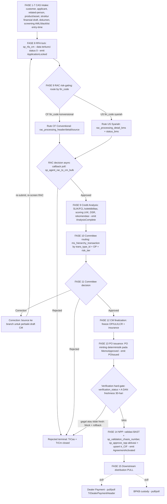
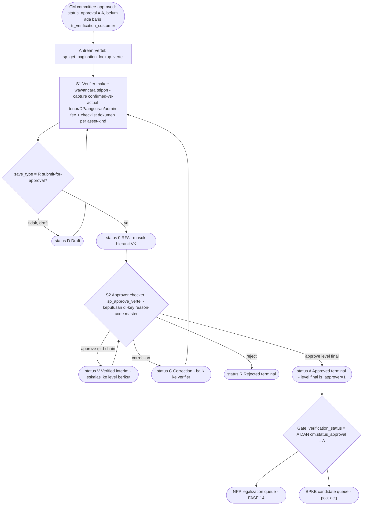
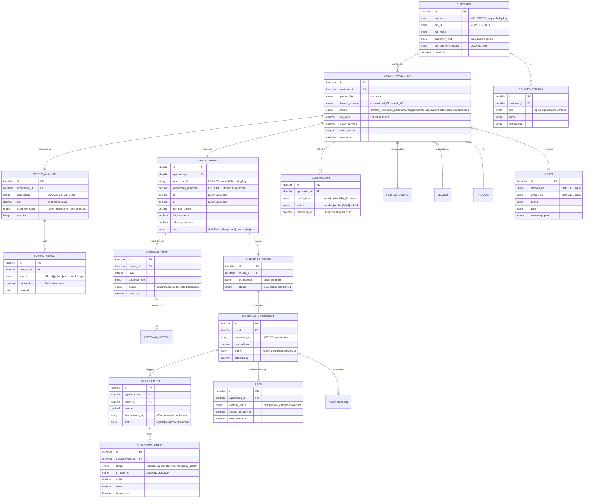

# PRD Payung — Microservice Acquisition (MCF/FINCORE)

> **Jenis dokumen**: PRD Payung (umbrella) untuk *bounded context* **Acquisition** pada core multifinance
> MCF/FINCORE. Dokumen ini adalah **START POINT** developer untuk membangun microservice — ditulis agar
> **BUILDABLE** (entitas + field + enum + aturan kontrak konkret), bukan ringkasan.
> **Bahasa**: Bahasa Indonesia; istilah teknis + identifier asli (nama SP, tabel, field, kode) dipertahankan
> apa adanya.

## Tujuan Bisnis

Acquisition adalah **inti credit-origination pembiayaan kendaraan** (vehicle-financing credit origination)
untuk lender multifinance yang beroperasi di Indonesia. Fungsinya: menerima permohonan pembiayaan sebuah
**motor atau mobil** — yang bersumber dari dealer (*Pooling Order*), field agent, atau channel mobile
(*Repeat Order* / Instant-Approval) — lalu membawanya dari **intake pertama** melewati **credit decisioning**,
**persetujuan komite**, **kontrak**, hingga **legalisasi (NPP)**, sambil menghasilkan catatan akuntansi dan
regulator yang dibutuhkan sistem downstream (disbursement/GL, BPKB, dealer payment) dan otoritas (OJK).

Rentang yang dimiliki microservice ini adalah **FASE 1–15** (intake → RFA → RAC/analisa → komite → CM/PO →
NPP → serah PULL ke downstream). Post-acquisition (disbursement, collateral/BPKB, dealer payment) berada di
luar batas Acquisition dan **menarik (PULL)** data dari sini — bukan di-push.

### Catatan tentang sumber & artefak

- **KB (`.mega-sdd/knowledge-base/`) adalah SUMBER OTORITATIF TEKNIS** untuk PRD ini. Seluruh klaim entitas,
  alur, gate, dan penanda mutabilitas berasal dari sana (hasil ekstraksi tech-agnostic atas legacy .NET +
  473 stored procedure + schema `FC_ACQ_MCF`).
- **BRD stakeholder-facing** direncanakan berada di `.mega-sdd/brd/` — itu **artefak berbeda** (bahasa bisnis,
  audiens stakeholder). *Forward reference*: pada saat penulisan PRD ini folder `.mega-sdd/brd/` belum dibuat;
  bila nanti ada, ia **melengkapi**, bukan menggantikan KB, dan bila terjadi selisih maka **KB menang** untuk
  keputusan teknis.
- Ground-truth alur (`_ACQUISITION-GROUND-TRUTH.md` dari PDF `ALUR TRANSAKSI ACQUISITION.pdf`) dan koreksinya
  (`_CROSS-DOMAIN-NOTES.md`) sudah digabungkan; di mana kode tidak sejalan dengan PDF, koreksi kode dipakai
  (mis. `sp_get_next_approval_scheme` adalah ladder credit-analyst, bukan router komite; FASE 15 = PULL).

### Disiplin penanda (marker discipline)

| Penanda | Arti dalam PRD ini |
|---|---|
| `[LOCKED]` | **WAJIB dipertahankan 1:1** (regulatori / kontrak eksternal / external-FK). Perubahan additive saja. |
| `[INTENT]` | Outcome bisnis yang harus dipenuhi; **skema/mekanisme bebas didesain ulang** oleh rebuild. |
| `[ARTIFACT]` | Kecelakaan legacy — **dibuang** setelah konfirmasi stakeholder. |
| `[OPEN]` | Belum terjawab → masuk **Register Keputusan (§11)**; **JANGAN diselesaikan diam-diam**. |

---

## 1. Ruang Lingkup & Non-Goal

### 1.1 In-scope (dimiliki Acquisition, FASE 1–15)

- **Intake CAS** (FASE 1–8): capture customer/applicant, related-person, product/asset, struktur finansial
  draft, upload dokumen, screening AML/blacklist entry-time, sampai **RFA lock**.
- **Credit decisioning** (FASE 9): **RAC risk-gating** (rute CF konvensional vs US syariah) + **Credit Analysis**
  (SLIK/FCL, scoring, DSR) + rekomendasi.
- **Approval komite** (FASE 10–11): routing hierarki maker-checker, tiga aksi (approve/reject/correction),
  Instant-Approval sebagai *policy flag* auditable.
- **Contract / CM + PO** (FASE 12–13): finalisasi credit memo (bekukan OP/ULI/LCR + asuransi), penerbitan PO.
- **NPP legalization** (FASE 14–15): validasi BAST + nomor rangka/mesin, aktivasi financing agreement,
  penyerahan **PULL** ke downstream.
- **Anti-Corruption Layer** untuk 10 integrasi eksternal (lihat §9).

### 1.2 Non-Goal (di luar batas Acquisition)

- **Post-acquisition eksekusi**: Disbursement/GL posting, BPKB custody state-machine, Dealer Payment transfer —
  mereka **PULL** dari Acquisition. Acquisition **hanya menyediakan** kontrak eligibility / event outbox
  (§5, §9). Model data mereka disebut di §6 sebagai konsumen, bukan milik.
- **Sibling context**: COLLECTION (Cash Receive, Cashier Session), TERMINATION (Normal/Khusus/Insurance/
  Repossession), INSURANCE (Claim/Billing/Refund) — **bukan** scope acquisition.
- **Upstream**: MOOFI (FCL, ACQ mobile, Credit Scoring, RFA mobile) memberi umpan; Acquisition **tidak**
  memiliki logika mobile origination itu, hanya titik masuk Instant-Approval.
- **Master data catalog** (`FC_MSTAPP_MCF`, ~252 `Ms*` masters): dikonsumsi read-only oleh Acquisition;
  kepemilikan (owned vs read-only) adalah `[OPEN]` (OQ-EXTMASTERS-01 / pre-phase blocker Phase 1).
- **Frontend** (`FINCORE.WEB`) dan rendering laporan (RDLC) — di luar backend scope.

### 1.3 Reengineering mandate (bukan mirror legacy)

Rebuild memenuhi tujuan bisnis + constraint `[LOCKED]`, **bukan** mereplika legacy verbatim. Bug legacy
"do-not-replicate" (GL silent no-op, BPKB guard dinonaktifkan, blacklist fail-open, LKK grade→weight bug,
security anti-pattern) **WAJIB diperbaiki** — lihat §8 dan register OQ §11.

---

## 2. Aktor & Peran

Sumber: `00-overview/actors-and-roles.md`. **Tidak ada** skema `[Authorize]`/RBAC statis di kode legacy
(pencarian repository = 0 hit) — peran direkonstruksi dari data model hierarki maker-checker + skema approval.
Rebuild **bebas** memperkenalkan permission layer yang benar; absennya RBAC di legacy **bukan** constraint.

### 2.1 Peran ter-evidensi

| Peran | Deskripsi | Mutabilitas |
|---|---|---|
| **Preparer / "maker"** | Employee yang membuat & submit transaksi ke hierarki approval; tercatat sebagai acting employee pada entri hierarki. | `[INTENT]` |
| **Approver / "checker"** | Employee yang diharapkan bertindak berikutnya; bisa multi-level. | `[INTENT]` |
| **Approval-level holder** | Posisi bernama di dalam skema approval, ter-scope skema+level (contoh teramati: "Level 0"). Katalog nama level asli = `[OPEN]` (OQ-ACTORS-03). | `[LOCKED]` struktur / `[OPEN]` katalog |
| **Super user** | Employee ber-flag (per trans-type, active-dated) yang boleh **bypass** cek "apakah saya next approver". | `[INTENT]` (outcome bypass dipertahankan/di-reconfirm) |
| **Credit Analyst** | Menjalankan stage credit-analysis: review finansial, mutasi rekening, laporan biro, aksi RFA + final-approval. | `[INTENT]` (identitas penandatangan = `[LOCKED]`) |
| **Surveyor** | Field role pada credit memo; kunjungan/verifikasi customer; muncul di pooling-order & phone-verification. | `[INTENT]` |
| **Marketing Head** | Reviewer/approver bernama pada credit memo; posisi persis di hierarki = `[OPEN]`. | `[INTENT]` |
| **Dealer personnel** | Aktor eksternal (bukan employee) yang mengoriginasi permohonan; **bukan** peserta hierarki approval. | `[INTENT]` |
| **"CMO"** | Muncul pada lookup portfolio-exposure keyed by surveyor code; apakah role distinct = `[OPEN]`. | `[OPEN]` |

### 2.2 Peran disebut brief tapi TIDAK ter-evidensi (jangan difabrikasi)

- **OQ-ACTORS-01** [P2]: "Branch Manager" — skema approval **branch-scoped**, tapi tak ada field/SP menamai
  "branch manager". Perlu konfirmasi apakah perlu role distinct.
- **OQ-ACTORS-02** [P2]: "Admin" — tak ada role admin-of-system distinct dari super-user per-trans-type.

### 2.3 Catatan jalur ganda approval

Query inbox approval **mengecualikan** credit ID asal channel mobile → aplikasi mobile-originated dirutekan
lewat **Instant-Approval (IA)** auto-path, **bukan** inbox manusia. Rebuild role/permission WAJIB memodelkan
**jalur kedua** ini agar tidak kehilangan/menduplikasi item antrean. Outcome (setiap aplikasi resolve lewat
**tepat satu** jalur approval yang mengikat) yang penting; mekanismenya bebas.

---

## 3. Peta Bounded Context / Kapabilitas

Acquisition dipecah menjadi **5 kapabilitas** di sepanjang critical path. Ini adalah **behaviour-contract
view**, bukan mandat jumlah microservice — boleh ship sebagai satu modular service atau beberapa.

> **Skema FASE (otoritatif untuk PRD ini)** — dokumen ini memakai penomoran FASE 1–15 milik brief.
> **Rekonsiliasi ke label PDF** (`_ACQUISITION-GROUND-TRUTH.md`): PDF FASE 9 (RAC) + PDF FASE 10 (CA)
> = **PRD FASE 9** (credit decisioning); PDF FASE 11 (komite) = **PRD FASE 10–11**; PDF FASE 8/12/13/14/15
> = PRD FASE 8/12/13/14/15 (identik). FASE 1–7 tidak ada di PDF → direkonstruksi dari kode (`[INTENT]`).

| # | Kapabilitas | FASE | MEMILIKI (owns) | BUKAN miliknya |
|---|---|---|---|---|
| **01** | **intake-cas** | 1–8 | CAS application header, capture applicant + related-person, product/asset draft, struktur finansial draft, upload dokumen, screening AML/blacklist entry-time, **RFA lock** (`sp_rfa_cm`, status **0** = RFA-locked). Emit `ApplicationLocked`. | Tidak memiliki: RAC decision, scoring biro, routing komite, PO minting, aktivasi kontrak. Tidak "menutup" aplikasi saat reject (side effect closure = OQ-AC-01). |
| **02** | **credit-analysis** | 9 | **RAC risk-gating** (rute **CF** konvensional vs **US** syariah) via ACL + ingest callback async; **Credit Analysis** SLIK/FCL kolektibilitas, scoring LKK, DSR, rekomendasi (Recommended/Not-Recommended); komposisi **risk-category** yang menyusun `trans_type_id`. Emit `AnalysisComplete`. | Tidak memiliki: keputusan komite (hanya **memasok** decision RAC + risk-tier ke 03), penerbitan PO, freeze OP/ULI/LCR. RAC *processing* jalan di sisi Bank Mega (eksternal). |
| **03** | **approval-committee** | 10–11 | Routing hierarki komite via `ms_hierarchy_transaction` keyed by `trans_type_id` (risk-tier-qualified) + **OP (Plafond)** + risk-tier; tiga aksi **approve/reject/correction**; enforce identitas approver (no self-approval); IA sebagai **policy flag** auditable; audit → `TrApprovalHistory`. Emit `MemoApproved`. | Tidak memiliki: komposisi awal `trans_type_id` (dari 02), **PO minting** (milik 04 — legacy memicunya dari modul yang salah), freeze figur finansial, aktivasi NPP. Ladder credit-analyst (`sp_get_next_approval_scheme`, `AA00000001`) **distinct** dari router komite. |
| **04** | **contract-cm-po** | 12–13 | Finalisasi CM (2nd data entry pada draft Status 0): **freeze OP/ULI/LCR** `[LOCKED]`, Payment Option, Upping OTR, life-insurance (`TrCmLifeInsuranceCredit`) + vehicle-insurance (`TrCmInsurance`); **PO minting** deterministik tunggal pada `MemoApproved` (→ `TrPo`); koreksi PO (unit fisik beda) tanpa re-entry CAS. Emit `POIssued`. Konsumsi DOKU account-validate. | Tidak memiliki: keputusan approve/reject (dari 03), BAST/chassis validation, aktivasi kontrak, GL posting. **JANGAN** memicu PO dari modul credit-analyst (bug legacy). |
| **05** | **npp-legalization** | 14–15 | Validasi **BAST** + `sp_validation_chasis_number` (nomor rangka + mesin); **eksekusi verification hard-gate** (`verification_status='A'` + freshness 30-hari) sebelum aktivasi; `sp_approve_npp` mengaktifkan `TrNpp` + cetak Financing Agreement; **upsert `tr_CIF`** (identitas KTP/NIK + NPWP); serah **PULL** ke downstream (Dealer Payment, BPKB). Emit `AgreementActivated`. | Tidak memiliki: eksekusi disbursement/GL, custody BPKB, transfer dealer (semua PULL). Tidak **memproduksi** status verifikasi (itu milik kapabilitas verification/post-acq); 05 hanya **meng-enforce** gate-nya. |

**Kapabilitas pendukung (bukan bagian dari 5, tapi bersinggungan):**
`verification-external-checks` **memproduksi** `verification_status` yang di-gate oleh 05 (sub-alur Vertel di §4.1); `regulatory-rules`
(AML, kolektibilitas, DSR) leaf Phase 1; masters (customer/dealer/product) leaf Phase 1.

---

## 4. Alur End-to-End FASE 1–15

CF vs US branch di RAC · verification **hard-gate** sebelum NPP · downstream **PULL**.



**Catatan alur yang mengikat:**
- **RAC (FASE 9)** adalah boundary **eksternal async** (Bank Mega). Legacy menulis `rac_processing_*` di
  linked-server `[macf-dbmega].[JFinMega]`; keputusan dibuat off-system; poll job `sp_agent_rac_to_cm_bulk`
  membaca `rac_get_status` balik. Rebuild: **request adapter + callback/poll ingester** (ACL), **tanpa**
  cross-DB DML.
- **Correction** memantulkan ke branch; re-open di legacy **menghapus destruktif** record RAC → memaksa
  re-screening. Rebuild: re-lock **idempotent**, re-screen eksplisit.
- **Verification hard-gate** dieksekusi oleh **05-npp** sebelum aktivasi (block 403 + rollback bila gagal).
  Freshness credit-analysis (FASE 9) hanya **advisory**; **jangan** dikonflasi (dua cek 30-hari berbeda).
- **FASE 15 = PULL**, bukan push: Dealer Payment & BPKB adalah konsumen yang **poll** record eligible; tidak
  ada reader yang men-seed run Dealer Payment dari status NPP (OQ-NPP-03).

### 4.1 Sub-alur Verifikasi Telpon (Vertel) — maker-checker gate sebelum NPP

> **Posisi**: cross-cutting **antara contract-cm-po (FASE 12–13) dan NPP (FASE 14)** — ini adalah node
> `VGATE` pada diagram §4 di atas. Di-**produksi** oleh kapabilitas `verification-external-checks`,
> di-**enforce** oleh **05-npp** (§5, seam "Verification hard-gate sebelum NPP"). **Bukan sekadar layar
> input**: ia **maker-checker dua peran penuh** dengan approval engine, routing hierarki, state machine,
> dan gate downstream. **Sumber otoritatif**: KB `10-domains/30-verification-external-checks.md`
> (BR-VERIF-1…12); tabel kanonik `tr_verification_customer` (OQ-DATA-05 **resolved**; `CFVerifikasiKonsumen`
> mati).

**Trigger & scope (mengikat):**
- Aplikasi masuk antrean Vertel **hanya setelah** Credit Memo committee-approved (`status_approval='A'`)
  **dan** belum punya baris `tr_verification_customer` (BR-VERIF-1).
- Output `verification_status='A'` (bersama `cm.status_approval='A'`) = **syarat wajib** aplikasi masuk
  **NPP legalization queue** + **BPKB candidate queue** (BR-VERIF-6). Ini gate `[INTENT]` — *outcome*
  (verifikasi mendahului legalisasi/kolateral) WAJIB dipertahankan; mekanisme kode status 1-karakter bebas
  didesain ulang.



**Dua peran (maker-checker):**
- **S1 — Verifier (maker)** `[INTENT]`: wawancara telpon; capture pasangan *confirmed-vs-actual* (tenor, DP,
  angsuran, admin fee, delivery date, item type, email/HP), penerima barang + relasi, checklist dokumen
  per asset-kind (mis. foto KTP), catatan bebas. `save_type` = Draft vs Submit-for-approval. Sumber:
  `FINCORE.SERVICE.VERTEL/Repositories/EF/VertelRepositoryEF.cs:118-441`.
- **S2 — Approver (checker)** `[INTENT]`: aksi via `sp_approve_vertel` — tipe keputusan
  **Approve / Reject / Correction / Verify** di-*key* oleh reason-code master (`ms_CAS_approval_reason.type`),
  eskalasi multi-level lewat hierarki transaksi **"VK"**; skema routing **beda car (`_R4`) vs motor**
  (BR-VERIF-3). Sumber: `SP/FC_ACQ_MCF/dbo.sp_approve_vertel.StoredProcedure.sql:7-385`.

**State machine `verification_status`** (single char, `[INTENT]`):

| Kode | Arti | Transisi masuk |
|---|---|---|
| `D` | Draft | verifier simpan tanpa submit |
| `0` | RFA (masuk hierarki VK) | submit (`SaveType='R'`) |
| `V` | Verified (interim) | approve mid-chain → eskalasi level berikut |
| `A` | Approved (terminal) | approve di level final (`is_approver=1`) → **buka gate NPP/BPKB** |
| `C` | Correction | dikembalikan ke verifier (kembali S1) |
| `R` | Rejected (terminal) | ditolak approver |

**Catatan alur yang mengikat:**
- **Dua gate berbeda, JANGAN dikonflasi**: (a) gate approval domain ini `verification_status='A'`; (b) gate
  **freshness FCL/SLIK 30-hari** yang di-enforce **di NPP-save** (hard 403 + rollback, BR-VERIF-7) — cek
  berbeda, stage berbeda. Bandingkan §4 catatan "Freshness credit-analysis hanya advisory".
- **Idempotensi**: re-submit saat transaksi "VK" masih open (`status='0'`) **melanjutkan** chain yang ada
  (`sp_update_status_approval_vertel`), bukan membuat chain duplikat (BR-VERIF-4).
- **Do-not-replicate** `[ARTIFACT]`: Vertel `R` (Rejected) **seharusnya** kembali ke antrean untuk
  re-verifikasi, tapi filter antrean mengecualikan setiap aplikasi yang sudah punya baris verifikasi →
  **tak pernah terjadi** (BR-VERIF-12). Rebuild: implement re-verifikasi dengan benar; jangan port filter rusak.
- **Do-not-replicate**: query eligibility Vertel **triplikat** (`spGetListNewVertelLookUpPaging`,
  `sp_get_pagination_lookup_vertel`, `sp_get_pagination_lookup_vertel_r4`) → konsolidasi jadi satu di rebuild.
- **OQ terkait** (register domain, bukan §11): OQ-VERIF-01 (apakah hasil match Dukcapil di-gate atau hanya
  informatif); OQ-VERIF-03 (apakah ada penulis eksternal `CFVerifikasiKonsumen`).

---

## 5. Kepemilikan Batas (Boundary Ownership)

Setiap seam rawan tabrakan antar-dev diberi **SATU pemilik**. Aturan: *pemilik seam = yang memiliki tabel/
kontrak sumbernya*; konsumen **membaca**, tidak menulis.

| Seam | Pemilik tunggal | Konsumen | Aturan mengikat | Sumber |
|---|---|---|---|---|
| **RFA (Request For Approval / lock)** | **01-intake-cas** | 02, 03 | RFA lock (`sp_rfa_cm`) + transisi ke status **0** (RFA-locked) hanya boleh dipicu 01. Re-lock **idempotent**; re-open memicu re-screen RAC. | GT FASE 8; `_CROSS-DOMAIN-NOTES` (Wave 3 contract) |
| **RAC async callback ingest** | **02-credit-analysis** | 03 (mengonsumsi decision) | 02 memiliki request adapter + callback/poll ingester (idempotent by application + decision id). 03 **membaca** decision untuk routing — **tidak** menulis balik ke RAC. Tanpa cross-DB DML. | Wave 4 integrations; §9 |
| **Verification hard-gate sebelum NPP** | **Eksekutor: 05-npp**; **Produsen status: kapabilitas verification** | 05 | Verification (`tr_verification_customer`, canonical) **memproduksi** `verification_status='A'` + freshness 30-hari; **05 meng-enforce** gate in-transaction (block + rollback bila gagal). Gate lintas: dua peran distinct, satu eksekutor. | Wave 4 verification; OQ-NPP-14 |
| **PO minting** | **04-contract-cm-po** | — | PO di-mint **tunggal & deterministik** pada event `MemoApproved`. Legacy memicunya dari modul **salah** (`CreditAnalystRepositoryEF.cs:692-708`, domain credit-analyst) — **JANGAN** direplika. Semua terminasi hierarki (termasuk Level-0) harus mint (OQ-CMPO-05 untuk jalur motor). | module-dependency-graph §Circular; Wave 3 |
| **Penulisan `tr_CIF` di NPP** | **05-npp-legalization** | intake (future dedup) | `sp_approve_npp` **meng-upsert `tr_CIF`** (KTP/NIK + NPWP). `tr_CIF` **LIVE** (OQ-DATA-02 **resolved**). Target rebuild: promosikan jadi customer master dedup-at-intake, tapi **penulisan otoritatif** tetap milik 05. | Wave 3 npp; §6 Departure 1 |

**Circular dependency yang WAJIB dipecah bersih di desain:**
- **approval ↔ contract**: 03 memiliki **keputusan**; 04 memiliki **PO minting** (trigger tunggal deterministik
  pada `MemoApproved`). Jangan menyatukan.
- **credit-analysis → approval**: 02 meng-emit **risk-category** yang menyusun `trans_type_id` yang dipakai 03.
  Jaga komposisi `trans_type_id` **di satu tempat** (lihat §7).

---

## 6. Model Data Bersama (Shared ERD)

Bentuk **target** (desain rebuild), tech-agnostic (`identifier`, `string`, `decimal`, `enum`, dst). Bukan
bentuk legacy. Field `[LOCKED]` boleh **additive only** — tanpa perubahan nama/tipe/nilai.



### 6.1 Entitas inti — key + pemilik kapabilitas

| Entitas | Key | Pemilik (writer otoritatif) | Konsumen | Tier |
|---|---|---|---|---|
| **CUSTOMER** | `national_id` (NIK) unik | penulisan otoritatif **05-npp** (`tr_CIF` upsert); target: dedup-at-intake **01** | semua | `[INTENT]` (field identitas `[LOCKED]`) |
| **RELATED_PERSON** | `id`, `customer_id`+`role` | **01-intake** | 02, 03 | `[INTENT]` |
| **CREDIT_APPLICATION** | `id` | **01-intake** | 02, 03, 04, 05 | `[INTENT]` |
| **ASSET** | `chassis_no`, `engine_no` unik | **01-intake** (capture); validasi final **05** | 04, 05, BPKB | `[LOCKED]` (chassis/engine) |
| **CREDIT_ANALYSIS** | `id`, `application_id` | **02-credit-analysis** | 03 | `[LOCKED]` collectibility |
| **BUREAU_RESULT** | `id`, `analysis_id` | **02** (via ACL) | 02, 05 (freshness) | `[LOCKED]` scale / `[INTENT]` storage |
| **RAC_SCREENING** | `id`, `application_id` | **02** (ingest async) | 03 | `[LOCKED]` kontrak / `[INTENT]` mekanisme |
| **CREDIT_MEMO** | `id`; `trans_type_id` routing | **04-contract** (finalize); `trans_type_id` disusun dari 02 | 03, 05 | `[INTENT]` (OP/ULI/LCR `[LOCKED]` frozen) |
| **APPROVAL_STEP / APPROVAL_HISTORY** | `id`, `memo_id` | **03-approval** | audit | `[LOCKED]` routing key / `[INTENT]` storage |
| **PURCHASE_ORDER** | `id`, `po_number` | **04-contract** (mint) | 05 | `[INTENT]` |
| **FINANCING_AGREEMENT** | `agreement_no` | **05-npp** | DISB, BPKB | `[LOCKED]` legal |
| **VERIFICATION** | `id`, `application_id` | kapabilitas verification | **05** (gate) | `[INTENT]` |
| **DISBURSEMENT / SUBLEDGER_ENTRY** | `id`; `idempotency_key` | post-acq (PULL) | — | `[LOCKED]` GL crosswalk + amounts |
| **BPKB** | `id`, `agreement_id` | post-acq (PULL) | — | `[LOCKED]` custody states |

### 6.2 Delapan Departures-from-Legacy (target WAJIB)

1. **Durable CUSTOMER master dedup-by-NIK** — legacy re-capture identitas tiap aplikasi; `tr_CIF` diisi hanya
   di NPP (akhir funnel), tak pernah dipakai ulang di intake. Target: customer master ter-dedup NIK sejak
   intake. `[INTENT]`.
2. **Typed related-person** — ganti record posisional (1=spouse, 2=guarantor, 3-5=references, hanya slot
   spouse divalidasi) dengan baris `RELATED_PERSON.role` bertipe + validasi per-role. `[INTENT]`.
3. **Single approval engine** — kolapskan jalur car vs motor + tabel shadow `_transaction`/`_shd` + ladder
   credit-analyst terpisah menjadi satu engine config-driven. Pertahankan **outcome routing**
   (trans-type + OP/risk → approver); redesign storage. `trans_type_id` tetap `[LOCKED]`.
4. **Normalized subledger + idempotent GL** — satu `SUBLEDGER_ENTRY` dengan diskriminator `ledger`; tambah
   `idempotency_key` + `is_reversal` (legacy tak punya keduanya → double-post mungkin, tanpa reversal).
   GL bank-ID crosswalk `[LOCKED]` verbatim.
5. **Konsolidasi verification** — buang `CFVerifikasiKonsumen` mati; pertahankan `tr_verification_customer`
   sebagai `VERIFICATION`. (OQ-DATA-05 **resolved**.) `[INTENT]`.
6. **Anti-Corruption Layer untuk semua panggilan eksternal** — RAC, SLIK, Pefindo, NeoScore, Dukcapil, DOKU,
   Passnet dicapai lewat **kontrak API yang dimiliki** + **outbox** untuk async (RAC callback, Passnet).
   Hapus cross-DB linked-server DML & HTTP dari dalam T-SQL. `[INTENT]` (kontrak `[LOCKED]`).
7. **Standarisasi tipe & penamaan** — `varchar` currency → `decimal`; drift nama tabel Indonesia/Inggris →
   identifier Inggris bersih (nilai external-FK tetap eksak).
8. **Field dibuang** — `tr_cm.po_no` (selalu NULL), profession-tiered max-age (mati, diganti flat-65),
   `sp_*_cas` di `tr_credit_analyst` (stale), car-line CM staging SPs (mati). Konfirmasi stakeholder → ADR.

---

## 7. Konvensi Kontrak API

> **Target stack = `[KEPUTUSAN DESAIN BARU]` yang BELUM DITENTUKAN.** Tidak ada framework diresepkan. Seluruh
> kontrak di bawah ditulis pada level **resource + field**, **framework-agnostic**. Pemilihan bahasa/runtime/
> transport (REST/gRPC/message-bus) adalah keputusan arsitektur baru → masuk register (§11, OQ-ARCH-STACK).

### 7.1 Format ID / nomor transaksi

- **`trans_type_id` `[LOCKED]` external-FK** — **WAJIB dipertahankan char-for-char**. Alasan: dicocokkan
  char-for-char terhadap tabel referensi approval-hierarchy/trans-type **eksternal** (`FC_MSTAPP_MCF`);
  perubahan struktur akan memutus routing komite.
  - **Komposisi**: `(application-type code) + (menu-entry prefix) + (sequence)`, **risk-tier-qualified** di
    stage CM. Disusun oleh `sp_get_trans_type_id_cm`, dieskalasi di `sp_rfa_cm` / `sp_approve_cm`.
  - **Satu tempat**: komposisi `trans_type_id` **hanya** disusun di satu lokasi (milik 02→dipakai 03), untuk
    hindari drift. Ladder credit-analyst memakai `trans_type_id` **fixed** `'AA00000001'` — **distinct**,
    jangan dicampur.
  - Contoh crosswalk `[LOCKED]` lain: **GL bank-ID** `'000001'→'00001'` (disbursement) WAJIB verbatim.
- **`agreement_no`** (Financing Agreement) & **`po_number`** — nomor legal/dokumen; `agreement_no` `[LOCKED]`
  (kontrak legal), diassign saat aktivasi; `po_number` diassign **saat mint** (bukan NULL seperti legacy).
- **`national_id` (NIK)** & **`tax_id` (NPWP)** — nama field boleh berubah; **nilai/format/validasi WAJIB
  dipertahankan** (identitas OJK/Dukcapil + AML).

### 7.2 Enum status lintas service (kanonik)

| Resource | Field | Enum |
|---|---|---|
| CREDIT_APPLICATION | `status` | `draft` `rfa_locked` `risk_gated` `analyzing` `committee` `approved` `rejected` `corrected` `cancelled` |
| CREDIT_MEMO | `status` | `draft` `finalized` `approved` `corrected` `rejected` |
| APPROVAL_STEP | `action` | `pending` `approved` `rejected` `correction` |
| FINANCING_AGREEMENT | `status` | `pending` `validated` `active` `held` |
| DISBURSEMENT | `status` | `eligible` `paid` `posted` `reversed` |
| BPKB | `custody_status` | `in` `out` `loan` `re_entry` `handover` `lost` `[LOCKED]` (set state regulated) |
| VERIFICATION | `status` | `pending` `verified` `failed` `recheck` |
| CREDIT_ANALYSIS | `collectibility` | `1..5` `[LOCKED]` OJK (map hari: 0→1, 1-90→2, 91-120→3, 121-180→4, >180→5) |

> **Legacy status literal** `0` = **RFA-locked** (bukan state edit; editing di `D`/`C`). Dokumentasikan
> mapping saat migrasi (OQ-CMPO-01).

### 7.3 Pola error

- **Envelope seragam**: `{ code, message, details?, correlation_id }` di semua boundary.
- **Regulated gate = fail-closed by default**: AML/blacklist, SLIK, DSR, verification, chassis/BAST — bila
  dependency gagal/error → **block** (jangan lolos diam-diam). Kebijakan fail-open/fail-closed final =
  **✅ RESOLVED (2026-07-07) → FAIL-CLOSED** (OQ-REG-06): dependency gagal/error/throw mid-check = block, tanpa kecuali.
- **Gate finansial in-transaction**: NPP activation & GL posting **rollback** atomik bila gate gagal
  (perbaiki bug legacy "commit anyway").

### 7.4 Idempotency-key (langkah yang memindahkan uang / state eksternal)

| Langkah | Kunci idempotensi | Alasan (gap legacy) |
|---|---|---|
| RFA lock | idempotent; re-lock re-screen | re-open destruktif menghapus record RAC |
| RAC callback ingest | by `application_id` + `decision_id` | poll async bisa re-read |
| Committee approve | actor-identity enforced; no self-approval | legacy mungkin tak enforce identitas |
| PO minting | trigger deterministik tunggal; semua terminasi hierarki mint | Level-0 tak pernah mint; `po_no` selalu NULL |
| NPP activation | hard BAST + chassis gate sebelum activate | BAST gate legacy prosedural saja |
| GL posting | `idempotency_key` + compensating reversal; fail-closed | double-post mungkin; tanpa reversal; silent commit |
| Downstream (payment/BPKB) | kontrak eligibility eksplisit ATAU outbox event | legacy PULL tanpa event push |
| Passnet sync | outbox + reconciliation (ack/write-back) | fire-and-forget tanpa write-back |

---

## 8. Non-Functional Requirements

### 8.1 Audit trail (maker-checker)

- Setiap transisi approval (submit/approve/reject/correction/override) **wajib** tercatat ke
  `APPROVAL_HISTORY` (legacy `TrApprovalHistory`) dengan actor, timestamp, level, aksi, alasan.
- Enforce **identitas approver** (no self-approval) di **application layer** (SQL layer legacy tak enforce
  untuk NPP & credit-analyst approve — ✅ OQ-MCP-01 **RESOLVED 2026-07-07 → enforce app-layer**). Super-user override wajib ter-audit.

### 8.2 Keamanan — hapus anti-pattern legacy (WAJIB, bukan port)

- **`EXECUTE AS LOGIN='sa'`** untuk email → **least-privilege mail service** (semua mail via privilege esc.
  `[ARTIFACT]`).
- **HTTP dari dalam T-SQL** (`sp_OACreate` OLE Automation ke hardcoded IP `10.90.7.3:81`, DOKU) → **HTTP
  client app-tier** + owned response handling.
- **Cross-DB / cross-company linked-server DML** (mis. `DELETE` ke DB Bank Mega) → **kontrak API yang
  dimiliki**; tanpa DML lintas-DB.
- **Kredensial**: hapus plaintext DB credential (MINIAPI `appsettings.json`, OQ-EXTMASTERS-05); perlakukan
  `PasscodeBiBca` sebagai secret + security review (OQ-REF-05 / OQ-DLRPTN-05).

### 8.3 Ketahanan async

- RAC callback + Passnet sync: **outbox transaksional + reconciliation**; retry idempotent; dead-letter untuk
  gagal permanen; poll job punya scheduler yang terdokumentasi (legacy: scheduler tak ter-lokasi — OQ-RAC-02,
  OQ-NOTIF-01).

### 8.4 Financial integrity

- GL posting: **idempotent** (`idempotency_key`), **compensating reversal**, **fail-closed** (perbaiki
  silent no-op + commit-on-error legacy). BPKB custody guard **di-enforce di dalam transaksi mutasi**
  (bukan endpoint terpisah dengan `RAISERROR` di-comment).

### 8.5 Data residency / regulator

- Data identitas + laporan OJK (kolektibilitas, sektor ekonomi, NIK/NPWP) **residen di Indonesia**; kepatuhan
  OJK/APU-PPT; retensi audit trail sesuai regulasi multifinance.

---

## 9. Anti-Corruption Layer & Integrasi

10 integrasi eksternal. **Arah** relatif terhadap Acquisition. **Async** wajib lewat **outbox** (RAC, Passnet).
**Fidusia** adalah **record-keeping internal**, **bukan** API pemerintah live.

| # | Integrasi | Arah | Sync/Async | Pemilik seam | Catatan ACL / outbox | Sumber (`50-integrations/`) |
|---|---|---|---|---|---|---|
| 1 | **RAC Bank Mega** (risk engine) | outbound request + inbound callback | **async** | **02-credit-analysis** | **Outbox** untuk request; poll/callback ingester (`sp_agent_rac_to_cm_bulk`) idempotent; CF vs US route; **tanpa** cross-DB DML | `rac-bank-mega-risk-engine.md` |
| 2 | **SLIK / OJK** (biro nasional) | outbound (pull) | sync (via staging fabric) | 02 | Orkestrator biro; freshness 30-hari; upstream automation (RPA vs portal OJK) `[OPEN]` OQ-SLIK-05 | `slik-ojk.md` |
| 3 | **Pefindo** (biro privat) | outbound (pull) | sync | 02 | Fan-out dari satu checking-request (`IsPefindo=1`), staging bersama | `pefindo.md` |
| 4 | **NeoScore** (scoring internal/eksternal) | outbound | async (call-site off-system `[OPEN]`) | 02 | Call HTTP outbound tak ditemukan di backend (OQ-NEOSCORE-01); do-not-replicate bug clobber score stale | `neoscore.md` |
| 5 | **Dukcapil** (civil-registry) | outbound | async (upstream automation `[OPEN]`) | 02 / verification | Trigger request `[OPEN]` OQ-DUKCAPIL-01; identitas regulator `[LOCKED]` | `dukcapil.md` |
| 6 | **DOKU** (bank-account inquiry) | outbound | sync | **04-contract** | Ganti `sp_OACreate` HTTP-hardcoded-IP dengan client app-tier; own response persist (write-back mati OQ-DOKU-01) | `doku-payment-gateway.md` |
| 7 | **Passnet / mf-payment sync** | outbound | **async** | **05-npp** | **Outbox + reconciliation** (ganti fire-and-forget; write-back drain tak ada OQ-PASSNET-01); scope `[OPEN]` OQ-PASSNET-02 | `passnet-mf-payment-sync.md` |
| 8 | **Fidusia** (registrasi fidusia) | internal | n/a (record-keeping internal) | collateral (post-acq) | **Bukan** API registri pemerintah live; entri notaris/sertifikat + cross-validate Passnet; flag `IsUpload` `[OPEN]` OQ-COLL-03 | `fidusia-registration.md` |
| 9 | **External masters & linked servers** (`FC_MSTAPP_MCF`) | inbound (read) | sync | references (Phase 1) | Owned vs read-only `[OPEN]` OQ-EXTMASTERS-01; linked server reachability `[OPEN]` | `external-masters-and-linked-servers.md` |
| 10 | **Email / SMS notifications** | outbound | async | cross-cutting | Least-privilege mail (bukan `EXECUTE AS sa`); **0** kapabilitas SMS nyata di kode; scheduler `[OPEN]` OQ-NOTIF-01/02 | `email-sms-notifications.md` |

---

## 10. Fase Pembangunan

Dari `suggested-phasing.md`. Setiap fase: goal + modul + kriteria terima + **pre-phase blocker** yang WAJIB
diselesaikan sebelum mulai.

### Pre-phase (global blockers — regulatori/keamanan, selesaikan lebih dulu)

- ✅ **RESOLVED (2026-07-07)** — kebijakan SEMUA regulated gate (AML, SLIK, DSR, verification) = **FAIL-CLOSED** (OQ-REG-06): dependency gagal/error/throw → block.
- Hapus security anti-pattern (§8.2): `EXECUTE AS sa`, `sp_OACreate` HTTP, cross-company linked-server DML,
  plaintext DB credential, field `PasscodeBiBca`.
- Konfirmasi varian SP mana yang production-live di antara banyak shadow/`_R2`/`_R4`/`_staging`.

### Phase 1 — Foundation: reference data + intake

- **Modul**: customer/dealer/product master, regulatory-rules, acquisition-cas-intake.
- **Kriteria terima**: customer master dedup-by-NIK; related-person typed rows; CAS wizard (customer → asset →
  financial draft → dokumen → RFA) dengan staged input; AML/blacklist entry-time **deterministik broad-match,
  fail-closed**; komposisi `trans_type_id` eksak (external-FK compatible).
- **Pre-phase blocker**: ✅ OQ-ACQCAS-01 **RESOLVED → broad `sp_check_blacklist_test_ilyas`** authoritative;
  OQ-EXTMASTERS-01 (masters owned vs read-only); OQ-CORE-03 (arti OP/ULI/LCR).

### Phase 2 — Decisioning: analysis + approval + contract

- **Modul**: credit-analysis-scoring, approval-committee, contract-cm-po, verification-external-checks.
- **Kriteria terima**: RAC via ACL (async request + callback ingest), rute CF vs US; orkestrasi biro
  (SLIK/Pefindo/NeoScore/Dukcapil) honor freshness 30-hari, skala kolektibilitas eksak; routing komite by
  `trans_type_id` + OP + risk-tier; tiga aksi; enforce identitas approver; IA sebagai **policy flag**
  auditable (bukan string-hack); CM freeze OP/ULI/LCR + insurance; **PO minting deterministik tunggal**;
  verification **hard-gate** sebelum NPP; satu tabel verification.
- **Pre-phase blocker**: ✅ OQ-AC-02 **RESOLVED → Rp 35.000.000** (nilai kode); OQ-CRSCORE-01/OVERVIEW-01
  (CA vs CREDITSANALYST authoritative — ⏳ **NEEDS TELEMETRY**, tetap OPEN); ✅ OQ-REG-06 **RESOLVED → fail-closed**; LKK grade→weight bug (do-not-replicate).

### Phase 3 — Legalization + downstream

- **Modul**: npp-legalization-downstream, collateral-bpkb-fidusia, disburse-subledger, reporting.
- **Kriteria terima**: NPP activation gated BAST + chassis/engine (hard, in-transaction); GL/subledger
  normalized + idempotency-key + compensating reversal + fail-closed, GL bank-ID crosswalk verbatim; BPKB
  custody guard di dalam transaksi mutasi; downstream payment/BPKB via kontrak eligibility eksplisit atau
  outbox; Passnet sync via outbox + reconciliation.
- **Pre-phase blocker**: OQ-PASSNET-01/OQ-DOKU-01 (siapa drain queue / response tables); ✅ OQ-COLL-01
  **RESOLVED → `verification_status='A'`**; OQ-DISB-05/OQ-NPP-03 (eligibility Dealer Payment + siapa post
  header di PAYMENT DB eksternal).

### Template kriteria per-modul

```
- [ ] Semua field/rule [LOCKED] modul ini dipertahankan 1:1 (lihat data-mutation-policy.md)
- [ ] Semua item [ARTIFACT] dikonfirmasi dibuang (atau dipertahankan eksplisit) dengan sign-off stakeholder
- [ ] Setiap bug do-not-replicate dari hidden-gotchas.md diperbaiki, dengan regression test
- [ ] State machine cocok dengan domain file section 8; jalur non-happy-path tercakup
- [ ] Seam integrasi lewat anti-corruption layer (tanpa cross-DB DML, tanpa T-SQL HTTP)
- [ ] Idempotency + reversal di titik yang memindahkan uang atau state eksternal
```

---

## 11. Register Keputusan Dibutuhkan (Open Questions P1)

Dari roll-up **247 OQ** (P1: 55 · P2: 108 · P3: 74). Berikut P1 paling **memblokir** untuk Acquisition, dengan
OQ-ID. **JANGAN diselesaikan diam-diam** — setiap OQ butuh domain-expert / stakeholder sign-off; alirkan ke
5 penulis kapabilitas dan phasing (§10).

> **Sudah RESOLVED (jangan dimasukkan sebagai blocker):** OQ-DATA-02 (`tr_CIF` **LIVE** — di-upsert
> `sp_approve_npp`); OQ-DATA-05 (`tr_verification_customer` **canonical**, `CFVerifikasiKonsumen` mati).
>
> **RESOLVED via `resolve-oq` (2026-07-07, stakeholder sign-off):**
> - **OQ-REG-06** → **FAIL-CLOSED**: setiap regulated gate (AML/blacklist, SLIK, DSR, verification, chassis/BAST)
>   yang dependency-nya gagal/error/throw mid-check → **BLOCK** (jangan lolos diam-diam). Menetapkan default §7.3
>   sebagai kebijakan final; berlaku pre-phase global.
> - **OQ-ACQCAS-01** → blacklist **broad `sp_check_blacklist_test_ilyas`** = production-authoritative (varian
>   '_test_ilyas' dikonfirmasi memang deployed; broad-match dipilih demi minim false-negative kepatuhan).
> - **OQ-ACQCAS-02** → AML **`sp_check_APUPPT`** (varian produksi bersih) = authoritative; `sp_check_APUPPT_Test_Ilyas` bukan.
> - **OQ-AC-02** → threshold eskalasi aggregate-exposure = **Rp 35.000.000** (nilai di kode), bukan Rp 30jt komentar.
> - **OQ-MCP-01** → **enforce identitas approver di app-layer** (no self-approval) utk NPP & credit-analyst approve;
>   super-user override wajib ter-audit. Menutup celah SQL-layer legacy.
> - **OQ-NPP-14** → BAST completeness jadi **hard gate in-transaction** sebelum NPP activation (block + rollback bila tak lengkap), bukan prosedural.
> - **OQ-PRODASSET-06** → IA trial-cohort override (string-position) = **pilot hack stale `[ARTIFACT]` → dibuang**; IA dimodelkan sbg **policy flag auditable**.
> - **OQ-COLL-01** → filter BPKB-In candidate-queue = **`verification_status='A'`** (kanonik per BR-VERIF-6); `agreement_status='A'` yang di-comment = regresi/dead-code, jangan re-enable.
> - **OQ-CMPO-01** → "Status 0" flow-doc = **status header credit-application = RFA-locked**, BUKAN status edit memo (memo diedit di `D`/`C`). Dokumentasikan mapping saat migrasi.
> - **OQ-NPP-03** → **PULL confirmed**: tak ada seeder sisi-NPP; downstream (Dealer Payment, BPKB) poll record eligible sendiri (FASE 15 = PULL).
> - **OQ-AC-01** → committee Reject **TIDAK** menutup `tr_cas` di kode (deskripsi PDF aspirational) → **rebuild WAJIB tambah closure eksplisit** saat reject.
>
> **⏳ NEEDS STAKEHOLDER / TELEMETRY (tetap `[OPEN]` — tak dapat di-resolve dari kode, 2026-07-07):**
> - **OQ-CRSCORE-01** — mana dari 3 write-target 5C yang live: butuh production telemetry / stakeholder walkthrough.
> - **OQ-OVERVIEW-01** — CA vs CREDITSANALYST mana authoritative/dead: KB tak konklusif (controller nama identik); butuh telemetry.
> - **OQ-PRODASSET-01** — unify vs dua katalog aset distinct: keputusan desain, bukan fakta kode; tunda ke desain arsitektur.

| OQ-ID | Pertanyaan | Memengaruhi |
|---|---|---|
| **OQ-REG-06** ✅ | ~~fail-closed (block) atau fail-open (lolos) saat screening SP throw mid-check?~~ **RESOLVED 2026-07-07 → FAIL-CLOSED** (dependency gagal/error/throw = block, tanpa kecuali). | 01, 02; semua regulated gate; pre-phase global |
| **OQ-ACQCAS-01** ✅ | ~~narrow `sp_check_blacklist` vs broad `sp_check_blacklist_test_ilyas`?~~ **RESOLVED 2026-07-07 → broad `sp_check_blacklist_test_ilyas`** (production-authoritative). | 01-intake; Phase 1 |
| **OQ-ACQCAS-02** ✅ | ~~`sp_check_APUPPT` vs `sp_check_APUPPT_Test_Ilyas`?~~ **RESOLVED 2026-07-07 → `sp_check_APUPPT`** (varian produksi bersih authoritative). | 01-intake |
| **OQ-CORE-03 / OQ-CMPO-02** | Arti bisnis `OP`, `ULI`, `LCR` (dan varian `Ost*`) — GL-reconciled? butuh `[LOCKED]`? | 02, 03, 04 |
| **OQ-AC-02** ✅ | ~~Rp 35.000.000 (kode) vs ~Rp 30.000.000 (komentar)?~~ **RESOLVED 2026-07-07 → Rp 35.000.000** (nilai di kode otoritatif). | 03-approval |
| **OQ-AC-01** ✅ | ~~Reject nutup `tr_cas` atau PDF aspirational?~~ **RESOLVED 2026-07-07 → tak ada closure di kode (PDF aspirational); rebuild WAJIB tambah closure eksplisit** saat reject. | 01, 03 |
| **OQ-MCP-01** ✅ | ~~API/session layer enforce 'hanya assigned employee/super-user boleh act' utk NPP & credit-analyst approve?~~ **RESOLVED 2026-07-07 → YA, enforce di app-layer** (no self-approval; super-user override ter-audit). | 03, 05; §8.1 |
| **OQ-RAC-01** | Di mana `sp_insert_rac_processing*` berjalan (dikonfirmasi absen lokal = eksternal Bank Mega)? | 02; ACL RAC |
| **OQ-RAC-02** | SQL Agent job / scheduler apa yang memanggil `sp_agent_rac_to_cm_bulk` (poll ingest)? | 02; §8.3 |
| **OQ-CRSCORE-01** ⏳ | Dari 3 write-target paralel untuk catatan analisa 5C, mana source-of-truth? (CA vs CREDITSANALYST) — **NEEDS TELEMETRY/STAKEHOLDER** (tak dapat dari kode), tetap `[OPEN]`. | 02 |
| **OQ-OVERVIEW-01** ⏳ | CA vs CREDITSANALYST — mana authoritative, mana dead? — **NEEDS TELEMETRY/STAKEHOLDER** (KB tak konklusif, controller nama identik), tetap `[OPEN]`. | 02; Phase 2 |
| **OQ-CMPO-01** ✅ | ~~"Status 0" = header status parent atau status memo?~~ **RESOLVED 2026-07-07 → status header credit-application = RFA-locked** (bukan status edit memo; memo diedit di `D`/`C`). | 01, 04 |
| **OQ-CMPO-05** | Untuk hierarki terminasi Level-0 (tak auto-mint PO), bagaimana PO terbit untuk lini **motor** (tanpa self-heal fallback lini car)? | 04-contract |
| **OQ-PRODASSET-06** ✅ | ~~IA trial-cohort override = policy permanen atau pilot hack stale?~~ **RESOLVED 2026-07-07 → pilot hack stale `[ARTIFACT]`, dibuang** → IA jadi policy flag auditable. | 02, 03; IA policy flag |
| **OQ-PRODASSET-01** ⏳ | Katalog aset mana authoritative (asset-kind→class→brand vs item-brand-type + OTR)? — **KEPUTUSAN DESAIN** (unify vs dua distinct), bukan fakta kode; ditunda ke desain arsitektur, tetap `[OPEN]`. | 01, 12-product |
| **OQ-NPP-14** ✅ | ~~BAST completeness jadi hard gate?~~ **RESOLVED 2026-07-07 → YA, hard gate in-transaction** (block + rollback bila tak lengkap). | 05-npp |
| **OQ-NPP-03** ✅ | ~~konfirmasi PULL?~~ **RESOLVED 2026-07-07 → PULL confirmed** (tak ada seeder sisi-NPP; downstream poll sendiri). | 05; downstream seam |
| **OQ-COLL-01** ✅ | ~~BPKB-In queue: `verification_status='A'` vs `agreement_status='A'` (di-comment)?~~ **RESOLVED 2026-07-07 → `verification_status='A'`** (kanonik BR-VERIF-6); yang di-comment = regresi/dead-code. | post-acq; Phase 3 |
| **OQ-PASSNET-01** | Proses apa men-drain `tr_synchronize_to_passnet` (`is_sync='0'`) & write-back? | 05; outbox Passnet |
| **OQ-PASSNET-02** | Passnet murni master NPP, atau juga eksekusi payment? (scope ACL) | 05; boundary |
| **OQ-DOKU-01** | Siapa mengisi `DOKU_*.responseStatus/responseAccName` (write-back SP tanpa caller)? | 04; ACL DOKU |
| **OQ-DUKCAPIL-01** | Mekanisme apa yang menginisiasi request Dukcapil + mengisi hasilnya? | 02/verification |
| **OQ-NEOSCORE-01** | Tier mana yang melakukan HTTP outbound ke NeoScore, dengan apa? | 02; ACL NeoScore |
| **OQ-SLIK-05** | Apakah freshness 30-hari SLIK di-enforce hard block di suatu tempat? | 02; freshness |
| **OQ-DISB-05 / OQ-RPT-06** | Apa penentu "eligibility" kontrak masuk batch Dealer Payment? | post-acq; Phase 3 |
| **OQ-DISB-01** | Proses apa yang flip flag `is_sync` subledger dari unset → synced? | post-acq |
| **OQ-DISB-09** | Apakah record outbound-sync Passnet pernah dikonfirmasi (ack)? | 05; outbox |
| **OQ-DLRPTN-01** | `MsDealer` vs `MsDealer1` vs `MsDealerBackup20221227` — mana live? | references |
| **OQ-DLRPTN-05 / OQ-REF-05** | `[SECURITY]` `MsBank.PasscodeBiBca` — kredensial live? (review sebelum migrasi) | references; §8.2 |
| **OQ-EXTMASTERS-01** | Linked server `MACF-DBSTG/DBMCF/DBKONSOL/dbrep` masih reachable / live? | references; Phase 1 |
| **OQ-EXTMASTERS-05** | Status validitas/rotasi plaintext MINIAPI DB credential (aksi security). | §8.2 |
| **OQ-NOTIF-01 / OQ-NOTIF-02** | Trigger/scheduler & varian SP mail mana yang deployed produksi? | 10-email; §8.3 |
| **OQ-COL-01** | Apa penentu sebuah aplikasi butuh case credit-analyst vs langsung dari CM-approval ke drafting? | 02, 03; UX/phasing |
| **OQ-ASM-01 / OQ-ASM-02** | Semantik "Reject" non-Level-0 (eskalasi?) & actor target correction non-Level-0. | 03-approval |
| **OQ-ARCH-STACK** `[KEPUTUSAN DESAIN BARU]` | Target stack (bahasa/runtime/transport REST vs gRPC vs bus) belum ditentukan — kontrak ditulis resource+field agnostik. | semua; §7 |

> **Register lengkap** ada di masing-masing domain file `10-domains/*.md §OQ`, `40-business-rules/*.md`,
> `50-integrations/*.md`, dan roll-up di `README.md` + `suggested-phasing.md`. Tabel di atas adalah subset
> **paling memblokir** untuk memulai microservice Acquisition.
