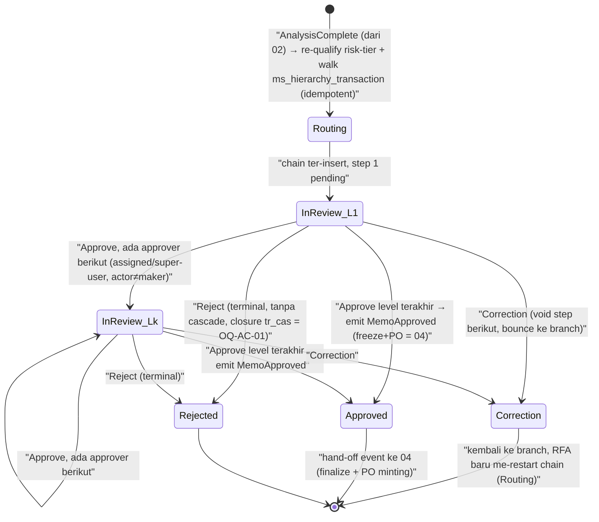

# PRD — Approval & Committee (Credit-Committee Inbox Hierarchy)

> **Kapabilitas 03** dari bounded context Acquisition. **FASE 10–11** (routing komite + keputusan komite).
> Kapabilitas ini adalah **gate persetujuan komite kredit**: begitu sebuah credit memo (CM) draft di-lock
> (RFA), kapabilitas ini menghitung **siapa** yang harus me-review (routing dinamis berdasarkan risk-tier +
> aggregate exposure/OP), menjalankan review sekuensial multi-level (surfacing lewat "inbox"), lalu
> mengeksekusi salah satu dari **tiga aksi komite**: **Correction** (pantulkan ke branch), **Reject**
> (permanen), atau **Approve** (emit `MemoApproved` → memicu finalisasi + PO minting di kapabilitas 04).
> **Bahasa**: Bahasa Indonesia; seluruh identifier/field/kode/SP/OQ-ID dipertahankan apa adanya.

**Kepemilikan singkat**: routing hierarki komite via `ms_hierarchy_transaction` **keyed by `trans_type_id`
(risk-tier-qualified) + OP (Plafond) + risk-tier**; tiga aksi approve/reject/correction; enforce identitas
approver (assigned-or-super-user) **plus** no-self-approval; Instant-Approval (IA) sebagai **policy flag
auditable**; audit maker-checker. **BUKAN** miliknya: komposisi awal `trans_type_id` (milik 02), PO minting
+ freeze OP/ULI/LCR (milik 04), aktivasi NPP (milik 05), dan ladder credit-analyst (`AA00000001`,
`sp_get_next_approval_scheme`) yang **distinct** dari router komite ini.

> **Disiplin penanda** (dari `00-OVERVIEW.md`): `[LOCKED]` = WAJIB dipertahankan 1:1 (regulatori / external-FK /
> kontrak eksternal), additive only. `[INTENT]` = outcome bisnis dipertahankan, skema/mekanisme bebas
> didesain ulang. `[ARTIFACT]` = kecelakaan legacy, dibuang setelah konfirmasi stakeholder. `[OPEN]` = masuk
> Register Keputusan §11, JANGAN diselesaikan diam-diam. `[KEPUTUSAN DESAIN BARU]` = desain baru, bukan dari
> legacy.

---

## 1. Ruang Lingkup & Kepemilikan

### 1.1 Yang DIMILIKI kapabilitas ini (owns)

| # | Kepemilikan | Marker | Sumber KB |
|---|---|---|---|
| O-1 | **Routing hierarki komite** — walk `ms_hierarchy_transaction` (org-supervisor map: branch/outlet → area → regional) di-key oleh `trans_type_id` final (risk-tier-qualified), insert **satu** hand-off step per approver ter-resolve secara **sekuensial** (bukan quorum/parallel). | `[VERIFIED][INTENT]` | `22-approval-committee.md §5.6, §7 BR-AC-5` |
| O-2 | **Re-kualifikasi risk-tier di routing-time** — sebelum walk hierarki: (a) effective-rate re-check (naik satu tier bila rate di bawah minimum pasar), (b) aggregate-exposure (OP/Plafond) escalation ke Very-High-Risk + swap approver final ke ACM. **03 tidak menyusun ulang `trans_type_id` dari nol** — ia me-re-qualify risk-digit lalu **memanggil fungsi komposisi milik 02** dengan input ter-eskalasi (lihat §7 BR-AC-1a). | `[VERIFIED][INTENT]` | `22 §5.4–5.6, §7 BR-AC-3` |
| O-3 | **Tiga aksi komite** pada step pending: **Approve** (advance / terminal), **Reject** (terminal), **Correction** (pantulkan ke branch, clear step berikutnya). | `[VERIFIED][INTENT]` | `22 §5.9–5.12, §8` |
| O-4 | **Enforcement identitas approver** — hanya assigned employee **atau** configured super-user (per `trans_type_id`) boleh act; ditambah **no-self-approval** (maker ≠ checker). | `[LOCKED]` (assigned-or-super-user) + `[KEPUTUSAN DESAIN BARU]` (no-self-approval) | `22 §7 BR-AC-7, BR-AC-11` |
| O-5 | **Instant-Approval sebagai policy flag auditable** — satu kapabilitas policy-flag menggantikan **tiga** mekanisme legacy (risk-force-low, CA-role exclusion, auto-approve walker). | `[INTENT]` (outcome) menggantikan `[ARTIFACT]` (string-hack) | `22 §7 BR-AC-8; hidden-gotchas GOTCHA-9` |
| O-6 | **Audit maker-checker** — setiap transisi (submit/approve/reject/correction/override super-user) tercatat ke `APPROVAL_HISTORY` yang bersih (grounded pada `tr_hierarchy_transaction`, **bukan** `tr_approval_history` yang disused). | `[INTENT]` | `maker-checker-pattern.md §7 BR-MCP-2, Edge Case 1` |
| O-7 | **Entitas `APPROVAL_STEP` + `APPROVAL_HISTORY`** (routing key `[LOCKED]`, storage `[INTENT]`). Emit event **`MemoApproved`** pada terminal Approve. | mixed | umbrella shared_entities; `22 §6` |

### 1.2 Yang BUKAN miliknya (non-goal / batas)

| Bukan miliknya | Pemilik sebenarnya | Catatan |
|---|---|---|
| **Komposisi awal `trans_type_id`** (application-type prefix + menu-prefix + base risk digit). | **02-credit-analysis** (`sp_get_trans_type_id_cm`, satu tempat) | 03 **mengonsumsi** + me-re-qualify risk-digit-nya, tidak menyusun ulang komposisi. Konvensi umbrella §7.1: komposisi HANYA di satu lokasi. |
| **Freeze figur finansial** OP/ULI/LCR + Payment Option + Upping OTR + insurance pada CM. | **04-contract-cm-po** (FASE 12) | Legacy `sp_approve_cm` men-inline freeze di terminal-approve (BR-AC-10). Rebuild: 03 **hanya** emit `MemoApproved`; 04 melakukan freeze. **Departure**. |
| **PO minting** (`po_number`). | **04-contract-cm-po** (deterministik tunggal pada `MemoApproved`) | Legacy menulis `tr_cm.po_no = NULL` di terminal-approve (GOTCHA-6). Rebuild: **03 tidak pernah menyentuh `po_no`**. **Departure**. |
| **Penutupan aplikasi (`tr_cas`) saat Reject.** | **01-intake-cas** (status aplikasi) | Legacy committee reject **TIDAK** menutup `tr_cas` (Edge Case 3); framing PDF "TrCas + TrCm closed" belum terkonfirmasi → `[OPEN]` OQ-AC-01. 03 hanya emit keputusan Reject. |
| **Aktivasi NPP + upsert `tr_CIF`.** | **05-npp-legalization** (FASE 14–15) | — |
| **Ladder credit-analyst** (`tr_ca`, `trans_type_id` fixed `'AA00000001'`, `sp_get_next_approval_scheme`, Level-0 escalation gate). | **domain credit-analyst / `approval-state-machine.md`** | **DISTINCT** dari router komite ini (§7 BR-AC-6, Edge Case 5). Jangan dikonflasi/disatukan state machine-nya. |
| **RFA lock trigger** (`sp_rfa_cm` transisi ke status `0` + emit `ApplicationLocked`). | **01-intake-cas** | Legacy `sp_rfa_cm` mengonflasi lock **dan** chain-build. Rebuild: lock = 01; **chain-build/routing = 03** (dipicu event `AnalysisComplete` dari 02, setelah analisis). |

### 1.3 FASE yang dicakup

- **FASE 10** — Committee routing: bangun rantai approver via `ms_hierarchy_transaction` by `trans_type_id` +
  OP + risk-tier.
- **FASE 11** — Committee decision: tiga aksi approve/reject/correction; terminal Approve → emit `MemoApproved`.

> Catatan rekonsiliasi: dalam `_ACQUISITION-GROUND-TRUTH.md`, routing key komite secara literal dihitung pada
> **FASE 8** (di dalam `sp_rfa_cm`), tetapi keputusan komite adalah **FASE 11**. Rebuild memisahkan: lock =
> 01 (FASE 8), routing-compute + decision = 03 (FASE 10–11).

---

## 2. Aktor & Peran

Sumber: `22-approval-committee.md §2`. Legacy **tidak** punya RBAC statis (`00-OVERVIEW.md §2`) — peran
direkonstruksi dari data model hierarki maker-checker.

| Peran | Deskripsi | Marker / OQ |
|---|---|---|
| **Branch Admin / CMO (Maker)** | Menyiapkan CM draft dan menekan RFA yang men-trigger routing komite. Adalah **submitter**; secara konstruksi tidak pernah di-insert sebagai step approver (chain dibangun mulai dari supervisor-nya). | `[VERIFIED][INTENT]` (`sp_rfa_cm:7-52`) |
| **Committee Approver (Level k, k=1..N)** | Deretan employee ter-resolve individual dari **org-supervisor chain** (branch/outlet head → area head → regional head), BUKAN dari skema "Level 1/2/3" bernama. Singkatan kode: `kacab`/`kapos` (branch/outlet head), `kepala area`, `kawil` (`kepala wilayah`, regional head). | `[VERIFIED][INTENT]` chain; `[INFERRED]` decode singkatan (`sp_rfa_cm:910-1150`) |
| **Super-user** | Employee ber-flag (per `trans_type_id`, di `ms_trans_super_user`) yang boleh act pada **step pending manapun** untuk trans-type itu, terlepas dari assignment. Override wajib ter-audit. | `[VERIFIED][LOCKED]` outcome (`sp_approve_cm:169-193`) |
| **ACM** | Employee ter-map spesifik (`ms_mapping_hierarchy.ACM_NIK`, keyed by branch) yang **di-substitusi sebagai approver LEVEL FINAL** ketika aturan aggregate-exposure escalation menyala (§7 BR-AC-3), menggantikan hasil walk org-hierarchy biasa. Job-title "ACM" tidak dinyatakan di kode. | `[VERIFIED][INTENT]` mekanisme; job title `[OPEN]` **OQ-AC-05** (`sp_rfa_cm:1255-1270`) |
| **Credit Analyst** | Biasanya kandidat di dalam chain org-hierarchy (bila supervisor di chain memegang title itu); **DIKECUALIKAN** dari chain di bawah kondisi IA trial-cohort (§7 BR-AC-8b). | `[VERIFIED][INTENT]` (`sp_rfa_cm:1307-1328`) |
| **System (Instant-Approval)** | Perilaku otomatis (policy-flag) yang menyentuh routing/hierarki yang sama; tiga varian legacy (§7 BR-AC-8). | `[VERIFIED]` |

> **Peran belum ter-evidensi (jangan difabrikasi)**: "Branch Manager" sebagai *named role* tetap `[OPEN]`
> (OQ-ACTORS-01) meski routing di sini branch-scoped.

---

## 3. Model Data

Bentuk **target** (tech-agnostic), konform ke Shared ERD `00-OVERVIEW.md §6`. Kapabilitas ini **memiliki**
`APPROVAL_STEP` + `APPROVAL_HISTORY`; **mengonsumsi** shared entity lain (read-only) untuk routing.

### 3.1 Entitas yang dimiliki

**`APPROVAL_STEP`** — satu baris per approver ter-resolve dalam rantai komite (hand-off ledger step).

| Field | Tipe | Wajib | Marker | Catatan |
|---|---|---|---|---|
| `id` | identifier | ya | `[INTENT]` | PK |
| `memo_id` | identifier (FK → `CREDIT_MEMO`) | ya | `[INTENT]` | transaksi yang di-route (`credit_id` legacy) |
| `trans_type_id` | string | ya | `[LOCKED]` | **routing key external-FK**, WAJIB char-for-char (§7 BR-AC-1) |
| `sequence` | integer | ya | `[INTENT]` | urutan step (ascending, strictly sequential) |
| `level_label` | string | tidak | `[INTENT]` | label level (mis. branch/area/regional); decode singkatan `[INFERRED]` |
| `assigned_employee_id` | identifier | ya | `[LOCKED]` | approver yang di-assign untuk step ini (gate identitas) |
| `action` | enum `pending\|approved\|rejected\|correction` | ya | `[LOCKED]` (nilai kanonik) | outcome step; `pending` = current/belum di-action |
| `reason_id` | identifier | saat action | `[INTENT]` | reason code (lookup `sp_get_approver_reason`) |
| `reason` | text | saat action | `[INTENT]` | alasan free-text |
| `acted_by_employee_id` | identifier | saat action | `[LOCKED]` | actor aktual (untuk audit + no-self-approval) |
| `super_user_override` | boolean | tidak | `[LOCKED]` | true bila di-action oleh super-user (wajib ter-audit) |
| `acted_at` | datetime | saat action | `[INTENT]` | timestamp action |

**`APPROVAL_HISTORY`** — jejak audit maker-checker (satu baris per transisi). Di-ground pada
`tr_hierarchy_transaction` (audit legacy yang **live**), **BUKAN** `tr_approval_history` (disused, mostly
write-only — `[ARTIFACT]`, OQ-MCP-04).

| Field | Tipe | Wajib | Marker | Catatan |
|---|---|---|---|---|
| `id` | identifier | ya | `[INTENT]` | PK |
| `memo_id` | identifier | ya | `[INTENT]` | FK |
| `step_id` | identifier | ya | `[INTENT]` | FK → `APPROVAL_STEP` |
| `actor_employee_id` | identifier | ya | `[LOCKED]` | siapa yang bertindak |
| `action` | enum `pending\|approved\|rejected\|correction` | ya | `[LOCKED]` | aksi |
| `reason_id` / `reason` | id / text | ya | `[INTENT]` | alasan |
| `super_user_override` | boolean | ya | `[LOCKED]` | flag override |
| `correlation_id` | string | ya | `[KEPUTUSAN DESAIN BARU]` | untuk trace lintas boundary |
| `recorded_at` | datetime | ya | `[INTENT]` | timestamp |

### 3.2 Shared entity yang DIKONSUMSI (read; pemilik lain)

| Entitas | Pemilik | Dipakai 03 untuk | Field kunci |
|---|---|---|---|
| **`CREDIT_MEMO`** | 04 (finalize); `trans_type_id` disusun dari 02 | subjek review; sumber `trans_type_id`, effective-rate, asset_cost, down_payment | `trans_type_id` `[LOCKED]`; `outstanding_principal`(OP)/`uli`/`lcr` `[LOCKED]` (di-freeze oleh **04**, bukan 03) |
| **`CREDIT_APPLICATION`** | 01 | konteks aplikasi + status `committee` | `status` enum |
| **`CREDIT_ANALYSIS`** | 02 | **risk_tier** yang menyusun risk-digit; kolektibilitas (untuk jalur mobile "Kol>3") | `risk_tier` `[INTENT]`; `collectibility` 1–5 `[LOCKED]` |
| **`RAC_SCREENING`** | 02 (ingest async) | decision RAC yang di-**baca** untuk routing (tanpa write-back) | kontrak `[LOCKED]` |

### 3.3 Katalog referensi eksternal (read-only, `FC_MSTAPP_MCF`)

| Katalog | Peran | Marker |
|---|---|---|
| `ms_hierarchy_transaction` | org-supervisor map yang di-walk untuk membangun chain, keyed by `trans_type_id` | `[LOCKED]` external-FK |
| `ms_trans_type` (`mapping_risk_category_id`) | mapping risk-category → risk-digit (dipakai fungsi komposisi milik 02) | `[LOCKED]` external-FK |
| `ms_trans_super_user` | daftar super-user per trans-type | `[LOCKED]` outcome |
| `ms_mapping_hierarchy.ACM_NIK` | target swap ACM per branch | `[LOCKED]` outcome; title `[OPEN]` OQ-AC-05 |

> **Dua makna "OP"** (keduanya ride OQ-CORE-03): (1) **aggregate-exposure OP** yang dihitung **03** di
> routing-time (`sp_get_OP_by_identity_number`: `asset_cost − down_payment`, di-sum lintas aplikasi + lintas
> sistem by NIK applicant + spouse) untuk cek threshold escalation; (2) **per-memo OP/ULI/LCR** yang
> di-**freeze oleh 04** pada CM. Sama formula dasar (`asset_cost − down_payment`), scope berbeda. Jangan
> dikonflasi.

---

## 4. API Endpoint

> **Target stack `[KEPUTUSAN DESAIN BARU]` BELUM DITENTUKAN** (OQ-ARCH-STACK). Kontrak ditulis level
> **resource + field**, framework-agnostic (REST/gRPC/message-bus bebas). `Auth/Role` menyebut peran §2,
> bukan skema teknis tertentu.

| Method | Path | Deskripsi | Auth/Role |
|---|---|---|---|
| `POST` | `/credit-memos/{memoId}/committee-routing` | Bangun rantai approver komite (dipicu event `AnalysisComplete` dari 02). Re-qualify risk-tier (effective-rate + exposure/OP), resolve `trans_type_id` final via fungsi komposisi 02, walk `ms_hierarchy_transaction`, insert steps. **Idempotent** (re-emit tidak duplikasi step). | System (event handler) / Maker |
| `GET` | `/credit-memos/{memoId}/approval-steps` | List rantai + step current pending untuk sebuah memo. | Approver, Maker, Super-user, Auditor |
| `GET` | `/approval-inbox?approver={employeeId}` | Inbox: semua memo yang step current pending-nya di-assign ke approver ini (filter status pending set). | Approver, Super-user |
| `POST` | `/credit-memos/{memoId}/approval-decision` | Eksekusi aksi komite pada step current pending: `approve` / `reject` / `correction`. Enforce identitas + no-self-approval. Terminal Approve → emit `MemoApproved`. | Approver (assigned) atau Super-user |
| `GET` | `/credit-memos/{memoId}/approval-history` | Jejak audit maker-checker untuk memo. | Auditor, Approver, Super-user |
| `GET` | `/approval-reasons?action={action}` | Lookup reason code (per aksi). | Approver, Super-user |
| `GET` | `/credit-memos/{memoId}/approval-progress` | View progres level (level aktif / selesai) untuk memo. | Approver, Super-user, Maker |

> Catatan: `committee-routing` diekspos sebagai endpoint **dan** dipicu event `AnalysisComplete` (§10) —
> keduanya idempotent. Tidak ada endpoint untuk menyusun `trans_type_id` (milik 02) atau minting PO / freeze
> figur (milik 04).

---

## 5. Kontrak Request/Response

### 5.1 `POST /credit-memos/{memoId}/committee-routing` — bangun chain

**Request** (field wajib ditandai `*`):
```json
{
  "memo_id": "CM-0001*",
  "submitter_employee_id": "EMP-BRANCH-88*",
  "idempotency_key": "route-CM-0001-v1*"
}
```

**Response 201** — chain terbentuk:
```json
{
  "memo_id": "CM-0001",
  "trans_type_id": "0224000004",
  "risk_tier_resolution": {
    "base_risk_digit": "2",
    "effective_rate_escalation_applied": false,
    "exposure_escalation_applied": true,
    "aggregate_op": 41000000,
    "op_threshold_applied": 35000000,
    "final_risk_digit": "4",
    "acm_swap_applied": true,
    "ia_policy_flag": "none"
  },
  "steps": [
    { "sequence": 1, "assigned_employee_id": "EMP-KACAB-12", "level_label": "branch_head", "action": "pending" },
    { "sequence": 2, "assigned_employee_id": "EMP-AREA-05",  "level_label": "area_head",   "action": "pending" },
    { "sequence": 3, "assigned_employee_id": "EMP-ACM-01",   "level_label": "acm_final",   "action": "pending" }
  ]
}
```
- `trans_type_id` `[LOCKED]` — char-for-char external-FK.
- `aggregate_op` / `op_threshold_applied` — nilai threshold **konfigurable**; JANGAN hardcode 35M atau 30jt
  sebelum OQ-AC-02 di-resolve. `risk_tier_resolution` adalah jejak **auditable** dari re-kualifikasi.
- Re-emit dengan `idempotency_key` sama → **200** mengembalikan chain yang sama (tidak insert ulang).

**Response 409** — guard gagal (status memo bukan `draft`/`correction`, lihat §7 BR-AC-9):
```json
{ "code": "INVALID_MEMO_STATUS", "message": "RFA hanya dari status Draft/Correction; status saat ini: finalized", "correlation_id": "..." }
```

**Response 422** — chain tak ter-resolve (org-hierarchy walk tidak mengembalikan approver):
```json
{ "code": "HIERARCHY_UNRESOLVED", "message": "ms_hierarchy_transaction tidak mengembalikan approver untuk trans_type_id 0224000004", "correlation_id": "..." }
```

### 5.2 `POST /credit-memos/{memoId}/approval-decision` — aksi komite

**Request** (approve):
```json
{
  "memo_id": "CM-0001*",
  "step_id": "STEP-3*",
  "actor_employee_id": "EMP-ACM-01*",
  "action": "approve*",
  "reason_id": "R-OK*",
  "reason": "Dokumen lengkap, exposure sesuai kebijakan*",
  "analysis": "opsional anotasi worksheet credit-analysis",
  "conclusion": "opsional",
  "idempotency_key": "decide-STEP-3-v1*"
}
```
- `action` ∈ `approve\|reject\|correction` (map ke `APPROVAL_STEP.action` `approved\|rejected\|correction`).
- `reason_id` + `reason` **wajib** setiap aksi.
- `analysis`/`conclusion` opsional (piggyback anotasi ke record credit-analysis).
- `idempotency_key` **wajib** (langkah pemindah state; §7.4 umbrella).

**Response 200** — approve non-final (advance):
```json
{ "memo_id": "CM-0001", "step_id": "STEP-3", "action": "approved", "next_pending_step": { "sequence": 2, "assigned_employee_id": "EMP-AREA-05" }, "memo_committee_state": "in_review" }
```

**Response 200** — approve **terminal** (last level) → emit `MemoApproved`:
```json
{
  "memo_id": "CM-0001",
  "step_id": "STEP-3",
  "action": "approved",
  "memo_committee_state": "approved",
  "event_emitted": "MemoApproved",
  "note": "PO minting + freeze OP/ULI/LCR dilakukan oleh kapabilitas 04; 03 tidak menulis po_no maupun figur frozen."
}
```

**Response 200** — reject (terminal):
```json
{ "memo_id": "CM-0001", "step_id": "STEP-2", "action": "rejected", "memo_committee_state": "rejected", "note": "03 tidak menutup aplikasi (tr_cas); closure = concern 01, OQ-AC-01." }
```

**Response 200** — correction (bounce ke branch):
```json
{ "memo_id": "CM-0001", "step_id": "STEP-1", "action": "correction", "memo_committee_state": "correction", "cleared_future_steps": ["STEP-2","STEP-3"], "note": "Step berikutnya dibatalkan eksplisit (bukan empty-string sentinel legacy)." }
```

**Response 403** — identitas gagal (bukan assigned employee dan bukan super-user; atau self-approval):
```json
{ "code": "APPROVER_IDENTITY_DENIED", "message": "Actor bukan approver ter-assign / super-user untuk step ini, atau actor = maker (self-approval dilarang)", "correlation_id": "..." }
```

**Response 409** — step bukan current pending / sudah di-action / idempotency replay konflik:
```json
{ "code": "STEP_NOT_ACTIONABLE", "message": "Step bukan step pending current, atau sudah di-action", "correlation_id": "..." }
```

### 5.3 `GET /approval-inbox?approver={employeeId}` — inbox

**Response 200**:
```json
{
  "approver": "EMP-AREA-05",
  "items": [
    { "memo_id": "CM-0001", "trans_type_id": "0224000004", "sequence": 2, "applicant_name": "Budi", "submitted_at": "2026-07-06T09:00:00Z", "state": "pending" }
  ],
  "total": 1
}
```
- Filter status pending set kanonik (padanan legacy `V\|0\|E\|P`). Item ber-status "cleared" (correction)
  **eksplisit di-void**, tidak muncul (perbaikan empty-string sentinel — GOTCHA/Edge Case 2 maker-checker).

---

## 6. Aturan Bisnis

| ID | Aturan | Sumber KB | Marker | Catatan |
|---|---|---|---|---|
| **BR-AC-1** | Routing key komite adalah `trans_type_id` ter-komposisi positional (product/plafond-band prefix + menu prefix + satu risk-tier digit), di-match **char-for-char** ke katalog eksternal `ms_trans_type`/`ms_hierarchy_transaction`. | `22 §7 BR-AC-1` | `[LOCKED]` external-FK | Rebuild yang mengubah bentuk identifier memutus routing secara silent. |
| **BR-AC-1a** | 03 **tidak menyusun ulang** `trans_type_id`. Ia me-**re-qualify** risk-digit (via escalation di O-2) lalu **memanggil fungsi komposisi milik 02** dengan input ter-eskalasi untuk mendapat `trans_type_id` final. **BUKAN** string-position edit legacy. | konvensi umbrella §7.1; `22 §5.3–5.6`; GOTCHA-9 | `[KEPUTUSAN DESAIN BARU]` | Menjaga aturan "komposisi di SATU tempat" (02) sekaligus routing-escalation (03). Legacy meng-overwrite char ke-8 → **do-not-replicate**. |
| **BR-AC-2** | Risk-tier digit di-resolve dari pipeline scoring (`sp_get_scoring` → `sp_get_risk_category`: Low/Medium/High/Very-High + override motor) lalu di-map via `ms_trans_type.mapping_risk_category_id` — **bukan** inline di prosedur routing. | `22 §7 BR-AC-2` | `[INTENT]` | Jaga seam "how risky" (02) vs "route mana" (03). |
| **BR-AC-3** | Aggregate exposure **OP** (di-sum lintas applicant **DAN** spouse NIK, lintas current + dua sistem legacy) `>= threshold` memaksa Very-High-Risk **DAN** swap approver final ke ACM (branch-mapped) — pada **jalur desktop/branch-admin**. | `22 §7 BR-AC-3`; `operational-rules OR-7/OR-8` | `[VERIFIED][INTENT]`; threshold `[OPEN]` | Threshold **konfigurable**; JANGAN hardcode 35.000.000 (kode) atau 30jt (komentar) → **OQ-AC-02** / GOTCHA-4. Ini "route by Plafond". |
| **BR-AC-4** | Escalation exposure yang **sama** diimplementasi berbeda untuk aplikasi mobile/MOOFI: blok OP di-**comment-out**, diganti kondisi **"Kol > 3"** (collectibility applicant/spouse) untuk outcome VHR+ACM yang sama. | `22 §7 BR-AC-4` | `[VERIFIED]`; unifikasi `[OPEN]` | Dua channel bisa capai outcome risk berbeda untuk aplikasi setara → konfirmasi sebelum unify. |
| **BR-AC-5** | Chain komite adalah daftar **strictly SEQUENTIAL** employee individual dari org-hierarchy (branch/outlet → area → regional) keyed `trans_type_id`; **tidak ada** skema "Level 1..N" bernama, **tidak ada** quorum/parallel. | `22 §7 BR-AC-5` | `[VERIFIED][INTENT]` | Kontras dengan ladder credit-analyst (skema-configured). |
| **BR-AC-6** | `sp_get_next_approval_scheme` / `ms_approval_scheme/level/user` (yang di-framing PDF sebagai router FASE-11) sebenarnya milik **ladder credit-analyst** (`trans_type_id='AA00000001'`), **bukan** router komite CM. Router komite CM nyata = `ms_hierarchy_transaction` keyed risk-tier-qualified `trans_type_id`. | `22 §7 BR-AC-6`; GOTCHA-5 | `[VERIFIED][LOCKED]` (fakta) | **Do-not-misroute**: model dua ladder **terpisah**; jangan dikonflasi. |
| **BR-AC-7** | Identitas approver **di-enforce**: actor harus `assigned_employee_id` **ATAU** super-user ter-config untuk `trans_type_id` ini (dalam WHERE yang sama). | `22 §7 BR-AC-7` | `[LOCKED]` (compliance control) | Port apa adanya — ini kontrol siapa yang boleh sign-off legal. |
| **BR-AC-7a** | **No-self-approval**: submitter (maker) sebuah CM **dilarang** meng-approve/act sebagai approver/super-user pada case yang sama. Legacy **tidak** punya guard ini (self-approval tak ter-exclude secara struktural). | `22 §7 BR-AC-11`; umbrella §8.1 | `[KEPUTUSAN DESAIN BARU]` (rebuild ADDS) | Enforce di application layer. Residual "di mana legacy enforce (jika ada)" = **OQ-AC-06 / OQ-MCP-01**. Dua aturan berbeda dari BR-AC-7 — jangan digabung. |
| **BR-AC-8** | **Instant-Approval = SATU policy flag auditable** menggantikan **tiga** mekanisme legacy non-identik: (a) `sp_get_trans_type_id_cm` force risk-digit ke low untuk `credit_source_id=5` + credit_id allow-listed; (b) `sp_rfa_cm`/`sp_validation_mobile_to_fincore` exclude employee ber-title "CREDIT ANALYST" untuk `credit_source_id=6` + branch allow-listed; (c) auto-approve walker (`sp_agent_auto_approve_hirarki_ia`) yang meng-approve semua level untuk VHR-flagged di 2 branch hardcoded. | `22 §7 BR-AC-8`; `maker-checker BR-MCP-7`; GOTCHA-9 | `[INTENT]` (outcome) / `[OPEN]` (permanent vs pilot) | Rebuild: **satu flag eksplisit auditable**, bukan string-hack / allow-list tersebar. Permanen vs stale-pilot = **OQ-AC-04 / OQ-PRODASSET-06**. Walker (c) melakukan **HTTP dari T-SQL** (OLE Automation) ke endpoint print-PO eksternal → **security anti-pattern**, di-own app-tier / PO-print milik 04, **JANGAN** direplika. |
| **BR-AC-9** | RFA submission (chain-build) hanya diizinkan dari status memo **Draft** atau **Correction** (guard anti double-submission). | `22 §7 BR-AC-9` | `[LOCKED]` (data-integrity) | Status lain → block dengan pesan menyebut status current. |
| **BR-AC-10** | Legacy terminal Approve men-**persist** OP (=`asset_cost − nett_down_payment`), LCR (=`installment × tenor`), ULI (=`LCR − OP`) pada CM. **Dalam rebuild, freeze ini milik 04**, bukan 03. | `22 §7 BR-AC-10, §5.12` | `[LOCKED]` formula (di 04) | **Departure**: 03 terminal-Approve **hanya** record keputusan + emit `MemoApproved`. OP/ULI/LCR meaning = **OQ-CORE-03**. |
| **BR-AC-11** | Legacy `sp_approve_cm` meng-**recompute** `trans_type_id` (termasuk escalation) di approve-time lalu **membuang**-nya (di-overwrite lookup dari chain terbangun) → **dead code**. | `22 §7 BR-AC-12, Edge Case 1` | `[ARTIFACT]` | **Do-not-replicate** recompute-then-discard. Jika re-escalation approve-time benar dibutuhkan → redesign eksplisit; saat ini silently non-fungsional (**OQ-AC-08**). |
| **BR-AC-12** | Correction meng-set outcome step ter-action ke `correction` dan **eksplisit membatalkan (void)** semua step belum-tercapai untuk `(memo_id, trans_type_id)`, lalu memantulkan memo ke branch untuk rework/resubmit. | `22 §5.10, §7`; `maker-checker BR-MCP-5` | `[INTENT]` | **Do-not-replicate** empty-string sentinel legacy (step jadi invisible, bukan void). Setiap Correction di level manapun berperilaku sama (tak ada branching "level mana yang minta"). |
| **BR-AC-13** | Reject adalah outcome first-class (`rejected`) tetapi **tanpa cascade** di kapabilitas ini: 03 hanya emit keputusan. Legacy **tidak** menutup `tr_cas` pada reject. | `22 §5.11, Edge Case 3`; GOTCHA-7 | `[VERIFIED]` (absence) / `[OPEN]` | Closure aplikasi = concern 01, **OQ-AC-01**. Report "rejected" WAJIB filter **status code** (`rejected`), **bukan** `reason like '%reject%'` (GOTCHA-7 do-not-replicate). |
| **BR-AC-14** | "Current" pending step di-**derive** (step un-actioned paling awal setelah step ter-action terakhir), **tidak** disimpan sebagai pointer eksplisit → ledger append-only auditable. | `maker-checker §7 BR-MCP-1` | `[INTENT]` | Jaga semantik "derive current step". |
| **BR-AC-15** | Super-user boleh act pada step pending manapun untuk `trans_type_id`-nya terlepas assignment; **fakta override wajib ter-record** pada step + history. | `maker-checker §7 BR-MCP-2` | `[LOCKED]` (audit override survive) | Mekanisme assignment super-user bebas berubah; audit override tidak. |
| **BR-AC-16** | Ada implementasi LIVE paralel untuk lini **car** (`sp_approve_cm_car`/`sp_rfa_cm_car`) yang **berbeda materiil**: routing key via `fn_get_trans_type_id` (bukan `sp_get_trans_type_id_cm`), dual-write ke `tr_hierarchy_approval_transaction`, formula OP/LCR/ULI berbeda (`OP=jml_pembiayaan`), dan create/update `tr_CA` on Approve. | `22 §7 BR-AC-13, Edge Case 8`; GOTCHA-10 | `[VERIFIED]` (divergence) / `[OPEN]` | **Do-not-silently-unify**. Rebuild: satu engine **config-driven** untuk car/motor (jaga outcome routing), bukan dua code path divergen. Kesetaraan `fn_get_trans_type_id` vs `sp_get_trans_type_id_cm` = **OQ-AC-10**. |
| **BR-AC-17** | Efektif-rate re-check punya cabang **RIMO** (trans-type-level digit `5`) yang bergerak **berlawanan arah** (reset ke `1`/low) dari semua cabang lain (scale UP). | `22 §5.4, Edge Case 7` | `[VERIFIED]` (fakta) / `[OPEN]` | **JANGAN** asumsikan typo & "perbaiki" diam-diam → **OQ-AC-07**. |
| **BR-OR-2** | Separasi maker–checker berlaku di setiap hand-off approval; aksi ter-record ke audit trail. | `operational-rules OR-2` | `[VERIFIED][INTENT]` | cross-cutting. |
| **BR-OR-5** | Tiga disposisi komite: **Correction** (return ke branch), **Rejected** (permanen), **Approved** (memo finalized → hand-off ke 04). | `operational-rules OR-5`; `22 §8` | `[VERIFIED][INTENT]` | — |

---

## 7. State Machine

### 7.1 Status & mapping legacy

- **`APPROVAL_STEP.action`** (kanonik umbrella): `pending` `approved` `rejected` `correction`.
- **State komite pada memo** (derivasi): `routing` → `in_review` → salah satu terminal `approved` / `rejected`
  / `correction`(→ kembali ke branch).
- **Mapping literal legacy** (dokumentasikan saat migrasi): RFA `0`; Correction `C`; Approved `A`; Rejected
  `R`; Verify `V`; Escalated `E`; Pending `P`. (`maker-checker §11 legend`.) Catatan: legacy label sama
  kadang beda tampil ("Reject" vs "Review") → OQ-ASM-03 (sibling ladder).

### 7.2 Transisi

| Dari | Aksi / Trigger | Ke | Guard / Prasyarat |
|---|---|---|---|
| *(memo Draft/Correction)* | `AnalysisComplete` (dari 02) → build chain (idempotent) | **routing** → step[1]=`pending` | Guard BR-AC-9: status ∈ {Draft, Correction}; org-hierarchy walk mengembalikan ≥1 approver (else 422) |
| **routing** | (chain ter-insert) | **in_review** (Level 1 pending) | re-emit event tidak duplikasi step (idempotent) |
| **in_review** (step k) | **Approve**, masih ada approver berikutnya | **in_review** (step k+1 `pending`) | actor = assigned employee **atau** super-user (BR-AC-7); actor ≠ maker (BR-AC-7a) |
| **in_review** (step terakhir) | **Approve**, tak ada step berikut | **approved** (terminal) → emit `MemoApproved` | 03 **tidak** freeze figur, **tidak** mint `po_no`; hand-off ke 04 |
| **in_review** (step manapun) | **Reject** | **rejected** (terminal) | first-class outcome, **tanpa** cascade; 03 tidak menutup `tr_cas` (OQ-AC-01) |
| **in_review** (step manapun) | **Correction** | **correction** → bounce ke branch | void eksplisit semua step belum-tercapai (BR-AC-12); memo → Draft/Correction untuk rework |
| **correction** | branch rework + RFA lagi | **routing** (chain baru) | hanya saat status memo = `C` (atau `D`); chain lama tidak dilanjut |

### 7.3 Diagram



> **Non-happy-path tercakup**: guard status gagal (409), hierarki tak ter-resolve (422), identitas/self-approval
> gagal (403), step bukan current (409), Reject terminal, Correction bounce. **Kontras ladder credit-analyst**
> (`approval-state-machine.md`): di sana Reject non-Level-0 = **eskalasi** ke Level-0 branch-manager (bukan
> terminal); di **komite ini Reject langsung terminal di setiap level** — jangan impor semantik eskalasi
> ladder (Edge Case 5).

---

## 8. Integrasi Eksternal

**Tidak ada seam eksternal langsung** untuk kapabilitas ini (per brief). Semua integrasi eksternal
(RAC/SLIK/Pefindo/NeoScore/Dukcapil/DOKU/Passnet) dimiliki kapabilitas lain. Interaksi 03 bersifat
**internal antar-kapabilitas**:

| Interaksi | Arah | Sync/Async | Pemilik seam | Aturan |
|---|---|---|---|---|
| **RAC decision + risk-tier** | inbound (read) dari **02** | — (baca state) | 02-credit-analysis | 03 **membaca** decision/risk-category untuk routing; **TIDAK** menulis balik ke RAC. Tanpa cross-DB DML. |
| **`trans_type_id` composition function** | inbound (call) ke **02** | sync | 02-credit-analysis | 03 memanggil fungsi komposisi 02 dengan risk-digit ter-eskalasi (BR-AC-1a); komposisi tetap "satu tempat". |
| **`MemoApproved`** | outbound (event) ke **04** | async (event) | 03 (emitter) | 04 melakukan freeze OP/ULI/LCR + PO minting. 03 tidak. |
| **Katalog `FC_MSTAPP_MCF`** (`ms_hierarchy_transaction`, `ms_trans_type`, `ms_trans_super_user`, `ms_mapping_hierarchy`) | inbound (read) | sync | references (Phase 1) | Read-only external-FK; owned vs read-only = OQ-EXTMASTERS-01. |

**Anti-pattern legacy yang WAJIB dibuang** (bukan di-port; `data-mutation-policy.md`, umbrella §8.2):
- **HTTP dari dalam T-SQL** (`sp_OACreate` OLE Automation) pada auto-approve walker IA → pindah ke **HTTP
  client app-tier**; callback print-PO adalah concern 04. (BR-AC-8c.)
- **Dual-write shadow table** (`tr_hierarchy_approval_transaction` untuk lini car) → satu source-of-truth +
  event/history log. (BR-AC-16, `maker-checker BR-MCP-6`.)

---

## 9. Acceptance Criteria

**AC-1 — Happy path: approve seluruh level → emit MemoApproved**
- **Given** CM `CM-1` status Draft dengan `trans_type_id` base dari 02 dan chain 2 level ter-resolve,
- **When** approver Level 1 approve (identitas valid, bukan maker) lalu approver Level 2 (terakhir) approve,
- **Then** `APPROVAL_STEP` keduanya `approved`, memo committee-state `approved`, event **`MemoApproved`**
  ter-emit, dan **tidak ada** penulisan `po_no` maupun freeze OP/ULI/LCR oleh 03 (itu 04).

**AC-2 — Routing exposure escalation + ACM swap**
- **Given** applicant+spouse aggregate OP `>= threshold` (konfigurable) di jalur desktop,
- **When** `committee-routing` dijalankan,
- **Then** `final_risk_digit` = Very-High-Risk, approver **level final = ACM** (branch-mapped), dan
  `risk_tier_resolution` mencatat `exposure_escalation_applied=true` + `acm_swap_applied=true` (auditable).
  Threshold TIDAK di-hardcode (OQ-AC-02).

**AC-3 — Reject terminal tanpa cascade**
- **Given** memo `in_review`,
- **When** approver Reject,
- **Then** step `rejected`, memo committee-state `rejected`, event Reject ter-emit; **03 tidak menutup
  `tr_cas`** (closure = concern 01, OQ-AC-01); report "rejected" memfilter **status code**, bukan teks alasan.

**AC-4 — Correction bounce ke branch + void step berikut**
- **Given** memo `in_review` dengan step 2 & 3 masih pending,
- **When** approver Level 1 Correction,
- **Then** step 1 `correction`, step 2 & 3 **di-void eksplisit** (bukan empty-string sentinel), memo → branch
  untuk rework; RFA berikutnya me-restart chain baru.

**AC-5 — Enforcement identitas (assigned-or-super-user)**
- **Given** step pending di-assign ke `EMP-A`,
- **When** `EMP-B` (bukan assigned, bukan super-user) mencoba approve,
- **Then** **403** `APPROVER_IDENTITY_DENIED`; **When** super-user ter-config approve, **Then** sukses +
  `super_user_override=true` ter-audit.

**AC-6 — No-self-approval (gate baru)**
- **Given** `EMP-M` adalah maker/submitter `CM-1`,
- **When** `EMP-M` (walau kebetulan super-user / muncul di chain) mencoba act pada `CM-1`,
- **Then** **403** ditolak (BR-AC-7a); tercatat sebagai attempt di audit.

**AC-7 — Guard status RFA**
- **Given** memo status `finalized`/`approved` (bukan Draft/Correction),
- **When** `committee-routing` dipanggil,
- **Then** **409** `INVALID_MEMO_STATUS` (BR-AC-9), tidak ada chain terbentuk.

**AC-8 — Idempotency chain-build & decision**
- **Given** event `AnalysisComplete` untuk `CM-1` ter-emit dua kali (atau `idempotency_key` sama),
- **When** `committee-routing` diproses ulang,
- **Then** chain **tidak** ter-duplikasi (step set identik). Sama untuk `approval-decision` replay: outcome
  idempotent, tidak double-advance.

**AC-9 — Instant-Approval sebagai policy flag auditable**
- **Given** aplikasi memenuhi kriteria IA (policy flag aktif),
- **When** routing/decision diproses,
- **Then** efek IA (mis. risk-force-low **atau** CA-role-exclusion **atau** auto-approve) diterapkan lewat
  **satu policy flag eksplisit ter-audit** di `risk_tier_resolution`/history — **bukan** string-position edit,
  **bukan** HTTP-dari-T-SQL. (BR-AC-8; permanen vs pilot = OQ-AC-04/OQ-PRODASSET-06.)

**AC-10 — Hierarki tak ter-resolve**
- **Given** `ms_hierarchy_transaction` tidak mengembalikan approver untuk `trans_type_id` final,
- **When** `committee-routing` dijalankan,
- **Then** **422** `HIERARCHY_UNRESOLVED`, tidak insert step parsial (atomik).

---

## 10. Dependency

### 10.1 Upstream (dikonsumsi)

| Sumber | Bentuk | Yang dikonsumsi |
|---|---|---|
| **01-intake-cas** | RFA lock (status `0`, event **`ApplicationLocked`**) | prasyarat upstream (aplikasi terkunci). **Routing TIDAK dipicu langsung oleh 01** — pemicu routing = **`AnalysisComplete`** dari 02 (baris berikut). Re-lock idempotent. |
| **02-credit-analysis** | event **`AnalysisComplete`** + read state | **risk_tier / risk-category** (menyusun risk-digit), **decision RAC** (read untuk routing), **base `trans_type_id`** via fungsi komposisi 02, kolektibilitas (jalur mobile "Kol>3"). |
| **references (Phase 1)** | read katalog `FC_MSTAPP_MCF` | `ms_hierarchy_transaction`, `ms_trans_type`, `ms_trans_super_user`, `ms_mapping_hierarchy`. |

### 10.2 Downstream (dipicu)

| Target | Bentuk | Efek |
|---|---|---|
| **04-contract-cm-po** | event **`MemoApproved`** (async) | 04 melakukan **finalisasi** (freeze OP/ULI/LCR + insurance) + **PO minting** deterministik tunggal. **PULL/event**, bukan write langsung oleh 03. |
| **04-contract-cm-po** | disposisi **correction/reject** (event komite inbound, nama **`[OPEN]`** OQ-CMPO-11) | 04 = **sole writer `CREDIT_MEMO`** → butuh sinyal untuk menulis memo → `corrected`/`rejected` (**pre-mint**, tanpa freeze/mint). Kontrak event lintas-service belum dinamai (lihat 04 §11). |
| **01-intake-cas** | keputusan Reject/Correction (event/status) | closure aplikasi pada Reject = **concern 01** (OQ-AC-01); Correction memantulkan memo ke branch. |
| **audit / reporting** | `APPROVAL_HISTORY` | jejak maker-checker (report "rejected" filter status code). |

> **Circular dependency approval ↔ contract dipecah**: 03 memiliki **keputusan**; 04 memiliki **PO minting +
> freeze**, dipicu event `MemoApproved`. **JANGAN** memicu PO dari modul credit-analyst (bug legacy
> `CreditAnalystRepositoryEF.cs:692-708`; GOTCHA-8) dan **JANGAN** menyatukan 03 & 04.

---

## 11. Keputusan Dibutuhkan (Open Questions)

Semua OQ yang menyentuh kapabilitas ini. **JANGAN diselesaikan diam-diam** — butuh domain-expert/stakeholder
sign-off. (`22 §10`, `maker-checker §10`, umbrella §11.)

| OQ-ID | Prioritas | Pertanyaan | Menyentuh (BR/AC) |
|---|---|---|---|
| **OQ-AC-01** | P1 | Apakah committee Reject benar-benar menutup/terminate `tr_cas` di suatu tempat (read-side derivation / front-end call / SP lain), atau framing PDF "TrCas + TrCm closed" aspirational? | BR-AC-13, AC-3 |
| **OQ-CMPO-11** | P2 | Nama & kontrak **event komite inbound** (03→04, **pre-mint**) untuk disposisi **correction**/**reject** yang men-transisikan `CREDIT_MEMO` → `corrected`/`rejected`. 03 hanya emit `MemoApproved` (approve-only) + route Reject/Correction ke 01 tanpa nama; 04 = **sole writer** memo butuh sinyal. Diputus bersama pemilik umbrella & 04 §11. | O-7, §10.2 |
| **OQ-AC-02** | P1 | Threshold aggregate-exposure escalation yang benar: Rp 35.000.000 (kode) vs ~Rp 30.000.000 (komentar)? | BR-AC-3, AC-2 |
| **OQ-AC-03** | P2 | Apa arti literal `credit_source_id=5` vs `=6` sebagai channel bernama? | BR-AC-8 |
| **OQ-AC-04** | P2 | Dua allow-list IA (`tamp_credit_id_trial_IA`, `tamp_branch_trial_IA`) — rollout sama, pilot sekuensial, atau program independen; masih aktif/permanen atau pilot hack stale? | BR-AC-8, AC-9 |
| **OQ-AC-05** | P2 | Job title "ACM" (`ms_mapping_hierarchy.ACM_NIK`) sebenarnya apa, dan hubungannya dengan "Dept Head Credit" yang disebut komentar? | §2 (aktor ACM), BR-AC-3 |
| **OQ-AC-06** | P3 | Adakah guard application/session-layer yang mencegah submitter CM sekaligus jadi approver/super-user pada case yang sama (tak ditemukan di data layer)? | BR-AC-7a, AC-6 |
| **OQ-AC-07** | P3 | Apa arti "RIMO" (trans-type-level digit `5`), dan apakah scaling DOWN ke low-risk pada effective-rate-below-market intentional (vs semua tier lain scale UP)? | BR-AC-17 |
| **OQ-AC-08** | P3 | Apakah effective-rate recompute di dalam `sp_approve_cm` (yang dibuang) memang dimaksudkan no-effect, atau regresi (re-escalation guard yang berhenti bekerja)? | BR-AC-11 |
| **OQ-AC-09** | P3 | Apakah logika chain-build channel mobile (`sp_get_hierarchy_rfa_cm_R2*` di `sp_validation_mobile_to_fincore`) fungsional identik dengan desktop di luar divergensi BR-AC-4? | BR-AC-4 |
| **OQ-AC-10** | P2 | Apakah `fn_get_trans_type_id(@credit_id,'1')` (routing key lini car) resolve ke identifier risk-tier-qualified yang setara `sp_get_trans_type_id_cm`, atau car di-route atas dasar fundamental berbeda? | BR-AC-16 |
| **OQ-MCP-01** | P1 | Apakah API/session layer meng-enforce "hanya assigned employee/super-user boleh act" untuk endpoint NPP & credit-analyst approve (SQL layer legacy tidak)? Relevan untuk penempatan enforcement identitas lintas kapabilitas. | BR-AC-7/7a, §8.1 |
| **OQ-MCP-04** | P3 | Apakah ada front-end flow yang masih memanggil `InsertApprovalHistoryEF` (`tr_approval_history`), atau tabel itu efektif abandoned? Menentukan apakah bentuknya dibawa ke rebuild. | §3.1 (`APPROVAL_HISTORY` grounding) |
| **OQ-CORE-03 / OQ-CMPO-02** | P1 | Arti bisnis `OP`, `ULI`, `LCR` (dan varian `Ost*`) — GL-reconciled? butuh treatment `[LOCKED]`? Relevan untuk **dua makna OP** (aggregate-exposure milik 03 vs per-memo frozen milik 04). | BR-AC-3, BR-AC-10, §3 |
| **OQ-PRODASSET-06** | P1 | IA trial-cohort override (force low-risk trans-type via string-position editing) = policy permanen atau pilot hack stale? | BR-AC-8, AC-9 |
| **OQ-ASM-01 / OQ-ASM-02** | P1 | Semantik "Reject" non-Level-0 (eskalasi?) + actor target Correction non-Level-0. **Catatan**: OQ ini di-map umbrella ke 03, tetapi sebenarnya menyentuh **sibling ladder credit-analyst** (`approval-state-machine.md`), **bukan** router komite ini (komite: Reject langsung terminal). Disertakan untuk kelengkapan kontrak; jangan impor semantik eskalasi ladder ke komite. | §7 (kontras), Edge Case 5 |
| **OQ-ARCH-STACK** | `[KEPUTUSAN DESAIN BARU]` | Target stack (bahasa/runtime/transport REST vs gRPC vs message-bus) belum ditentukan — kontrak ditulis level resource+field agnostik. | §4, §5 |

> **Sudah RESOLVED (bukan blocker)**: OQ-DATA-02 (`tr_CIF` LIVE), OQ-DATA-05 (`tr_verification_customer`
> canonical) — tidak menyentuh 03 secara langsung, dicatat agar tidak keliru diangkat ulang.
